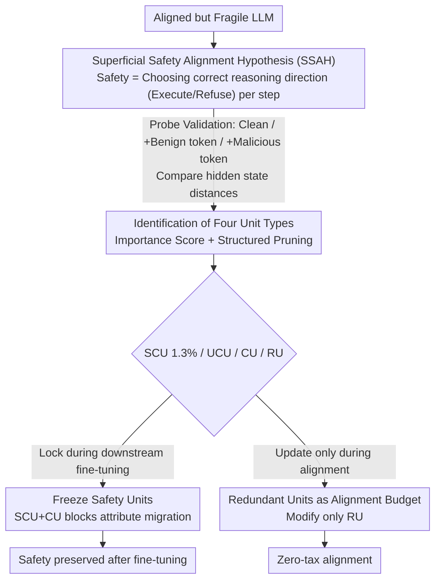

# Superficial Safety Alignment Hypothesis

**Conference**: ICLR 2026  
**arXiv**: [2410.10862](https://arxiv.org/abs/2410.10862)  
**Code**: [https://ssa-h.github.io/](https://ssa-h.github.io/)  
**Area**: AI Safety / LLM Alignment  
**Keywords**: Safety alignment, safety vulnerability, neuron-level analysis, alignment tax, model pruning

## TL;DR
Proposes the "Superficial Safety Alignment Hypothesis" (SSAH): safety alignment essentially teaches the model to perform an implicit binary classification task (execute vs. refuse). Only ~1.3% of neurons are required to establish safety guardrails; freezing these safety-critical units maintains safety during fine-tuning, and utilizing redundant units as an "alignment budget" can eliminate the alignment tax.

## Background & Motivation

**Background**: LLM safety alignment primarily relies on methods like SFT, RLHF, and DPO. However, these methods typically treat safety alignment as a subset of general alignment, overlooking the unique properties of safety alignment.

**Limitations of Prior Work**:
   - Safety mechanisms are extremely fragile—safety guardrails can collapse even when fine-tuning on benign data (Qi et al., 2023).
   - Existence of the "alignment tax"—improving safety often sacrifices the general capabilities of the model.
   - Current methods require full-parameter fine-tuning, which is computationally expensive.

**Key Challenge**: There is a lack of deep understanding regarding how safety alignment affects model behavior and why safety mechanisms are so fragile.

**Goal**: To answer three questions: How does safety alignment affect model behavior? Why is safety fragile? How can these issues be mitigated?

**Key Insight**: A key observation is that models capable of executing malicious requests already possess the relevant knowledge and reasoning abilities. Therefore, safety alignment only needs to teach the model to choose the correct reasoning direction (execute vs. refuse) rather than injecting new knowledge.

**Core Idea**: Safety alignment ≈ an implicit binary classification task, which can be achieved through a minimal set (~1.3%) of safety-critical neurons.

## Method

### Overall Architecture
SSAH is not a specific training algorithm but a hypothesis concerning "what safety alignment actually modifies in a model," followed by localization and application based on this hypothesis. Starting with an aligned but fragile LLM, the authors first propose the hypothesis and use probe experiments to confirm that safety alignment changes the "reasoning direction" (execute vs. refuse) chosen by the model at each generation step, rather than injecting knowledge. Next, they use structured pruning and importance scoring to categorize neurons into four types: Safety-Critical Units (SCU), Utility-Critical Units (UCU), Composite Units (CU), and Redundant Units (RU), localizing the small subset of neurons maintaining the safety guardrails. Finally, they develop two application branches: freezing safety units during downstream fine-tuning to prevent safety degradation, and updating only redundant units during alignment to eliminate the alignment tax.

### Key Designs

**1. Superficial Safety Alignment Hypothesis (SSAH): Re-understanding safety alignment as an implicit binary classification and verifying it with probes**

The general Safety Alignment Hypothesis (SAH) vaguely suggests that alignment provides the model with a complete set of values, which is difficult to verify. SSAH narrows the scope to a key observation: a model that can fully execute a malicious request already possesses the knowledge and reasoning ability. Thus, safety alignment does not need to teach new content but only how to select the correct "reasoning direction"—to execute or refuse. Beyond this binary decision, alignment also provides a standardized refusal mechanism and response templates. This narrowed hypothesis becomes concretely verifiable as it focuses on "knowledge-ready" models, excluding the confounding factor of knowledge deficits.

Since the reasoning direction is an abstract internal state, the authors infer it via distances in the hidden state space. For each malicious query, they construct three versions: the original malicious query (Clean), query followed by a benign token ("Sorry, I can't..."), and query followed by a malicious token ("Here's how..."). For an aligned model, the Clean hidden states should be closer to the "benign token" version and farther from the "malicious token" version at each generation step; the unaligned model shows the opposite. Experiments confirmed this, showing that this preference for safety direction persists across all Transformer blocks. The authors emphasize this is necessary but not sufficient evidence, as alignment may involve subtler changes. This perspective also explains why jailbreaking works—current alignment often sets the direction at the initial token; attackers can manipulate the starting tokens to pivot the direction toward "execution." Robust alignment should re-evaluate the reasoning direction at every generation step.

**2. Identification of Four Unit Types (SCU/UCU/CU/RU): Localizing safety neurons via structured pruning**

If safety alignment is a simple binary classification, the neurons supporting it should be minimal. To localize them, the authors calculate unit-wise importance scores for each depth-2 module $f(X) = B\sigma(AX)$:

$$\mathbf{I}_{:,j} = \frac{1}{N-1}\sum_{n=1}^{N}(X^B_{n,j,:} - \bar{X}^B_{:,j,:})^2 \cdot \|\mathbf{W}^B_{:,j}\|_2^2$$

Essentially, the importance of the $j$-th unit is the product of its activation variance and the squared norm of its output weights. Scores $\mathbf{I_S}$ and $\mathbf{I_U}$ are calculated on safety and utility datasets respectively, categorizing units into four types: Redundant Units (RU) have the lowest $\mathbf{I_U}+\mathbf{I_S}$; Safety-Critical Units (SCU) and Utility-Critical Units (UCU) are those with the highest and lowest $\mathbf{I_S}-\mathbf{I_U}$ respectively; the remainder are Composite Units (CU). Pruning uses structured removal (entire channels/neurons), scanning from high pruning ratios downward. Results confirm the hypothesis—SCUs account for only ~1.3% of neurons but are the "Achilles' heel" of safety guardrails: removing just this 1.3% causes ASR to skyrocket.

**3. Freezing Safety Units: Locking them during fine-tuning to prevent "attribute migration"**

Why does benign fine-tuning damage safety? Attribute migration analysis reveals that fine-tuning gradually shifts SCUs toward utility—over half of SCUs degrade into CUs, and some CUs degrade into UCUs, reducing the total contribution to safety. The countermeasure is direct: freeze safety-critical components (SCU plus top-ranked CUs) during fine-tuning to block this migration path. Results on LLaMA2 show that freezing SCU + all CU reduced AdvBench ASR from 11.92% to 2.88%, with migration analysis confirming the suppression of safety-to-utility conversion.

**4. Redundant Units as Alignment Budget: Updating only RU to eliminate alignment tax**

The alignment tax stems from fine-tuning modifying UCUs, thereby sacrificing general capabilities. Analysis shows that during alignment, many utility-only units are flipped to CU/SCU, while pre-existing redundant units from pre-training are barely used. Since pre-trained models have at least ~20% redundant parameters (RU), safety alignment can be restricted to these units. By localizing RUs via pruning and freezing all other parameters, safety/alignment behavior can be established without touching UCUs. Results show that updating only 20% of parameters achieves equivalent alignment, and math ability (GSM8K) actually improved from 9.24 to 13.4, outperforming the full-parameter fine-tuning result of 8.8. This indicates that squeezing alignment into redundant space avoids the disturbances to utility units caused by full-parameter updates.

### Training Strategy
Pruning consistently uses the activation-variance importance score with structured channel removal. Both applications rely on "freezing one set of units while training another" (freezing SCU/CU or training only RU). To ensure fair comparisons, frozen versions doubled the training epochs to ensure final training loss was comparable to or lower than full-parameter baselines, ruling out "insufficient training" as a reason for better safety.

## Key Experimental Results

### Main Results: Freezing Safety Units Against Fine-tuning Attacks

| Model / Setting | AdvBench ASR (keyword) | AdvBench ASR (llama3-guard) | HEx-PHI Score | HEx-PHI Rate |
|-----------|----------------------|---------------------------|---------------|-------------|
| LLaMA2 Initial | 0.19% | 0.19% | 1.05 | 0.3% |
| LLaMA2 + Dolly FT | 11.92% | 10.58% | 1.95 | 18.78% |
| LLaMA2 + Freeze SCU+6%CU | 3.65% | 2.31% | 1.55 | 10.6% |
| LLaMA2 + Freeze SCU+All CU | 2.88% | 1.92% | 1.48 | 9.0% |
| LLaMA3 Initial | 1.54% | 1.15% | 1.16 | 3.0% |
| LLaMA3 + Dolly FT | 61.15% | 50.58% | 2.95 | 37.2% |
| LLaMA3 + Freeze SCU+All CU | 40.58% | 28.27% | 2.32 | 23.6% |

### Ablation Study: Impact of Pruning Four Unit Types

| Unit Type | Ratio | Utility Drop (LLaMA2) | Safety ASR Increase (LLaMA2) |
|---------|------|-----------------|-------------------|
| SCU | 1.3% | -1.3% | +56.0% |
| UCU | 13.3% | -15.6% | +18.3% |
| RU | 14.8% | -2.8% | +4.6% |
| Dense (Full Model) | 100% | Base | Base (10.0%) |

### Key Findings
- **SCU is extremely sparse yet critical**: Only 1.3% of neurons manage safety; removing them causes ASR to jump from 10% to 66%.
- **LLaMA3 is more fragile than LLaMA2**: ASR jumped from 1.54% to 61.15% after fine-tuning, likely because LLaMA3 "analyzes" the intent of malicious requests.
- **PEFT methods can be more destructive to safety than full FT**: LoRA led to a 26.9% high-risk rate vs. 18.48% for full FT, which is counter-intuitive.
- **Redundant unit alignment improves math ability**: GSM8K increased from 9.24 → 13.4 (20% parameter FT) vs. 9.24 → 8.8 (Full FT).

## Highlights & Insights
- **Safety ≈ Binary Classification**: Reducing safety alignment to a decision on reasoning direction is a concise yet powerful perspective. It explains fragility: only a few neurons need their "vote" flipped to compromise safety.
- **Redundant Units as Alignment Budget**: Pre-trained models naturally have ~20% redundancy. Using these for alignment avoids modifying utility units. This is transferable to any scenario requiring new features without damaging existing ones.
- **Attribute Migration Framework**: Tracking neuron category changes (SCU→CU→UCU) provides a visual map of how fine-tuning destroys safety.
- **Probe Methodology**: Using hidden state distances relative to benign/malicious tokens to infer reasoning direction is simple but effective.

## Limitations & Future Work
- **SSAH is necessary but not sufficient**: The authors acknowledge probes verify implications of the hypothesis but don't strictly prove it; subtler changes may exist.
- **Step-wise re-evaluation overhead**: The ideal solution of re-evaluating direction at every step would introduce inference costs.
- **LLaMA3 constraints**: Due to resource limits, only the first 12 blocks were frozen in LLaMA3, yielding less dramatic results than LLaMA2.
- **SFT focus**: Behavior under RLHF/DPO was not explored.
- **Future Work**: Combine SCU/RU identification with LoRA to design "safety-aware LoRA"—placing adapters only on RUs.

## Related Work & Insights
- **vs. Wei et al. (2024)**: They identify safety-critical components at the weight level; this work operates at the neuron level with finer granularity and more thorough validation of freezing strategies.
- **vs. SafeDPO**: SafeDPO constrains safety via training objectives; this work starts from model structure. These are complementary—using SSAH for unit identification and SafeDPO for objectives.
- **vs. AlphaSteer**: AlphaSteer uses null-space constraints for rejection steering. This is similar in goal to the freezing strategy but approaches it from a different angle.

## Rating
- Novelty: ⭐⭐⭐⭐⭐ The SSAH hypothesis is highly original and insightful.
- Experimental Thoroughness: ⭐⭐⭐⭐ Multiple models and benchmarks, though LLaMA3 experiments were somewhat limited by compute.
- Writing Quality: ⭐⭐⭐⭐⭐ Clear logic, progressing naturally from hypothesis to validation to application.
- Value: ⭐⭐⭐⭐⭐ Provides a theoretical foundation for understanding safety alignment and designing efficient training strategies.

<!-- RELATED:START -->

## Related Papers

- [\[ICML 2026\] Operationalising the Superficial Alignment Hypothesis via Task Complexity](../../ICML2026/llm_alignment/operationalising_the_superficial_alignment_hypothesis_via_task_complexity.md)
- [\[ICLR 2026\] Mitigating the Safety Alignment Tax with Null-Space Constrained Policy Optimization](mitigating_the_safety_alignment_tax_with_null-space_constrained_policy_optimizat.md)
- [\[ICLR 2026\] Alignment-Weighted DPO: A Principled Reasoning Approach to Improve Safety Alignment](alignment-weighted_dpo_a_principled_reasoning_approach_to_improve_safety_alignme.md)
- [\[ICLR 2026\] A2D: Any-Order, Any-Step Safety Alignment for Diffusion Language Models](a2d_any-order_any-step_safety_alignment_for_diffusion_language_models.md)
- [\[ICLR 2026\] Safety Subspaces are Not Linearly Distinct: A Fine-Tuning Case Study](safety_subspaces_are_not_linearly_distinct_a_fine-tuning_case_study.md)

<!-- RELATED:END -->
