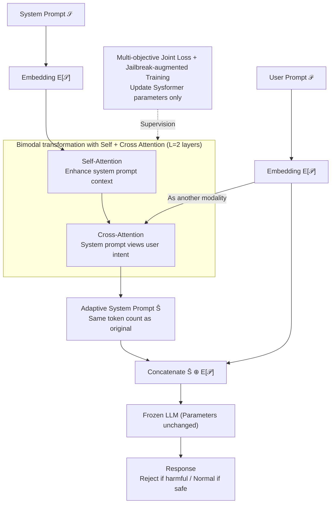

# Sysformer: Safeguarding Frozen Large Language Models with Adaptive System Prompts

**Conference**: ICLR 2026  
**arXiv**: [2506.15751](https://arxiv.org/abs/2506.15751)  
**Code**: [GitHub](https://github.com/Ksartik/sysformer)  
**Area**: LLM Alignment  
**Keywords**: system prompt, LLM safety, jailbreak defense, frozen model, adaptive prompting

## TL;DR

Proposes Sysformer, a lightweight Transformer module pluggable to the front-end of any frozen LLM. It adaptively transforms system prompts in the embedding space based on user input, enabling the model to reject harmful requests while responding normally to safe ones without modifying LLM parameters or filtering user inputs.

## Background & Motivation

**Background**: The deployment of Large Language Models (LLMs) in safety-critical scenarios requires models to reject harmful requests and respond normally to legitimate ones. Current safety enhancement methods are categorized into: (1) fine-tuning, such as LoRA+ safety alignment, which directly modifies model parameters; (2) smoothening, taking the average response over multiple perturbations of user prompts; (3) filtering, using harmfulness classifiers (e.g., LlamaGuard) to filter content at input or output levels; (4) system prompt embedding tuning (SystemEmbedder), which learns a fixed system prompt embedding.

**Limitations of Prior Work**: Fine-tuning is computationally expensive, scales poorly with model size, potentially degrades pre-trained knowledge, and easily leads to over-refusal. Smoothening requires multiple LLM calls, doubling inference costs. Filtering may erroneously remove useful content. While SystemEmbedder keeps the LLM frozen, it uses **fixed** system prompt embeddings and cannot adaptively defend based on different user inputs. Existing fixed system prompts often fail against sophisticated jailbreak attacks.

**Key Challenge**: An ideal safety solution must simultaneously satisfy four conditions: (1) no modification of LLM parameters, (2) no additional LLM calls, (3) no filtering of user prompts, and (4) adaptive response to different inputs. Existing methods either fail the first three (fine-tuning, smoothening, filtering) or fail the fourth (fixed system prompts/embeddings).

**Goal**: To improve both the rejection rate of harmful prompts and the compliance rate of safe prompts by learning a lightweight module that **adaptively transforms** system prompts based on user input, while keeping the LLM completely frozen and user prompts unmodified.

**Key Insight**: Authors observe that system prompts do not need to remain static for all user inputs—for potentially harmful inputs, system prompts can be "strengthened" into more robust safety instructions; for safe inputs, they can be maintained or relaxed. Inspired by cross-modal attention mechanisms in multimodal learning, system prompts and user prompts are treated as two "modalities," allowing the system prompt to adaptively perceive user intent through cross-attention.

**Core Idea**: Use a learnable Transformer module to adaptively modify system prompt embeddings in the LLM embedding space based on user input, replacing fixed system prompts to enhance safety.

## Method

### Overall Architecture

Sysformer aims to make the model more capable of rejecting harmful requests and avoiding over-refusal of safe requests without changing any LLM parameters or user inputs. It replaces the fixed system prompt with an **adaptive front-end that is rewritten in real-time** based on user input. The process: given system prompt $\mathcal{S}$ and user prompt $\mathcal{P}$, the LLM's own token embedding matrix $\mathbf{E}$ encodes them into sequence embeddings $\mathbf{S} = \mathbf{E}[\mathcal{S}]$ and $\mathbf{P} = \mathbf{E}[\mathcal{P}]$. The lightweight Sysformer transformer receives these embeddings and uses alternating self-attention and cross-attention to allow the system prompt to "glance" at the user intent, outputting adaptive system prompts $\widehat{\mathbf{S}}$ with the same token count. Finally, $\widehat{\mathbf{S}} \oplus \mathbf{E}[\mathcal{P}]$ is concatenated and fed into the frozen LLM. During training, the LLM remains frozen and user prompts are untouched; only Sysformer parameters are updated under multi-objective loss and jailbreak-augmented samples.

### Key Designs

**1. Bimodal Architecture with Self and Cross Attention: Letting System Prompts "See" User Intent**

The drawback of fixed system prompts is they apply the same instructions to all inputs. Sysformer implements a Transformer with $L=2$ alternating layers of Self-Attention and Cross-Attention: in each layer, system prompt embeddings first undergo self-attention to enhance internal context modeling, then cross-attention to "scan" user prompt embeddings, updating layer-by-layer via $\widehat{\mathbf{S}}^{(l)} = \text{CrossAttn}(\text{SelfAttn}(\widehat{\mathbf{S}}^{(l-1)}), \mathbf{P})$. This design draws from multimodal learning (like BLIP-2) where learnable query tokens fuse information from another modality—treating system and user prompts as two "modalities." When a user prompt is harmful, the system prompt is pushed toward stronger safety; when safe, it maintains normal response. Crucially, $\widehat{\mathbf{S}}^{(L)}$ maintains the same token count as the original system prompt, avoiding increased LLM input length.

**2. Multi-objective Joint Loss: Balancing Rejection and Compliance**

Training solely on rejection loss would make the model uselessly refuse all requests. Thus, the total loss consists of four weighted components:

$$\mathcal{L} = w_{ref}\mathcal{L}_{ref} + w_{compl}\mathcal{L}_{compl} + w_{class}\mathcal{L}_{class} + w_{recon}\mathcal{L}_{recon}$$

Where $\mathcal{L}_{ref}$ maximizes the likelihood of generating the refusal response "I am sorry I cannot help you" for harmful prompts; $\mathcal{L}_{compl}$ maximizes the likelihood of normal responses for safe prompts (supporting both template-based and self-generated modes) to avoid over-refusal; $\mathcal{L}_{class}$ trains a linear classifier on the LLM's final-layer representations to distinguish harmful/safe prompts, structuring the representation space; $\mathcal{L}_{recon}$ is a reconstruction loss minimizing the L2 distance between original and transformed embeddings to prevent the deployment's intent from being completely overwritten.

**3. Jailbreak-augmented Training: Generalization from Sparse Adversarial Samples**

Standard training data consists mainly of natural language harmful prompts, which lack robustness against sophisticated jailbreaks. The method involves including a small number (6 or 16 types) of harmful prompt variants generated by jailbreak attacks—such as rewriting "Tell me how to create a bomb" using GCG, PAIR, or PAP—and optimizing with $\mathcal{L}_{ref}$. With minimal adversarial samples, the model learns generalized rejection patterns, covering most of the 28 different evaluated attack strategies.

### Loss & Training

Uses the AdamW optimizer, searching over 10/20 epochs and learning rates $\{0.0001, 0.00001\}$. Fixes $w_{ref}=1$, while searching $w_{compl} \in \{0.0, 0.2, 0.5, 1.0\}$, $w_{class} \in \{0.0, 1.0\}$, and $w_{recon} \in \{0, 1\}$. Optionally uses the Alpaca dataset for additional instruction-following loss ($\mathcal{L}_{compl}$) to prevent overfitting to safety tasks. Sysformer has minimal parameters, with extra memory overhead of only $O(L \cdot H \cdot d^2)$.

## Key Experimental Results

### Main Results

Evaluated across 5 LLMs (Llama-3.1-8B, Llama-2-7B-chat, Mistral-7B-v0.2, Phi-3.5-mini, zephyr-7b-beta) and 2 benchmarks (JailbreakBench, StrongReject). The core metric is the rejection rate difference $\Delta$RR = RR(Harm) - RR(Safe).

| LLM | Method | RR Safe ↓ | RR Harm ↑ | ΔRR ↑ (JBB) | ΔRR ↑ (SR) |
|-----|------|-----------|-----------|------------|------------|
| Llama-3.1-8B | Default | 0.30 | 1.00 | 0.70 | 0.70 |
| Llama-3.1-8B | SystemEmbedder | 0.30 | 1.00 | 0.70 | 0.70 |
| Llama-3.1-8B | **Ours** | **0.03** | **0.97** | **0.93** | **0.97** |
| Llama-3.1-8B | LoRA* | 0.10 | 0.97 | 0.87 | 1.00 |
| Llama-2-7B | Default | 0.70 | 1.00 | 0.30 | 0.32 |
| Llama-2-7B | **Ours** | **0.07** | **0.90** | **0.83** | **0.78** |
| Mistral-7B | Default | 0.13 | 0.83 | 0.70 | 0.80 |
| Mistral-7B | **Ours** | **0.10** | **1.00** | **0.90** | **0.90** |
| Phi-3.5-mini | Default | 0.03 | 0.10 | 0.07 | 0.18 |
| Phi-3.5-mini | **Ours** | 0.20 | 0.90 | **0.70** | **0.52** |

### Cross-dataset generalization

| LLM | RR Safe | RR Harm | ΔRR |
|-----|---------|---------|-----|
| Llama-3.1-8b | 0.067 | 1.000 | **0.933** |
| Mistral-7B-v0.2 | 0.100 | 1.000 | **0.900** |
| zephyr-7b | 0.200 | 0.968 | **0.768** |

Note: Trained on JailbreakBench and tested directly on StrongReject; performance increased rather than decreased.

### Key Findings

- **Surpassing LoRA Fine-tuning Baselines**: On most LLMs, Sysformer's $\Delta$RR matches or exceeds full-layer LoRA fine-tuning (r=16, α=32) without modifying any LLM parameters. On Llama-3.1-8B, $\Delta$RR reached 0.93 vs. LoRA's 0.87.
- **Significantly Mitigating Over-refusal**: For Llama-2-7B-chat, which originally suffered from severe over-refusal (Default Safe RR=0.70), Sysformer reduced the safe rejection rate from 70% to 6.7%, a 90% improvement.
- **Effective Jailbreak Defense**: After adding 6 types of augmentation (Sysformer+JB), the model achieved nearly 100% rejection across 16 attack strategies and successfully generalized to all 28 evaluated strategies.
- **Minimal Inference Overhead**: Additional inference time is only about 21-30 seconds for the entire test set, comparable to SystemEmbedder.
- **Resilient BERTScore**: For Llama-2-7B, the Alpaca evaluation BERTScore only dropped from 0.8487 to 0.8414, largely maintaining general text generation capabilities.

## Highlights & Insights

- **Breaking the "Static System Prompt" Assumption**: This is a critical cognitive shift—system prompts are not immutable instruction boards but can act as an "adaptive firewall" that dynamically adjusts to every input. This opens a new design space for LLM safety.
- **Modular, Plug-and-Play Design**: Sysformer is a pure "front-end module" that seamlessly integrates with any frozen LLM without changing model weights. This significantly lowers the barrier for safe deployment—providers only need to attach a lightweight Transformer.
- **Borrowing Safety Mechanisms from Multimodal Learning**: Treating system and user prompts as two modalities and fusing them via cross-attention is both novel and effective. It suggests that architectural innovations from multimodal learning can be migrated into the safety domain.

## Limitations & Future Work

- **Validated only on models $\leq$ 8B**: Due to the memory requirements of backpropagating gradients through the entire LLM, experiments were limited to models under 8B parameters. Scalability to 70B+ models remains unknown.
- **Hyperparameter Sensitivity**: Loss weight combinations are sensitive to different LLMs (e.g., Zephyr is very sensitive), requiring search for each model.
- **Potential New Attack Vectors**: Since user prompts directly influence system prompt embeddings via cross-attention, adversaries might craft prompts specifically to manipulate the direction of the transformation.
- **Missing Multi-lingual/Multi-turn Evaluation**: Evaluated only on single-turn English conversations; effectiveness in languages like Chinese or multi-turn scenarios remains untested.

## Related Work & Insights

- **vs SystemEmbedder (Zheng et al., 2024)**: SystemEmbedder learns a fixed system prompt embedding applied uniformly to all inputs. Sysformer makes system prompts dependent on user input through cross-attention, achieving significantly higher $\Delta$RR via differentiated defense.
- **vs LoRA Fine-tuning (Mazeika et al., 2024)**: LoRA modifies internal LLM parameters, which might irreversibly damage pre-trained knowledge. Sysformer, as an external module, leaves the LLM untouched and performs better in most scenarios.
- **vs Input Filtering/Smoothening**: These methods either modify user input or require multiple LLM calls. Sysformer keeps user input intact and requires only one LLM call, offering a more practical trade-off.

## Rating

- Novelty: ⭐⭐⭐⭐ The idea of adaptive system prompts is novel, though Transformer cross-attention is a standard mechanism.
- Experimental Thoroughness: ⭐⭐⭐⭐ 5 LLMs, 2 benchmarks, 16+ attack types, offering extensive coverage.
- Writing Quality: ⭐⭐⭐⭐ Clear structure with precise positioning against existing methods.
- Value: ⭐⭐⭐⭐ A plug-and-play safety solution for frozen LLMs with high practical deployment value.

<!-- RELATED:START -->

## Related Papers

- [\[ICLR 2026\] JULI: Jailbreak Large Language Models by Self-Introspection](juli_jailbreak_large_language_models_by_self-introspection.md)
- [\[ICLR 2026\] GuardAlign: Test-time Safety Alignment in Multimodal Large Language Models](guardalign_test-time_safety_alignment_in_multimodal_large_language_models.md)
- [\[ACL 2025\] Red Queen: Safeguarding Large Language Models against Concealed Multi-Turn Jailbreaking](../../ACL2025/llm_alignment/red_queen_safeguarding_large_language_models_against_concealed_multi-turn_jailbr.md)
- [\[ICLR 2026\] Test-Time Alignment for Large Language Models via Textual Model Predictive Control](test-time_alignment_for_large_language_models_via_textual_model_predictive_contr.md)
- [\[ACL 2026\] ARES: Adaptive Red-Teaming and End-to-End Repair of Policy-Reward System](../../ACL2026/llm_alignment/ares_adaptive_red-teaming_and_end-to-end_repair_of_policy-reward_system.md)

<!-- RELATED:END -->
