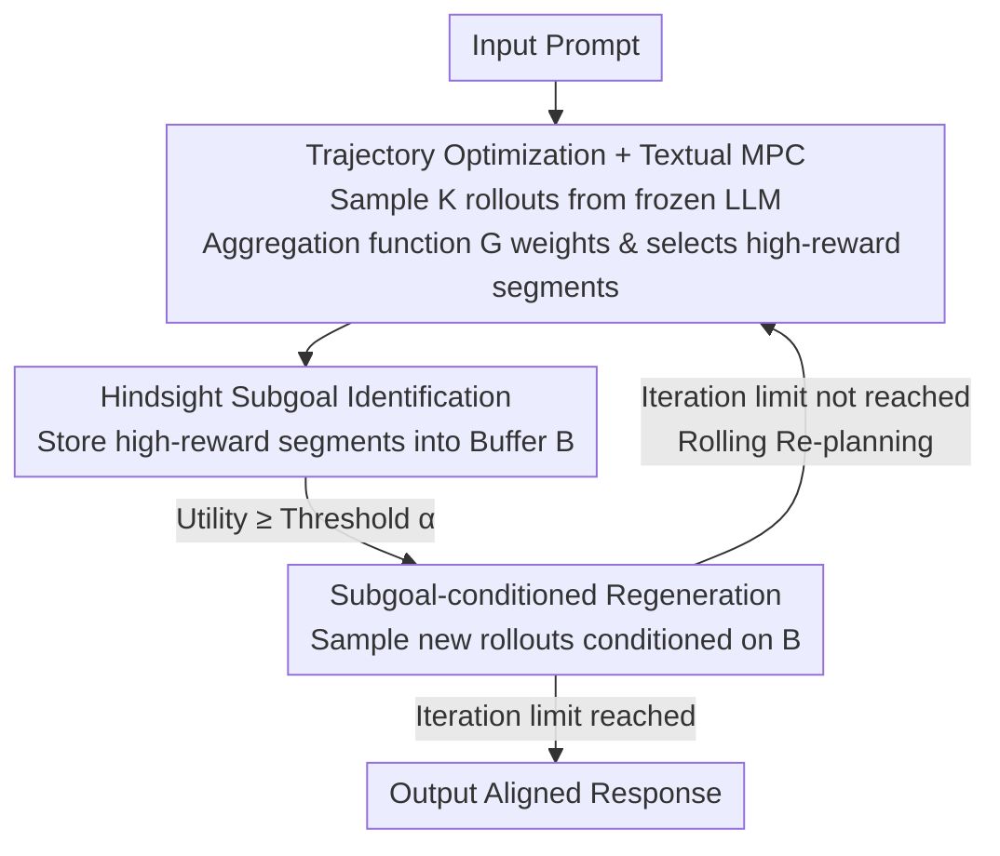

# Test-Time Alignment for Large Language Models via Textual Model Predictive Control

**Conference**: ICLR 2026  
**OpenReview**: [https://openreview.net/forum?id=DsS3xRPSs5](https://openreview.net/forum?id=DsS3xRPSs5)  
**Paper**: [Project Page](https://rl-bandits-lab.github.io/TMPC/)  
**Code**: https://rl-bandits-lab.github.io/TMPC/ (Project Page)  
**Area**: Alignment RLHF / LLM Test-Time Alignment  
**Keywords**: Test-time Alignment, Model Predictive Control, Subgoal Planning, Trajectory Optimization, Inference-time Search

## TL;DR
This paper reformulates the test-time preference alignment of LLMs as a trajectory optimization problem, utilizing Model Predictive Control (MPC) from control theory for "planning while moving." By employing **hindsight subgoal identification** to extract high-reward segments from generated rollouts as waypoints and performing **conditioned regeneration**, the method achieves rolling approximation of the optimum. It stably improves performance across machine translation, long-form response, and code generation tasks without modifying model parameters.

## Background & Motivation

**Background**: The mainstream approach to aligning LLMs with human preferences is training-time alignment—methods like RLHF, DPO, SimPO, and CPO update parameters for good results. However, they require retraining for every new preference or task, which is costly and inflexible. Test-time alignment has emerged as a lightweight alternative: freezing the model and guiding the output during inference. Common methods fall into two categories: token-level guided decoding (e.g., ARGS, GenARM, which intervene token-by-token using a reward model) and response-level iterative refinement (e.g., TPO, which translates rewards into textual critiques for the model to rewrite).

**Limitations of Prior Work**: The authors view the generation process as "sequential decision-making" and identify pitfalls in both existing categories. Token-level guided decoding suffers from the **curse of horizon**: with fine-grained actions and trajectories often exceeding hundreds of steps, credit assignment (determining which token is responsible for final quality) becomes extremely unreliable, making alignment fragile. Response-level iterative refinement suffers from the **curse of dimensionality**: rewriting the entire response at each step involves a massive action space, making the search both unstable and difficult for finding actual directions for improvement.

**Key Challenge**: There is a trade-off between accurate credit assignment and a controllable search space. Action granularity that is too fine leads to long horizons and difficult credit assignment, while granularity that is too coarse leads to an exploded search space. Prior methods reside at either extreme, missing the optimal balance.

**Goal**: To find a "unit of action" with intermediate granularity that shortens the planning horizon and constrains the search to high-quality regions, all without training or updating parameters.

**Key Insight**: MPC in control theory is a paradigm that repeatedly solves for local optima over a moving window, executes only a portion, and then performs rolling re-planning, naturally balancing horizon and search. However, classical MPC assumes problems can be segmented into predefined hard boundaries, whereas text generation (especially code) often lacks natural boundaries.

**Core Idea**: The paper proposes **Textual Model Predictive Control (TMPC)**—porting MPC into text generation by using "subgoals" as variable-length time steps. It addresses the "lack of natural boundaries" by drawing on two principles from hierarchical reinforcement learning: identifying high-reward segments from rollouts in **hindsight** as subgoals, and then conditioning on these verified subgoals to perform rolling generation.

## Method

### Overall Architecture

TMPC formalizes "generating an aligned response for a given prompt" as a trajectory optimization problem on a deterministic MDP: the state is the text prefix, the action is a generation unit of some granularity, the reward comes from a reward model or task signal, and the objective is to maximize the cumulative reward $J(\tau)=\sum_{t=0}^{T-1}R(s_t,a_t)$. Since direct global search for an optimal sequence of length $T$ is infeasible, the MPC approach is used to decompose it into "repeatedly solving for local optima over a moving window."

A single cycle works as follows: a frozen LLM acts as the proposal distribution to sample $K$ rollouts from the current state; each rollout is segmented and scored; an **aggregation function $G$**, mimicking MPPI (Model Predictive Path Integral) in continuous control, uses reward weighting to select a set of **discontinuous high-reward segments** $\tilde a^{\text{TMPC}}$; these segments are identified as subgoals in hindsight and stored in a buffer $B$; the next round of generation no longer starts from a generic proposal but is **conditioned on the verified subgoals in $B$** to sample new rollouts. This receding-horizon process continues for several rounds, with a portion of the trajectory being "executed in hindsight" and the remaining part being re-optimized, eventually assembling a globally high-utility response.

TMPC is naturally suited for test-time alignment for two reasons: ① **No additional learning required**—the state transition in the text generation MDP is deterministic (dynamics model is built-in), and the frozen LLM serves directly as the proposal distribution; ② **Simultaneous resolution of both curses**—evaluating rewards at the subgoal level shortens the effective credit horizon (solving the curse of horizon), and using the subgoal buffer constrains the search to high-reward regions (solving the curse of dimensionality).

### Key Designs

**1. Trajectory Optimization Perspective + Textual MPC: Finding the Sweet Spot for Credit Assignment and Search Space**

To address the core contradiction between fine-grained token-level and coarse-grained response-level actions, TMPC does not fix action granularity. Instead, it reformulates alignment as trajectory optimization $a^*(s_0)=\arg\max_{a_{0:T-1}}\sum_t R(s_t,a_t)$ and uses MPC to approximate the solution over a moving window $H$ ($H<T$): $a^{\text{MPC}}(s_t)=\arg\max_{a_{t:t+H-1}}\sum_{i=t}^{t+H-1}R(s_t,a_t)$. Crucially, for "weighted action selection" from discrete text rollouts, the authors abstract the MPPI weighting $a_t=\big(\sum_i \exp(\tfrac{1}{\lambda}J(\tau^{(i)}_t))a^{(i)}_t\big)/\sum_i \exp(\tfrac{1}{\lambda}J(\tau^{(i)}_t))$ into an **aggregation function** $\tilde a^{\text{TMPC}}(s)\leftarrow G(\{\tau^{(i)}\}_{i=1}^K,\{J(\tau^{(i)})\}_{i=1}^K;s)$, which selects a set of discontinuous actions for subsequent subgoal generation. By operating at the "segment/subgoal" level, TMPC achieves higher stability than guided decoding or full-text refinement.

**2. Hindsight Subgoal Identification: Let Rewards Define Waypoints in the Absence of Natural Boundaries**

Classical MPC requires predefined hard boundaries. However, while translation can be segmented by sentences, long-form responses only have semantic boundaries, and code generation often lacks structural boundaries for planning. TMPC solves this with "generate first, identify later": it samples candidate rollouts, evaluates them segmentally, and then **in hindsight** designates high-reward intermediate segments as subgoals. Subgoals can be concrete (a sentence in translation) or abstract (a functional milestone in code, such as "passing a failed unit test"). Selected segments enter or exit buffer $B$ based on utility: if the buffer is not full, they are merged; if full, a higher-reward new segment replaces a poorer one (the "eviction" rule in Eq. 4). This step allows a task-agnostic mechanism to adapt to diverse tasks.

**3. Subgoal-conditioned Regeneration: Rolling Assembly of Verified "Building Blocks"**

Identifying subgoals is not enough, as single-pass optimization often stops at local optima. TMPC iterates the planning: subsequent rounds do not sample from a general proposal but are **conditioned on high-reward subgoals in buffer $B$**. The aggregation function selects $\tilde a^{\text{TMPC}}_t(s)\leftarrow G(\{\tau^{(i)}_t\}_{i=1}^K,R(\cdot)\mid s,B):=\{a\mid R(s,a)\ge\alpha,\ a\in\{\tau^{(i)}_t\}_{i=1}^K\}$, retaining only segments with rewards exceeding threshold $\alpha$. Intuitively, the model is encouraged to "combine and extend" verified building blocks rather than starting from scratch each round. Principle 1 determines which segments count as subgoals, and Principle 2 determines how to re-order them into a complete trajectory. This receding-horizon loop accumulates the best fragments across rounds.

### Main Results

Using LLaMA-3.1-8B-Instruct as the backbone, the method was tested on three tasks: Paragraph-level Machine Translation (WMT'24, natural boundaries), Long-form Response (HH-RLHF, no natural boundaries), and Program Synthesis (MBPP, reward based on unit tests, boundaries via functional milestones).

Paragraph-level Translation (SEGALE-COMET ↑ / NA Ratio ↓):

| Method | zh→en COMET | zh→en NA↓ | zh→ru COMET | zh→de COMET |
|------|------|------|------|------|
| ARGS (token-level) | 63.99 | 31.53 | 43.03 | 51.97 |
| RAIN | 58.52 | 37.18 | 66.29 | 67.43 |
| RE-Control | 86.39 | 7.06 | 84.97 | 87.16 |
| GenARM | 61.18 | 34.73 | 55.67 | 60.96 |
| TPO | 88.81 | 5.63 | **92.63** | 87.67 |
| Best-of-60 | 90.97 | 3.58 | 84.86 | 82.74 |
| **TMPC** | **94.62** | **0.00** | 91.53 | 91.73 |
| GPT-4o (Reference Upper Bound) | 94.58 | 0.10 | 93.74 | 94.54 |

TMPC even surpasses GPT-4o on zh→en and reduces the NA Ratio (omission/over-translation) to 0, outperforming Best-of-60 with significantly less computation. For Long-form Responses (Avg Reward): TMPC scores 4.60, higher than DPO (-0.91 base / strongest training-time SimPO 3.95), Best-of-20 (4.36), and TPO (iter=4) 4.19. TMPC uses only 10 total generations (3 rounds × 3 rollouts + 1 initial), while Best-of-20 remains inferior despite double the sampling. For Program Synthesis (MBPP Pass Rate): TMPC reaches 61%, significantly outperforming TPO (48%), Best-of-35 (50%), and the base model (34%).

### Ablation Study

Analysis of the two principles and robustness on Long-form Response (Avg Reward):

| Configuration | Avg Reward | Description |
|------|---------|------|
| Full TMPC | 4.595 | Complete model |
| w/o Principle 1 (FIFO buffer, no quality ranking) | 4.264 | Largest drop; subgoals are no longer filtered by quality |
| w/o Principle 2 (Buffer size=1, minimal conditioning) | 4.463 | Performance drop, but doesn't degrade to Best-of-N |
| Threshold $\alpha=0$ | 4.469 | Premature inclusion of low-quality segments |
| Threshold $\alpha=4$ / $\alpha=5$ | 4.595 / 4.539 | High $\alpha$ reduces diversity, converging toward Best-of-N |
| Weak Reward Model (GRM, 77.54% acc) | 4.332 | Limited impact; buffer filters poor segments |
| Injected Reward Noise ($\sigma^2=1$) | 4.457 | Even smaller impact |
| Buffer/Segment dimensions (3/6 combination) | 4.482~4.595 | Changes < 0.1; insensitive to core hyperparameters |

### Key Findings
- **Hindsight Identification (Principle 1) is the most critical component**: Degrading it to a FIFO buffer caused the largest performance drop (4.595→4.264), indicating that selecting subgoals by reward quality is more important than the buffer itself.
- **Robustness to Reward Model Quality**: Switching to a weak RM or injecting noise only caused small performance decreases. This is attributed to the progressive filtering of the subgoal buffer—poor segments are eventually overwritten by stronger ones, providing inherent denoising.
- **Iterative Gains Plateau**: Performance on zh→en peaked at round 3 and then slightly declined, while naive iterative refinement (buf=1, seg=1) showed no improvement, highlighting the necessity of both principles.
- **Sample Efficiency**: Given the same computational budget (10 LLM calls), TMPC matches or exceeds TPO, whereas TPO requires roughly twice the budget to catch up.

## Highlights & Insights
- **Clean mapping of MPC/MPPI to text generation**: Deterministic transitions provide the dynamics model, and the frozen LLM serves as the proposal distribution, reaping the benefits of model-based planning without any training.
- **"Subgoals" as a unified solution to both curses**: Intermediate granularity shortens the credit horizon while constraining the search space, avoiding the failure modes of both token-level and response-level methods.
- **Hindsight identification bypasses boundary issues**: Instead of presetting segments, the reward tells the model in hindsight which parts are good waypoints. This task-agnostic approach covers sentences, semantic blocks, and functional milestones.
- **Inherent denoising in buffers**: The continuous replacement of low-reward segments with high-reward ones makes the method robust to reward model errors and noise, which is vital for test-time scenarios where signals are often imperfect.

## Limitations & Future Work
- Dependency on external reward signals (RMs or unit tests) for scoring subgoals; the risk of reward hacking remains, though partially mitigated by using Win Rates (GPT-4 evaluation).
- Iteration plateaus (performance slightly declined after 3 rounds in translation); the optimal number of iterations may vary by task.
- Experiments focused on a single 8B backbone (LLaMA-3.1-8B-Instruct); scalability to larger models or stronger bases is unverified.
- Implementation of "combining and extending" subgoals in the prompt layer and potential incoherence in long-dependency tasks are discussed less in the main text.

## Related Work & Insights
- **vs. Guided Decoding (ARGS / GenARM / RE-Control)**: These intervene at the token level, suffering from the curse of horizon and fragile credit assignment (high NA Ratio in translation); TMPC operates at the subgoal level for stability.
- **vs. Iterative Refinement (TPO)**: TPO uses textual critiques to rewrite segments, operating at the response level and suffering from error accumulation; TMPC uses verified subgoal buffers for conditioning, proving more stable and efficient (10 vs 20 calls).
- **vs. Best-of-N**: Best-of-N relies on sampling luck and is capped by the base model's capacity; TMPC actively constructs solutions by building on partially correct foundations.
- **vs. Training-time Alignment (DPO / SimPO)**: Training-time methods require parameter updates; TMPC aligns without training and even outperforms DPO in average reward on long-form responses.

## Rating
- Novelty: ⭐⭐⭐⭐⭐ Systematically introduces receding-horizon planning and hindsight subgoal identification from MPC/MPPI to LLM test-time alignment.
- Experimental Thoroughness: ⭐⭐⭐⭐ Covers three tasks with distinct boundary properties, though limited to an 8B backbone.
- Writing Quality: ⭐⭐⭐⭐⭐ Clear framing of the "two curses" and explicit mapping between MPPI and the aggregation function.
- Value: ⭐⭐⭐⭐ High sample efficiency and robustness to reward noise make it highly practical for test-time alignment deployment.

<!-- RELATED:START -->

## Related Papers

- [\[ICLR 2026\] GuardAlign: Test-time Safety Alignment in Multimodal Large Language Models](guardalign_test-time_safety_alignment_in_multimodal_large_language_models.md)
- [\[ACL 2026\] On the Rejection Criterion for Proxy-Based Test-Time Alignment](../../ACL2026/llm_alignment/on_the_rejection_criterion_for_proxy-based_test-time_alignment.md)
- [\[ICLR 2026\] Towards Understanding Valuable Preference Data for Large Language Model Alignment](towards_understanding_valuable_preference_data_for_large_language_model_alignmen.md)
- [\[ICLR 2026\] Multi-objective Large Language Model Alignment with Hierarchical Experts](multi-objective_large_language_model_alignment_with_hierarchical_experts.md)
- [\[ICLR 2026\] Semantic-aware Wasserstein Policy Regularization for Large Language Model Alignment](semantic-aware_wasserstein_policy_regularization_for_large_language_model_alignm.md)

<!-- RELATED:END -->
