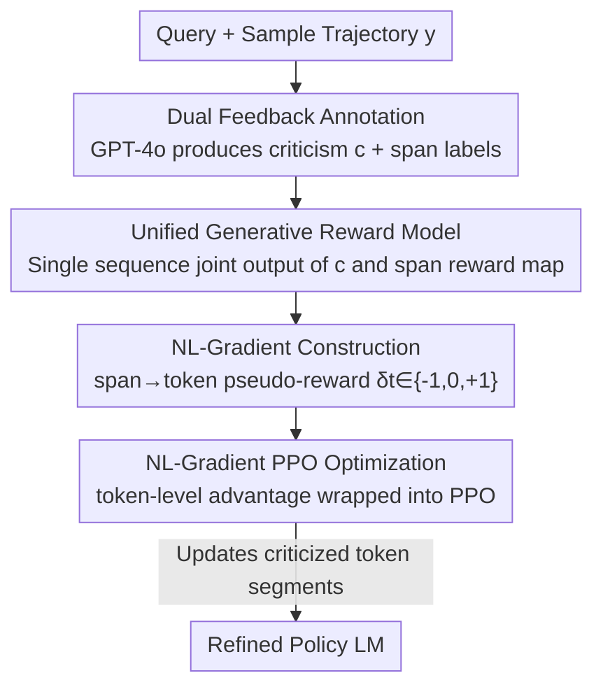

# Text2Grad: Reinforcement Learning from Natural Language Feedback

**Conference**: ICLR 2026  
**OpenReview**: [https://openreview.net/forum?id=SIE9fNq8lk](https://openreview.net/forum?id=SIE9fNq8lk)  
**Code**: https://github.com/microsoft/Text2Grad (Available)  
**Area**: Alignment RLHF / LLM Training / Reinforcement Learning  
**Keywords**: Natural Language Feedback, span-level reward, token-level credit assignment, PPO, generative reward models  

## TL;DR
The paper aligns free-form textual criticism with output token segments, converts them into token-level pseudo-rewards, and constructs "Natural Language Gradients" to drive PPO updates. This approach ensures the model modifies only the "criticized tokens" rather than making global haphazard adjustments. It outperforms scalar reward RL and pure prompting-based reflection baselines across summarization, code generation, and question-answering tasks.

## Background & Motivation

**Background**: RLHF has become the mainstream paradigm for aligning LLMs. The standard practice involves compressing human preferences into a scalar reward $R(y)$ and then using PPO/DPO to push the policy toward higher scores.

**Limitations of Prior Work**: Scalar rewards collapse multi-dimensional, fine-grained information—such as "which part is good/bad and where"—into a single number. When the optimizer receives a score like $-3$, it only knows the "overall quality is poor" but lacks guidance on which specific segment to modify, leading to inaccurate credit assignment, slow convergence, and poor interpretability. The example in Figure 1 is telling: the reward model says, "I know this summary is bad, but which part exactly?"—a scalar reward cannot answer this.

**Key Challenge**: An alternative path (e.g., ReAct, Reflexion) preserves feedback as natural language and allows the model to reflect and self-correct during inference. While this improves interpretability, the **model parameters remain unchanged**—the feedback is not "internalized," and the model must be corrected anew for similar errors. This creates a dilemma: fine-grained trainable signals require collapsing linguistic information into scalars, while retaining linguistic information limits the feedback to inference-time without updating parameters.

**Goal**: Transform free-form textual criticism into **trainable gradients** that retain the fine-grained localization of language while enabling actual updates to strategy parameters.

**Key Insight**: The authors observe that a criticism (e.g., "The summary missed the author's concern about the draft being rejected") naturally points to **specific token spans** in the output. If "critical phrases ↔ token spans" can be aligned, linguistic feedback can be mapped to specific tokens and used as token-level reward weights within the policy gradient.

**Core Idea**: Define "Natural Language Gradient" (NL-Gradient)—aligning text criticism to spans, mapping them to token-level pseudo-rewards $\delta_t$, and then weighting standard policy gradients with $\delta_t$. Effectively, "language determines what and where to update."

## Method

### Overall Architecture

The core objective of Text2Grad is to construct an NL-Gradient capable of directly driving policy updates. The pipeline connects "linguistic reasoning" to "differentiable credit assignment": first, a strong LLM labels sampling trajectories with "textual criticism + span-level positive/negative labels." This labeling scheme is trained into a unified generative reward model. During inference, the reward model simultaneously outputs criticism and a span reward map for the policy's output, which is parsed into token-level pseudo-rewards $\delta_t \in \{-1, 0, +1\}$. These $\delta_t$ values are used via GAE to calculate token-level advantages, which are then incorporated into the PPO objective for updates. The entire system only requires a "token-weighting wrapper" on top of PPO and remains unchanged across different tasks.

### Key Designs

**1. Dual Feedback Annotation: Aligning "Criticism Text" with "Criticized Tokens"**

To convert language into token-level supervision, the first step is to obtain labels that provide both explanation and localization. The authors use GPT-4o to simultaneously produce two items for each sample: a free-form textual criticism $c$ (explaining strengths and weaknesses) and a structured span reward map $A(y)$ that marks segments as `positive` or `negative` (`neutral` is implicit). For example, in a summarization task, if the criticism is "The summary misses that the author is worried the manuscript might be rejected," the corresponding JSON would label `"200 page unpublished novel"` as a good span and `"first time author"` / `"finding a good editor"` as poor spans.

Crucially, the annotation prompt **mandates that spans must be directly supported by the criticism**: when human feedback is unavailable, a CoT prompt encourages GPT-4o to first reason about quality, then write the criticism, and finally highlight spans. Each span must have an evidence anchor in criticism $c$. This ensures semantic alignment between "criticism ↔ span" rather than random highlighting. By focusing only on positive/negative categories, annotation costs are reduced by 85–90%. Marking only about 30% of tokens maintains 93–96% accuracy; the paper emphasizes that performance depends on span **quality** rather than coverage, as dense token labeling (~70% of tokens) introduces noise from functional or irrelevant words.

**2. Unified Generative Reward Model: One Sequence for Criticism and Span Map**

Given the annotated data, the authors treat reward modeling as a **text generation task** instead of training a model to predict scalar scores. For a prompt $x$ and response $y$, the reward model $R_\phi$ outputs a sequence $z = [c; A(y)]$, where the first part is natural language criticism and the second is a JSON-formatted span label map, generated in a single autoregressive pass. Training follows standard conditional language modeling cross-entropy:

$$\mathcal{L}_R(\phi) = -\mathbb{E}_{(x,y,z)\in D_R}\big[\log p_\phi(z \mid x, y)\big]$$

This design offers three advantages: generalization via text supervision across tasks, gradient flow through tokenized outputs, and the unification of explanations and token-level rewards in one model. Llama3.1-8B-Instruct is fine-tuned as the reward model using GPT-4o's CoT annotations. It replaces scalar reward models by providing both the "why" and the "where" of the score.

**3. NL-Gradient Definition & Construction: Mapping Span Labels to Token Pseudo-Rewards**

This is the theoretical core. Traditional policy gradients optimize sequence-level scalar returns $J(\theta) = \mathbb{E}_{y\sim\pi_\theta}[R(y)]$, which obscures token-level contributions. The authors define the NL-Gradient: given sequence $y=(y_1,\dots,y_T)$ and criticism $c$, aligning $c$ to $y$ yields token-level pseudo-rewards $\{\delta_t\}$ such that:

$$\nabla_{\mathrm{NL}}(c\to y) = \sum_{t=1}^{T} \delta_t \,\nabla_\theta \log \pi_\theta(y_t \mid x, y_{<t})$$

The mapping from span to token is straightforward: tokens in positive spans receive $\delta_t=+1$, negative spans receive $-1$, and others receive $0$. The authors clarify that "NL-Gradient" does not involve taking derivatives with respect to text; rather, "language determines what to update and where"—criticism aligns to spans, spans are discretized into token pseudo-rewards, and these pseudo-rewards weight the standard policy gradient per token. This replaces "global nudging" with "locally targeted adjustments," naturally providing interpretability (every update corresponds to human-readable feedback) and transferability.

**4. NL-Gradient PPO Optimization: Token-level Advantage in PPO**

To ensure stable optimization, $\delta_t$ is integrated into PPO. The authors use these dense token pseudo-rewards for fine-grained advantage estimation. First, the pseudo-reward is combined with a KL penalty to form $r^{\text{total},A}_t = \delta_t + r^{\text{KL}}_t$, followed by GAE:

$$A_t = \sum_{l=0}^{T-t-1} (\gamma\lambda)^l \,\delta^{\mathrm{TD}}_{t+l},\quad \delta^{\mathrm{TD}}_t = r^{\text{total},A}_t + \gamma V_\psi(x, y_{<t+1}) - V_\psi(x, y_{<t})$$

The token-level advantage is substituted into the PPO clipped objective $\mathcal{L}_{\text{PPO}}(\theta) = \mathbb{E}_t[\min(\rho_t A_t, \mathrm{clip}(\rho_t, 1-\epsilon, 1+\epsilon)A_t)] - \beta H(\pi_\theta)$. The paper provides a theoretical argument: token-level rewards amplify credit assignment for early tokens compared to terminal sequence rewards—at $\gamma\lambda\approx 0.95$, the feedback weight for the 20th to last token is approximately $0.95^{-20}\approx 2.8$ times ($nearly 3\times$) higher than terminal supervision, making it more effective for localization and error correction in long texts.

## Key Experimental Results

Llama3.1-8B-Instruct (Llama3-8B-Instruct for QA) is used as the backbone for both policy and reward models. All reward supervision comes from GPT-4o CoT annotations.

### Main Results

Summarization (SLF5K): Text2Grad SOTA across all metrics, +25.3% BLEU and +6.7 ROUGE-L over PPO.

| Method | R-1 | R-2 | R-L | BLEU | BERTScore |
|------|-----|-----|-----|------|-----------|
| SFT | 0.285 | 0.078 | 0.195 | 0.032 | 0.875 |
| SFT + Reflection | 0.329 | 0.087 | 0.225 | 0.041 | 0.888 |
| DPO | 0.327 | 0.101 | 0.224 | 0.039 | 0.885 |
| PPO | 0.365 | 0.132 | 0.262 | 0.075 | 0.893 |
| PRM-PPO | 0.341 | 0.130 | 0.254 | 0.069 | 0.889 |
| ILF | 0.349 | 0.134 | 0.259 | 0.073 | 0.892 |
| **Ours** | **0.400** | **0.155** | **0.291** | **0.094** | **0.902** |

Code Generation (KodCode, pass@1 %): Average +3.6 over PPO, +5.1/+5.8 over DPO/PRM-PPO.

| Method | HumanEval | HumanEval+ | MBPP | MBPP+ | Avg. |
|------|-----------|-----------|------|-------|------|
| DPO | 65.2 | 56.7 | 66.1 | 56.1 | 61.0 |
| PPO | 64.6 | 61.0 | 68.5 | 55.8 | 62.5 |
| PRM-PPO | 61.5 | 59.8 | 65.1 | 54.9 | 60.3 |
| ILF | 63.4 | 60.4 | 68.5 | 57.1 | 62.3 |
| **Ours** | **67.7** | **61.6** | **73.3** | **61.6** | **66.1** |

Open-domain QA (UltraFeedback): AlpacaEval +12.1 over base, +2.3 over PPO. ARC-C and MT-Bench also exceed PPO (34.7 / 84.4 / 7.58 vs. PPO 32.4 / 82.7 / 7.43).

### Ablation Study

| Configuration | Key Metric | Description |
|------|---------|------|
| Text2Grad (Full) | R-L 0.291 / Code Avg 66.1 | CoT Criticism + Span Labels |
| w/o CoT | R-L 0.275 / Code Avg 59.2 | Span scores only, no text; code drops 6.9 points |
| Dense Token Annotation | R-L 0.196 | ~70% token coverage; functional word noise hurts advantage |

### Key Findings

- **CoT explanation is key, not just span labels**: Removing CoT drops average code scores by 6.9 and summarization ROUGE-L from 0.291 to 0.275, proving natural language provides more actionable token-level supervision.
- **Quality > Coverage**: Annotating only ~30% of tokens with CoT maintains 93–96% accuracy; dense annotation (~70%) crashes ROUGE-L to 0.196 due to functional word noise.
- **Precision over Recall**: Reward model recall for negative tokens is low (~22% on UltraFeedback), but the authors argue that incorrect labeling pollutes gradients while missing labels only reduces update density. Thus, high precision + high human alignment (>82%) is sufficient for stable advantages.
- **Faster Convergence**: Text2Grad converges ~22% faster than PPO on SLF5K, with a ~12% win rate gain over PPO in GPT-4 evaluation.

## Highlights & Insights
- **Integrated Trainable Link**: Chains "Criticism → Token Pseudo-reward → Weighted Policy Gradient," successfully enabling parameters to update while maintaining fine-grained linguistic localization, bypassing the "scalar info loss vs. inference-only" dilemma.
- **Reward Modeling as Text Generation**: A single autoregressive sequence produces both criticism and span maps, unifying explanation and supervision in a cleaner way than "scalar score + separate explanation" assemblies.
- **"Sparse but Accurate" Labeling Strategy**: Less is more. Reducing annotation costs by 85–90% while improving performance by avoiding noise—this counter-intuitive finding is transferable to other dense token supervision tasks.
- **Lightweight Integration**: Only requires a token-weighting wrapper over PPO, making it easy to implement across different tasks.

## Limitations & Future Work
- The pipeline heavily depends on GPT-4o as an annotator; quality and bias of GPT-4o define the ceiling of span supervision. Performance with weaker or domain-specific annotators is unknown.
- Negative token recall is low (~22%). While precision is prioritized, it means many erroneous segments go unmarked, potentially leaving undetected errors in long texts.
- Backbones are limited to 8B Llama models; stability of token-level credit assignment in larger models or longer contexts requires verification.
- Pseudo-rewards are discrete $\{-1,0,+1\}$, failing to capture error severity. Future work could explore continuous or multi-level span intensities.

## Related Work & Insights
- **vs PPO / DPO (Scalar RLHF)**: These collapse multi-dimensional criticism into one number and lose error location; Ours retains span-level language signals for token-level credit assignment, yielding superior results.
- **vs PRM (Process Reward Model)**: PRM provides finer credit assignment but remains scalar and lacks linguistic explainability, making "steps" hard to define in long responses (hence PRM-PPO's absence in UltraFeedback); Ours uses natural language to anchor tokens directly.
- **vs ReAct / Reflexion (Inference Feedback)**: These keep criticism at inference without parameter updates; Ours internalizes criticism into parameters for long-term efficacy.
- **vs ILF (Learning from Language Feedback)**: ILF uses feedback to generate refined sequences for imitation learning at the sequence level; Ours converts feedback into finer token-level gradients.

## Rating
- Novelty: ⭐⭐⭐⭐⭐ First complete framework to systematically convert free-form text feedback into token-level gradients for parameter updates.
- Experimental Thoroughness: ⭐⭐⭐⭐ Covers summarization, code, and QA plus reward model evaluation and ablations, though focused on 8B Llama models.
- Writing Quality: ⭐⭐⭐⭐⭐ Clearly explains the motivation dilemma; Figures 1 and 2 are intuitive; methodology and theory are self-consistent.
- Value: ⭐⭐⭐⭐⭐ Opens a feasible path for using language feedback as a direct training signal; easy to integrate in production.

<!-- RELATED:START -->

## Related Papers

- [\[NeurIPS 2025\] Strategyproof Reinforcement Learning from Human Feedback](../../NeurIPS2025/llm_alignment/strategyproof_reinforcement_learning_from_human_feedback.md)
- [\[ACL 2026\] PERSA: Reinforcement Learning for Professor-Style Personalized Feedback with LLMs](../../ACL2026/llm_alignment/persa_reinforcement_learning_for_professor-style_personalized_feedback_with_llms.md)
- [\[ICLR 2026\] Stackelberg Learning from Human Feedback: Preference Optimization as a Sequential Game](stackelberg_learning_from_human_feedback_preference_optimization_as_a_sequential.md)
- [\[ICLR 2026\] Inverse Reinforcement Learning with Dynamic Reward Scaling for LLM Alignment](inverse_reinforcement_learning_with_dynamic_reward_scaling_for_llm_alignment.md)
- [\[ACL 2025\] Curiosity-Driven Reinforcement Learning from Human Feedback](../../ACL2025/llm_alignment/curiosity_driven_rlhf.md)

<!-- RELATED:END -->
