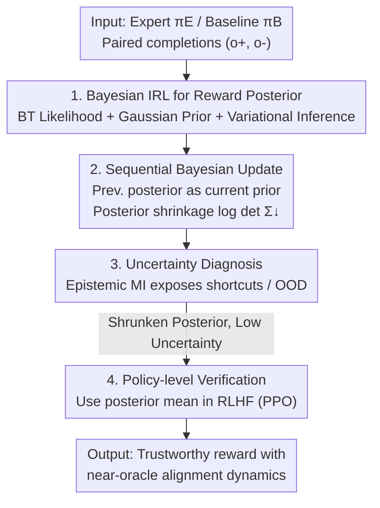

# The Alignment Auditor: A Bayesian Framework for Verifying and Refining LLM Objectives

**Conference**: ICLR 2026  
**OpenReview**: [https://openreview.net/forum?id=CH7TfRLqSF](https://openreview.net/forum?id=CH7TfRLqSF)  
**Code**: https://github.com/ai4ai-lab/IRL-Alignment-Auditor  
**Area**: RLHF Alignment / LLM Safety Auditing  
**Keywords**: Bayesian Inverse Reinforcement Learning, Reward Inference, Non-identifiability, Uncertainty Quantification, Alignment Auditing

## TL;DR
The study reformulates "recovering implicit LLM rewards via Inverse Reinforcement Learning (IRL)" from a one-off point estimation into a Bayesian auditing workflow. It first recovers the **posterior distribution** of rewards rather than a single point using variational inference, then shrinks the posterior round-by-round via sequential Bayesian updates. Epistemic uncertainty is employed to diagnose shortcuts and out-of-distribution inputs. Finally, the study demonstrates that the shrunken, low-uncertainty reward can be fed back into RLHF to replicate the alignment effects of an oracle reward (showing nearly identical toxicity reduction curves).

## Background & Motivation

**Background**: What an LLM truly optimizes after pre-training, fine-tuning, and RLHF remains implicit and opaque. Inverse Reinforcement Learning (IRL) provides a natural perspective: treating LLM outputs as behavioral demonstrations to infer the reward function that explains these behaviors, thereby auditing what the model "intends to achieve."

**Limitations of Prior Work**: Existing IRL methods for alignment auditing face two fatal issues. First, they typically return a **single, potentially overconfident** point estimate of the reward. Second, they ignore the **non-identifiability** inherent in the task—the same observed expert behavior can be explained equally well by an infinite number of different reward functions. Without principled uncertainty quantification, auditors cannot determine when the "inferred objective" is fragile or untrustworthy, making reward inference susceptible to being misled by spurious shortcuts.

**Key Challenge**: Auditing requires "trustworthiness judgment," whereas point-estimate IRL provides a "seemingly certain answer." Forcing an inherently ambiguous problem into a deterministic estimation framework hides ambiguity rather than exposing it—a condition unacceptable for auditing purposes.

**Goal**: The authors decompose reward inference into three sub-problems: (1) Explictly representing ambiguity and systematically reducing it; (2) Identifying which inputs make the inferred objective untrustworthy; and (3) Verifying that the inferred reward is not just a passive description of behavior but a usable objective capable of driving true alignment.

**Key Insight**: Bayesian IRL naturally handles non-identifiability by maintaining a **distribution** over reward functions. However, it has not been applied to LLMs previously and has typically stopped at "posterior inference." The authors observe that the posterior variance serves as a measure of non-identifiability, and the posterior can be actively "tightened" via sequential evidence.

**Core Idea**: Upgrade reward inference from "estimation" to "verification"—recovering the reward posterior via Bayesian IRL, shrinking it through sequential updates, providing actionable reliability signals via uncertainty diagnosis, and performing policy-level closed-loop verification with RLHF.

## Method

### Overall Architecture

The authors model LLM-user interaction as a **single-step MDP (contextual bandit)**: the state is the prompt $p$, the action is the completion $o$, and the reward $R_\theta(o)=\theta^\top\phi(o)$ is a linear function defined on fixed pre-trained encoder features $\phi(o)$. The core auditing goal is to infer and verify the expert's implicit reward parameters $\theta_E$ by observing paired completions $(o^+, o^-)$ from an expert policy $\pi_E$ (aligned, low toxicity) and a baseline policy $\pi_B$ (unaligned) on the same prompts.

The framework consists of a three-stage serial pipeline: **Stage 1** uses Bayesian IRL to convert paired demonstrations into a reward posterior distribution, making ambiguity explicit. **Stage 2** partitions data into $K$ rounds for sequential Bayesian updates (using the previous posterior as the current prior) to monotonically shrink the posterior, while using epistemic/aleatoric uncertainty decomposition to diagnose shortcuts and OOD prompts. **Stage 3** takes the mean of the final shrunken posterior as a reward signal to fine-tune a baseline LLM via standard RLHF (PPO), comparing its training dynamics with those driven by a true oracle reward for policy-level verification. Stages 1–2 constitute a "lightweight auditing mode" requiring no retraining, while Stage 3 is an optional step providing stronger behavioral evidence.

### Key Designs

**1. Bayesian IRL for Reward Posterior: Exposing Ambiguity with Distributions**

Addressing the issue of point estimates hiding non-identifiability, the authors infer the **full posterior distribution** of $\theta$ rather than a single point. Given a paired dataset $\mathcal{D}=\{(o_i^+, o_i^-)\}$, feature margins are defined as $\Delta\phi := \phi(o^+)-\phi(o^-)$. A standard Bayesian structure is established: the prior is a zero-mean isotropic Gaussian $p(\theta)=\mathcal{N}(\theta\mid 0, \sigma_0^2 I)$; the likelihood uses the Bradley–Terry model to characterize expert preference $o^+\succ o^-$,

$$P(o^+ \succ o^- \mid \theta) = \sigma\big(\alpha\,\theta^\top \Delta\phi\big), \qquad p(\mathcal{D}\mid\theta) = \prod_{i=1}^{N} \sigma\big(\alpha\,\theta^\top \Delta\phi_i\big),$$

where $\alpha$ is a fixed temperature. The posterior is given by $p(\theta\mid\mathcal{D})\propto p(\mathcal{D}\mid\theta)\,p(\theta)$. The key insight is that **the volume (specifically the variance) of this posterior directly quantifies non-identifiability**—a wider posterior indicates that many different reward functions explain the same behavior. As the posterior is analytically intractable, **variational inference** is used for approximation: a mean-field Gaussian variational family $q_\lambda(\theta)=\mathcal{N}(\theta\mid\mu,\mathrm{diag}(\sigma^2))$ is introduced to minimize $\mathrm{KL}(q_\lambda\|p(\theta\mid\mathcal{D}))$ by maximizing the ELBO:

$$\mathcal{L}(\lambda) = \mathbb{E}_{q_\lambda(\theta)}[\log p(\mathcal{D}\mid\theta)] - \mathrm{KL}\big(q_\lambda(\theta)\,\|\,p(\theta)\big).$$

**2. Sequential Bayesian Update: Tightening Ambiguity via Chain of Evidence**

The authors use a sequential Bayesian update scheme to **actively** reduce ambiguity: training data is partitioned into $K$ disjoint rounds $\mathcal{D}_1,\dots,\mathcal{D}_K$. In round $k$, the **posterior from the previous round $q_{k-1}(\theta)$ is used as the current prior** to derive a new posterior $q_k(\theta)$. This chain process updates Bayesian beliefs as evidence accumulates. The core auditing metric is **posterior shrinkage**, measured by the log-determinant of the covariance matrix $\log\det(\Sigma_k)$. A monotonic decrease in this value provides concrete evidence of reduced non-identifiability; conversely, posterior **expansion** in any round signals potential reward conflict or misspecification. In experiments, 5 rounds of sequential updates reduced the log-determinant from $-196$ to $-897$, indicating improved identifiability rather than mere data fitting.

**3. Uncertainty Diagnosis: Exposing Shortcuts and OOD via Epistemic Decomposition**

The reward posterior provides **actionable reliability signals**. Predictive uncertainty (entropy of preference label $y$) is decomposed into aleatoric (data ambiguity) and epistemic (model uncertainty) components:

$$\underbrace{H[p(y\mid o,\mathcal{D})]}_{\text{Total Uncertainty}} = \underbrace{\mathbb{E}_{q(\theta)}\big[H[p(y\mid o,\theta)]\big]}_{\text{Aleatoric}} + \underbrace{I(\theta, y\mid o,\mathcal{D})}_{\text{Epistemic (MI)}}.$$

High epistemic uncertainty (Mutual Information, MI) indicates the reward model is uncertain about the input, marking truly ambiguous or **out-of-distribution (OOD)** prompts. Diagnostic probes are created by injecting spurious features (irrelevant keywords) into prompts. A robust reward model should exhibit **increased** epistemic uncertainty on such "polluted" inputs, whereas a model that has learned a shortcut will falsely appear overconfident. In experiments, "marked" prompts showed higher local uncertainty, and reward variance correlated strongly with Mahalanobis distance to the training distribution ($r=0.989$), proving the model "knows what it doesn't know."

**4. Policy-level Verification: Driving Alignment via Inferred Rewards**

The ultimate test is whether the inferred reward truly drives alignment. The mean of the final shrunken posterior $\hat R(o)=\mu_K^\top\phi(o)$ is used as a reward signal to fine-tune the baseline $\pi_B$ via standard PPO. These training dynamics are compared against a ground-truth run using the oracle reward from $\pi_E$. Verification targets three metrics: monotonic increase and alignment of the reward curve with the oracle, stable KL divergence between the policy and baseline (indicating controlled learning), and comparable toxicity reduction rates on held-out high-risk prompts. Alignment is successful only if the policy trained on the inferred reward **replicates** the behavior of the oracle-trained policy. Crucially, using the round 1 posterior (insufficiently identified) for PPO leads to reward hacking, whereas shrunken posteriors from round 2 onwards do not.

### Loss & Training

The reward head is a linear layer on frozen text features $\phi(o)$, which are mean-pooled hidden states from LLM embedding spaces, standardized and fixed. The variational posterior is trained with Adam (lr $1\text{e}{-2}$, batch 256) for 3k steps. Sequential updates use 5 rounds, each training for 3k steps. The expert policy $\pi_E$ is generated via KL-regularized PPO on RealToxicityPrompts against a RoBERTa toxicity classifier, with objective $J(\phi)=\mathbb{E}_{o\sim\pi_\phi}[R^\star(o)] - \beta\,\mathrm{KL}(\pi_\phi\|\pi_{\text{ref}})$.

## Key Experimental Results

### Main Results

The primary task is detoxification using AllenAI **RealToxicityPrompts** (99k completions with Perspective scores), with generalization tests on Anthropic **HH-RLHF** helpfulness. Models include Pythia (70M to 1B), SmolLM (135M/360M), Llama-3.2-1B, and Llama-3.1-8B. Metrics include pairwise accuracy, AUROC, Brier score, and ECE.

| Setup | Model | Key Metric | Result |
|--------|------|------|------|
| Detox (Main) | Llama-3.2-1B | Reward separation Cohen's $d$ | 1.325 |
| Detox (Main) | Llama-3.1-8B | Reward separation Cohen's $d$ | 1.821 (Scales with size) |
| Helpfulness | Llama-3.2-1B → 8B | Pairwise accuracy | 0.725 → 0.729 |
| Helpfulness | Llama-3.2-1B → 8B | Single-text F1 | 0.630 → 0.645 |

**Main Conclusion**: The reward function clearly separates toxic and non-toxic completions. Reliability curves for both pairwise and single-text diagnostics are well-calibrated. Performance and calibration improve with **model scale**, as features become more linearly separable. Pairwise calibration is consistently stronger than single-text calibration, suggesting inferred rewards are most reliable for comparative judgments.

### Ablation Study

| Configuration | Key Metric | Description |
|------|---------|------|
| Single round inference | $\log\det\Sigma \approx -196$ | Wide posterior, under-identified |
| Sequential (5 rounds) | $\log\det\Sigma \approx -897$ | Volume significantly shrunken, identifiability improved |
| PPO with Round 1 posterior | Unstable dynamics / Poor toxicity | Under-identification leads to reward hacking |
| PPO with Round 2–5 posterior | Toxicity reduction matches oracle | Shrinkage enables safe alignment |

### Key Findings
- **Posterior shrinkage is the core mechanism**: Across 5 rounds, $\log\det(\Sigma_k)$ and epistemic uncertainty (MI) decrease monotonically as data increases, while accuracy improves and calibration errors decrease.
- **Epistemic uncertainty is a true signal**: The strong correlation ($r=0.989$) between reward variance and Mahalanobis distance, combined with monotonic shrinkage, supports interpreting epistemic uncertainty as genuine reward ambiguity.
- **"Shrink-then-align" is essential**: Using the under-identified round 1 posterior leads to reward hacking; only subsequent shrunken posteriors allow RLHF to replicate the oracle's toxicity reduction without degradation.

## Highlights & Insights
- **Using "posterior variance" as a direct "measure of non-identifiability"**: This elegantly transforms a long-standing IRL challenge into a monitorable scalar $\log\det\Sigma$, making "ambiguity reduction" an engineering objective.
- **Sequential "posterior-as-prior" as a conflict detector**: Any expansion of the posterior provides a built-in consistency check by flagging reward conflicts or model misspecification.
- **Epistemic uncertainty diagnosis makes "shortcuts" observable**: The use of diagnostic probes to check if a model becomes more cautious or overconfident provides a framework transferable to any reward model auditing task.
- **Policy-level closed-loop verification sets a high standard**: The study demands not just classification accuracy but the ability to drive the same training dynamics as an oracle.

## Limitations & Future Work
- **Capacity ceiling of linear rewards and frozen features**: Dependence on $R_\theta(o)=\theta^\top\phi(o)$ results in "calibrated but uninformative" behavior in small models, where non-identifiability remains high.
- **Circularity of expert rewards as ground truth**: Since the expert $\pi_E$ is constructed using a known toxicity classifier, the "true goal" is pre-defined. Auditing becomes harder in real scenarios where no oracle exists.
- **Scale and single-step bandit assumptions**: The study focuses on models up to 8B and single-step interactions, leaving long-range dependencies in multi-turn dialogues unaddressed.
- **Future Work**: Implementing non-linear reward heads, expanding diagnostic probes to systematic adversarial OOD suites, and performing end-to-end auditing on real-world deployed models.

## Related Work & Insights
- **Vs. Point-estimation IRL (Joselowitz et al. 2025)**: Previous works stop at single reward inference, leaving non-identifiability and practical verification unaddressed. This work extends the process to posterior recovery and policy-level validation.
- **Vs. Classical Bayesian IRL (Ramachandran & Amir 2007)**: While Bayesian IRL has long handled non-identifiability via distributions, this work is the first to apply it to LLMs and complete the loop with shrinkage and verification.
- **Vs. Cai et al. 2025**: Similar in formulating alignment as Bayesian IRL, but focusing on inference **efficiency**, whereas this work contributes a broader **auditing framework** integrating sequential shrinkage and policy verification.
- **Vs. LLM Uncertainty Quantification**: Standard UQ methods quantify uncertainty in **outputs or prompts**. This work quantifies the posterior over the **reward function driving the behavior**, moving from surface-level calibration to objective-level verification.

## Rating
- **Novelty**: ⭐⭐⭐⭐⭐ First application of Bayesian IRL to LLMs, reformulating reward inference into a comprehensive audit paradigm.
- **Experimental Thoroughness**: ⭐⭐⭐⭐ Covers 7 model sizes and two tasks; includes shrinkage, diagnosis, and closed-loop evidence.
- **Writing Quality**: ⭐⭐⭐⭐⭐ Clear three-stage structure with well-explained metrics and progressive motivation.
- **Value**: ⭐⭐⭐⭐⭐ Provides an actionable toolkit for auditors and safety teams to verify what LLMs are truly optimizing.

<!-- RELATED:START -->

## Related Papers

- [\[ICLR 2026\] RE-PO: Robust Enhanced Policy Optimization as a General Framework for LLM Alignment](re-po_robust_enhanced_policy_optimization_as_a_general_framework_for_llm_alignme.md)
- [\[AAAI 2026\] Differentiated Directional Intervention: A Framework for Evading LLM Safety Alignment](../../AAAI2026/llm_alignment/differentiated_directional_intervention_a_framework_for_evading_llm_safety_align.md)
- [\[ICLR 2026\] Beyond RLHF and NLHF: Population-Proportional Alignment under an Axiomatic Framework](beyond_rlhf_and_nlhf_population-proportional_alignment_under_an_axiomatic_framew.md)
- [\[ICLR 2026\] Inverse Reinforcement Learning with Dynamic Reward Scaling for LLM Alignment](inverse_reinforcement_learning_with_dynamic_reward_scaling_for_llm_alignment.md)
- [\[ICLR 2026\] Beyond Pairwise: Empowering LLM Alignment With Ranked Choice Modeling](beyond_pairwise_empowering_llm_alignment_with_ranked_choice_modeling.md)

<!-- RELATED:END -->
