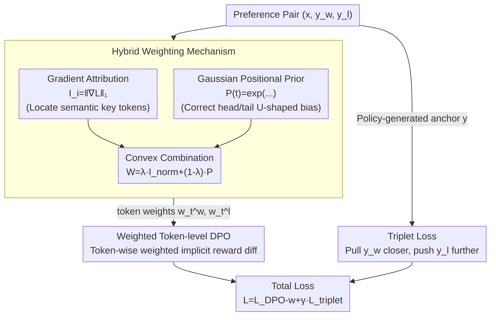

# Token-Importance Guided Direct Preference Optimization (TI-DPO)

**Conference**: ICLR 2026 Oral  
**arXiv**: [2505.19653](https://arxiv.org/abs/2505.19653)  
**Code**: [https://github.com/gracefulning/TIDPO](https://github.com/gracefulning/TIDPO)  
**Area**: Alignment RLHF / DPO  
**Keywords**: token-level DPO, gradient attribution, hybrid weights, triplet loss, fine-grained alignment

## TL;DR
This paper proposes TI-DPO, which precisely quantifies the contribution of each token to preferences through a hybrid weighting mechanism (gradient attribution + Gaussian prior), combined with a triplet loss to guide optimization in continuous semantic space. It achieves SOTA with an average score of 62.3 across 6 benchmarks and provides interpretable token-level control.

## Background & Motivation

**Background**: DPO optimizes preferences at the sequence level, ignoring the differentiated importance of various tokens. Existing token-level methods (e.g., TDPO, TIS-DPO) use probability proxies to estimate importance, which are often biased.

**Limitations of Prior Work**:
   - Coarse-grained optimization in DPO is sensitive to data noise and severe distribution shifts.
   - Probability proxies in existing token-level methods produce inconsistent outputs.
   - The binary "chosen/rejected" contrastive framework cannot finely adjust generation behavior in continuous semantic space.

**Key Challenge**: The need to accurately identify key tokens while simultaneously guiding preference adjustment in continuous space.

**Core Idea**: Use gradient attribution to locate key tokens, a Gaussian prior to correct positional bias, and triplet loss for continuous space guidance.

## Method

### Overall Architecture

TI-DPO decentralizes the DPO signal from the sequence level to the token level. Given a preference pair $(x, y_w, y_l)$, it follows three steps: first, it uses a **hybrid weighting mechanism** to estimate importance for each token in $y_w$ and $y_l$ (gradient attribution locates semantic key positions, while Gaussian priors correct head/tail biases); second, these weights are integrated into token-level implicit reward differences for **weighted contrast**, allowing key tokens to dominate the optimization signal; concurrently, the policy model generates an anchor response, and a **triplet loss** is applied in the continuous semantic space to pull the anchor closer to the chosen response and push it away from the rejected one. The two losses are combined into the total objective: $\mathcal{L}_{\text{TI-DPO}} = \mathcal{L}_{\text{DPO-w}} + \gamma \mathcal{L}_{\text{triplet}}$, where $\gamma$ balances the weighted DPO term and the triplet term.

### Key Designs

**1. Hybrid Weighting Mechanism: Magnifying Key Tokens and Suppressing Noise**

The importance of tokens within a sequence varies significantly, but standard DPO treats them equally, leading to noise sensitivity. TI-DPO fuses two signals for token weights. The first is gradient attribution $I_i = \|\nabla_{e_i}\mathcal{L}_{\text{target}}\|_1$, calculated as the $\ell_1$ norm of the gradient of the target loss with respect to each token's embedding $e_i$. A larger gradient indicates a more critical impact on the final prediction. However, gradient attribution suffers from inherited U-shaped attention bias where head/tail tokens are overemphasized. Thus, a second signal, a Gaussian positional prior $\mathcal{P}(t) = \exp(-\frac{1}{2}(\frac{t-\mu}{\sigma})^2)$ (with $\mu=(T-1)/2, \sigma=T/4$), is introduced to boost weights of middle tokens and offset this bias. The final weight $W = \lambda \cdot \mathcal{I}_{\text{norm}} + (1-\lambda) \cdot \mathcal{P}$ ensures accuracy and stability.

**2. Weighted Token-level DPO: Decomposing Reward Differences**

Upon obtaining weights, TI-DPO reformulates the implicit reward difference: $\Delta r_{\text{token}} = \sum_t w_t^w \log\frac{\pi_\theta(y_w^t|\cdot)}{\pi_{\text{ref}}(y_w^t|\cdot)} - \sum_t w_t^l \log\frac{\pi_\theta(y_l^t|\cdot)}{\pi_{\text{ref}}(y_l^t|\cdot)}$. Unlike original DPO which sums log-likelihood ratios equally, here each token's log-ratio is multiplied by its weight $w_t$. This amplifies the contribution of key tokens and suppresses noisy ones, making the signal more robust to label noise and distribution shifts.

**3. Triplet Loss: Guidance in Continuous Semantic Space**

Binary "chosen/rejected" contrast only identifies which is better but lacks fine-grained adjustment in continuous space. TI-DPO directs the policy model to generate an anchor response $y$ and optimizes it in the implicit reward space to be closer to $y_w$ and further from $y_l$ via $\mathcal{L}_{\text{triplet}} = \max(0, d(y, y_w) - d(y, y_l) + \alpha)$, where $\alpha$ is a margin hyperparameter. This shifts the target from "choosing sides between two samples" to "actively aligning with good samples while distancing from bad ones."

## Key Experimental Results

### Main Results (Average across 3 models)

| Method | MMLU | GSM8K | HumanEval | TruthfulQA | IFEval | Avg |
|------|------|-------|-----------|-----------|--------|-----|
| DPO | 65.3 | 69.3 | 61.0 | 56.7 | 70.0 | 57.7 |
| SimPO | 63.5 | 64.7 | 58.2 | 54.2 | 64.7 | 54.5 |
| GRPO | 70.7 | **75.7** | 64.3 | 59.9 | 74.0 | 62.1 |
| **TI-DPO** | 70.0 | 73.0 | **67.0** | **62.0** | **75.7** | **62.3** |

### Ablation Study (Llama-3.2-3B)

| Configuration | General | Math | Code | Reliability |
|------|---------|------|------|-------------|
| **Full TI-DPO** | **65.4** | **80.7** | **33.0** | **86.8** |
| w/o Triplet Loss | 64.0 | 79.0 | 31.0 | 83.0 |
| Uniform Weights | 64.0 | 78.2 | 29.0 | 80.0 |
| w/o Gaussian Prior | 64.5 | 79.7 | 31.5 | 82.5 |

### Key Findings
- **TI-DPO performs on par with GRPO**: Average 62.3 vs 62.1, but TI-DPO leads in HumanEval (67 vs 64.3) and IFEval (75.7 vs 74).
- **Task-Adaptive Weight Distribution**: Weights for math tasks concentrate in $[0.2, 0.5]$ (few key symbols), while safety tasks skew towards $[0.6, 0.8]$ (requiring comprehensive attention).
- **Noise Robustness**: TI-DPO shows the least performance degradation as label noise increases.
- **Interpretability**: Higher weights can be visualized on critical tokens; for instance, "medical attention" receives high weight in medical scenarios while "painkillers" is downweighted.

## Highlights & Insights
- **Complementary Design**: The fusion of gradient attribution (semantic importance) and Gaussian priors (bias correction) provides a comprehensive weighting scheme.
- **Breaking Binary Framework**: Triplet loss extends preference learning from simple binary contrast to alignment in continuous semantic space.
- **Interpretable Control**: Beyond performance gains, the ability to visualize key tokens provides direct value for safety auditing.

## Limitations & Future Work
- **Computational Overhead**: Gradient attribution requires additional forward and backward passes.
- **Gaussian Prior Assumption**: Assumes important tokens are somewhat centrally distributed; this may not hold for all tasks.
- **Future Directions**: Potential integration with Uni-DPO's quality weights for dual-layer dynamic weighting at both the data and token levels.

## Related Work & Insights
- **vs TDPO/TIS-DPO**: TI-DPO is more accurate by using gradient attribution instead of biased probability proxies.
- **vs Uni-DPO**: Uni-DPO weights at the data level, while TI-DPO weights at the token level; they are orthogonal and combinable.
- **vs GRPO**: While GRPO uses RL exploration, TI-DPO focuses on token-level refinement of supervised signals; they reach similar performance through different mechanisms.

## Rating
- Novelty: ⭐⭐⭐⭐ Sophisticated combination of hybrid weights and triplet loss.
- Experimental Thoroughness: ⭐⭐⭐⭐⭐ 6 benchmarks × 3 models + detailed ablation and noise experiments.
- Writing Quality: ⭐⭐⭐⭐ Clear theoretical motivation.
- Value: ⭐⭐⭐⭐ Practical improvement to token-level DPO with interpretability as a key advantage.

<!-- RELATED:START -->

## Related Papers

- [\[ICLR 2026\] SafeDPO: A Simple Approach to Direct Preference Optimization with Enhanced Safety](safedpo_preference_optimization_safety.md)
- [\[ICML 2026\] Autoregressive Direct Preference Optimization](../../ICML2026/llm_alignment/autoregressive_direct_preference_optimization.md)
- [\[ICML 2025\] DPO Meets PPO: Reinforced Token Optimization for RLHF](../../ICML2025/llm_alignment/dpo_meets_ppo_reinforced_token_optimization_for_rlhf.md)
- [\[ICLR 2026\] ActiveDPO: Active Direct Preference Optimization for Sample-Efficient Alignment](activedpo_active_direct_preference_optimization_for_sample-efficient_alignment.md)
- [\[ICML 2026\] Boosting Direct Preference Optimization with Penalization](../../ICML2026/llm_alignment/boosting_direct_preference_optimization_with_penalization.md)

<!-- RELATED:END -->
