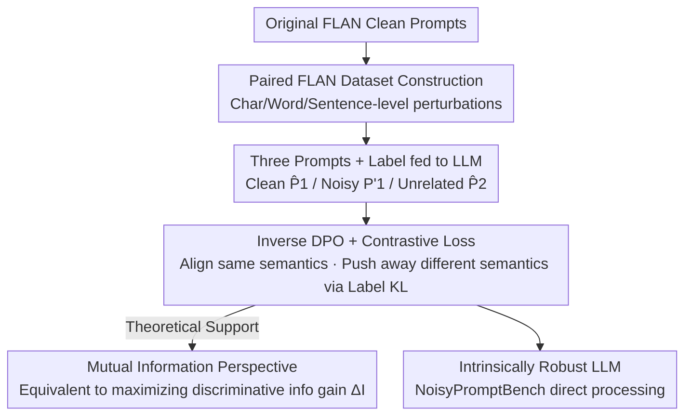

# Towards Self-Robust LLMs: Intrinsic Prompt Noise Resistance via CoIPO

**Conference**: ICLR 2026  
**OpenReview**: [https://openreview.net/forum?id=TUd3c7Vr1z](https://openreview.net/forum?id=TUd3c7Vr1z)  
**Code**: https://github.com/vegetable-yx/CoIPO  
**Area**: Alignment RLHF / LLM Robustness  
**Keywords**: Prompt Noise Robustness, Inverse DPO, Contrastive Learning, Preference Optimization, Mutual Information

## TL;DR
This paper proposes CoIPO (Contrastive Learning + Inverse DPO) to ensure LLMs produce outputs consistent with clean prompts when facing noisy prompts (typos, word substitutions, syntactic perturbations). Without relying on external pre-processing tools, it embeds intrinsic robustness into the model during training, outperforming the current SOTA (CoIN) by an average accuracy of 3.64% on the self-constructed NoisyPromptBench.

## Background & Motivation
**Background**: LLMs are extremely sensitive to prompt perturbations, especially in "constrained output" scenarios like mathematical problem solving, code generation, or strict JSON/XML formatting. Even minor perturbations can cause performance to plummet (Figure 1 shows Llama2-7B dropping from 55.10% to 37.66% under TextFolder perturbations, a 17.44% decrease). Real-world user prompts are rarely "perfect"—misspellings ("clasify" instead of "classify"), word choice variations (using "investigation" for "diagnosis"), or irrelevant content can degrade response quality.

**Limitations of Prior Work**: Previous work mainly followed the "prompt pre-processing and repair" route—using grammar checkers, terminology normalization, or a second LLM to rewrite prompts. These external solutions have three fatal flaws: ① additional computational overhead, cost, and deployment complexity; ② multi-stage pipelines **cascadely amplify errors**, causing the final output to deviate from intent; ③ they treat the model as an entity that must be "fed clean input," ignoring its potential to process noisy input internally. Moreover, existing noise benchmarks (e.g., PromptBench) mostly support single-step perturbations, failing to simulate real-world scenarios.

**Key Challenge**: "Outsourcing" robustness to front-end tools is an admission that the model itself is not robust—this increases costs and introduces new uncertainties. The real task should be making the model **intrinsically** immune to noise, rather than constantly patching the input.

**Goal**: To train "prompt perturbation immunity" directly into the model parameters through pure offline post-training without introducing any external components.

**Key Insight**: For semantically equivalent clean/noisy prompt pairs, a model should ideally provide **nearly identical label prediction distributions**. Thus, the robustness problem is transformed into a distribution alignment problem: pulling the "noisy prompt logits for the correct label" closer to the "clean prompt logits for the same label," while pushing away logits from "unrelated task prompts."

**Core Idea**: Utilizing "Inverse DPO" (fixing labels while comparing different prompts) combined with Contrastive Learning, the model learns to provide the same label confidence regardless of whether the prompt is clean or noisy, as long as the semantics are identical.

## Method

### Overall Architecture
The input to CoIPO is a triplet—a clean prompt $\hat P_1$, its noisy version $P'_1$, and an unrelated clean prompt $\hat P_2$ from a different task. These are concatenated with the same label $y_1$ and fed into the LLM to obtain three sets of logits (Logits 1, Logits 1', Logits 2 in Figure 3). The training objective is: using the **noisy prompt** label logits as a reference point, **maximize** its similarity to the semantically identical clean prompt $\hat P_1$ (preferred) and **minimize** its similarity to the semantically different prompt $\hat P_2$ (dispreferred). Similarity is measured by KL divergence over label tokens. The entire process is pure offline post-training; at inference, the model processes noisy prompts directly without external modules.

This method is supported by three pillars: **paired training data** (how to construct clean-noisy pairs), **Inverse DPO + Contrastive Learning loss** (optimization objective), and **Mutual Information interpretation** (why this loss improves discriminative information).

### Key Designs

**1. Inverse DPO: Fixed Labels, Comparing Different Prompts**

Standard DPO compares log probabilities of "different outputs given the same input $x$." However, in robustness, the "output (label $y$)" is fixed, and the comparison is between "conditional probabilities of the same label given different prompts"—effectively swapping the roles of input and output in DPO, which the authors call Inverse DPO (invDPO). Formally, defining a comparison function $D$, the loss is $L_{\text{invDPO}} = -D(\hat P_2 \| P'_1, y_1) + D(\hat P_1 \| P'_1, y_1)$, where $\hat P_1, \hat P_2$ are clean prompts from different tasks and $P'_1$ is the noisy version of $\hat P_1$. The intuition is to make $P'_1$ **closer** to $\hat P_1$ and **farther** from $\hat P_2$ in label space. This "input-side preference" differentiates this work from standard preference optimization.

**2. Contrastive Learning Instance D: KL Divergence on Label Tokens**

To implement $D$, the authors use logit distribution similarity as a proxy for probability. For input sequence $S = P \oplus y$ (prompt concatenated with label), the model forward pass yields logits $\ell_{1:T}(S) = g_\theta(S)$. A mask operator $M_y(\cdot)$ is used to **retain only logits corresponding to label tokens**, yielding conditional distributions $p^{(P,y)}_t = \mathrm{softmax}(M_y(\ell_t(P\oplus y)))$. $D$ is then instantiated as sequence-level KL divergence $D(P\|P_{\text{ref}}, y) = \sum_{t\in T_y} \mathrm{KL}(p^{(P_{\text{ref}},y)}_t \| p^{(P,y)}_t)$. The final loss sets the noisy prompt $P'_1$ as the reference:

$$L = -\sum_{t\in T_{y_1}} \mathrm{KL}\big(p^{(P'_1,y_1)}_t \,\|\, p^{(\hat P_2,y_1)}_t\big) + \sum_{t\in T_{y_1}} \mathrm{KL}\big(p^{(P'_1,y_1)}_t \,\|\, p^{(\hat P_1,y_1)}_t\big)$$

The second term minimizes the gap between noisy and semantically identical clean prompts, while the first term maximizes the gap with the unrelated prompt. Minimizing $L$ achieves the contrastive effect of "aligning same semantics, rejecting different semantics," ensuring noisy prompts are indistinguishable from clean ones in label prediction.

**3. Mutual Information Interpretation: Minimizing Loss = Maximizing Discriminative Info Gain**

The authors argue from a mutual information perspective. Defining relative mutual information gain $\Delta I = I(Y;\hat P_1 \mid P'_1) - I(Y;\hat P_2 \mid P'_1)$, which measures "how much more discriminative information about label $Y$ is provided by the correct clean prompt versus the incorrect one." Expanding conditional mutual information simplifies it to the difference in conditional entropy $\Delta I = H(Y\mid \hat P_2, P'_1) - H(Y\mid \hat P_1, P'_1)$. Using the model's output distribution under noisy prompts $q(y) = p_\theta(y\mid P'_1)$ as an empirical reference, the empirical MI difference is written as the difference between two KL divergences $\Delta\tilde I_q = \mathrm{KL}(q\|p_\theta(\cdot\mid\hat P_2)) - \mathrm{KL}(q\|p_\theta(\cdot\mid\hat P_1))$, which leads to $L_{\text{CoIPO}} = -\Delta\tilde I_q$. Thus, **minimizing CoIPO loss is strictly equivalent to maximizing relative mutual information gain**.

### Loss & Training
Training data is based on FLAN, selecting 25 sub-tasks with fixed answers. For each entry, a clean prompt is generated from a template, and character/word/sentence-level perturbations are randomly applied to create noisy pairs. Models used are Alpaca (instruction-tuned LLaMA-7B) and Qwen2.5-7B, with a learning rate of $1\times10^{-4}$, batch size 64, and max sequence length 256, trained on A100.

## Key Experimental Results

### Main Results
Evaluation on NoisyPromptBench (enhanced from PromptBench, 5 datasets × 4 perturbation types: DeepWordBug/TextFolder/CheckList/StressTest). Acc denotes accuracy, and Diff denotes the drop relative to clean prompts.

| Model | Method | Clean Acc | Avg Acc (Perturbed) | Avg Diff |
|------|------|-----------|-----------|-----------|
| Llama | Base | 55.10 | 46.64 | 10.58 |
| Llama | SFT | 57.28 | 54.72 | 3.20 |
| Llama | CoIN | 61.87 | 58.60 | 4.08 |
| Llama | **CoIPO** | **67.00** | **63.90** | 3.88 |
| Qwen | Base | 75.25 | 72.24 | 3.76 |
| Qwen | SFT | 77.94 | 76.85 | 1.36 |
| Qwen | CoIN | 82.93 | 81.48 | 1.81 |
| Qwen | **CoIPO** | **83.88** | **83.45** | **0.54** |

On Llama, CoIPO's average accuracy exceeds CoIN by 5.3%, SFT by 9.18%, and Base by 17.26%. On Qwen, it exceeds CoIN by 1.97%, SFT by 6.6%, and Base by 11.21%. Top-tier performance is achieved with a drop of only 0.54% on Qwen.

### Ablation Study
The method consists of Inverse DPO and Contrastive Learning. Components are tested separately: CL only, InvDPO only, and full CoIPO.

| Model | Configuration | Clean Acc | Avg Acc (Perturbed) | Avg Diff |
|------|------|-----------|-----------|-----------|
| Llama | SFT | 57.28 | 54.72 | 3.20 |
| Llama | CL | 61.87 | 58.60 | 4.08 |
| Llama | InvDPO | 65.89 | 62.72 | 3.97 |
| Llama | **CoIPO** | **67.00** | **63.90** | 3.88 |

### Key Findings
- **Both components are essential, but InvDPO is primary**: CL or InvDPO alone cannot beat the full CoIPO, though both outperform SFT. InvDPO contributes more significantly (Llama 62.72% vs CL 58.60%), confirming that preference modeling by comparing prompts is the core mechanism.
- **High Performance and High Stability**: CoIPO achieves the highest accuracy on clean prompts while maintaining minimal drops under perturbation (just 0.54% for Qwen).
- **Larger Decoding Radius**: CoIPO's decoding radius $R(a)$ is significantly larger than Base, meaning it can withstand more character edits before accuracy drops below a threshold $a$.
- **Cross-scale Effectiveness**: CoIPO maintains a steady lead across Qwen2.5 7B/14B/72B, following standard scaling trends.

## Highlights & Insights
- **Swapping DPO roles** is a brilliant move: Standard preference optimization compares "same input, different outputs," while this work compares "same output, different inputs." This naturally formulates prompt robustness as a preference signal without requiring reward models or manual labeling.
- **Robustness Internalization**: Moving from "repairing input" to "fixing the model" allows for intrinsic immunity, reducing costs and pipeline errors while enabling independent deployment.
- **Information Theory Loop**: The equivalence $L_{\text{CoIPO}} = -\Delta\tilde I_q$ provides a principled foundation rather than an ad-hoc engineering fix.
- **Selective KL**: Calculating KL only on label tokens focuses constraints on regions that actually impact the answer, avoiding noise from prompt phrasing differences.

## Limitations & Future Work
- **Narrow Task Scope**: Experiments are concentrated on classification/NLI sub-tasks from FLAN. Applicability to open-ended generation (long text, reasoning chains) remains unverified.
- **Requirement for Paired Data**: Training requires clean-noisy pairs and unrelated negative samples, involving data engineering costs.
- **Perturbation Metrics**: Using character edit distance for radius is somewhat coarse; sentence-level semantic perturbations might require better metrics.
- **Future Directions**: Extending invDPO to generative tasks (using sequence-level consistency), introducing hard negatives, or curriculum training with online perturbations.

## Related Work & Insights
- **vs Prompt Pre-processing**: These tools repair prompts at the **input stage**. CoIPO **internalizes** robustness within parameters, eliminating external components and inference latency.
- **vs CoIN (Prev. SOTA)**: Both aim for intrinsic robustness, but CoIPO uses Inverse DPO + Contrastive Learning with information theory grounding, achieving a Gain of +3.64% on average.
- **vs Standard DPO**: DPO optimizes "same input, multi-output" preferences; CoIPO is a role-reversal adaptation for the "input robustness" problem.

## Rating
- Novelty: ⭐⭐⭐⭐ The role-reversal of Inverse DPO is simple yet effective, supported by MI theory.
- Experimental Thoroughness: ⭐⭐⭐⭐ Extensive testing across model families and scales, though limited to discrete tasks.
- Writing Quality: ⭐⭐⭐⭐ Clear motivation, complete derivations, and intuitive framework diagrams.
- Value: ⭐⭐⭐⭐ Provides a practical intrinsic robustness solution, the NoisyPromptBench benchmark, and paired data.

<!-- RELATED:START -->

## Related Papers

- [\[ACL 2026\] Team-Based Self-Play With Dual Adaptive Weighting for Fine-Tuning LLMs](../../ACL2026/llm_alignment/team-based_self-play_with_dual_adaptive_weighting_for_fine-tuning_llms.md)
- [\[ICLR 2026\] Robust Reward Modeling via Causal Rubrics](robust_reward_modeling_via_causal_rubrics.md)
- [\[ICLR 2026\] Robust Preference Alignment via Directional Neighborhood Consensus](robust_preference_alignment_via_directional_neighborhood_consensus.md)
- [\[ICLR 2026\] JULI: Jailbreak Large Language Models by Self-Introspection](juli_jailbreak_large_language_models_by_self-introspection.md)
- [\[ICLR 2026\] Obscure but Effective: Classical Chinese Jailbreak Prompt Optimization via Bio-Inspired Search](obscure_but_effective_classical_chinese_jailbreak_prompt_optimization_via_bio-in.md)

<!-- RELATED:END -->
