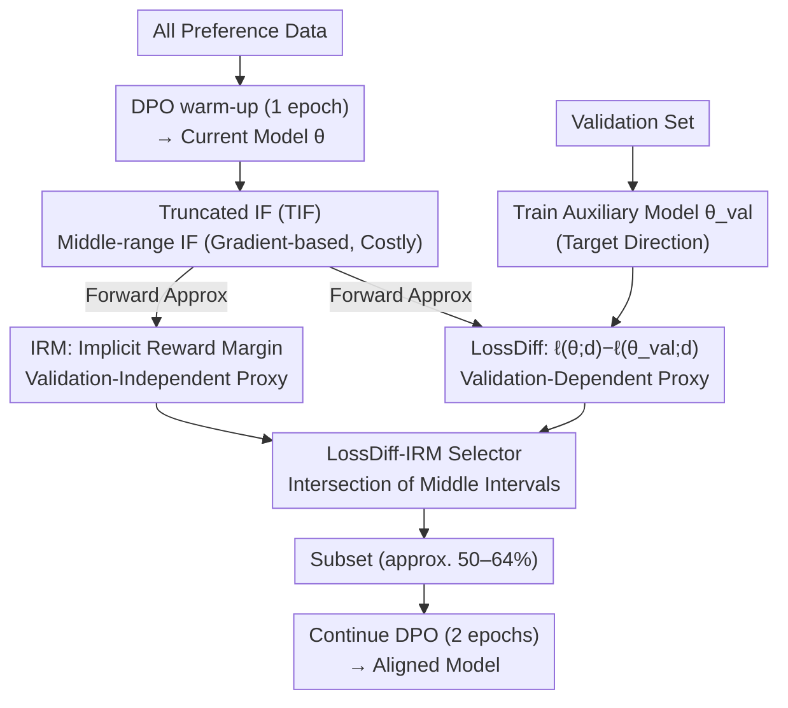

# Towards Understanding Valuable Preference Data for Large Language Model Alignment

**Conference**: ICLR 2026  
**arXiv**: [2510.13212](https://arxiv.org/abs/2510.13212)  
**Code**: [GitHub](https://github.com/tmlr-group/TIF_LossDiff-IRM)  
**Area**: LLM Alignment  
**Keywords**: Preference data selection, influence functions, DPO, data quality, model-dependency

## TL;DR
This paper investigates preference data quality from a model-dependent perspective. It proposes the Truncated Influence Function (TIF), revealing that medium-IF data is the most valuable (contrary to the classical view favoring high-IF data). Two lightweight proxy metrics, LossDiff and IRM, are designed to approximate TIF. Their combination, the LossDiff-IRM selector, achieves an average WinRate improvement of 13.58% using only 50-64% of the data, demonstrating effectiveness across multiple LLM families and alignment benchmarks.

## Background & Motivation

**Background**: LLM alignment relies on high-quality preference data. Existing methods typically use external reward models or GPT-4 to filter data, implicitly assuming that "data quality is an inherent property of the data itself." However, this ignores the influence of the specific model and training configuration on data value.

**Performance of Prior Work**: (1) External filtering (GPT-4/reward models) treats data quality as inherent and model-agnostic—identical data may be beneficial to one model but harmful to another; (2) Classical Influence Functions (IF) suffer from overfitting to the validation set in preference alignment (high-IF data is not necessarily optimal); (3) Exact IF computation requires gradients, making it computationally prohibitive for large models.

**Key Challenge**: Preference alignment is an open-ended task without standard answers. Validation set gradients serve as imperfect proxies. Traditional IF assumes high-IF data equals high-quality data, but in preference alignment, this leads to overfitting—the model over-optimizes toward a maximum margin on a few high-IF samples, harming overall performance.

**Goal**: (a) What type of preference data is truly valuable? (b) How can valuable data be identified efficiently? (c) How can data selection be adapted to a specific model?

**Key Insight**: By using IF to categorize training data into small, medium, and large groups, observation of training dynamics reveals that medium-IF data produces the most stable alignment effects. This leads to the proposal of TIF (Truncated IF), which retains only the middle interval. Furthermore, lightweight, positively correlated proxies are designed to approximate TIF.

**Core Idea**: The value of preference data is model-dependent, and medium-influence data is the most valuable—not too easy, not too difficult, but "just right."

## Method

### Overall Architecture
This paper addresses two main questions: what type of data is valuable in preference alignment, and how to select such data for a specific model without computing gradients. The answer is built on the counter-intuitive observation that data in the middle range of the Influence Function (IF) is best, as values that are too small represent noise and values that are too large lead to overfitting.

The pipeline follows a "warm-up, filter, and continue training" approach: first, perform one epoch of DPO warm-up on all preference data to bring the model into an aligned state while training an auxiliary model on a validation set to serve as the "validation target direction." Next, use two lightweight indicators that require only forward passes—LossDiff and IRM—to approximate the TIF for each data point. Only the intersection of data where both indicators fall within the middle percentile range (approx. 50–64%) is retained. Finally, DPO training is continued for 2 epochs on this subset.

### Key Designs

**1. Truncated Influence Function (TIF): Correcting "High IF = Good" to "Medium IF is Best"**

Classical influence functions in classification tasks assume higher IF data is more valuable. However, since preference alignment is an open-ended task with no standard labels—relying on validation gradients as imperfect proxies for human preference—this assumption fails. By partitioning data by IF percentiles into small, medium, and large groups, the authors observed: small-IF data consists of noise or ambiguous samples (eval loss increases after training); large-IF data causes overfitting (eval loss dips then rises, with margins of few pairs pushed to extremes); only **medium-IF** data leads to stable decreases in eval loss and steady increases in margins. Thus, TIF retains only the middle range:

$$\text{TIF}(d) = \mathbb{I}[\delta_{small} < \text{IF}(d) < \delta_{large}]$$

This is counter-intuitive compared to classification tasks but logical given imperfect validation gradients: extreme IF values signify low-quality data.

**2. Loss Difference (LossDiff): Approximating IF with Forward Passes**

Since exact IF is infeasible for LLMs, a proxy positively correlated with IF that uses only forward passes is needed. LossDiff works by training an aligned auxiliary model $\pi_{\theta_{val}}$ on a validation set to serve as the "validation target" and measuring the loss difference between the current model $\theta$ and this target:

$$\text{LossDiff}(d) = \ell(\theta; d) - \ell(\theta_{val}; d)$$

The intuition is: a larger LossDiff suggests that moving parameters from $\theta$ toward $\theta_{val}$ significantly reduces the sample's loss, indicating the sample is highly consistent with the validation target. Mathematical proof shows LossDiff is positively correlated with IF (Pearson $r=0.77$) at the cost of only two forward passes without backpropagation.

**3. Implicit Reward Margin (IRM): A Validation-Independent Proxy**

IRM further reduces dependency by utilizing only internal signals from the current model. It extracts the term inside the sigmoid from the DPO loss—the implicit reward difference between chosen and rejected responses:

$$\text{IRM}(d) = \beta \log \frac{\pi_\theta(y_w|x)}{\pi_{ref}(y_w|x)} - \beta \log \frac{\pi_\theta(y_l|x)}{\pi_{ref}(y_l|x)}$$

IRM measures the model's current preference strength. While it correlates with IF ($r=0.67$), its accuracy is lower than LossDiff due to the lack of validation information. However, it is suitable for scenarios where a validation set is unavailable.

**4. LossDiff-IRM Combined Selector: Complementary Intersection**

A single proxy's overlap with TIF is limited (approx. 0.66–0.70). LossDiff and IRM have different error sources—one is validation-dependent and the other is not—meaning their failures rarely coincide. The selector retains data that falls in the middle percentiles for **both** metrics. This combined approach increases TIF overlap to 0.73–0.78.

### Loss & Training
- Warm-up: 1 epoch of DPO on the full dataset to initialize alignment.
- Concurrently train an auxiliary model $\pi_{\theta_{val}}$ for 1 epoch on the validation set.
- Compute LossDiff (two forward passes) and IRM (one forward pass) for each sample.
- Apply the LossDiff-IRM rule to select the intersection of middle-range data (approx. 50–64%).
- Continue DPO training for 2 epochs on the filtered subset.

## Key Experimental Results

### Main Results: LossDiff-IRM Selection vs. Baselines (DPO)

| Method | Data fraction | UltraFeedback WR | AlpacaEval WR | Vicuna WR | Arena-Hard WR |
|------|--------|-----------------|---------------|-----------|---------------|
| Full Data (Llama-3.1-8B) | 100% | 77.61 | 78.41 | 73.75 | 81.39 |
| GPT4 Filter | 64% | 80.57 | 81.09 | 80.31 | 84.30 |
| Reward Model Filter | 64% | 82.68 | 83.76 | 76.88 | 86.19 |
| **LossDiff-IRM** | **64%** | **83.97** | **87.08** | **86.88** | **88.40** |

### Ablation Study: Training Dynamics by Data Group (TIF Validation)

| IF Interval | Training Loss | Eval Loss | Eval Margin | Effect |
|--------|---------|-----------|-------------|------|
| Small-IF | Decrease | Increase | Negative | Harmful (Noise/Ambiguity) |
| Large-IF | Decrease | Dip-then-Rise | Continuous Rise | Overfitting (Extreme optimization) |
| **Medium-IF** | **Decrease** | **Stable Decrease** | **Stable Increase** | **Optimal** |

### Key Findings
- **Verification of Model Dependency**: The IF distribution for the same data differs between Qwen-0.6B and Llama-1B; data beneficial for one model can be harmful to another.
- **Optimality of Medium-IF**: This finding challenges the "high-IF = good" paradigm, showing that medium-IF data is the most valuable for preference alignment.
- **High Efficiency**: While IF calculation on Llama-1B takes ~10 hours, LossDiff-IRM takes only ~5 minutes (120x speedup).
- **Generalization**: Consistently effective across Llama-3.1-8B, Qwen-3-8B, and the Pythia family, as well as across DPO and SLiC alignment methods.
- **Combined > Single**: LossDiff-IRM's TIF overlap (0.73-0.78) is significantly higher than LossDiff alone (0.66-0.70) or IRM alone (0.60-0.70).

## Highlights & Insights
- **"Data quality is a property of the model"**: This flips the mainstream assumption in preference data. While existing pipelines (GPT-4/RM) are model-agnostic, this work proves data selection should be tailored to the target model.
- **"Goldilocks Effect" of Medium-IF**: The insight that small-IF is noise and large-IF leads to overfitting—and only "just right" difficulty is beneficial—is highly impactful and theoretically supported.
- **LossDiff Proxy Strategy**: Using a validation-aligned model as a proxy direction to approximate IF via closed-form loss differences is an elegant solution transferable to other data valuation scenarios.
- **Error Cancellation through Combination**: Grouping a validation-dependent and a validation-independent signal allows for a more robust ensemble of data selection.

## Limitations & Future Work
- The warm-up phase still requires training on the full dataset for one epoch, which is costly at massive scales.
- Percentile thresholds for TIF require manual tuning and may vary across datasets.
- The assumption of an available high-quality validation set may not always hold in practice.
- Validation on much larger models (>8B) has not been fully explored.

## Related Work & Insights
- **vs. Morimura/Deng et al. (External RM Filtering)**: These treat quality as inherent. LossDiff-IRM is model-dependent and more computationally efficient.
- **vs. Pattnaik (Curriculum Learning)**: While curriculum learning uses GPT-4 scores, those are model-agnostic. LossDiff-IRM rankings adapt to the model.
- **vs. Classical Influence Functions (Koh & Liang)**: In classification, high IF is generally good. In preference alignment, the truncated (medium) IF interval is superior—a domain-specific discovery.

## Rating
- Novelty: ⭐⭐⭐⭐⭐ "Data quality as a model property" and "Medium-IF optimality" are major new insights.
- Experimental Thoroughness: ⭐⭐⭐⭐⭐ Comprehensive validation across model families, benchmarks, and methods.
- Writing Quality: ⭐⭐⭐⭐ Analytical, progressive, and logically sound.
- Value: ⭐⭐⭐⭐⭐ Paradigm-shifting potential for data selection in LLM alignment.

<!-- RELATED:START -->

## Related Papers

- [\[ICLR 2026\] IDEAL: Data Equilibrium Adaptation for Multi-Capability Language Model Alignment](ideal_data_equilibrium_adaptation_for_multi-capability_language_model_alignment.md)
- [\[ICLR 2026\] Multi-objective Large Language Model Alignment with Hierarchical Experts](multi-objective_large_language_model_alignment_with_hierarchical_experts.md)
- [\[ICLR 2026\] Semantic-aware Wasserstein Policy Regularization for Large Language Model Alignment](semantic-aware_wasserstein_policy_regularization_for_large_language_model_alignm.md)
- [\[ICLR 2026\] Test-Time Alignment for Large Language Models via Textual Model Predictive Control](test-time_alignment_for_large_language_models_via_textual_model_predictive_contr.md)
- [\[ICML 2025\] PoisonBench: Assessing Large Language Model Vulnerability to Data Poisoning](../../ICML2025/llm_alignment/poisonbench_assessing_large_language_model_vulnerability_to_data_poisoning.md)

<!-- RELATED:END -->
