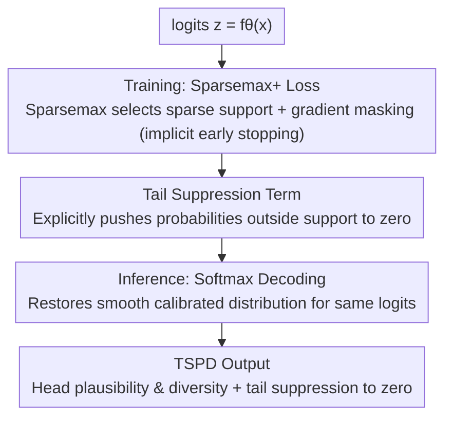

# TS²: Sparsemax+ for Training and Softmax for Testing for Accurate and Diverse LLM Fine-tuning

**Conference**: ICLR 2026  
**OpenReview**: [https://openreview.net/forum?id=CylRqa82Rk](https://openreview.net/forum?id=CylRqa82Rk)  
**Code**: https://github.com/xzy-bit/TS-2-ICLR-2026  
**Area**: Alignment RLHF / LLM Fine-tuning  
**Keywords**: Supervised Fine-Tuning, Output Diversity, Sparsemax, Fenchel-Young Loss, Alignment Tax

## TL;DR
Addressing the issue where Cross-Entropy (CE) supervised fine-tuning collapses probability distributions into one-hot vectors and crushes output diversity, this paper proposes TS²: employing a Sparsemax+ loss with tail suppression (sparse support + explicit tail pruning) during training while reverting to softmax decoding during inference. This approach enhances accuracy and diversity for Llama-3.1-8B / Qwen-2.5-7B across chat, code, and open-ended generation without altering model architecture.

## Background & Motivation

**Background**: The standard practice for post-training large language models is Supervised Fine-Tuning (SFT), typically using Cross-Entropy (CE) as the default loss function. While CE corresponds to maximum likelihood and is a strictly proper scoring rule—theoretically optimal—its geometric properties push probability mass toward the one-hot labeled token, suppressing all "reasonable but non-labeled" candidate tokens to near zero.

**Limitations of Prior Work**: Fine-tuned models often suffer from the "alignment tax"—where a pre-trained model capable of providing multiple semantically reasonable responses becomes highly deterministic and monotonous after SFT. This is critical for generation tasks relying on sampling exploration (e.g., writing, planning, best-of-N code generation), where the model may "know" the answer but cannot sample the correct alternative due to distribution collapse.

**Key Challenge**: A tension exists between increasing diversity and "maintaining probability calibration while controlling the tail." Methods that only modify decoding (nucleus / top-k / best-of-N) do not touch training dynamics. GEM, which rewrites SFT with reverse KL + entropy regularization, can preserve some diversity but **cannot guarantee the suppression of clearly incorrect tokens to zero**—entropy regularization may instead inject probability mass into long-tail erroneous tokens.

**Goal**: The authors argue for a precise operational definition of "useful diversity." The objective is not to distribute probability uniformly across the vocabulary, but to **concentrate probability on a few semantically reasonable candidate tokens while aggressively pushing clearly incorrect long-tail tokens toward zero**.

**Key Insight**: This work examines the geometric properties of the "logits-to-probability" mapping. Forward KL is mean-seeking (assigning probability wherever data exists, often raising low-probability tokens), while reverse KL is mode-seeking (concentrating mass in promising regions). Sparsemax naturally assigns **exactly zero** to non-support tokens, and its gradient vanishes for tokens outside the support set when the target falls within it (Lemma 3), acting as an implicit "early stopping" mechanism.

**Core Idea**: Decouple the mapping functions for training and inference—using sparsemax (paired with an improved Fenchel-Young loss) for sparse discrimination and tail suppression during training, while switching back to softmax for inference to recover a smooth, calibrated distribution that allows "plausible candidates" to survive during sampling.

## Method

### Overall Architecture

TS² solves a specific problem: ensuring the model learns the correct answers during SFT without compressing all alternative tokens into a one-hot distribution. Its pipeline utilizes different mappings for training and inference: for a given set of logits $z=f_\theta(x)$, the **training phase** uses the Sparsemax+ loss—where the sparsemax projection identifies a compact support set $S^{sp}(z)$ of plausible candidates and masks gradients outside this set (implicit early stopping), combined with a tail suppression term to explicitly push residual tail probabilities to zero. The **inference phase** applies softmax decoding to the same logits to restore a smooth, calibrated, and non-degenerate distribution, allowing the top plausible candidates to retain significant probability. The final output satisfies the author-defined "Tail-Suppressed Plausible Diversity" (TSPD).

### Key Designs

**1. TSPD: Formalizing "Useful Diversity" as Head Preservation + Tail Suppression**

This work provides a verifiable definition for useful diversity. **Tail-Suppressed Plausible Diversity (TSPD)** is defined as: given a prompt-response pair $(x,y)$ and distribution $p=g(f_\theta(x))$, fixed integer $m\ge 2$, and thresholds $0<\varepsilon_{head}\le \frac1m$, $0\le\varepsilon_{tail}\le 1-m\varepsilon_{head}$. Let $\mathrm{Top}_m(p)$; if label $y$ is within it, the support set $S:=\mathrm{Top}_m(p)$, otherwise $S:=\mathrm{Top}_{m-1}(p)\cup\{y\}$. $p$ satisfies $m$-order TSPD if and only if **head preservation** ($\min_{j\in S}p_j\ge\varepsilon_{head}$) and **tail suppression** ($\sum_{j\notin S}p_j\le\varepsilon_{tail}$) are met.

This definition transforms vague "diversity" into hard constraints: every candidate in the support set must have non-negligible probability (avoiding a single winner), and the cumulative probability of tokens outside the support must approach zero (avoiding mass in long-tail errors). A corollary notes that if $p$ collapses to one-hot ($p_y=1$), it **directly fails** TSPD, characterizing CE collapse as a failure.

**2. Training/Inference Mapping Decoupling: Sparsemax Training + Softmax Decoding**

This represents a structural innovation addressing the differing needs of training dynamics and inference. The authors use a unified **Fenchel-Young Loss** $L_\Pi(z;y)=\Pi(e_y)-\Pi(p^*)+\langle z,p^*-e_y\rangle$ to link softmax and sparsemax: negative Shannon entropy regularization yields softmax + CE; negative Gini entropy regularization yields sparsemax loss.

Sparsemax is chosen for training because it **linearly stretches the probability gaps between candidates** for the same logits (Theorem 4: $\frac{\partial}{\partial u}(p^{sp}_i-p^{sp}_j)=1$ inside the support, whereas softmax is strictly $<1$). Once head logits cross a margin, it converges quickly and nullifies tail gradients, wasting no updates on separated tail candidates. However, sparsemax is **not suitable for inference** as it also outputs near one-hot distributions after convergence. Switching back to softmax for inference recovers smooth probabilities from the stretched logits, allowing plausible candidates to retain non-degenerate mass for sampling.

**3. Sparsemax+ Loss: Adding a Tail Suppression Term for Softmax Inference**

Decoupling leaves a theoretical gap: Corollary 5 / Remark 2 proves that for a large vocabulary $K$, the upper bound of the cumulative tail mass $\sum_{k>m}p^{sf}_{(k)}$ during softmax inference monotonically increases with $K$ toward 1. Thus, sparsemax training alone **theoretically does not guarantee** tail suppression, contradicting the TSPD goal.

To fix this, a lightweight **tail suppression loss** is added: $L_{sup}(p;y)=-\log\!\big(1-\sum_{i\notin S}p^{sf}_i\big)$, where $p^{sf}=\mathrm{softmax}(z)$. This explicitly pushes probability for tokens outside the support set to zero. Remark 3 notes this is equivalent to $-\log\sum_{i\in S}p^{sf}_i$, effectively a softmax cross-entropy treating the support set $S$ as a "super-class." The combined **Sparsemax+ Loss** is:

$$L_{spm+}(z;y)=-z_y+\frac12\!\sum_{j\in S^{sp}(z)}\!\big(z_j^2-\tau^2(z)\big)+\alpha\Big(\!-\log\big(1-\!\!\sum_{i\notin S^{sp}(z),\,i\ne y}\!\!p^{sf}_i\big)\Big)$$

Where $\tau(z)$ is the sparsemax threshold and $\alpha>0$ controls suppression strength. The two terms separate tasks: sparsemax selects the stable support and stops gradients, while the suppression term explicitly zeros out unreasonable tokens.

### Loss & Training
The objective is the $L_{spm+}$ defined above. During training, the Sparsemax+ loss is calculated per mini-batch to update $\theta$; during testing, softmax is applied to logits followed by decoding (Algorithm 1). Experiments fine-tuned Llama-3.1-8B / Qwen-2-7B on UltraFeedback for 3 epochs using AdamW, effective batch size 128, cosine learning rate (init $2\times10^{-5}$, warmup 0.03), and 2048 max sequence length. $\alpha$ was empirically optimized per model.

## Key Experimental Results

### Main Results

Win rates on AlpacaEval were measured using a best-of-32 protocol (reward model selection compared to GPT-4), alongside three diversity metrics. TS² leads in both quality and diversity:

| Model | Method | Win Rate (%) ↑ | N-gram ↑ | 100−Self-BLEU ↑ | Sent-BERT ↑ |
|------|------|------|------|------|------|
| LLaMA-3.1-8B | CE | 29.77 | 17.78 | 47.04 | 9.97 |
| LLaMA-3.1-8B | GEM | 31.53 | 20.32 | 49.82 | 11.16 |
| LLaMA-3.1-8B | **TS² (Ours)** | **33.12** | **23.78** | **53.87** | **12.80** |
| Qwen-2-7B | CE | 31.41 | 17.23 | 16.77 | 7.95 |
| Qwen-2-7B | GEM | 33.89 | 24.35 | 31.19 | 9.25 |
| Qwen-2-7B | **TS² (Ours)** | **37.48** | **30.15** | **39.04** | **9.81** |

- Chat (Llama, N=32) win rate reached 33.12%, a **Gain** of +11.2% over CE and +5.0% over GEM. Diversity Metrics (N-gram / BLEU / Sent-BERT) saw gains of +17.0% / +8.1% / +10.7% over GEM, breaking the "quality-diversity trade-off."
- Code generation (HumanEval) pass@100 reached 87.00% (+19.8% over CE). Notably, pass@50 (82.70%) nearly matched GEM's pass@100 (83.40%), indicating higher sampling efficiency.
- OpenLLM Leaderboard (6 tasks, best-of-N): Llama N=32 mean accuracy was 88.88%, an absolute 13.2 point gain (+17.4% relative) over GEM (75.69%), showing better preservation of pre-trained knowledge.

### Ablation Study

TS² consists of three components: (1) sparsemax training, (2) softmax decoding, and (3) tail suppression. Results on AlpacaEval:

| Configuration | Observation | Description |
|------|------|------|
| Full TS² | Best win rate and diversity | Synergistic effect of all three components. |
| Decoupling Only (sparsemax training + softmax inference, no suppression) | Diversity spikes, win rate crashes | Decoupling releases diversity, but without suppression, it is uncalibrated noise. |
| Unified Sparsemax (sparsemax for both) | Competitive win rate, low diversity | Proves softmax inference is required to translate logit geometry into a rich sampling distribution. |
| Suppression Only (CE + suppression) | Both metrics fail | Suppression is not an independent improvement; it must collaborate with the sparsemax support set. |

### Key Findings
- The three components are interdependent: decoupling releases diversity, suppression ensures quality by removing noise, and softmax inference maps trained logit geometry to a samplable distribution.
- The greatest contribution comes from the synergy of "decoupling + suppression."
- The advantages of TS² scale with the sampling budget $N$ (best-of-N chat, pass@k code), identifying where the value of "preserved diversity" is realized.

## Highlights & Insights
- **Asymmetric mapping for training/inference**: This provides a lightweight decoupling perspective without changing model structure or decoder interfaces, making it a drop-in replacement for SFT pipelines.
- Reinterpreting sparsemax gradient masking as **implicit early stopping** explains why it avoids the over-confident collapse found in CE better than standard regularization.
- The TSPD definition paired with the theoretical upper bound (tail mass approaching 1 as $K$ grows) provides a rigorous closed-loop argument for why the third component (suppression) is necessary.
- The equivalence of the suppression loss to "super-class softmax CE" is a transferable insight for any scenario requiring concentrated probability over a set of candidates rather than a single label.

## Limitations & Future Work
- Decoupling causes a training/inference distribution mismatch; theoretical guarantees rely on logit margin assumptions that may vary in real long-sequence auto-regression.
- The suppression weight $\alpha$ requires empirical tuning per model; an adaptive or parameter-free version is missing.
- Gains are most pronounced in sampling scenarios (best-of-N); benefits in single-shot greedy decoding are less significant.
- Evaluation was limited to 8B/7B scales and UltraFeedback; effectiveness in larger models or preference alignment phases (DPO/RLHF) remains to be explored.

## Related Work & Insights
- **vs GEM**: While GEM uses reverse KL + entropy regularization to promote "spreading," it does not enforce a hard zero for unreasonable tokens. TS² uses sparsemax to ensure spreading occurs only where appropriate and adds hard zeroing through suppression, outperforming GEM in both quality and diversity.
- **vs Pure Decoding Methods**: Nucleus or top-k sampling do not address training dynamics or calibration; TS² reshapes the underlying logit geometry and is orthogonally compatible with these decoders.
- **vs CE / NEFTune**: CE sacrifices diversity by pushing for one-hot distributions; NEFTune and weight decay offer limited relief. TS² addresses the root cause via mapping function geometry.

## Rating
- Novelty: ⭐⭐⭐⭐⭐ Decoupled probability mapping + Fenchel-Young framework + TSPD formalization.
- Experimental Thoroughness: ⭐⭐⭐⭐ Multiple tasks covered with deep ablation, though scaling and dataset variety are limited.
- Writing Quality: ⭐⭐⭐⭐⭐ Clear logical chain from formalization to theoretical gaps to solutions.
- Value: ⭐⭐⭐⭐ Drop-in compatibility with existing decoders; highly useful for sampling-based generation.

<!-- RELATED:START -->

## Related Papers

- [\[ICLR 2026\] Anchored Supervised Fine-Tuning](anchored_supervised_fine-tuning.md)
- [\[ICLR 2026\] Spectrum Tuning: Post-Training for Distributional Coverage and In-Context Steerability](spectrum_tuning_post-training_for_distributional_coverage_and_in-context_steerab.md)
- [\[ICLR 2026\] Safety Subspaces are Not Linearly Distinct: A Fine-Tuning Case Study](safety_subspaces_are_not_linearly_distinct_a_fine-tuning_case_study.md)
- [\[NeurIPS 2025\] Mechanism Design for LLM Fine-tuning with Multiple Reward Models](../../NeurIPS2025/llm_alignment/mechanism_design_for_llm_fine-tuning_with_multiple_reward_models.md)
- [\[ICLR 2026\] Data Selection for LLM Alignment Using Fine-Grained Preferences](data_selection_for_llm_alignment_using_fine-grained_preferences.md)

<!-- RELATED:END -->
