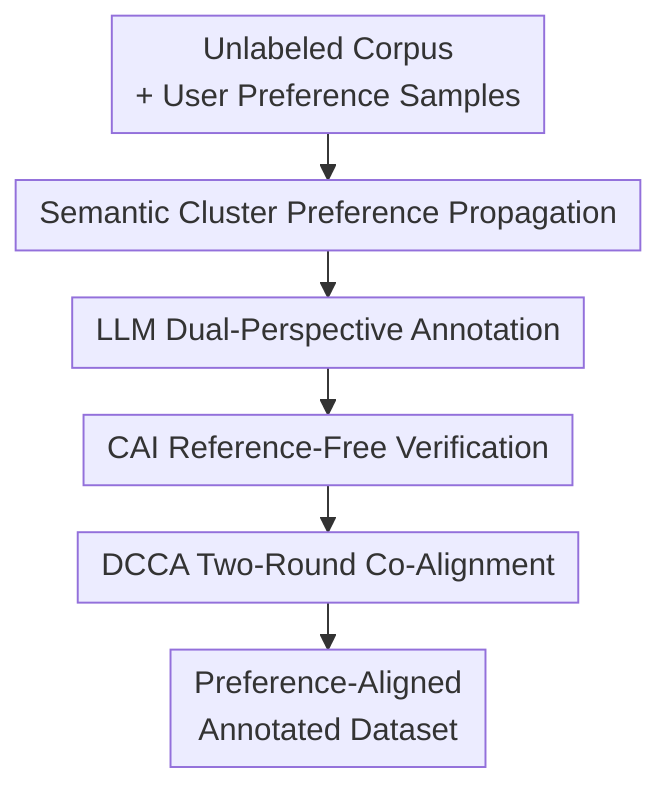

# Verification and Co-Alignment via Heterogeneous Consistency for Preference-Aligned LLM Annotations

**Conference**: ICLR 2026  
**OpenReview**: [https://openreview.net/forum?id=jugY302BAh](https://openreview.net/forum?id=jugY302BAh)  
**Code**: https://github.com/858006908cc/VERIFICATION-AND-CO-ALIGNMENT-ICLR26  
**Area**: LLM Alignment / Preference Annotation / Reference-Free Evaluation  
**Keywords**: Heterogeneous Consistency, Preference Alignment Annotation, CAI Ratio, Semi-supervised NLU, Training-free Calibration  

## TL;DR
This paper proposes Heterogeneous-Consistency Co-Alignment (HCC), which utilizes the consistency/inconsistency relationship between LLMs and task-specific embedding models to verify the reliability of LLM annotations in reference-free semi-supervised NLU scenarios. It further rectifies preference-inconsistent samples through two rounds of co-alignment based on nearest neighbor voting.

## Background & Motivation
**Background**: LLMs are increasingly utilized as data annotators, particularly for categorical NLU tasks such as intent classification, topic classification, sentiment recognition, and relation extraction. Compared to human annotation, LLMs can efficiently label large-scale unlabeled corpora; compared to training a new model, prompt-based or few-shot annotation is more lightweight. Furthermore, "correct labels" in real-world applications often involve more than objective facts; they encompass preferences from users, regions, cultures, and task providers, such as Southeast Asian local expressions, personal recommendation preferences, domestic robot operating habits, or individualized constraints in medical QA.

**Limitations of Prior Work**: SFT and RLHF can embed preferences into models, but they typically require large volumes of high-quality preference data. While personalized RLHF attempts to adapt to different users, it still relies on massive, diverse preference corpora and additional training. Directly using LLMs for annotation is more cost-effective but entails two risks: first, LLMs may provide "plausible but user-preference-inconsistent" labels based on population statistics from pre-training; second, LLM self-evaluation or confidence scores are often overconfident, making it difficult to identify which annotations require correction in the absence of reference answers.

**Key Challenge**: This work addresses a dilemma in low-resource preference annotation: users are only willing or able to provide a small set of preference samples, yet the system must propagate these preferences to a large-scale unlabeled corpus. Simultaneously, ground truth labels are invisible, rendering traditional accuracy, F1, and precision/recall metrics unusable during the annotation phase. Relying solely on embedding similarity might mistake "geometric proximity" for "preference correctness," while relying solely on LLMs might mistake their own outputs for reliable judgments—both have inherent blind spots.

**Goal**: The authors decompose the problem into two sub-problems: first, how to judge if LLM-generated labels are reliable under reference-free conditions; second, how to utilize a small number of user preference samples to perform low-cost, training-free correction of unreliable LLM annotations. The objective is not to train a global reward model but to recalibrate the unlabeled corpus to a specific preference set for a given user or task.

**Key Insight**: The key observation of HCC is that LLMs and lightweight task models have different error mechanisms. LLM labels stem from token-level generation probabilities, excelling at linguistic knowledge but prone to overconfidence. Task-specific models like MiniLM/BERT propagate labels through nearest neighbors in the embedding space, which is computationally inexpensive but limited by the quality of semantic clusters. If both models provide the same label for a sample, it is more likely to be reliable; if they conflict, it should be categorized into a set for rectification.

**Core Idea**: Use "heterogeneous model consistency" instead of ground truth as a reference-free reliability signal. Consistent samples and a few user preference samples are then used as anchors to progressively rectify inconsistent annotations through nearest neighbor majority voting.

## Method
### Overall Architecture
HCC takes an unlabeled corpus $D_u$ and a small set of user preference samples $H$ as input, and outputs a preference-calibrated annotated dataset $D^{final}$. Initially, the task-specific model $S$ assigns pseudo-labels to each sample via embedding-based nearest neighbors. Subsequently, the LLM $T$ generates labels under zero-shot and single-shot settings (with $S$'s pseudo-label as a prompt tip). Heterogeneous label consistency is used to divide samples into a consistent set $C$ and an inconsistent set $I$, and co-alignment is performed only on $I$.

The overall process resembles a "prior divergence detection + local re-annotation" system: consistent samples serve as reliable anchors, while inconsistent samples are treated as high-risk regions. During rectification, neither the LLM nor a reward model is re-trained; instead, $C$ and the user preference set $H$ are merged into a reference library to re-label conflicting samples using nearest neighbor majority voting.

### Key Designs
**1. Heterogeneous Consistency Verification: Exposing LLM Uncertainty through Model Divergence**

HCC does not treat the LLM's own confidence as reliable evidence but compares label hypotheses from two different sources. The task-specific model $S$ encodes sample $x_i$ into a sentence vector $e_i=S(x_i)$ and provides an embedding-based label $\bar{y}^{(S)}_i$ based on clusters formed by user preference samples. The LLM $T$ generates $\bar{y}^{(T)}_i$ and $\hat{y}^{(T)}_i$ under zero-shot and single-shot settings, respectively. If these labels align, the sample enters the consistent set $C$; any disagreement places it in the inconsistent set $I$.

This design transforms "verification" from reference-based accuracy to reference-free agreement. LLMs may yield popular but non-personalized labels due to pre-training distributions, while embedding models may yield neighbor biases due to semantic cluster overlap. When both agree, the probability of error is significantly lower. The paper quantifies this structure using the CAI Ratio:

$$
CAI(D_u;T,S)=\frac{N_C}{N_I+\epsilon}
$$

where $N_C=|C|$ and $N_I=|I|$. A high $CAI$ indicates more consistent samples and a stable annotation structure; a low $CAI$ suggests frequent model divergence, necessitating more cautious rectification. It is not a ground-truth replacement for accuracy but a reference-free diagnostic signal for reliability.

**2. Semantic Cluster Preference Propagation: Diffusing Preferences with Sparse User Samples**

The user preference set $H$ is partitioned into category clusters $C_1,\ldots,C_k$, each carrying a user preference label. For any unlabeled sample, HCC uses a sentence-transformer (e.g., MiniLM) to obtain an embedding and calculates the average cosine similarity with the top-$k$ nearest neighbors in each category cluster:

$$
AS(e_i,C_j)=\frac{1}{k}\sum_{e\in Top-k(C_j,e_i)}\frac{e_i\cdot e}{\|e_i\|\|e\|}
$$

Then $C_{j^*}=\arg\max_{C_j}AS(e_i,C_j)$ is selected, and the corresponding label $\bar{y}_{j^*}$ is assigned to $x_i$. Experiments use $k=5$ by default, and the appendix systematically examines $k=3,5,7,10$ across backbones such as BERT, MiniLM, E5, GTE, and BGE.

The embedding model acts as a structural prior rather than an absolute judge: it identifies which samples are semantically closest to user-labeled examples. This prior is cross-validated by the LLM, avoiding the strong "nearest neighbor is always correct" assumption of common clustering methods. The embedding model proposes candidate preferences, and CAI determines which candidates align with the LLM's generative perspective.

**3. DCCA Two-Round Alignment: Resolving Easy Samples First, Then Hard Conflicts with New Anchors**

For the inconsistent set $I$, HCC employs Divide-and-Conquer Co-Alignment (DCCA). In the first round, $C\cup H$ is used as the reference set to run MV-VTES for each inconsistent sample, yielding a redistributed label $\hat{y}$. If $\hat{y}$ becomes consistent with the original inconsistent labels, the sample enters $C_I$ as a first-round rectified sample; otherwise, it moves to $I_I$.

In the second round, the reference set is expanded to $C\cup C_I\cup H$, and the same nearest neighbor voting is applied to $I_I$, yielding $I_I^{(1)}$. The final dataset is $D^{final}=C\cup C_I\cup I_I^{(1)}$. This is more stable than re-labeling all conflicts at once: the first round resolves easy conflicts near reliable anchors, while the second round uses newly confirmed reliable samples to expand coverage, preventing hard samples from being incorrectly biased due to insufficient reference.

The paper emphasizes that two rounds serve as an empirical stability point. In the appendix, Round 2 significantly improves over Round 1 on noisy social data like Reddit (e.g., Llama-3-8B sees a 14-18 point gain), while performance may saturate or slightly regress with additional rounds on cleaner datasets like Banking77. Thus, DCCA's value lies in stopping at a stable point between error correction and noise diffusion.

**4. MV-VTES: Replacing Parametric Calibrators with k-NN Majority Voting**

MV-VTES takes a sample $x$ to be rectified, a reference set $D_e$ (either $C\cup H$ or $C\cup C_I\cup H$), an embedding function $S(\cdot)$, and the number of neighbors $k$. it retrieves the top-$k$ samples in the reference set by cosine similarity:

$$
\{a_i\}_{i=1}^{k}=TopK_{a\in A_e}\left(\frac{S(a)\cdot S(x)}{\|S(a)\|\|S(x)\|}\right)
$$

It then counts the frequency of labels among these neighbors $n_a=\sum_{i=1}^{k}\mathbb{I}[\bar{y}_i=a]$ and outputs $\hat{y}=\arg\max_{a}n_a$. As it requires no additional training parameters or reward model fitting, it is ideal for cold-start scenarios with only 1% to 10% user preference samples.

This voting mechanism, combined with CAI stratification, offers two advantages. First, it only acts on samples flagged as inconsistent by CAI, avoiding over-correction of reliable samples. Second, the reference library grows with DCCA, turning high-confidence consistent samples into anchors that help rectify more distant samples. The appendix notes that the voting itself is similarity-aware because candidates are pre-selected by cosine similarity, although a uniform majority is used within the top-$k$.

### A Complete Example
Suppose a user labels 5% of intent classification samples, including categories like "check balance," "freeze card," and "change address." For a new query "can you stop my card from being used," MiniLM finds it closest to the "freeze card" cluster based on embeddings and provides $\bar{y}^{(S)}=$ "freeze card." Zero-shot LLM might output "report lost card," but single-shot LLM, seeing the prompt from the specialized model, might also output "freeze card." If all three align, the sample enters $C$ as a reliable anchor.

For a more ambiguous query "I need to update where my statements go," the specialized model might classify it as "change address," while zero-shot LLM might suggest "query billing," and single-shot LLM might follow the prompt with "change address." Label divergence occurs, so the sample enters $I$. In DCCA Round 1, top-$k$ neighbors are searched in $C\cup H$. If the neighbor majority is "change address," the sample is corrected. If it remains inconsistent after Round 1, it waits for Round 2, voting again after newly confirmed samples $C_I$ are added to the reference set.

This example illustrates the HCC strategy: it does not demand a perfect label from the LLM in one go, but constructs a balanced annotation system among the LLM, task-specific model, and user samples. LLMs provide linguistic knowledge, embedding models provide local structure, CAI decides trust, and DCCA decides what needs realignment.

### Loss & Training
The proposed method is training-free and has no additional neural network loss functions. The trainable components are existing models: off-the-shelf LLMs (GPT-3.5, GPT-4o-mini, Llama-3-8B-Instruct) and pre-trained encoders (MiniLM, BERT, E5, GTE, BGE). The core computations in HCC involve embedding retrieval, label comparison, and majority voting.

Experimental settings typically involve using 5% of the training set as user preference samples, with appendix tests at 1%, 5%, and 10%. Some imbalance experiments, after ensuring at least one sample per class, assign 60% of remaining samples to the majority class to simulate skewed real-world preference distributions. Different tasks use different top-$k$ and consistent sample proportions; for instance, $k=3$ for Banking77, and $k=5$ for CLINC and Massive Scenario. Generally, $k=3$ or $k=5$ is more stable for fine-grained tasks.

## Key Experimental Results

### Main Results
The paper evaluates on eight categorical NLU datasets: CLINC, Massive Scenario, MTOP Intent, StackExchange, Banking77, Reddit, FewRel-Nat, and Massive Intent. Baselines include task-specific models, zero-shot LLMs, task model + LLM, clustering, CoT, Few-shot/FoT, Self-Consistency, Self-Refine, and HCC variants before/after correction.

| LLM | Datasets where HCC achieved best/near-best | Typical Gain | Key Observation |
|-----|--------------------------------------------|--------------|------------------|
| GPT-3.5 Turbo | 5/8 | CLINC 81.32 → 85.49; Banking77 73.56 → 82.45 | HCC consistently improves closed-source LLM annotations and significantly increases CAI. |
| GPT-4o Mini | 6/8 | CLINC 85.23 → 87.93; Massive Scenario 79.60 → 80.18; Reddit 44.47 → 60.94 | Stronger LLMs still benefit from heterogeneous calibration, though fine-grained tasks like MTOP may see regression. |
| Llama-3-8B-Instruct | 7/8 | CLINC 32.49 → 82.43; Massive Scenario 43.52 → 78.13; Banking77 33.06 → 77.71 | HCC provides the most significant compensation for weak zero-shot open-source LLMs. |

| Dataset | Llama-3-8B zero-shot | Task-Specific Model | HCC w/ Corr. | Gain relative to LLM |
|---------|----------------------|---------------------|--------------|----------------------|
| CLINC | 32.49 | 79.01 | 82.43 | +49.94 |
| Massive Scenario | 43.52 | 75.55 | 78.13 | +34.61 |
| MTOP Intent | 34.17 | 52.49 | 63.39 | +29.22 |
| StackExchange | 11.02 | 32.27 | 38.88 | +27.86 |
| Banking77 | 33.06 | 73.93 | 77.71 | +44.65 |
| Reddit | 36.31 | 51.73 | 58.81 | +22.50 |
| FewRel-Nat | 14.25 | 35.35 | 42.92 | +28.67 |
| Massive Intent | 45.41 | 61.80 | 67.75 | +22.34 |

### Ablation Study
Ablations focus on the impact of CAI, backbones, rounds, user preference budget, and imbalanced distributions. The general trend: stronger encoders produce better semantic clusters; HCC works even with weak encoders, but performance is capped by embedding separability. Two-round DCCA is usually the optimal balance between error correction and noise diffusion.

| Ablation Dimension | Summary of Results | Insights |
|--------------------|--------------------|----------|
| CAI vs. Accuracy Correlation | GPT-3.5 Pearson $\rho=0.93$, GPT-4o Mini $\rho=0.86$, Llama-8B $\rho=0.81$, all significant. | CAI serves as a reference-free reliability signal, though not a sample-wise ground truth. |
| Backbone Strength | With BERT as a weak backbone, Llama-3-8B + HCC still outperforms GPT-3.5/4o-mini on multiple datasets; E5/GTE/BGE further improve results. | HCC is robust to encoder quality, but strong representations amplify co-alignment gains. |
| DCCA Rounds | Round 2 significantly improves over Round 1 on complex data like Reddit; performance saturates or slightly drops after Round 2 on some data. | Two rounds is an empirical stable point; infinite propagation is discouraged. |
| User Preference Budget | Most datasets see steady gains from 1% to 10% budget; e.g., CLINC rises from ~71.18 to 86.84. | HCC effectively utilizes sparse supervision but maintains clear gains at low budgets. |
| Imbalanced Preferences | HCC usually outperforms baselines under 60% imbalance, though fine-grained tasks like MASSIVE-Intent show fluctuation. | Fine-grained label spaces with overlapping clusters amplify nearest neighbor errors under imbalance. |

### Key Findings
- HCC is most effective for "semi-supervised NLU annotation where LLM linguistic capability is available but task preferences/label spaces require local calibration." For open-source LLMs with weak zero-shot performance like Llama-3-8B, heterogeneous consistency and DCCA bridge the quality gap significantly.
- CAI significantly correlates with accuracy but is not a monotonic guarantee. For GPT-4o Mini on MTOP Intent, CAI rose from 0.74 to 1.66 while accuracy dropped from 75.03 to 67.10. Similarly, small CAI increases on StackExchange don't always surpass LLM-only baselines. This indicates CAI is better suited for diagnosis and model/process monitoring than as a blind proxy for performance.
- MASSIVE-Intent serves as an important edge case. The dataset has extremely fine-grained intent labels that may differ by only a slot or phrase, leading to cluster overlap. Multi-lingual and translationese styles also weaken English encoder separability. Under low separability, DCCA may fail to obtain a clean enough correction signal from the consistent set.
- Regarding cost, HCC's active refinement is lightweight. With Llama-3-8B, DCCA takes roughly 51.8s per backbone. Co-alignment for GPTs ranges from 0.36 to 1.15 minutes per dataset. The primary token cost remains the LLM annotation itself, not the HCC correction phase.

## Highlights & Insights
- The CAI concept is highly practical: in the absence of an answer, it shifts from asking "is this label correct?" to "do two systems with different error mechanisms agree?". This moves reference-free evaluation from abstract confidence to computable cross-model consistency.
- HCC clearly differentiates the roles of LLMs and small models. LLMs are not the sole judge, and embedding models are not idealized as truth; they cross-validate each other, anchored by user preferences.
- The two-round DCCA design is a transferable trick. Many weak-supervision correction tasks could benefit from confirming easy samples first and adding them to the reference pool for harder ones, provided a stopping point is set to prevent noise propagation.
- This work is insightful for "LLM-annotated data quality." While many data synthesis pipelines focus on prompts and model selection, HCC highlights the need for a reference-free process metric to monitor convergence toward a preference structure.
- By bounding preference alignment to categorical NLU annotation rather than generalizing to pairwise generation evaluation, the method becomes highly deployable: the label space is finite, neighbors are searchable, and CAI is interpretable.

## Limitations & Future Work
- The method relies heavily on embedding space separability. If categories are extremely fine-grained or differences lie in subtle slots/tones, top-$k$ neighbors might not find true peers, weakening both CAI and DCCA.
- CAI is a diagnostic of reliability, not a proof of correctness. Consistency between models could result from shared bias, especially if both the LLM and encoder share pre-training distribution overlaps.
- Current experiments are limited to categorical NLU and do not cover open-ended answers, long-text generation, pairwise preference ranking, or multi-turn dialogue. Extending this to RLHF-style data would require redefining consistency, nearest neighbor references, and conflict resolution.
- It assumes at least one sample per class in the preference set, which may not hold in true cold-starts. Active learning or human-in-the-loop mechanisms might be needed to fill missing categories.
- DCCA uses uniform majority voting; while top-$k$ selection is similarity-based, future work could explore similarity-weighted voting, density-adaptive $k$, slot-aware embeddings, or multilingual encoders for boundary samples.

## Related Work & Insights
- **vs. RLHF / Personalized RLHF**: RLHF learns a global reward, and personalized versions require massive multi-user preference corpora. HCC performs annotation-level calibration on small preference sets for specific tasks without training reward models, making it cheaper but narrower in scope.
- **vs. SFT**: SFT requires substantial high-quality labels to bake behavior into model parameters. HCC operates during annotation production, using reference-free verification and non-parametric correction to improve pseudo-label quality before training.
- **vs. Prompt-based methods**: CoT, Few-shot, and Self-Refine depend on LLM internal capability and cannot explicitly identify misalignment with user preferences. HCC introduces an external observable signal via embedding models and CAI.
- **vs. Clustering / ClusterLLM**: Clustering often assumes geometric proximity equals semantic/label identity. HCC uses similarity as a prior, validated by LLM agreement, and only rectifies inconsistent samples, providing a safeguard against blind propagation.
- **vs. Reference-free text evaluation metrics**: Traditional metrics focus on fluency or relevance. CAI is specifically designed for preference annotation, measuring the consistency ratio between generative LLM labels and structural task labels, making it ideal for monitoring large-scale NLU annotation pipelines.

## Rating
- Novelty: ⭐⭐⭐⭐ While heterogeneous consistency is not entirely new, the combination of CAI, user preference samples, $k$-NN voting, and two-round co-alignment into a training-free framework is distinctive.
- Experimental Thoroughness: ⭐⭐⭐⭐ Covers eight datasets, multiple LLMs/encoders, various $k$ values, budget, imbalance, and cost analyses; however, open-ended generation and pairwise preferences remain untested.
- Writing Quality: ⭐⭐⭐ The main narrative is clear and the experiments are extensive, though the appendix is somewhat crowded with tables and symbols that require careful reading.
- Value: ⭐⭐⭐⭐ Highly practical for teams needing cost-effective preference-aligned annotations, especially as a reference-free quality monitor and post-processing module for LLM data pipelines.

<!-- RELATED:START -->

## Related Papers

- [\[ICLR 2026\] Align Once, Benefit Multilingually: Enforcing Multilingual Consistency for LLM Safety Alignment](align_once_benefit_multilingually_enforcing_multilingual_consistency_for_llm_saf.md)
- [\[ACL 2026\] Teaching LLM to be Persuasive: Reward-Enhanced Policy Optimization for Alignment from Heterogeneous Rewards](../../ACL2026/llm_alignment/teaching_llm_to_be_persuasive_reward-enhanced_policy_optimization_for_alignment_.md)
- [\[ICLR 2026\] Evaluating and Improving Cultural Awareness of Reward Models for LLM Alignment](evaluating_and_improving_cultural_awareness_of_reward_models_for_llm_alignment.md)
- [\[ICLR 2026\] The Alignment Auditor: A Bayesian Framework for Verifying and Refining LLM Objectives](the_alignment_auditor_a_bayesian_framework_for_verifying_and_refining_llm_object.md)
- [\[ICLR 2026\] PALC: Preference Alignment via Logit Calibration](palc_preference_alignment_via_logit_calibration.md)

<!-- RELATED:END -->
