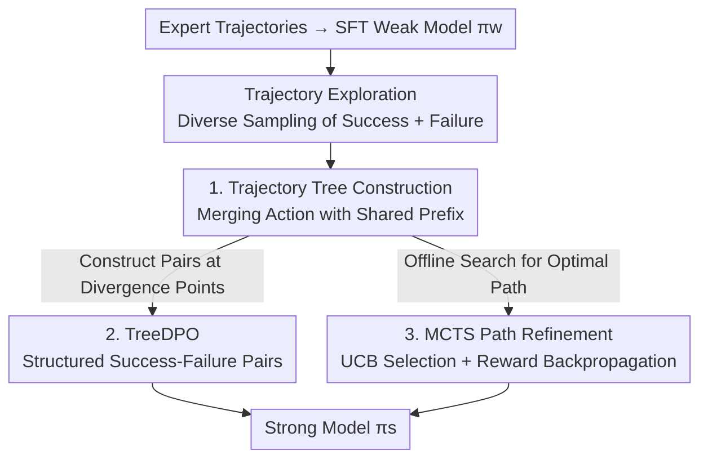

# Weak-to-Strong Generalization with Failure Trajectories

**Conference**: ICLR 2026  
**OpenReview**: [https://openreview.net/forum?id=TXZ54qxdAF](https://openreview.net/forum?id=TXZ54qxdAF)  
**Code**: https://github.com/yeruimeng/TraTree.git  
**Area**: Alignment RLHF / LLM Agent  
**Keywords**: Weak-to-Strong Generalization, Failure Trajectories, Trajectory Tree, MCTS, DPO

## TL;DR
This paper extends "Weak-to-Strong Generalization" (W2SG) from binary classification to multi-step interactive decision-making tasks. A weak model explores numerous action trajectories containing both successes and failures, which are merged into a "Trajectory Tree" based on common prefixes. Structured preference pairs (TreeDPO) or offline MCTS path search are then used to fine-tune a strong model. The resulting strong model not only outperforms the SFT weak model across three Agent environments but even surpasses the SFT strong model trained on expert data.

## Background & Motivation
**Background**: As superintelligence is anticipated to arrive within a decade, "how to supervise models stronger than humans" has become a core challenge in the alignment field. Weak-to-Strong Generalization (W2SG, Burns et al. 2023) proposes using a weaker model as a substitute for human supervision to generalize the "human intent/values" carred by the weak model to a strong model, eliciting the full potential of the strong model from weak labels.

**Limitations of Prior Work**: Existing W2SG research is almost entirely restricted to simple tasks like binary classification using discrete weak labels. In complex scenarios such as reasoning and multi-step decision-making—where the solution is an entire "action trajectory" rather than a single label—existing paradigms cannot be directly applied. Another relevant line of work, DPO, allows Agents to learn from trajectory preference pairs, but these pairs are binary and randomly matched: there is often no overlap between two trajectories, failing to capture the rich structural relationships between multiple reasoning paths.

**Key Challenge**: Trajectories explored by weak models are "imperfect" (containing many failures and sub-optimal actions), and random preference pairs discard the most valuable information: **where the trajectories begin to diverge**. A success path and a failure path often share a prefix; the critical decision determining success or failure is the first differing action after the split, which random pairing completely fails to perceive.

**Goal**: Generalize W2SG to complex interactive tasks where the solutions are action trajectories, and design a supervision signal that utilizes failure experiences and captures the hierarchical structure of trajectories to elicit strong models without human annotation.

**Key Insight**: Drawing inspiration from human learning—where individuals learn not only from success but also from the failure lessons summarized by ancestors—failure trajectories should not be discarded. Instead, they should be organized into a hierarchical structure along with success trajectories to explicitly expose "shared prefixes + critical divergences" to the strong model.

**Core Idea**: Merge the success and failure trajectories explored by the weak model into a "Trajectory Tree" based on common prefixes. Construct structured preference pairs (TreeDPO) at divergence points or use MCTS to search for optimal paths for imitation, using these structured weak supervision signals to fine-tune the strong model.

## Method

### Overall Architecture
The objective is to elicit the potential of a strong model $\pi_s$ beyond the level it would achieve via SFT on expert data, using only a weak model and no human annotations. The workflow consists of four steps: first, SFT a weak model $\pi_w^{SFT}$ using expert demonstration data; then, let it repeatedly explore the environment to collect a diverse set of trajectories (including success, failure, and sub-optimal paths); merge these trajectories into a Trajectory Tree based on common prefixes; finally, derive one of two weak supervision algorithms to fine-tune the strong model—either TreeDPO using divergence point pairs or SFT imitation using high-quality paths found via offline MCTS.

The task is formalized as a Partially Observable Markov Decision Process (POMDP) $(U, S, A, O, T, R)$. The Agent policy $\pi_\theta$ generates an action $a_j \sim \pi_\theta(\cdot|u, a_1, o_1, \dots, a_{j-1}, o_{j-1})$ at each step based on the interaction history. The full trajectory $e=(u, a_1, o_1, \dots, a_n, o_n)$ is assigned a final score $G(e)\in[0,1]$ by the environment. Policy performance is measured by $R(\pi_\theta)=\mathbb{E}_{u, e}[G(e)]$, which is also the primary evaluation metric.

### Key Designs

**1. Trajectory Tree Construction: Merging Success and Failure into a Comparable Hierarchical Structure**

This is the foundation of the work, addressing the limitation that "random preference pairs discard shared prefixes." First, the SFT weak model samples $M$ trajectories for each instruction $u$ using different sampling parameters (temperature, top-p) to ensure diversity. Optionally, a KL penalty on the historical exploration distribution $L_{explore}=L_{SFT}-\lambda\cdot KL(\pi_w\|\pi'_{explore})$ is added to further encourage diversity. These trajectories are then inserted into a tree $T=(V,E)$ rooted at the instruction. Each node is an "execution step" $(o_v, th_v, a_v)$ (observation + thought + action). If a child node under the current parent already has the same action and a semantically similar observation (within a cosine similarity threshold $\xi_{sim}$), the node is reused and its visit count incremented; otherwise, a new branch is created. Terminal nodes store the environment score $G(e)$.

The advantage of this merging is that when a success path and a failure path share a prefix, they converge into the same trunk on the tree until a specific action causes them to diverge—**this divergence point is the key to success or failure**. A "good trajectory tree" should satisfy diversity (breadth), representativeness (depth), and informativeness (distinct $G(e)$ values for different actions at divergence points). Failure trajectories here are not noise; they provide negative samples at the divergence point, teaching the strong model "not to go this way at this step."

**2. TreeDPO: Constructing Success-Failure Pairs Only at Tree Divergence Points**

This addresses the issue of "high noise and unfocused signals in random DPO pairs." Unlike standard DPO which pairs trajectories randomly, this method only takes preference pairs at tree divergence points: given a shared prefix $h$, two continuations $\sigma^+$ and $\sigma^-$ are identified where their aggregated $G(e)$ differ. Defining $\tau^+=(h,\sigma^+)$ and $\tau^-=(h,\sigma^-)$, the strong model is fine-tuned on the dataset $D_w=\{(\tau_i^+,\tau_i^-)\}$ using the DPO loss:

$$L_{TreeDPO}(\pi_s;\pi_w^{SFT})=-\mathbb{E}_{(\tau^+,\tau^-)\sim D_w}\Big[\log\sigma\big(r_{\pi_s}(\tau^+)-r_{\pi_s}(\tau^-)\big)\Big]+\beta\cdot KL(\pi_s\|\pi_w^{SFT}),$$

where $r_{\pi_s}(\tau)$ is the implicit DPO score under the strong model and $\pi_w^{SFT}$ serves as the fixed KL reference. Since the continuations share a prefix and only diverge at a critical action, these pairs eliminate irrelevant variables, providing DPO with cleaner and more focused signals.

**3. MCTS Path Refinement: Offline Search on Static Trajectory Trees to Synthesize High-Quality Paths**

This targets the issue of "computational explosion when enumerating all pairs in a large tree." When the action space and data scale are large, the number of pairs for TreeDPO can explode. The authors treat MCTS as an offline policy optimizer, searching directly on the constructed static trajectory tree. Nodes are selected from parent nodes using UCB to balance exploration and exploitation:

$$UCB(v')=\frac{r_M(v')}{c_M(v')}+\gamma\sqrt{\frac{\log C_M}{c_M(v')}},$$

where $r_M$ and $c_M$ are the cumulative rewards and visit counts of nodes, updated via backpropagation from the original terminal scores $G(e)$. After multiple iterations, the child node with the highest average reward $r_M(v)/c_M(v)$ is selected greedily at each step to extract an optimal path $e^*$. Standard SFT imitation is then performed on $D_{e^*}$: $L_{MCTS}(\pi_s)=-\frac{1}{|D_{e^*}|}\sum_{e^*}\sum_t \log\pi_s(a_t^* | \text{context}_t^*)$. This is claimed to be the "first application of MCTS to W2SG," compressing hierarchical tree information into a high-quality trajectory for direct imitation.

### Loss & Training
Training occurs in two stages: the weak model first undergoes standard SFT on expert data (negative log-likelihood $L_{SFT}$) followed by environment exploration; the strong model is then fine-tuned using either $L_{TreeDPO}$ (with $\beta=0.1$) or $L_{MCTS}$. LoRA (rank 64, $\alpha$ 128) is used throughout, with AdamW, an SFT learning rate of 1e-5, and a DPO learning rate of 2e-5.

Theoretically, the authors provide a performance guarantee based on the Bayesian interpretation of DPO (Theorem 1): $R(\hat\pi_s^{TreeDPO})\geq R(\pi_s^{SFT})+\big(R(\pi^*)-R(\pi_s^{SFT})\big)-C\sqrt{\frac{KL(\pi^*\|\pi_w^{SFT})+\log(N_p/\delta_0)}{N_p}}$. Intuitively, as long as the trajectory tree provides informative preference differences at divergence points, the strong model can be elicited to surpass the SFT baseline. If the weak model's exploration collapses and preference pairs are uninformative, the KL regularization ensures TreeDPO naturally degrades to the SFT strong model without performance loss—a "failure-safe" property.

## Key Experimental Results

### Main Results
Three interactive Agent environments: WebShop (online shopping), ScienceWorld (scientific experiments), and AlfWorld (household tasks). Default weak model: Llama2-7B; strong model: Llama2-13B. Metrics: Avg Reward and Success Rate.

| Method | WebShop Reward | WebShop Success Rate | SciWorld Reward | SciWorld Success Rate | AlfWorld Reward |
|------|------|------|------|------|------|
| SFT Weak (Llama2-7B) | 47.1 | 87.0 | 41.2 | 55.5 | 44.8 |
| W2SG + TreeDPO | 53.2 | 97.0 | 55.4 | 61.1 | 56.0 |
| W2SG + MCTS (Ours) | 56.9 | **99.0** | **58.2** | **66.8** | 57.5 |
| SFT Strong (Llama2-13B) | 51.0 | 94.0 | 53.6 | 59.2 | 51.5 |
| SFT Strong + ETO | 52.0 | 97.5 | 54.9 | 61.1 | 53.7 |
| SFT Strong + Best-of-N | 52.3 | 96.0 | 55.3 | 60.7 | 55.2 |
| Ceiling Model (Expert Prefs) | **58.3** | 96.5 | 56.9 | 63.5 | **59.0** |

**Key Findings**: Under pure weak supervision, W2SG-MCTS improves Avg Reward by **11.6%** and **11.7%** over the SFT strong model on WebShop and AlfWorld respectively, and even surpasses the Ceiling model trained with ETO on ScienceWorld. Compared to the expert-trained Ceiling model, imperfect trajectories can recover up to **39.4%** of performance without any additional human labels. T-tests across 5 random seeds show high significance for TreeDPO ($p=0.0003$) and MCTS ($p=0.0001$) vs. the SFT strong model. Results are consistent across model families like Llama3-8B and Qwen2.5-14B.

### Ablation Study

| Configuration | AlfWorld Avg Reward | Description |
|------|------|------|
| SFT (Llama3-8B) | 59.7 | Strong SFT baseline |
| Unstructured DPO | 60.4 | Random pairs, no shared prefix, high noise |
| TreeDPO | 61.9 | Structured pairs at divergence points |
| MCTS | **65.7** | Optimal path search for imitation |

Sensitivity analysis for tree width and $\beta$ (ScienceWorld): MCTS achieves optimal reward (58.2) at a tree width of 6, dropping to 54.9 at width 7. Increasing $\beta$ from 0.1 to 0.5 causes rewards to drop from 54.9 to 49.2, suggesting smaller $\beta$ facilitates knowledge transfer.

## Highlights & Insights
- **Explicit utilization of failure trajectories**: By using failure paths as negative samples at divergence points within the tree structure, the strong model learns "what not to do," which is the core of the title and differentiates it from SFT that only uses successful demonstrations.
- **Shared prefixes as a goldmine**: Success and failure often share a prefix; the divergence action is the variable determining the outcome. Exposing this structure to DPO effectively "controls variables" and removes irrelevant noise.
- **Failure-safe degradation**: KL regularization ensures that if weak supervision is uninformative, the model remains at the SFT baseline without performance loss, addressing concerns about poor weak supervision quality.
- **MCTS as an offline tree searcher**: Adapting MCTS for use on static offline trajectory trees captures hierarchical information while keeping costs at a sub-second level.

## Limitations & Future Work
- The gap between weak and strong models is limited (e.g., 7B to 13B). While motivated by superalignment, the "weak" model is not truly weak, and the effectiveness in real-world superintelligence scenarios remains unproven.
- Tree merging relies on exact action matching and an observation similarity threshold $\xi_{sim}$. Minor phrasing differences could cause excessive fragmentation of the tree.
- Sweet spots for trajectory counts, tree width, and $\beta$ vary by task (e.g., SciWorld needs 6 trajectories while AlfWorld performance drops beyond 7), requiring per-task tuning.
- All environments provide explicit rewards $G(e)$; performance in real-world scenarios where rewards are unavailable and must be self-evaluated by the weak model is not yet verified.

## Related Work & Insights
- **vs. Traditional W2SG (Burns et al. 2023)**: They focus on discrete labels in binary classification; this work extends W2SG to whole "interaction trajectories" using tree structures and MCTS/DPO.
- **vs. DPO (Rafailov et al. 2024)**: DPO uses random pairs with low information; TreeDPO focuses on divergence points with shared prefixes, providing significantly cleaner signals.
- **vs. ToT / CoT (Yao 2023b; Wei 2022)**: CoT is a linear chain; ToT explores paths but doesn't explicitly organize success and failure. This trajectory tree captures richer hierarchical relationships between both.
- **vs. ETO (Song et al. 2024b)**: ETO involves a model learning from its own exploration ("strong supervises strong"); this work is "weak supervises strong," even surpassing ETO-trained ceilings on ScienceWorld.

## Rating
- **Novelty**: ⭐⭐⭐⭐⭐ First to extend W2SG to multi-step decision-making and introduce MCTS to W2SG; the combination of failure trajectories and trajectory trees is clever.
- **Experimental Thoroughness**: ⭐⭐⭐⭐ Three environments, multiple model families, and comprehensive ablations; however, the model size gap is small and real-world scenarios are untested.
- **Writing Quality**: ⭐⭐⭐⭐ Logic flow from motivation to theory and experiments is clear; illustrations are helpful.
- **Value**: ⭐⭐⭐⭐ Provides a scalable, low-cost, and failure-safe path for eliciting strong models without human annotation, which is of practical significance for Agent alignment.

<!-- RELATED:START -->

## Related Papers

- [\[ACL 2025\] Synergistic Weak-Strong Collaboration by Aligning Preferences](../../ACL2025/llm_alignment/synergistic_weak-strong_collaboration_by_aligning_preferences.md)
- [\[ICLR 2026\] When Weak LLMs Speak with Confidence, Preference Alignment Gets Stronger](when_weak_llms_speak_with_confidence_preference_alignment_gets_stronger.md)
- [\[ACL 2026\] Student Guides Teacher: Weak-to-Strong Inference via Spectral Orthogonal Exploration](../../ACL2026/llm_alignment/student_guides_teacher_weak-to-strong_inference_via_spectral_orthogonal_explorat.md)
- [\[AAAI 2026\] W2S-AlignTree: Weak-to-Strong Inference-Time Alignment for Large Language Models via Monte Carlo Tree Search](../../AAAI2026/llm_alignment/w2s-aligntree_weak-to-strong_inference-time_alignment_for_large_language_models_.md)
- [\[ICLR 2026\] On the Shelf Life of Fine-Tuned LLM-Judges: Future-Proofing, Backward-Compatibility, and Question Generalization](on_the_shelf_life_of_fine-tuned_llm-judges_future-proofing_backward-compatibilit.md)

<!-- RELATED:END -->
