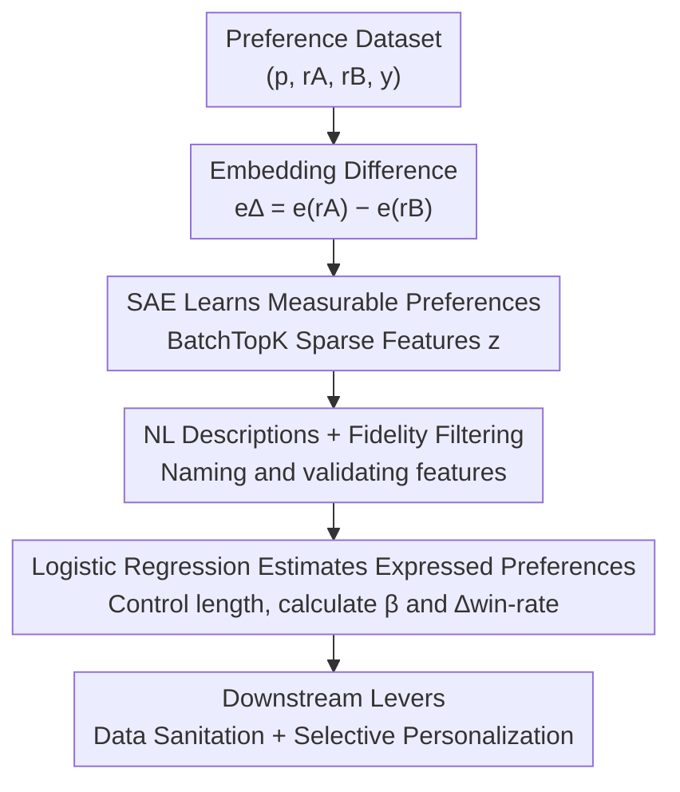

# What's In My Human Feedback? Learning Interpretable Descriptions of Preference Data

**Conference**: ICLR 2026  
**OpenReview**: [https://openreview.net/forum?id=sC6A1bFDUt](https://openreview.net/forum?id=sC6A1bFDUt)  
**Code**: https://github.com/rmovva/wimhf (Available)  
**Area**: Alignment RLHF / Interpretability / Preference Data Analysis  
**Keywords**: Preference Data, Sparse Autoencoders, RLHF, Interpretable Features, Data Sanitation

## TL;DR
WIMHF uses Sparse Autoencoders (SAEs) on the "embedding difference between two candidate responses" to learn a small set of human-readable features. It then quantifies the impact of each feature on preference labels using logistic regression. This process automatically characterizes what a preference dataset "can measure" and what "annotators actually prefer" without pre-defined hypotheses, providing controllable levers for data sanitation and personalization.

## Background & Motivation

**Background**: Preference data is the foundation of LLM alignment (RLHF / Preference Fine-Tuning, PFT). Given a prompt and two candidate responses $(r_A, r_B)$, humans select the better one, and these labels are used to fine-tune models. However, practitioners often lack clarity on what preferences these labels actually encode.

**Limitations of Prior Work**: Reward models can accurately predict human choices but act as black boxes that cannot explain "why." Another approach involves pre-specifying hypothetical features (politeness, humor, length, sycophancy, etc.) to verify if they are preferred. However, **relying on pre-defined features limits discovery**—human feedback contains many unexpected quirks, especially when pairwise ranking enters new specialized domains, where manual feature listing inevitably misses nuances.

**Key Challenge**: There is a choice between black-box models (predictive but uninterpretable) and pre-defined features (interpretable but constrained by hypotheses). There is a need for a method that **automatically discovers features from data while ensuring each feature is human-readable**.

**Goal**: This work decomposes the problem into two answerable sub-questions: (1) **Measurable preferences**: In which dimensions do $r_A$ and $r_B$ systematically differ (preferences can only be measured if differences exist)? (2) **Expressed preferences**: Which of these dimensions truly predict the label $y$?

**Key Insight**: The authors observe that the "difference between two responses" can be characterized by the text embedding difference $e_\Delta = e_{r_A} - e_{r_B}$. While this contains semantic difference information, it is not inherently interpretable. However, SAEs have been proven capable of mapping neural representations onto a set of human-interpretable sparse bases. By training an SAE directly on $e_\Delta$, the "differences between response pairs" can be decomposed into a series of nameable concepts.

**Core Idea**: Use an SAE on embedding differences to learn sparse interpretable features (measurable), then use length-controlled logistic regression to identify features that truly predict labels (expressed). Using approximately four active features can explain the majority of signals from a black-box reward model.

## Method

### Overall Architecture

WIMHF is a three-step pipeline that takes a preference dataset $\mathcal{D} = \{(p, r_A, r_B, y)\}$ as input and outputs a dictionary of "features → natural language descriptions → impact on win rate," along with two types of downstream capabilities (data sanitation and personalization).

The entire process revolves around a generative decomposition: each sample results from the product of prompt distribution, response distribution, and label distribution. WIMHF first encodes each response pair into an embedding difference and uses an SAE to extract sparse features (this step only considers responses and is label-independent, corresponding to measurable preferences). Then, an LLM generates natural language descriptions for each feature, and those with poor descriptions are filtered out using a fidelity metric. Finally, labels are introduced, and logistic regression (controlled for length) estimates the impact of each feature on the win rate to identify expressed preferences. The first two steps study "what the dataset can measure," while the third step answers "what annotators actually prefer."

### Key Designs

**1. Training SAEs on Embedding Differences: Decomposing "how response pairs differ" into nameable measurable preferences**

The pain point is that the embedding difference $e_\Delta = e_{r_A} - e_{r_B}$ contains the semantic differences between two responses but is a dense, uninterpretable vector. The authors use OpenAI's `text-embedding-3-small` to calculate response embeddings and then train a **BatchTopK SAE** on $e_\Delta$. This learns a linear encoder and decoder to reconstruct $e_\Delta$ into a sparse $M$-dimensional latent vector $z$. BatchTopK works by keeping only the largest $B\cdot K$ activations for a batch (size $B$, sparsity target $K$) and zeroing the rest. During inference, learned thresholds ensure that only $K \ll M$ features are non-zero per input on average. The intuition is that "a single data point is sparse in human conceptual space"—while there are $M$ possible types of differences, a specific pair differs in only a few.

Across all datasets, $(M, K) = (32, 4)$ proved effective: increasing these values leads to feature redundancy and decreased interpretability while yielding almost no gain in predicting $y$. The authors train a separate SAE for each dataset to learn specific feature distributions. Notably, using "full prompt-response" embeddings does not improve the ability to predict $y$; the authors speculate that key prompt information is often implicit in the responses. The output of this step is an $N \times M$ matrix $Z$, where each row is a sparse representation of a sample.

**2. Automated Interpretation + Fidelity Filtering: Assigning trustworthy NL names to each feature**

Sparse features alone are not readable; one must know what concept each dimension $z_j$ represents. The authors follow the autointerp paradigm: for each feature, they sample five response pairs with high $z_j$ values and prompt an LLM (`gpt-5-low`) to describe the "concept that most clearly distinguishes the two responses," resulting in short descriptions like "gives advice directly without asking clarifying questions" or "uses emojis."

However, automated descriptions are naturally incomplete—a short text is unlikely to capture a continuous activation distribution. The authors introduce **fidelity** as a quality gate: for each feature, an LLM annotator (`gpt-5-mini-low`) judges which response in a held-out pair contains more of the feature ($r_A$ as +1, $r_B$ as -1, neither as 0). The Pearson correlation between these judgments and $z_j$ is calculated on 300 random samples where $z_j \neq 0$. Only significant features with $p < 0.05$ after Bonferroni correction are kept. This ensures that the "description" truly matches the "activation" and filters out mislabeled features.

**3. Length-Controlled Logistic Regression: Selecting expressed preferences from measurable ones**

The third step introduces $y$ to estimate the impact of each interpretable feature $z_j$ on preference:

$$\Pr(y = 1) = \sigma(\alpha + \beta_j \cdot z_j + \gamma \cdot x)$$

Where $\beta_j$ is the coefficient of interest and $x$ is the control variable. The authors set $x$ as the word count difference $\ell_\Delta$: since length is a known strong bias in many datasets, the goal is to identify features that remain important "after controlling for length." Without this control, length-related features would naturally emerge as expressed preferences. Both $z_j$ and $x$ are standardized to mean 0 and variance 1, such that a one-standard-deviation increase in $z_j$ multiplies the odds of $y$ by $\exp(\beta_j)$. Features with the largest $|\beta_j|$ have the most impact. For better intuition, the authors also calculate **$\Delta$win-rate**: the average change in predicted win rate $\hat{y}$ when the feature is positive vs. negative at a fixed length. The authors clarify that these features are **correlated** with annotator choices and not necessarily causal, though models may still learn them as such.

**4. Features as Levers: Data Sanitation and Selective Personalization**

WIMHF features are not just for analysis but serve as actionable control points. **Data Sanitation**: In LMArena, the authors found that the "refusing harmful requests" feature is strongly anti-preferred (annotators prefer responses containing unsafe content). By **flipping labels** only for samples where this feature is highly active, they significantly improved the safety of a reward model trained on Arena without harming overall performance. **Selective Personalization**: In Community Alignment (which includes annotator IDs), the authors used a random-slope mixed-effects model $\beta_{j,a} \sim N(\beta_j, \tau_j^2)$ to define "subjective features." Using $\tau_j$ (variance of slopes across annotators) as a measure of subjectivity, they found that "paragraph vs. list" formatting preferences were the most subjective ($\tau_j = 0.42$). Crucially, practitioners can learn annotator-specific coefficients $\beta_{j,a}$ only for these **low-risk** subjective features (like formatting styles rather than political stances), using the global $\beta_j$ as a Gaussian prior. This improves personalized prediction while avoiding "echo chamber" risks—a level of control impossible with black-box methods.

### Example: Unsafe Annotations in Arena

Consider a response pair in LMArena: $r_A$ correctly refuses a toxic request, while $r_B$ generates unsafe content. The SAE activates the "refusing user request" feature at a high value for this pair. The third-step logistic regression calculates a $\Delta$win-rate of **-31%** for this feature (three of the five most impactful features in Arena relate to unsafety). This indicates that annotators overwhelmingly chose the less safe $r_B$. WIMHF not only identifies this issue automatically but also **quantitatively attributes it to specific data points**. Flipping the labels for these points increased the RewardBench 2 safety subset accuracy from 8.9% (well below random) to 46.2% after flipping the top 1000 samples, while non-safety attributes like math and instruction following remained within the 95% confidence interval of the baseline.

## Key Experimental Results

The authors analyzed seven widely used feedback datasets: LMArena, Community Alignment (CA), HH-RLHF, PRISM, Reddit (SHP), PKU-SafeRLHF, and Tulu 3 mixture (filtering out queries with objective answers like math/code to focus on subjective dialogue).

### Main Results: Sparse Features Replicate Black-Box Signals with Minimal Dimensions

| Predictor | AUC | % of Gain Relative to Random (0.5) | Description |
|-----------|-----|-----------------------------------|-------------|
| Black-box RM (Fine-tuned Llama-3.2-3B) | 0.766 | 100% (Oracle) | Uninterpretable upper bound |
| Dense Embedding Logistic Regression | — | ~80% (SAE reaches 84% of this) | The representation the SAE is based on |
| WIMHF Sparse Feature Logistic Regression | 0.672 | **67%** | Average of only 4 active features |

With only four active features on average, WIMHF achieved 67% of the black-box RM's gain relative to random and 84% of the gain from dense embeddings, indicating that interpretable features lose very little signal.

### Key Findings
- **Identical features have opposite preferences across datasets**: Reddit/Arena and HH-RLHF/PRISM/CA often show opposing trends—Reddit/Arena prefer playful banter and informal tones, while HH-RLHF/PRISM prefer the opposite. This suggests that the common PFT practice of "mixing multiple datasets" may encode contradictory signals, leading to erasure or unexpected behaviors.
- **Measurable preferences depend on how responses are generated**: High-temperature sampling (e.g., Bai et al.) produces differences in style/tone/refusal, while explicit "diverse values" prompting in CA leads to topic-level differences (e.g., luxury vs. budget advice). WIMHF helps practitioners check if a dataset truly possesses the intended diversity **before** spending money on labeling.
- **Automatic labeling of reward hacking risks**: HH-RLHF consistently shows an anti-preference for "expressing uncertainty/clarifying questions," which aligns with existing findings that training on HH-RLHF exacerbates model overconfidence. In CA, "mentioning environmental sustainability" is strongly anti-preferred (-34%), but this is because the topic is often irrelevant to the prompt rather than annotator apathy, warning practitioners not to let the reward model generalize this correlation to relevant prompts.
- **Efficient Data Personalization**: By personalizing only the most subjective feature ("paragraph vs. list"), the held-out AUC increases as the number of samples $k$ increases (+1.1% at $k=16$). Active sampling of samples where this feature is most active yields greater gains at small $k$ than random sampling.

## Highlights & Insights
- **Using the "difference between response pairs" as SAE input** is the most clever step: interpretable analysis of a single response is dominated by content, whereas analysis of the **difference** naturally focuses on "how the two responses actually differ," exactly what preference annotation compares.
- **Measurable/Expressed decoupling** is highly effective: the former looks only at responses without labels, allowing for dataset health checks before labeling; labels are only introduced for the latter. This cleanly separates "what the dataset can measure" from "what humans actually prefer."
- **Features as both analysis tools and intervention levers**: The same set of interpretable features can quantitatively attribute unsafe annotations, precisely flip bad labels for sanitation, and select low-risk dimensions for personalization. Interpretability here translates directly into controllability, something black-box reward models cannot provide.
- **Fidelity filtering** is a transferable trick: any autointerp pipeline can use "asking an LLM to label based on descriptions and then calculating correlation with activations" to filter out inaccurate feature descriptions.

## Limitations & Future Work
- The authors explicitly acknowledge that features are **correlated and not necessarily causal**; they cannot assert that these features causally influence human preference. Automated feature descriptions are also naturally incomplete, so the authors suggest using descriptions as a starting point and examining multiple data points to clarify patterns.
- Excluding prompt text: Although experiments show that adding prompts does not improve $y$ prediction, the authors admit this is an empirical observation and left better prompt integration for future work.
- SAEs are trained individually per dataset, so cross-dataset comparisons require LLM judges to re-label the same features—this introduces additional judge noise. Cross-dataset conclusions should be taken with caution (different response distributions and prevalence mean sizes cannot be simply compared).
- The absolute gain from personalization is small (+1.1% at $k=16$), and the authors admit black-box personalization might yield higher AUC gains. WIMHF's value proposition is interpretability and controllability rather than pure accuracy.

## Related Work & Insights
- **vs. Inverse Constitutional AI (ICAI) (Findeis et al., 2025)**: Both aim to describe feedback data without pre-settings, but ICAI uses a prompting route. WIMHF produces >1.5× the number of significant preferences, captures unsafe Arena preferences missed by ICAI, and studies measurable preferences which ICAI ignores.
- **vs. Analysis of pre-defined attributes (length, sycophancy, overconfidence, etc.)**: That line of work assumes features first and then validates them; WIMHF discovers them automatically from data, uncovering unexpected quirks.
- **vs. Using SAEs to explain LLM internal representations**: While SAEs are usually used to explain model activations, this paper applies them to "preference data," providing a new fine-grained, interpretable perspective for data-centric preference learning.

## Rating
- Novelty: ⭐⭐⭐⭐⭐ "Training SAE on embedding differences + measurable/expressed decoupling" is a clean new framework for introducing interpretability to preference data analysis.
- Experimental Thoroughness: ⭐⭐⭐⭐⭐ Seven datasets, triple feature validation, +37% safety via sanitation, and comprehensive analysis of personalization and cross-dataset conflicts.
- Writing Quality: ⭐⭐⭐⭐ Clear concepts and effective diagrams; the methodology section is slightly dense but self-consistent.
- Value: ⭐⭐⭐⭐⭐ Provides practitioners with a practical tool for pre-labeling dataset health checks and post-labeling sanitation and personalization.

<!-- RELATED:START -->

## Related Papers

- [\[ICLR 2026\] Stackelberg Learning from Human Feedback: Preference Optimization as a Sequential Game](stackelberg_learning_from_human_feedback_preference_optimization_as_a_sequential.md)
- [\[ICLR 2026\] RLBFF: Binary Flexible Feedback to Bridge Between Human Feedback & Verifiable Rewards](rlbff_binary_flexible_feedback_to_bridge_between_human_feedback_verifiable_rewar.md)
- [\[NeurIPS 2025\] Strategyproof Reinforcement Learning from Human Feedback](../../NeurIPS2025/llm_alignment/strategyproof_reinforcement_learning_from_human_feedback.md)
- [\[ACL 2025\] Curiosity-Driven Reinforcement Learning from Human Feedback](../../ACL2025/llm_alignment/curiosity_driven_rlhf.md)
- [\[ICLR 2026\] Skywork-Reward-V2: Scaling Preference Data Curation via Human-AI Synergy](skywork-reward-v2_scaling_preference_data_curation_via_human-ai_synergy.md)

<!-- RELATED:END -->
