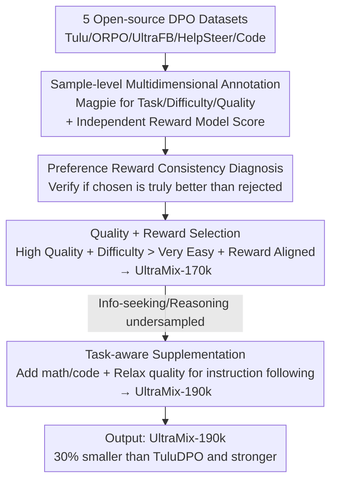

# When Data Is the Algorithm: A Systematic Study and Curation of Preference Optimization Datasets

**Conference**: ICLR 2026  
**OpenReview**: [https://openreview.net/forum?id=bmoh0i1nqE](https://openreview.net/forum?id=bmoh0i1nqE)  
**Code**: None (6 annotated datasets and the UltraMix mixture are available on HuggingFace)  
**Area**: Alignment RLHF / Preference Optimization / Data Curation  
**Keywords**: DPO, preference data, data-centric, reward model, data selection

## TL;DR
This paper conducts the first systematic "sample-level" horizontal audit of 5 commonly used open-source DPO preference datasets. By using Magpie to annotate task category/difficulty/input quality and an independent reward model to assign "preference reward" scores to each pair, the authors find that 20–30% of samples contain "chosen responses that are actually inferior to the rejected ones." Based on these diagnostic signals, a curated mixture set, UltraMix, is designed, which is 30% smaller than the strongest single dataset yet achieves superior performance.

## Background & Motivation
**Background**: The final step in aligning LLMs typically involves learning from preference feedback (RLHF). Among various methods, DPO (Direct Preference Optimization) has become the most popular in the open-source community because it eliminates the need for an explicit reward model or policy rollouts, fine-tuning directly on "chosen vs. rejected" preference pairs. Several open-source DPO corpora have been released: TuluDPO, ORPO, UltraFeedback, HelpSteer, and Code-Preference-Pairs.

**Limitations of Prior Work**: These datasets are largely "black boxes"—only coarse-grained overall compositions are reported, and rich sample-level annotations are missing. Some provide only binary preference pairs without ranking scores, making it impossible to discern "how much better the chosen is than the rejected." Others derive preference labels from GPT-4 or humans, but the accuracy of these preference orders has not been verified. Furthermore, existing horizontal comparisons are conducted under different models and hyperparameters, making the methodology highly heterogeneous and leaving the question of "which DPO dataset is better" unanswered.

**Key Challenge**: The DPO algorithm itself is simple; the real determinant of effectiveness is **data quality**. However, the community lacks diagnostic tools to perform side-by-side comparisons of sample quality and task coverage under fixed training configurations. Consequently, principled data curation recipes cannot be designed. In other words, "data is the algorithm," yet no one has systematically studied the inputs to this algorithm.

**Goal**: (1) Fairly benchmark 5 DPO datasets under a unified training configuration; (2) Supplement each preference pair with sample-level annotations, particularly a signal to independently verify preference ordering; (3) Design curation recipes using these annotations to select samples across datasets, creating a smaller yet stronger mixture set.

**Key Insight**: An **independent reward model**, unrelated to the original dataset annotations, is introduced to score each preference pair. If the "chosen response" score is lower than the "rejected response" score, the preference pair is considered suspicious. This signal serves as both a quality audit for the dataset and a selection criterion.

**Core Idea**: Treat preference data as an "algorithm" to be diagnosed. Use multidimensional annotations (task/difficulty/input quality/preference reward) to identify noise and redundant samples, then combine "quality + reward + task-aware" signals to curate samples across 5 datasets into UltraMix.

## Method

### Overall Architecture
The methodology consists of three stages: first, generating **multidimensional annotations** for all preference samples (using Magpie for task category/difficulty/input quality and an independent FsfairX reward model for "preference reward"). Second, performing a **horizontal diagnosis** to identify structural differences in composition, quality, and preference consistency across datasets. Finally, designing a **curation recipe** to select samples from all 5 datasets, removing noise and redundancy to iteratively derive the final UltraMix-190k. The entire pipeline is "data-centric": it does not modify the DPO algorithm or training hyperparameters, only the data itself.

### Key Designs

**1. Sample-level Multidimensional Annotation: Dashboard for Black-box Preference Data**

To address the issue that DPO datasets are "black boxes" at the sample level, the authors use the Magpie self-synthetic annotation pipeline to attach structured labels to each preference pair: task category (12 classes, e.g., information seeking, math, coding), query difficulty (very easy to very hard), input quality (very poor to excellent), and language/safety tags. These labels are generated by Llama-3.3-70B-Instruct as a judge. The true novelty lies in adding a **preference reward**: using FsfairX (a reward model based on Llama-3-8B-Instruct, fine-tuned on diverse high-quality preference data) to score both the "chosen" and "rejected" responses. Since this reward model is independent of the original dataset’s annotation source, its scores serve as an "external ruler" to measure how well responses satisfy instructions without relying on original human or GPT labels. To avoid over-reliance on a single reward model, the authors verified findings with a second reward model.

**2. Preference Reward Consistency Diagnosis: Preference Order is Not Always Trustworthy**

With an independent reward model, the first task was to verify if "the chosen response is actually better than the rejected one." The results were surprising: TuluDPO, ORPO, UltraFeedback, and HelpSteer all showed that only **70–80%** of samples satisfied $r_\text{chosen} > r_\text{rejected}$. In 20–30% of preference pairs, the reward model considered the "rejected" response to be superior. This exposes how UltraFeedback's GPT-4 based labels and HelpSteer's averaging approach often mismatch dedicated preference reward models. Examining the distribution of the reward margin $r_\text{chosen} - r_\text{rejected}$, TuluDPO, ORPO, and UltraFeedback have wider distributions reaching into the positive tail, indicating clear differentiation. HelpSteer’s distribution clusters near zero, signifying many "forced choices" between similar responses, resulting in weak alignment signals. The authors also found a **strong positive correlation between input quality and preference reward**—higher quality prompts lead to higher average rewards for chosen responses, providing the first empirical evidence that poor instructions lead to poor preference alignment. Code-Preference-Pairs was the least affected as functional/syntax errors in code provide clearer signals for both humans and reward models.

**3. Multi-signal + Task-aware Curation Recipe: Iterating from 170k to 190k**

Based on the conclusion that single-signal filtering is insufficient, the authors built UltraMix in two steps. **Initial Recipe (Quality + Reward)**: Each dataset was filtered to keep only samples with (a) "excellent/good" input quality, (b) difficulty above "very easy" (as easy samples correlate poorly with downstream performance), and (c) $r_\text{chosen} > r_\text{rejected}$. Percentile thresholds were applied (keeping above the 25th percentile for 4 general sets and the 80th percentile for Code-Preference-Pairs to avoid code overload), followed by deduplication (TuluDPO and UltraFeedback overlap significantly). This yielded **UltraMix-170k** (37% smaller than TuluDPO), which improved overall scores and TruthfulQA but saw regressions in code, MATH, and IFEval. Diagnosis revealed that 170k **undersampled information seeking and reasoning** (down 20% and 13% vs. TuluDPO), which are critical for instruction following. **Improved Recipe (Quality + Reward + Task-aware)**: First, 17k math/code samples were added back based on "$r_\text{chosen} > r_\text{rejected}$" to get **UltraMix-187k**. Second, for instruction following, **quality constraints were relaxed**: 3k information seeking/reasoning samples with preference rewards above the 70th percentile but "average" input quality were added, resulting in **UltraMix-190k** (still 30% smaller than TuluDPO). The key insight is that quality, task, and reward filters are insufficient individually; UltraMix’s effectiveness comes from their principled combination.

## Key Experimental Results

### Main Results
Using a fixed training configuration (Open-Instruct framework), DPO was performed on Llama-3.1-8B-TuluSFT and Qwen-2.5-7B-TuluSFT. Evaluation covered 12 Open LLM Leaderboard tasks + HumanEval/HumanEval+, totaling 14 benchmarks (Overall Average):

| Model | SFT | TuluDPO (Strongest single) | UltraMix-170k | UltraMix-190k (Ours) |
|------|------|------|------|------|
| Llama-3.1-8B-TuluSFT | 50.09 | 53.96 | 54.16 | **56.04** |
| Qwen-2.5-7B-TuluSFT | 56.55 | 59.56 | 60.48 | **62.05** |

UltraMix-190k consistently outperformed the strongest single dataset, TuluDPO, across both models while using 30% less data. Representative metrics (Llama): GSM8K 79.48→82.48, HumanEval 67.24→69.05, IFEval 80.35→81.13; (Qwen): MATH 43.13→49.55, GSM8K 76.84→82.70.

### Ablation Study / Diagnosis

| Diagnostic Dimension | Key Findings | Description |
|------|---------|------|
| Preference Consistency | Only 70–80% chosen > rejected | 20–30% of pairs are "mislabeled" according to independent RM |
| Task Distribution (170k) | Info-seeking −20%, reasoning −13% | Pure quality/reward filtering discards instruction following samples → Regression |
| Task-aware Supplement | 187k/190k added back +5%/+10% info-seeking | 190k outperformed 170k and TuluDPO on nearly all benchmarks |
| Single Signal vs. Combo | Quality/Task/Reward filters alone insufficient | UltraMix gains come from principled multi-signal interaction |

### Key Findings
- **Preference order mismatch is prevalent and harmful**: In 20–30% of samples, the "chosen" response is viewed as inferior to the "rejected" one by independent RMs, a metric never previously quantified in horizontal studies.
- **Input Quality ↔ Preference Reward correlation**: Poorly written prompts lead to lower-quality preference alignment, empirically demonstrated here for the first time.
- **Absolute Quantity > Relative Proportion**: TuluDPO has only 17% math samples, but due to higher absolute volume and quality, its math performance exceeds ORPO (29% math). This explains why 190k focuses on supplementing absolute numbers rather than just adjusting ratios.
- **Generalization**: UltraMix-190k consistently led all original datasets and variants across 6 other open-source models of varying architectures/sizes (1B to 8B).

## Highlights & Insights
- **"Data as the Algorithm" perspective works**: Significant gains over the strongest baseline were achieved purely through data diagnosis and selection without touching the DPO algorithm or hyperparameters, proving significant noise and redundancy in preference data.
- **Independent Reward Model as a "Lie Detector"**: Using a reward model unrelated to the original labels to cross-verify preference orders serves as both a diagnostic tool and a curation filter. This approach is transferable to any preference dataset.
- **The "Quality then Task supplement" iterative process**: The authors transparently showed how the initial recipe failed by discarding instruction-following samples and how task-aware supplementation fixed it, illustrating why single-signal filtering is inadequate.
- **Reusable Engineering Tricks**: Using different percentile thresholds for different datasets (e.g., 80th percentile for code to prevent overload) and relaxing quality constraints to salvage high-reward instruction-following samples are valuable practical insights for data mixture engineering.

## Limitations & Future Work
- **Dependence on Reward Model judgement**: The entire diagnosis and selection pipeline relies on the FsfairX reward model. Although cross-checked with another model, inherent biases in reward models could still influence conclusions regarding "mismatched" samples.
- **Manual thresholds in recipes**: Percentiles, difficulty gates, and relaxing quality to "average" are empirical settings that may not transfer seamlessly to new datasets, requiring re-tuning.
- **Limited to 5 datasets and DPO**: Larger corpora or other alignment paradigms like PPO/Online RLHF were not covered; the effectiveness of the mixture strategy in those contexts remains to be verified.
- **Future Improvements**: Preference reward verification could be made online/iterative (re-filtering during training) or use multi-RM voting to reduce bias.

## Related Work & Insights
- **vs. Existing DPO Benchmarks**: Previous comparisons covered small subsets and used heterogeneous models/hyperparameters. This work provides the first fair horizontal benchmarking across 8 models and 14 benchmarks with sample-level annotations.
- **vs. Original Datasets (UltraFeedback, etc.)**: These original labels come from GPT-4 or human averages. This study proves that 20–30% of these labels mismatch dedicated preference models, highlighting blind spots in original annotations.
- **vs. Author's Prior Work (SFT Data Analysis)**: This work extends the "annotation + diagnosis + curation" data-centric methodology from SFT scenarios to DPO preference pairs.

## Rating
- Novelty: ⭐⭐⭐⭐ The perspective (Data as Algorithm) and reverse-verification using independent RMs are solid, though individual technical innovations are incremental.
- Experimental Thoroughness: ⭐⭐⭐⭐⭐ Comprehensive benchmarking across 8 models and 14 tasks, combined with three rounds of iterative ablation, ensures consistent conclusions.
- Writing Quality: ⭐⭐⭐⭐ Clear logic and transparent reporting of failed recipes; however, diagrams are dense and some analysis requires referencing the appendix.
- Value: ⭐⭐⭐⭐⭐ Open-sourcing all annotations and the UltraMix dataset provides a directly reusable guide for curating preference data from open-source corpora.

<!-- RELATED:START -->

## Related Papers

- [\[ICLR 2026\] Skywork-Reward-V2: Scaling Preference Data Curation via Human-AI Synergy](skywork-reward-v2_scaling_preference_data_curation_via_human-ai_synergy.md)
- [\[ICLR 2026\] When Weak LLMs Speak with Confidence, Preference Alignment Gets Stronger](when_weak_llms_speak_with_confidence_preference_alignment_gets_stronger.md)
- [\[ICLR 2026\] Is On-Policy Data always the Best Choice for Direct Preference Optimization-based LM Alignment?](is_on-policy_data_always_the_best_choice_for_direct_preference_optimization-base.md)
- [\[ICLR 2026\] Towards Understanding Valuable Preference Data for Large Language Model Alignment](towards_understanding_valuable_preference_data_for_large_language_model_alignmen.md)
- [\[ACL 2026\] Alignment Data Map for Efficient Preference Data Selection and Diagnosis](../../ACL2026/llm_alignment/alignment_data_map_for_efficient_preference_data_selection_and_diagnosis.md)

<!-- RELATED:END -->
