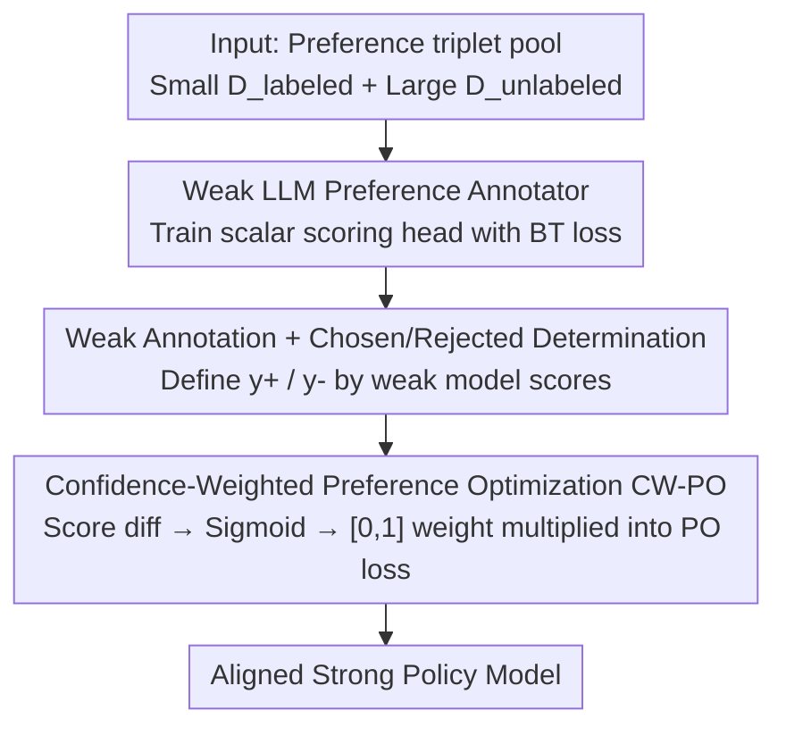

# When Weak LLMs Speak with Confidence, Preference Alignment Gets Stronger

**Conference**: ICLR 2026  
**Paper**: [Project Website](https://brbiclab.epfl.ch/projects/CW-PO) (EPFL, including code; arXiv ID not provided in cache)  
**Code**: https://brbiclab.epfl.ch/projects/CW-PO (Available)  
**Area**: Alignment RLHF / Preference Optimization  
**Keywords**: Preference Alignment, Weak Model Labeling, Confidence Weighting, DPO, Weak-to-Strong Alignment

## TL;DR
Using a weak LLM of less than 0.5B parameters as a preference annotator and weighting the preference optimization target per sample based on its "confidence" (CW-PO) allows the method to surpass DPO trained with 100% human labels on multiple datasets using only 20%~30% of human annotations. It is compatible with various objectives such as DPO, IPO, and rDPO.

## Background & Motivation
**Background**: The mainstream approach to aligning LLMs with human values is preference alignment—methods like RLHF or DPO. These require a set of triplets $(x, y_1, y_2)$ (a prompt + two candidate responses), where an annotator judges which is better, and these preference labels are used to optimize the policy model.

**Limitations of Prior Work**: While candidate responses $y_1, y_2$ are easily generated in bulk via prompting LLMs, the "judging which is better" step is truly expensive. Human annotation is costly, time-consuming, and noisy due to subjectivity across annotators and contexts. Switching to large API models like ChatGPT as annotators incurs significant computational and financial costs.

**Key Challenge**: Obtaining high-quality preference data requires high costs (human or large model APIs), while saving money by using weak models risks insufficient annotation quality. Recently, Tao & Li (2025) found that even a weak LLM like OPT-125M, trained on a small amount of human data, can act as an annotator to align stronger models, even matching human supervision. However, they **directly use the weak model's predictions as preference labels**, implicitly assuming every judgment from the weak model is equally reliable.

**Goal**: Since weak models can act as annotators, their "certainty" regarding different samples clearly varies. The goal is to utilize this uncertainty more intelligently rather than treating all weak annotations equally.

**Key Insight**: The authors made a key observation: training a strong model using only the subset of samples where the weak LLM is "most confident" (taking the top-N% sorted by score margin) actually yields better results than using all weak annotations, and even better than using all human annotations. This suggests that the weak model's confidence itself is a useful and nearly free signal.

**Core Idea**: Instead of hard filtering, the authors convert the weak LLM's confidence into a per-sample weight in $[0,1]$, multiplying it into the preference optimization loss—learning more from high-confidence samples and less from low-confidence ones. This is termed Confidence-Weighted Preference Optimization (CW-PO).

## Method

### Overall Architecture
CW-PO addresses the weak-to-strong alignment scenario where a weak model supervises a strong model. Given a pool of preference triplets where only a small portion $D_{labeled}$ (e.g., 30%) has human labels and the rest $D_{unlabeled}$ is unlabeled, the pipeline consists of three steps: **First**, train a weak LLM as a preference annotator using $D_{labeled}$. **Next**, use it to label the "chosen/rejected" responses in $D_{unlabeled}$ while calculating the confidence for each sample. **Finally**, align the strong policy model using a preference optimization objective with confidence weighting. The critical transition is in the third step: confidence is not used to filter samples but as a weight to scale the loss per sample, ensuring all weak-labeled data participates in training with varying contributions.

### Key Designs

**1. Weak LLM Preference Annotator: Extracting preference signals from minimal models**

To address the high cost of human/large model annotation, the authors assign the labeling task to a weak model < 0.5B (OPT-125M or Qwen2.5-0.5B). They use the weak model's pre-trained backbone, **replace the final layer with a scalar output layer** $\pi_w:(X,Y)\to\mathbb{R}$, and fine-tune the entire model. Training uses the classic Bradley-Terry model to link scores to preferences: $p(y^+\succ y^-\mid x)=\sigma(\pi_w(x,y^+)-\pi_w(x,y^-))$, optimizing the negative log-likelihood on human preference data: $L_{weak}=-\mathbb{E}_{(x,y^+,y^-)\sim D_{labeled}}[\log\sigma(\pi_w(x,y^+)-\pi_w(x,y^-))]$. Reusing the pre-trained backbone is crucial—it transfers existing linguistic knowledge to the scoring task, enabling a reasonably accurate annotator with minimal human data. Note the difference from Tao & Li (2025): while they keep LLM outputs unchanged and use generated implicit rewards as pseudo-labels, this work explicitly trains a scoring head.

**2. Selection/Rejection Determination: Automatically converting unlabeled pairs into preference triplets**

Once the annotator is trained, for each prompt $x$ and two candidates $(y_1, y_2)$ in $D_{unlabeled}$, the winner is determined by the weak model's scores: $y^+=\arg\max_{y\in\{y_1,y_2\}}\pi_w(x,y)$ and $y^-=\arg\min_{y\in\{y_1,y_2\}}\pi_w(x,y)$. The higher-scoring response is treated as "chosen" and the other as "rejected," automatically transforming unlabeled data into a weak-labeled preference set $\hat D$. This step bridges the practical gap where triplets are easy to generate but hard to label reliably: triplets are generated via prompting as usual, while labeling is handled by the reusable weak model.

**3. Confidence-Weighted Preference Optimization: Converting weak model certainty into per-sample weights**

This is the core of the paper. The limitation of treating all weak annotations equally is that the model can be hindered by low-quality samples where the weak model is uncertain. CW-PO multiplies the general preference optimization objective by a confidence weight: $L_{\text{CW-PO}}=\mathbb{E}_{(x,y^+,y^-)\sim\hat D}\big[C(x,y^+,y^-)\cdot\ell(\pi_s;x,y^+,y^-)\big]$. Confidence is defined as the normalized value of the sigmoid of the score difference between the chosen and rejected responses:

$$C(x,y^+,y^-)=2\cdot\big(\sigma(\pi_w(x,y^+)-\pi_w(x,y^-))-0.5\big).$$

By the definition of chosen/rejected, $\pi_w(x,y^+)\ge\pi_w(x,y^-)$ always holds, so $\sigma(\cdot)\in[0.5,1]$; subtracting 0.5 and multiplying by 2 scales it to $[0,1]$. $C\approx0$ indicates the weak model is very uncertain (close scores), while $C\approx1$ indicates high certainty (large score margin). Consequently, low-confidence samples have almost no impact on the strong model's alignment, while high-confidence samples are prioritized. The authors emphasize using sigmoid normalization over direct score margins $\pi_w(x,y^+)-\pi_w(x,y^-)$ because unbounded margins can lead to unstable optimization. Sigmoid normalization produces smooth gradients and bounded weights, and it is naturally consistent with the weak model's training objective $L_{weak}$ and the BT model's preference formula, enhancing training stability. Notably, CW-PO **does not perform data filtering but instead uses per-sample re-weighting**—a soft, differentiable version that complements the exploratory finding of "hard picking the top-N% most confident samples."

CW-PO is a general framework: applying this weight to DPO, IPO, or rDPO yields CW-DPO, CW-IPO, and CW-rDPO. Taking CW-DPO as an example, the objective is $L_{\text{CW-DPO}}=-\mathbb{E}_{\hat D}\big[C(x,y^+,y^-)\log\sigma(\beta_{\text{DPO}}\log\frac{\pi_s(y^+|x)}{\pi_{ref}(y^+|x)}-\beta_{\text{DPO}}\log\frac{\pi_s(y^-|x)}{\pi_{ref}(y^-|x)})\big]$, which effectively multiplies each sample in standard DPO by a confidence weight, maintaining the core of the original algorithm as a plug-and-play enhancement.

## Key Experimental Results

### Main Results
The evaluation metric is Gold Reward Accuracy (GRA): using a pre-trained reward model to score responses and measuring how often the aligned model's responses score higher than the SFT baseline. Weak $\to$ strong model pairs are OPT-125M $\to$ OPT-13B and Qwen2.5-0.5B $\to$ Qwen2.5-14B. Datasets include HH-RLHF (Harmless+Helpful), TL;DR, and UFB, with the weak model trained on 30% human labels.

| Model pair / Method | HH-RLHF | TL;DR | UFB | Avg. |
|--------------|---------|-------|-----|------|
| OPT 13B · Human (DPO) | 56.9 | 57.0 | 61.3 | 58.4 |
| OPT 13B · WS-DPO | 56.7 | 53.5 | 63.4 | 57.9 |
| OPT 13B · **CW-DPO** | 61.3 | 56.6 | 63.1 | **60.3** |
| Qwen 14B · Human (DPO) | 78.8 | 64.2 | 78.1 | 73.7 |
| Qwen 14B · WS-DPO | 81.4 | 64.8 | 78.3 | 74.8 |
| Qwen 14B · **CW-DPO** | 80.6 | 66.0 | 80.1 | **75.6** |

On average, CW-PO is approximately 5.2% GRA higher than WS-DPO (the direct weak labeling method from Tao & Li 2025) and about 5% higher than the Human baseline. This also holds for IPO and rDPO: CW-rDPO on OPT averages 62.7 (vs Human 56.3 / WS-DPO 55.5), demonstrating that confidence weighting is a plug-and-play enhancement across objectives.

CW-DPO using only 30% human labels can even outperform DPO trained on 100% human labels:

| Dataset | OPT-1.3B Human(100%) | OPT-1.3B CW-DPO(30%) | Qwen-7B Human(100%) | Qwen-7B CW-DPO(30%) |
|--------|------|------|------|------|
| HARMLESS | 69.2 | 72.9 (+3.7) | 65.7 | 72.0 (+6.3) |
| HELPFUL | 70.2 | 72.7 (+2.5) | 58.5 | 70.8 (+12.3) |
| HH-RLHF | 71.9 | 69.9 (−2.0) | 72.7 | 75.2 (+2.5) |
| TL;DR | 54.2 | 59.5 (+5.3) | 63.4 | 64.4 (+1.0) |
| Avg. | 66.4 | 68.8 (+2.4) | 65.1 | 70.6 (+5.5) |

### Ablation Study

| Configuration / Analysis | Key Metric | Description |
|------------|---------|------|
| top-30% most confident vs Human | GRA ↑ | Selecting only the top 30% most confident weak labels outperforms full human annotation. |
| CW-DPO vs WS-DPO (Different student sizes) | OPT Avg 64.8 vs 61.2 | Small/Medium models benefit most; gain decreases as model size increases. |
| CW-DPO (20% labels) vs DPO (100% Human) | 70.3% vs 69.7% | Surpasses 100% human DPO with only 20% labels. |
| CW-DPO vs DPO directly on D_labeled | CW-DPO superior across all splits | For the same budget, training a weak annotator first is more cost-effective. |

### Key Findings
- **Confidence Weighting > Hard Filtering**: The exploratory finding of "hard picking the top-N% most confident samples" already surpassed human labels but required threshold selection and data loss; CW-PO softens this into a differentiable per-sample weight that preserves data and stability.
- **Smaller Students Gain More**: CW-PO offers significant gains for small to medium models (OPT average +3.6 over WS-DPO). However, as strong model SFT baselines are already high, the GRA room for improvement narrows for large models—this is a characteristic of GRA relative to the baseline, not necessarily an indication of no absolute performance gain.
- **Extremely Efficient Budget**: CW-PO can outperform 100% human DPO with just 20% labels. Once the weak annotator is trained, it can be reused repeatedly, making deployment costs far lower than human or large API annotation.

## Highlights & Insights
- **"Uncertainty" as a Free Supervisory Signal**: The weak model's score difference costs almost nothing. The authors move from a binary "trust this label or not" decision to a continuous weight, effectively letting the weak model tell the strong model "how much I trust this one."
- **Dual Role of Sigmoid Normalization**: $C\in[0,1]$ ensures bounded weights and smooth gradients (training stability) while mathematically aligning with the BT model and weak model training objectives.
- **Plug-and-play**: CW-PO does not modify the PO algorithm itself, only multiplying the loss by a weight. It can be directly applied to DPO/IPO/rDPO, offering high portability—any preference optimization using noisy or weak labels can benefit from this weighting for denoising.

## Limitations & Future Work
- To control costs, all results are from a **single run** (following Tao & Li 2025). The lack of variance/confidence intervals suggests that individual results (e.g., -2.0 for CW-DPO on HH-RLHF with OPT) should be viewed with caution.
- Confidence is derived entirely from the weak model's internal scores. If the weak model has systemic biases (consistently overconfident about certain incorrect responses), the high-confidence weight might amplify errors; this failure mode is not deeply analyzed. ⚠️ Refer to the original paper for details.
- GRA depends on an external reward model as a judge. Since different reward models are used for different datasets, absolute GRA values across datasets should not be directly compared.
- Evaluation is primarily on classic preference sets like HH-RLHF / TL;DR / UFB and the OPT/Qwen families. Performance on larger models and more dimensions (e.g., safety red-teaming) remains to be verified.

## Related Work & Insights
- **vs Tao & Li (2025) / WS-DPO**: Both use "weak model as annotator to align strong model." However, WS-DPO treats weak labels as hard labels with equal weighting, whereas this work introduces per-sample confidence weights and uses an explicit scalar scoring head (rather than generative implicit rewards), achieving approximately 5.2% higher GRA on average.
- **vs Standard DPO / IPO / rDPO**: These objectives assume input preference pairs are trustworthy. CW-PO is their "confidence-aware" version, acknowledging noise in weak annotations and weighting by reliability, acting as an orthogonal enhancement rather than a replacement.
- **vs Large API Models (ChatGPT) as Annotators**: The latter provides high quality but at a high cost. This paper demonstrates that a <0.5B weak model + confidence weighting can match or exceed full human annotation at a cost one or two orders of magnitude lower.

## Rating
- Novelty: ⭐⭐⭐⭐ Upgrading weak model confidence from hard filtering to differentiable per-sample weighting is simple yet backed by solid observations and clear motivation.
- Experimental Thoroughness: ⭐⭐⭐⭐ Covers 3 datasets, 3 PO objectives, 2 model families, and multiple student sizes, though restricted to single runs.
- Writing Quality: ⭐⭐⭐⭐ The chain of reasoning from observation to method is clear, with well-explained formulas and design motivations.
- Value: ⭐⭐⭐⭐ Significantly reduces the cost of preference alignment annotation with a plug-and-play approach, showing strong practicality.

<!-- RELATED:START -->

## Related Papers

- [\[ICLR 2026\] When Data Is the Algorithm: A Systematic Study and Curation of Preference Optimization Datasets](when_data_is_the_algorithm_a_systematic_study_and_curation_of_preference_optimiz.md)
- [\[ICLR 2026\] Weak-to-Strong Generalization with Failure Trajectories](weak-to-strong_generalization_with_failure_trajectories.md)
- [\[ICLR 2026\] Annotation-Efficient Honesty Alignment via Confidence Elicitation and Calibration](annotation-efficient_honesty_alignment_via_confidence_elicitation_and_calibratio.md)
- [\[ICML 2026\] The Realignment Problem: When Right becomes Wrong in LLMs](../../ICML2026/llm_alignment/the_realignment_problem_when_right_becomes_wrong_in_llms.md)
- [\[ICLR 2026\] Robust Preference Alignment via Directional Neighborhood Consensus](robust_preference_alignment_via_directional_neighborhood_consensus.md)

<!-- RELATED:END -->
