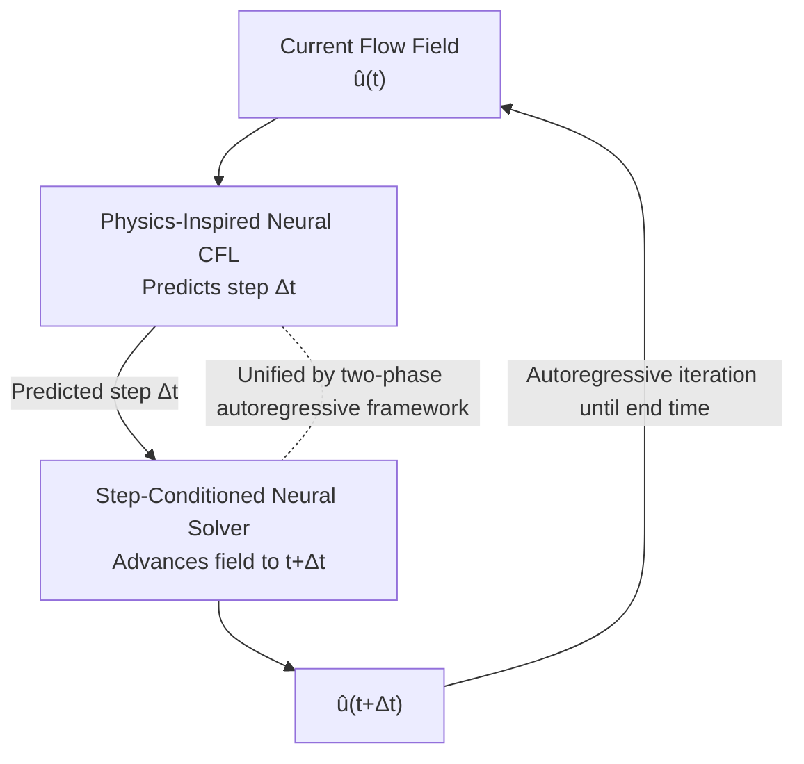

# A Two-Phase Deep Learning Framework for Adaptive Time-Stepping in High-Speed Flow Modeling

**Conference**: ICLR2026  
**OpenReview**: [https://openreview.net/forum?id=d4gzLgGl7I](https://openreview.net/forum?id=d4gzLgGl7I)  
**Code**: https://github.com/divelab/AIRS (ShockCast is open-sourced as part of the AIRS library)  
**Area**: Scientific Computing / Fluid Mechanics / Neural PDE Solvers  
**Keywords**: High-speed flows, Adaptive time-stepping, Neural PDE solver, CFL condition, Time-step conditioning

## TL;DR
ShockCast decouples "adaptive time-stepping for high-speed flows" into two learning problems: first, using a Neural CFL model to predict the next time step $\Delta t$ based on the current flow field; then, using a Neural Solver conditioned on $\Delta t$ to advance the flow field by $\Delta t$. These two modules alternate autoregressively during inference, allowing the neural solver to process supersonic flow fields with shocks by refining or coarsening steps as needed, mirroring classical solvers.

## Background & Motivation
**Background**: Learning fluid dynamics currently focuses almost exclusively on **low-speed, incompressible** scenarios. Time scales in these flows are relatively stable, and $\|\partial_t u(t)\|$ does not fluctuate violently, allowing the use of a **fixed time step** for temporal integration, which is simple and maintains accuracy.

**Limitations of Prior Work**: When flow velocities approach or exceed the speed of sound (supersonic $1<M<5$, hypersonic $M>5$, where $M=v/a$ is the Mach number), phenomena with **extremely small local time scales** such as shocks, expansion fans, and strong compression effects emerge. Resolving shocks requires very small steps, yet the flow field becomes smooth again after shocks dissipate, increasing the time scale. The standard solution in classical high-speed solvers is **adaptive time-stepping**: taking small steps at sharp gradients and large steps in smooth regions, determined by the CFL condition $\Delta t \le \frac{C}{\lambda_{\max}}\min_{x,y}(\Delta x,\Delta y)$.

**Key Challenge**: The speedup of neural solvers comes from learning mappings on **spatiotemporally coarsened grids** that span hundreds of classical solver steps, often explicitly modeling only a subset of physical variables. This makes classical CFL conditions **unusable**—the $\Delta x, \Delta y$ in the formula refer to fine grids, and the resulting $\Delta t$ is orders of magnitude smaller than the step a neural solver actually traverses. For multiphase flows, the CFL form involves numerous field variables; directly adopting it would force the neural network to evolve all variables, diluting its ability to model the fields of interest. Fixed steps are also unfriendly: under the same $\Delta t$, the difference $\|u(t+\Delta t)-u(t)\|$ for sharp gradients is far larger than for smooth states, leading to highly imbalanced training samples.

**Goal**: Enable neural solvers to be trained and inferred on high-speed flow data with **adaptive temporal resolution**, replicating both the evolution of classical solvers and their "step selection" process.

**Key Insight**: Since the CFL condition itself is not directly computable on coarse grids, the authors frame **"calculating the step size" as a supervised learning problem**, using a lightweight model to learn a "proxy CFL condition" under coarse spatiotemporal grid conditions using only available variables.

**Core Idea**: Use a pair of neural modules—"predicting the step size + step-conditioned advancement"—to replace "classical CFL formulas + fixed/classical steps," achieving adaptive time-stepping on neural solvers.

## Method

### Overall Architecture
ShockCast decomposes a single "advancement step" into two sequential phases. The dataset $\mathcal{D}=\{U_i\}_{i}^{N}$ consists of compressible Navier–Stokes solutions from classical solvers. Each trajectory $U=\{u_j\}_j^n$ is a sequence of snapshots on a **coarsened temporal grid** (one frame every $J\ge100$ solver steps), where $u_j\in\mathbb{R}^{D\times M}$ has $M$ grid points and $D$ fields.

- **Phase 1 (Neural CFL)**: Model $\psi$ takes the current flow field $u_j$ to predict the corresponding time step $\Delta_j$. The training objective is MAE: $\mathbb{E}_{j,U}[L_c(\psi(u_j),\Delta_j)]$. It learns "how the classical solver originally selected this step" rather than evolving the field.
- **Phase 2 (Neural Solver)**: Model $\phi$ takes the current flow field $u_j$ and the step $\Delta_j$ to predict the next frame $u_{j+1}$. The one-step objective uses the field-averaged relative error $\mathbb{E}_{j,U}[L_s(\phi(u_j,\Delta_j),u_{j+1})]$.

During inference, given initial condition $u_0$, the two phases **alternate autoregressively**: $\hat{\Delta t}:=\psi(\hat u(t))$ and $\hat u(t+\hat{\Delta t})=\phi(\hat u(t),\hat{\Delta t})$ until the termination time. A key constraint: the interpreted $\Delta t$ must align with the distribution of $\Delta t$ in the training data to avoid distribution shift for the Neural Solver.

### Key Designs

**1. Two-Phase Autoregressive Framework: Decoupling "Step Selection" and "Field Advancement"**

Directly applying classical adaptive stepping fails because CFL formulas are invalid on coarse grids. ShockCast **decouples** this: the Neural CFL $\psi$ mimics the original step-selection process using only relevant fields on coarse grids, while the Neural Solver $\phi$ focuses on propagation given a step size. Both receive clean supervision signals ($\Delta_j$ for $\psi$ and $u_{j+1}$ for $\phi$). This decoupling ensures that the one-step target $\|u(t+\Delta t)-u(t)\|$ for $\phi$ is more uniform across sharp and smooth samples, reducing variance. It also uses native non-uniform temporal grids from classical solvers, avoiding interpolation errors.

**2. Physics-Inspired Neural CFL: Predicting Steps with CFL "Prior Structures"**

To avoid a "black-box" regression for $u_j\mapsto\Delta_j$, the authors inject **three physical priors**: First, they include **spatial gradients** $\nabla u$ as input, since adaptive steps respond to gradient sharpness. Second, since CFL depends on the **maximum wave speed** $\lambda_{\max}=\max_{x,y}\lambda(x,y)$, they replace the network's spatial downsampling with **max pooling** to align the architecture with the semantics of $\lambda_{\max}$. Third, they concatenate **CFL features** (local wave speed $\lambda(x,y)$, velocity magnitudes $|u|,|v|$, and local sound speed $a(x,y)=\sqrt{\gamma R T}$) into the input. Experiments show these enhancements are particularly beneficial for **multiphase** problems (e.g., coal dust explosions) where CFL forms are complex.

**3. Step-Conditioned Neural Solver: Three Strategies for Injecting $\Delta t$**

The Neural Solver must "know" the target $\Delta t$ to respond correctly to variable-duration evolution. Three strategies are proposed:
- **Affine (Time-conditioned LayerNorm / Spatial-Spectral)**: Embeds $\Delta t$ as scale/shift vectors $a,b$ for normalization layers: $\mathrm{LN}(z)(1+a)+b$. For models like F-FNO without LN, spectral-spatial conditioning is used via point-wise multiplication $\mathcal{F}(z)\xi$.
- **Euler Residuals**: Maps the relationship $v(t+\Delta t)\approx v(t)+\Delta t\,\partial_t v(t)$ to residual connections $z_{l+1}=z_l+aF_l(z_l)$, where $a=W\Delta t+c$ explicitly binds the integration duration of each layer to the step size.
- **Mixture of Experts (MoE)**: Uses experts gated by $\Delta t$ ($z_{l+1}=z_l+\sum_k^K G_l(\Delta t)_k\,(a_k F_{l,k}(z_l))$), allowing different experts to specialize in "short steps/sharp gradients" versus "long steps/smooth dynamics."

### Loss & Training
The phases are trained independently. Neural CFL uses MAE $L_c$. Neural Solver uses mean relative error $L_s$ with **noise injection** (per Sanchez-Gonzalez et al.) to improve autoregressive stability. Architectures used include ConvNeXt/GNN for the Neural CFL and U-Net/CNO/F-FNO/Transolver/MeshGraphNets/DGN for the Neural Solver.

## Key Experimental Results

### Main Results
Evaluated on three supersonic flow datasets using Correlation Time Proportion (time until correlation $< 0.9$, ↑), TKE Error (↓), and Mean Flow Error (↓).

| Dataset | Setting | Cases (Train/Test) | Mach Range |
|-------|-------|-------|-------|
| Coal Dust Explosion | Gas-solid two-phase, shock lifting dust | 100 (90/10) | Initial shock 1.2–2.1 |
| Circular Blast | 2D circular version of Sod shock tube | 99 (90/9) | Max 0.49–2.97 |
| Airfoil Shock | Shock impacting NACA 0012 airfoil | 100 (90/10) | Shock 1.2–2.1, AoA ±8° |

Results also showed scalability on 3D Spherical Blast and long-term stability on Long Circular Blast (>100 steps).

### Ablation Study

| Configuration | Observation | Explanation |
|------|------|------|
| Vanilla Neural CFL | Best on circular blast | Single-phase variables suffice for step selection |
| + $\nabla u$ + max pool + CFL features | Best on coal dust | Multiphase CFL is more complex; priors help |
| Affine Conditioning | Baseline | TCLN / Spatial-spectral conditioning |
| Euler / MoE Conditioning | Lower TKE Error generally | Explicitly binding steps to residuals/gating is more effective |

### Key Findings
- **Physical prior gains depend on phase complexity**: Priors were negligible for single-phase circular blasts but significant for multiphase coal dust explosions.
- **Conditioning strategy is coupled with backbones/metrics**: U-Net + Time-conditioned LN was stable for correlation time, while Euler/MoE conditioning was superior for TKE error.
- **Stability and Scalability**: Long Circular Blast maintained high correlation for nearly half the duration; DGN outperformed MGN on airfoil meshes; 3D extensions were successful.
- **Accurate Step Prediction**: Autoregressive $\Delta t$ curves closely matched ground-truth $\Delta t$ (Figure 3), confirming the Neural CFL learned the proxy condition.

## Highlights & Insights
- **Reframing adaptive stepping as a learnable sub-problem**: Instead of fixing the classical CFL formula for neural grids, ShockCast treats step selection as a supervised regression, bypassing grid mismatch and variable explosion.
- **Aligning structure with physics**: Selecting max pooling for downsampling specifically because it semantically mirrors the $\lambda_{\max}$ operation in CFL conditions is a transferable insight for other proxy modeling tasks.
- **Residuals as Euler integration**: Euler Residuals elegantly translate the theory of "residual connection ≈ one step of Euler integration" into a tunable mechanism where integration time is controlled by $\Delta t$.
- **Training balancing**: Adaptive stepping naturally scales $\Delta t$ inversely to the rate of change, which balances the one-step learning target across sharp and smooth samples—a benefit for machine learning stability derived from numerical needs.

## Limitations & Future Work
- **Dense MoE Computational Cost**: The authors acknowledge the MoE gating is dense, meaning it lacks the sparsity-driven efficiency associated with large-scale MoE; sparsification is a logical next step.
- **Two-Phase Error Accumulation**: Errors in Neural CFL steps accumulate during autoregression; end-to-end joint training or uncertainty modeling could improve long-term robustness.
- **Supersonic Focus**: The core datasets are $M\lesssim3$ 2D scenarios. Hypersonic flows ($M>5$) with chemical reactions and stronger interactions mentioned in the motivation remain untested.
- **Missing Direct Comparisons**: While "neural feasibility" is proven, there is a lack of end-to-end wall-clock speedup vs. accuracy comparison against classical CFD solvers.

## Related Work & Insights
- **vs. Learned Spatial Remeshing (Pfaff 2021 / Song 2022)**: Most learned remeshing focuses on **spatial** grids; this is the **first** work to learn **temporal** remeshing using variable resolution data.
- **vs. Continuous-Time Query (Wu 2025 / Janny 2024)**: Those methods learn interpolators on **uniform** data to query any time; ShockCast directly consumes **non-uniform** adaptive data and explicitly predicts the next step.
- **vs. Fixed-Step Conditioning (Gupta & Brandstetter 2023)**: These treat step conditioning as a task where steps are known a priori; ShockCast addresses the missing link of "where the step comes from" via the Neural CFL.

## Rating
- Novelty: ⭐⭐⭐⭐⭐ First to reframe adaptive **temporal** stepping for high-speed flows as a learnable two-phase problem.
- Experimental Thoroughness: ⭐⭐⭐⭐ Extensive datasets and combinations, though missing direct speedup benchmarks against classical CFD.
- Writing Quality: ⭐⭐⭐⭐⭐ Rigorous derivation and clear alignment between physical motivation and methodology.
- Value: ⭐⭐⭐⭐ Provides a reusable paradigm for high-speed neural solvers, supported by an open-source library.

<!-- RELATED:START -->

## Related Papers

- [\[ICLR 2026\] Learning To Draft: Adaptive Speculative Decoding with Reinforcement Learning](learning_to_draft_adaptive_speculative_decoding_with_reinforcement_learning.md)
- [\[ICLR 2026\] Deep Hierarchical Learning with Nested Subspace Networks for Large Language Models](deep_hierarchical_learning_with_nested_subspace_networks_for_large_language_mode.md)
- [\[ICLR 2026\] MesaNet: Sequence Modeling by Locally Optimal Test-Time Training](mesanet_sequence_modeling_by_locally_optimal_test-time_training.md)
- [\[ICML 2025\] Curse of High Dimensionality Issue in Transformer for Long-context Modeling](../../ICML2025/llm_efficiency/curse_of_high_dimensionality_issue_in_transformer_for_long-context_modeling.md)
- [\[ICLR 2026\] DASH: Deterministic Attention Scheduling for High-throughput Reproducible LLM Training](dash_deterministic_attention_scheduling_for_high-throughput_reproducible_llm_tra.md)

<!-- RELATED:END -->
