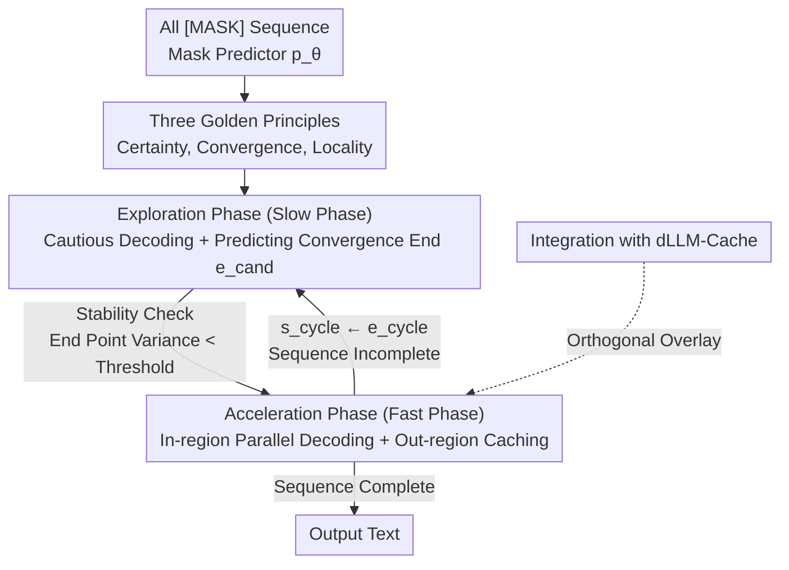

# Accelerating Diffusion Large Language Models with SlowFast Sampling: The Three Golden Principles

**Conference**: ICLR 2026  
**OpenReview**: [https://openreview.net/forum?id=Uh17FiwF4q](https://openreview.net/forum?id=Uh17FiwF4q)  
**Code**: https://github.com/LiangrunFlora/Slow-Fast-Sampling  
**Area**: LLM Efficiency / Diffusion Language Models / Inference Acceleration  
**Keywords**: Diffusion Language Models, Parallel Decoding, Sampling Acceleration, Confidence, Feature Caching

## TL;DR
Addressing the issue that existing sampling strategies for Diffusion Large Language Models (dLLMs) have a "fixed speed that does not adjust with generation states," this paper summarizes three empirical laws (Certainty, Convergence, Locality). Based on these, it designs SlowFast Sampling, which dynamically switches between "Slow Phase Exploration" and "Fast Phase Acceleration." It can be orthogonally combined with dLLM-Cache—achieving up to 15.63× acceleration on LLaDA for GPQA, and reaching 34.22× when integrated with cache, with almost no loss in accuracy.

## Background & Motivation

**Background**: Diffusion Large Language Models (dLLMs, such as LLaDA, Dream) represent a new alternative paradigm to autoregressive LLMs. Starting from an all-`[MASK]` sequence, an iterative denoising process is performed for $N$ steps using a mask predictor $p_\theta$. Each step can decode multiple tokens in **parallel**, unlike the strict one-by-one nature of autoregressive models, thus theoretically offering significantly lower inference latency for long sequences.

**Limitations of Prior Work**: However, existing sampling strategies fail to exploit this potential. Mainstream approaches fall into two categories: confidence-based selection (e.g., Fast-dLLM: decoding only tokens whose confidence exceeds a threshold) and semi-autoregressive decoding (cutting the sequence into fixed blocks and denoising block-by-block). They share a common flaw: **static behavior**, where the number of tokens decoded and their positions remain largely fixed throughout the generation. Any attempt to speed up via "aggressive multi-token decoding" leads to a noticeable drop in accuracy.

**Key Challenge**: The "aggressiveness" of sampling should vary with the generation state—some regions in the sequence are already clarified by the model (high confidence, stable) and can be decoded in one go; others remain ambiguous, where forced decoding leads to errors. Static strategies cannot distinguish between these two cases, resulting in either overall conservatism (slow) or overall aggressiveness (accuracy loss).

**Goal**: Design a dynamic sampler that can **intelligently decide how many tokens to decode per step and which positions in the sequence they occupy**, maintaining quality even at high parallelism.

**Key Insight**: The authors first perform empirical observations on the denoising trajectories of models like LLaDA and discover several stable laws in the evolution of token confidence—high-confidence tokens are often the final answer, confidence converges to a stable value over steps, and high-confidence tokens tend to cluster in regions rather than being randomly scattered. These laws provide criteria for "when it is safe to accelerate and which segment to accelerate."

**Core Idea**: Distill these three laws into "Three Golden Principles" and use them to cycle the sampling between a "Slow Phase" (cautiously exploring and identifying stable regions) and a "Fast Phase" (parallel decoding within stable regions and caching/reusing outside those regions).

## Method

### Overall Architecture

SlowFast Sampling decomposes a complete generation into several "Exploration → Acceleration" cycles, with each cycle processing a region starting from $s_{\text{cycle}}$. In the **Slow Phase (Exploration Phase)**, it cautiously decodes only a few tokens with the highest confidence while continuously predicting the convergence end $e_{\text{cand}}$, which indicates "how far it is safe to decode." A sliding window monitors whether this end has stabilized; once the variance of the end point falls below a threshold, the interval $[s_{\text{cycle}}, e_{\text{cycle}}]$ is identified as a stable zone, ending the slow phase. In the **Fast Phase (Acceleration Phase)**, all tokens within this stable zone that exceed a high-confidence threshold are decoded in parallel at once, while low-confidence tokens outside the zone utilize cached predictions for reuse. After a cycle, the starting point is updated to $s_{\text{cycle}} \leftarrow e_{\text{cycle}}$, initiating the next cycle until the full sequence is generated. The three golden principles guide the entire process: Certainty and Locality help "locate clusters for acceleration," and Convergence helps "determine if a region is stable."

### Key Designs

**1. Three Golden Principles: Quantifying "When to Accelerate and Where"**

This serves as the foundational observation addressed at the inefficiency of static sampling. Empirical analysis of denoising trajectories yields three rules: **Certainty Principle**—tokens with high $P_\theta(\hat r^{(k)}_{0,i}\mid c, y^{(k)})$ are highly likely to be the final correct result and rarely change in subsequent steps, thus deserving "acceptance" with minimal re-sampling; **Convergence Principle**—as the denoising step $k$ decreases, the predicted identity and confidence of a token fluctuate before converging to a stable value, signaling the model's consistent judgment; **Locality Principle**—high-confidence and early-converging tokens do not appear randomly but cluster in adjacent regions (likely due to local semantic dependencies). Together, these principles suggest that one-size-fits-all static sampling is inherently inefficient, and factors like "how much to decode," "selection criteria," and "location" should adapt as the sequence evolves.

**2. Exploration Phase (Slow Phase): Cautious Decoding while Identifying Stable Zones**

This step targets the pain point of "not knowing which segment is stable." From the current start $s_{\text{cycle}}$ to the sequence end $L$, the slow phase performs conservative updates—selecting the top-$k_{\text{slow}}$ tokens with the highest confidence within the window $[s_{\text{cycle}}, L]$. Simultaneously, the model predicts a **convergence end candidate** $e^{(k)}_{\text{cand}}$, the farthest position satisfying a minimum confidence threshold:

$$e^{(k)}_{\text{cand}} = \max\{\, i \mid i \in [s_{\text{cycle}}, L] \,\wedge\, P_\theta(\hat r^{(k)}_{0,i}\mid c, y^{(k)}) > \tau_{\min\_conf} \,\}$$

This represents how far the model can safely decode in the current step. A sliding window $H_W$ of length $W_{\text{hist}}$ collects recent candidate ends for a **stability check**: when the variance $\mathrm{Var}(H_W) < \sigma^2_{\text{stable}}$, the "decodable boundary" is considered stable, ending the slow phase at step $k_{\text{final}}$. The final cycle end $e_{\text{cycle}}$ is the mean of the candidate ends in the window. Essentially, the slow phase uses the Certainty Principle to select tokens, the Locality Principle to estimate boundaries, and the Convergence Principle (variance criterion) to confirm stability.

**3. Acceleration Phase (Fast Phase): Rapid Parallel Decoding and Caching**

Having obtained the stable zone $[s_{\text{cycle}}, e_{\text{cycle}}]$, the fast phase aims to complete this segment quickly while saving redundant computation. **In-region Parallel Decoding**: For all `[MASK]` positions within the zone where confidence exceeds a high-certainty threshold,

$$P_\theta(\hat r^{(k)}_{0,i}\mid c, y^{(k)}) > \tau_{\text{high\_conf}}$$

decoding is performed simultaneously in a single step, rather than incrementally—fully leveraging the Certainty Principle. **Out-region Caching**: For positions $i > e_{\text{cycle}}$ where confidence remains low, the predicted values $\hat r^{(k)}_{0,i}$ are cached and reused as long as they haven't entered the active decoding zone, avoiding repeated forward passes. **Fallback Mechanism**: If too few tokens meet the high threshold in the zone, it degrades to conservatively selecting top-$k_{\text{fast}}$ tokens to ensure progress. These three techniques together ensure speed and stability until the cycle advances the start to $e_{\text{cycle}}$.

**4. Integration with dLLM-Cache: Orthogonal Sampling and Feature Caching**

SlowFast optimizes the "sampling strategy itself" (decode order and parallelism), while dLLM-Cache optimizes "feature reuse" (caching intermediate representations to reduce forward computation). These operate on different dimensions and can thus be **directly combined**. Utilizing SlowFast with dLLM-Cache, with long-interval caching for prompts and short-interval caching for responses, further eliminates redundancy, boosting speedups from 15.63× to 34.22× on GPQA. This design value lies in placing "sampling acceleration" as an orthogonal module compatible with existing caching ecosystems.

## Key Experimental Results

Settings: Evaluated on LLaDA 8B and Dream 7B across 8 benchmarks (GSM8K, GPQA, Math, MMLU, MMLU-pro, BBH, MBPP, HumanEval). Hardware: RTX 4090. Metrics: TPS (Tokens Per Second) and task accuracy. Default hyperparameters: $\tau_{\min\_conf}=0.1$, $\tau_{\text{high\_conf}}=0.85$, $K_{\max}=8$, $W_{\text{hist}}=2$, $\sigma^2_{\text{stable}}=1.0$.

### Main Results: SlowFast Only (LLaDA 8B Subset)

| Task | Method | TPS | Gain | Accuracy |
|------|------|-----|--------|--------|
| GSM8K | LLaDA Original | 4.55 | 1.00× | 69.83 |
| GSM8K | + Fast-dLLM | 7.45 | 1.64× | 69.60 |
| GSM8K | + SlowFast | 14.57 | 3.20× | 69.59 |
| GPQA | LLaDA Original | 3.31 | 1.00× | 31.47 |
| GPQA | + SlowFast | 16.36 | 4.94× | 31.91 |
| BBH | LLaDA Original | 4.04 | 1.00× | 44.97 |
| BBH | + SlowFast | 21.19 | 5.24× | 44.60 |
| HumanEval | LLaDA Original | 11.24 | 1.00× | 31.71 |
| HumanEval | + SlowFast | 35.46 | 3.15× | 33.54 |

SlowFast achieves 2–5× acceleration across most tasks with nearly identical accuracy (mostly within ±1), significantly outperforming the parallel version of Fast-dLLM.

### Integrated dLLM-Cache + Extreme Acceleration Comparison

| Task/Comparison | Method | TPS | Gain | Accuracy |
|-----------|------|-----|--------|--------|
| GPQA (with Cache) | + SlowFast + Cache | 29.06 | 8.78× | 33.48 |
| BBH (Dream, with Cache) | + SlowFast + Cache | 70.20 | 10.13× | 48.24 |
| GPQA (Len=1024) | LLaDA + SlowFast | 25.00 | 15.63× | 31.47 |
| GPQA (Len=1024) | + SlowFast + Cache ($K_p{=}100,K_r{=}5$) | 48.80 | 30.50× | 30.13 |
| GPQA (Len=1024) | + SlowFast + Cache ($K_p{=}500,K_r{=}30$) | 54.75 | 34.22× | 28.79 |
| GPQA Ref. | LLaMA3 8B (AR) | 33.79 | — | 31.92 |

Notably, with caching, LLaDA's throughput (54.75 TPS) surpasses the autoregressive baseline LLaMA3 8B (33.79 TPS) while maintaining comparable accuracy, providing direct evidence that dLLMs with optimized sampling can exceed autoregressive throughput.

### Comparison of Sampling Strategies (GSM8K, LLaDA)

| Sampling Strategy | TPS | Accuracy |
|----------|-----|--------|
| Autoregressive (AR) | 5.25 | 60.80 |
| Diffusion Sampling | 4.55 | 69.83 |
| Semi-Autoregressive | 5.44 | 66.41 |
| SlowFast | 9.87 | 69.59 |

### Key Findings
- **Upper Bound of Speedup from Integration**: SlowFast alone reaches 15.63× on GPQA, but jumps to 34.22× with dLLM-Cache, indicating strong multiplicative gains between sampling and caching layers.
- **Cost of Aggressive Decoding**: As cache configurations become more aggressive (larger $K_p, K_r$), speed increases but accuracy drops (e.g., from 31.47 to 28.79), highlighting a speed-quality trade-off.
- **Stability Check Robustness**: $K_{\max}=8$ provides sufficient exploration for the convergence end; due to rapid stabilization, a small window $W_{\text{hist}}=2$ balances speed and quality; a strict variance threshold $\sigma^2_{\text{stable}}=1.0$ ensures the Fast Phase triggers only when truly stable.
- **Phased Roles**: Case studies show the Slow Phase identifies "anchors" (subjects/verbs/punctuation), while the Fast Phase outputs high-confidence long fragments (e.g., "she has 9 - 4 = 5 yuan left") at once.

## Highlights & Insights
- **Heuristic to Algorithm**: The paper distills empirical denoising observations into principles (Certainty → Token selection, Locality → Area estimation, Convergence → Stability criterion), making the algorithm grounded rather than arbitrary.
- **Variance as Switch**: Using sliding window variance of candidate ends $e_{\text{cand}}$ to detect stability is an elegant, lightweight, and interpretable signal for phase switching.
- **Orthogonal Value**: By not competing with caching for the same gains, SlowFast acts as a modular sampling improvement that multiplies with existing ecosystem solutions.
- **Challenging dLLM Latency Sterotypes**: The result that LLaDA+SlowFast+Cache can outperform LLaMA3 8B in throughput is a significant milestone for dLLMs as a practical inference path.

## Limitations & Future Work
- **Speed-Quality Trade-off**: Extreme acceleration leads to visible accuracy drops (GPQA 31.47→28.79). No automated mechanism is provided to select optimal configurations based on an accuracy budget.
- **Hyperparameter Dependency**: Thresholds like $\tau_{\min\_conf}$, $\tau_{\text{high\_conf}}$, and $\sigma^2_{\text{stable}}$ are globally fixed; optimal values likely vary by task or sequence length.
- **Generalization**: The principles were primarily observed on LLaDA and Dream. Whether they hold for larger scales or different training objectives remains to be fully verified.
- **Heuristic Locality**: Clustering is utilized for caching and decoding, but the "why" is speculative (semantic dependency). Efficiency could improve by replacing heuristics with learnable position predictors.

## Related Work & Insights
- **vs. Fast-dLLM (Confidence Parallelism)**: Fast-dLLM relies solely on thresholds for parallelism at a constant speed. SlowFast adds convergence and locality to dynamically determine stable zones.
- **vs. Semi-Autoregressive Decoding**: Semi-AR uses fixed block boundaries. SlowFast's stable zones $[s_{\text{cycle}}, e_{\text{cycle}}]$ are determined dynamically, adapting to actual high-confidence distributions.
- **vs. dLLM-Cache / dKV-Cache**: These optimize feature reuse. SlowFast optimizes the sampling dimension and is shown to be additive to these caching layers.

## Rating
- Novelty: ⭐⭐⭐⭐ Systematizing denoising laws into principles and applying them to dynamic phase switching is novel and self-consistent.
- Experimental Thoroughness: ⭐⭐⭐⭐ Covers various benchmarks and cache integration, though cross-model generalization and hyperparameter sensitivity could be deeper.
- Writing Quality: ⭐⭐⭐⭐ Clear logic from principles to method to experiments, with well-supported cases.
- Value: ⭐⭐⭐⭐⭐ Proving dLLM throughput can surpass AR baselines is of direct significance for dLLM practicality.

<!-- RELATED:START -->

## Related Papers

- [\[ICLR 2026\] NI Sampling: Accelerating Discrete Diffusion Sampling by Token Order Optimization](ni_sampling_accelerating_discrete_diffusion_sampling_by_token_order_optimization.md)
- [\[ICLR 2026\] Learning to Parallel: Accelerating Diffusion Large Language Models via Learnable Parallel Decoding](learning_to_parallel_accelerating_diffusion_large_language_models_via_learnable_.md)
- [\[ACL 2026\] CreditDecoding: Accelerating Parallel Decoding in Diffusion Large Language Models with Trace Credit](../../ACL2026/llm_efficiency/creditdecoding_accelerating_parallel_decoding_in_diffusion_large_language_models.md)
- [\[ICLR 2026\] Diffusion Language Models Know the Answer Before Decoding](diffusion_language_model_knows_the_answer_before_it_decodes.md)
- [\[ICLR 2026\] UltraLLaDA: Scaling the Context Length to 128K for Diffusion Large Language Models](ultrallada_scaling_the_context_length_to_128k_for_diffusion_large_language_model.md)

<!-- RELATED:END -->
