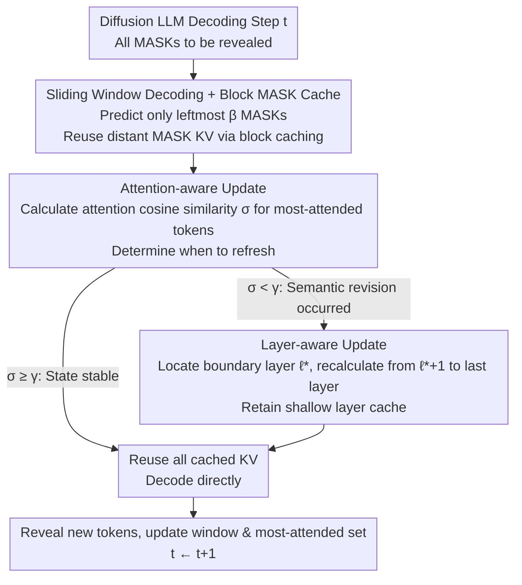

# Attention Is All You Need for KV Cache in Diffusion LLMs

**Conference**: ICLR 2026  
**OpenReview**: [https://openreview.net/forum?id=zkUbhdAiFJ](https://openreview.net/forum?id=zkUbhdAiFJ)  
**Project Page**: [https://vila-lab.github.io/elastic-cache-webpage/](https://vila-lab.github.io/elastic-cache-webpage/)  
**Code**: TBD  
**Area**: LLM Efficiency / Diffusion Language Models / KV Cache  
**Keywords**: Diffusion Language Models, KV Cache, Adaptive Caching, Attention Drift, Inference Acceleration

## TL;DR
To address the redundancy in Diffusion Language Models (DLMs) where all tokens and layer KV pairs are recalculated at every step, this paper proposes Elastic-Cache—a training-free and architecture-agnostic method. It uses the "attention drift of the most-attended tokens" to determine **when** to refresh the cache, leverages the "deep-layers-change-first" pattern to decide **from which layer** to refresh, and applies block-level caching for distant MASK tokens outside a sliding window. It achieves up to 45.1× decoding acceleration on models like LLaDA and Dream-7B with almost no drop in performance.

## Background & Motivation

**Background**: Diffusion Language Models (e.g., LLaDA, Dream-7B) generate text by "iterative denoising / gradually revealing MASKs." As an alternative to autoregressive Transformers, they support parallel decoding and flexible infilling, with quality approaching that of autoregressive models. However, each denoising step requires recalculating Q/K/V for **all tokens across all layers**, making inference extremely expensive.

**Limitations of Prior Work**: Autoregressive models reuse history via KV Cache because history K/V remain constant under causal attention ($K^{t-1}_{[1:t-1]}=K^{t}_{[1:t-1]}$). In contrast, DLMs use **bidirectional attention**, where newly revealed tokens at each step change the representations of all positions. This causes cached K/V to "expire," forcing naive implementations to perform full recalculations at every step.

**Key Challenge**: Existing acceleration methods (Fast-dLLM, dLLM-Cache, DeepCache) mostly use **fixed cycles** for refreshing (e.g., every $k$ steps), which is independent of instance difficulty, current attention states, or layer-wise differences. This leads to a double disadvantage: performing redundant computations when states are stable, and missing updates when semantic revisions are drastic. Furthermore, they treat all layers equally, even though shallow layers converge early while deep layers undergo constant global semantic adjustments.

**Key Insight**: The authors introduce **KV drift**—the change in cached K/V between adjacent steps—and observe three empirical laws: (1) Distant MASK tokens primarily serve as "length priors" and have minimal impact on current reveals; (2) KV drift increases with layer depth (shallow layers stabilize quickly, while deep layers continuously adjust global semantics); (3) **The most-attended tokens exhibit the smallest drift**, serving as a conservative lower bound for the drift of other tokens.

**Core Idea**: KV cache management is reformulated as an "attention-guided control problem"—where attention indicates token importance, drift indicates state changes, and the boundary layer $\ell^\star$ determines where updates become cost-effective, enabling adaptive, layer-wise, and on-demand cache refreshing.

## Method

### Overall Architecture

The goal of Elastic-Cache is to **adaptively decide when and where to recalculate KV** during each decoding step to maintain accuracy while reducing latency. It decomposes "full token/layer recalculation" into three orthogonal decisions: ① Spatially, a **sliding window** is used to predict only the leftmost $\beta$ MASKs, while KV pairs for distant MASK tokens outside the window use block-level cache reuse; ② Temporally, **attention-aware updates** monitor the attention drift of the most-attended tokens, triggering a refresh only when a threshold is exceeded; ③ Hierarchically, **layer-aware updates** recalculate only from the triggered boundary layer $\ell^\star$ to the deepest layer, reusing shallow layer caches as they are. Together, these align recalculation with the time and location where the model's belief actually changes.

### Key Designs

**1. Sliding Window Decoding + Block MASK Cache: Converting "Distant MASK Irrelevance" into Cachable Space**

Naive diffusion decoding computes attention over the entire sequence at each step. However, the authors observe from attention maps (Fig. 1a) that while adjacent MASK tokens within a sliding window strongly attend to each other, **distant MASK tokens receive almost no attention**—acting more like a "length prior." Based on this, the authors predict and compute attention only for the leftmost window $M^t_\beta = M^t_{[1:\beta]}$ of length $\beta$ at each step. The K/V values for MASK tokens outside this window are directly reused via block-level caching:

$$A^{t,l}_{[M^{t-1}_\beta]} = \mathrm{softmax}\!\left(\frac{Q^{t,l}_{[M^{t-1}_\beta]}(\tilde K^{t,l}_{[I]})^\top}{\sqrt{d_k}}\right)\tilde V^{t,l}_{[I]}$$

While similar to block-level decoding in Fast-dLLM, the key difference is that block-level decoding splits the sequence into fixed blocks and decodes them together, which can "falsely freeze" MASK tokens near block boundaries that still need updates. The sliding window moves smoothly from left to right, grouping truly interdependent neighboring MASKs for prediction, which reduces the loss from distant MASK caching, making the cache more aggressive yet safer.

**2. Attention-Aware KV Update: Using Most-Attended Token Drift as a Lightweight Refresh Trigger**

This is the core innovation—**automatically determining** if the cache should be refreshed. Directly comparing hidden states $H^{t,l+1}$ and $H^{t-1,l+1}$ is unreliable because errors are amplified by the deviation between cached values and ground truth. Instead, the authors track the "most-attended token" in each layer $\mathcal{T}^{t,l}=\arg\max_{k\in D_{<t}}\sum_{q\in M^t_\beta} S^{t,l}_{[q,k]}$ (the token with the highest cumulative attention among already decoded tokens). This choice is justified by two reasons: it has the greatest impact on prediction results, and (Fig. 1d) it exhibits the **smallest drift** among all cached tokens—so if even this token changes, others likely have as well, forming a conservative lower bound.

Specifically, the most-attended set $\mathcal{T}^{t-1}$ from the previous step is merged into the current window, and the cosine similarity of its attention weights across adjacent steps is calculated layer-wise:

$$\sigma^{t,l} = \frac{\lVert S^{t-1,l}_{[\mathcal{T}^{t-1}]}\cdot S^{t,l}_{[\mathcal{T}^{t-1}]\rVert}}{\lVert S^{t-1,l}_{[\mathcal{T}^{t-1}]}\rVert \cdot \lVert S^{t,l}_{[\mathcal{T}^{t-1}]}\rVert}$$

When $\sigma^{t,l}<\gamma$ for a layer, it signifies a "significant change in attention, with the cache deviating from ground truth," triggering a refresh; otherwise, reuse continues. Attention changes are used instead of KV changes because bidirectional attention is the source of KV changes—newly decoded tokens with high attention rewrite past attention outputs. Thus, attention drift and KV drift show highly consistent patterns (Fig. 1b/1c). Theorem A.9 in the appendix further proves that the KV drift of the most-attended token is bounded $\Delta^{t,\ell}_{\mathcal{T}^{t,\ell}}\le\bar\Delta^{t,\ell}+O(\sqrt{d_k}/R_\ell\sqrt{N})$, providing theoretical support. Higher $\gamma$ values increase refresh frequency and accuracy, while lower values save computation and increase speed.

**3. Layer-Aware KV Update: Exploiting "Deep Changes First" to Recalculate only from the Boundary Layer**

Since drift increases with layer depth (Fig. 1b), all layers should not be refreshed uniformly. Once the second design detects $\sigma^{t,l}<\gamma$ at a certain layer $l$, it is marked as the boundary layer $\ell^\star=l$. **K/V is then recalculated only for layers $\ell^\star+1$ to $L$**, while shallower layers ($l\le\ell^\star$, indicating convergence) continue to reuse the cache. Recalculation is re-initialized using the saved and updated hidden states $\tilde H^{t,l+1}_{[I]}$, overwriting the KV Cache as in the $t=0$ step:

$$Q^{t,l+1}_{[I]}, K^{t,l+1}_{[I]}, V^{t,l+1}_{[I]} = \mathrm{linear}(\tilde H^{t,l+1}_{[I]})$$

If all layers satisfy $\sigma^{t,l}\ge\gamma$, the cache is fully reused for that step without any recalculation. This concentrates compute precisely on the "deep layers where semantic revision actually occurs," avoiding waste on stable shallow layers—addressing the "over-serving shallow layers, under-serving deep layers" issue of fixed-period methods.

### Loss & Training
Elastic-Cache is a **training-free and architecture-agnostic** inference-stage strategy. it does not change the training objective or base structure and can be applied directly to pre-trained DLMs. Default hyperparameters: attention threshold $\gamma=0.9$, parallel decoding confidence $\epsilon=0.9$, cache block size 32; all experiments were conducted on a single A100 80GB.

## Key Experimental Results

### Main Results

Evaluated on LLaDA-Instruct / LLaDA-1.5 / Multi-modal LLaDA-V, covering math reasoning (GSM8K, MATH, MathVista, MathVerse) and code generation (HumanEval, MBPP), using lm-eval-harness; throughput is measured in tokens/sec. Representative results (throughput parentheses show relative speedup):

| Model / Task | Gen Length | Baseline acc / t/s | Fast-dLLM acc / t/s | Elastic-Cache acc / t/s |
|------|------|------|------|------|
| LLaDA-Inst GSM8K | 512 | 77.10 / 3.6 (1.0×) | 74.83 / 44.0 (12.3×) | **77.71 / 90.1 (25.2×)** |
| LLaDA-Inst MBPP | 512 | 15.0 / 4.7 (1.0×) | 13.6 / 44.7 (9.5×) | **15.6 / 63.0 (13.4×)** |
| LLaDA-1.5 GSM8K | 512 | 81.35 / 2.6 (1.0×) | 80.82 / 36.8 (14.1×) | 81.35 / **117.2 (45.1×)** |
| Dream-7B GSM8K | 512 | 76.0 / 7.9 (1.0×) | 74.1 / 45.9 (5.8×) | 75.6 / **169.4 (21.4×)** |
| Dream-7B HumanEval | 512 | 54.3 / 17.2 (1.0×) | 51.2 / 50.1 (2.9×) | **56.7 / 95.2 (5.5×)** |

Comparison with more KV cache methods (LLaDA-1.5, GSM8K 512 tokens):

| Method | Acc | Throughput t/s (Gain) |
|------|------|------|
| LLaDA-1.5 Baseline | 81.35 | 2.6 (1.0×) |
| dKV-Cache | 67.02 | 14.82 (5.7×) |
| dLLM-Cache | 80.97 | 16.84 (6.5×) |
| DeepCache (N=20) | 81.4 | 60.9 (23.4×) |
| **Elastic-Cache** | **83.7** | **139.4 (53.6×)** |

Compared to fixed scheduling methods, adaptive attention-aware caching provides **higher throughput while maintaining higher accuracy**: 53.6× speedup with accuracy exceeding the baseline. The authors also observed that throughput for Elastic-Cache **increases** with generation length, whereas Fast-dLLM decreases, thanks to the fixed sliding window and demand-based updates reducing dependence on sequence length.

### Ablation Study

| Configuration | Key Findings |
|------|---------|
| Threshold $\gamma$ | $\gamma\downarrow$ → Throughput↑ but Acc↓; optimal $\gamma$ is closer to 1.0 for high-precision models. |
| Sliding Window $\beta$ | $\beta\lesssim64$ yields Acc approaching No-Cache; excessive $\beta$ reduces cachable MASKs, increasing per-step compute. |
| Sliding Window vs Block | Sliding window significantly outperforms block-level for small blocks. |
| Cache Update Freq | Refresh frequency is only ~20% when $\gamma=0.95$. |

### Key Findings
- **Attention drift is a reliable and low-overhead trigger signal**: Even in extreme cases ($\gamma=0.95$), the refresh frequency only rises to about 20% of the baseline, proving that most steps do not require recalculation, confirming the waste in fixed-period methods.
- **Method efficiency scales with model accuracy**: Gains are larger on LLaDA-1.5 than LLaDA-Instruct, as accurate predictions correspond to cleaner attention scores with fewer outliers, making the drift signal smoother and more reliable.
- **Aggressive denoising scheduling yields larger relative speedups**: At 1 tok/step, it achieves 18.1× acceleration while surpassing baseline accuracy (82.6 vs 81.4).

## Highlights & Insights
- **Physical Observability of "When to Refresh"**: Converting cache refresh from a heuristic cycle into an observable physical quantity (cosine similarity of most-attended token drift) provides a grounded control signal supported by both empirical data (Fig 1d) and theoretical bounds (Theorem A.9). This is generalizable to any iterative generation paradigm requiring "staleness detection."
- **Orthogonal Decisions**: The three decisions—when (attention drift), where in layers (boundary layer $\ell^\star$), and where in sequence (sliding window + block MASK cache)—are decoupled yet complementary, making the system easy to understand and tune.
- **Training-free, Architecture-agnostic, Plug-and-play**: It requires no structural changes or retraining, making it highly deployment-friendly for existing DLMs. A single dial ($\gamma$) allows for a continuous speed-accuracy trade-off.

## Limitations & Future Work
- **Dependency on Prediction Quality**: The method's gains are maximized when the base model is accurate. For weak models or difficult tasks (noisy attention, many outliers), the drift signal becomes noisy, potentially reducing effectiveness.
- **Hyperparameter Sensitivity**: The optimal $\gamma$ drifts with model precision (approaching 1.0 for high-precision models); default values are not universally applicable. Excessive $\beta$ may also trigger premature EOS in LLaDA.
- **Verified only on Diffusion LLMs**: Whether core assumptions (KV drift under bidirectional attention, minimal drift of most-attended tokens) generalize to other iterative paradigms remains to be verified; Theorem A.9's error bounds rely on typical Transformer dimensionality assumptions.

## Related Work & Insights
- **vs Fast-dLLM (Block-level Dual Caching)**: It uses fixed blocks and uniform intra-block caching, which can falsely freeze MASK tokens needing updates, and throughput drops with sequence length. Ours uses sliding windows to cluster neighbors and attention-aware demand-based refreshes, achieving superior accuracy and throughput that scales better with length.
- **vs dKV-Cache / dLLM-Cache**: These target DLM caching but remain largely fixed-schedule, providing limited speedups (5–7×). Ours pushes this to dozens of times with better accuracy via adaptive triggering.
- **vs DeepCache (Fixed interval N)**: Fixed intervals ignore instance and layer variance. Ours provides dual-adaptive refreshing (attention drift + layer depth), achieving higher throughput (139.4 vs 60.9 t/s) at comparable accuracy.

## Rating
- Novelty: ⭐⭐⭐⭐⭐ First adaptive, layer-wise KV refresh strategy for DLMs with theoretical support for the attention drift trigger.
- Experimental Thoroughness: ⭐⭐⭐⭐⭐ Covers 3 base models + multi-modal + 6 benchmarks + multiple ablations, comparing against 5 caching methods.
- Writing Quality: ⭐⭐⭐⭐ Logical flow from 3 observations to 3 designs is clear; math-dense with heavy notation requiring coordination with the algorithm.
- Value: ⭐⭐⭐⭐⭐ Training-free plug-and-play with up to 45.1× speedup and negligible loss; significant for the practical adoption of Diffusion LLMs.

<!-- RELATED:START -->

## Related Papers

- [\[ICLR 2026\] Fast-dLLM: Training-free Acceleration of Diffusion LLM by Enabling KV Cache and Parallel Decoding](fast-dllm_training-free_acceleration_of_diffusion_llm_by_enabling_kv_cache_and_p.md)
- [\[NeurIPS 2025\] Tensor Product Attention Is All You Need](../../NeurIPS2025/llm_efficiency/tensor_product_attention_is_all_you_need.md)
- [\[ICLR 2026\] ReST-KV: Robust KV Cache Eviction with Layer-wise Output Reconstruction and Spatial-Temporal Smoothing](rest-kv_robust_kv_cache_eviction_with_layer-wise_output_reconstruction_and_spati.md)
- [\[ICLR 2026\] SparseD: Sparse Attention for Diffusion Language Models](sparsed_sparse_attention_for_diffusion_language_models.md)
- [\[ICLR 2026\] FlashDLM: Accelerating Diffusion Language Model Inference via Efficient KV Caching and Guided Diffusion](flashdlm_accelerating_diffusion_language_model_inference_via_efficient_kv_cachin.md)

<!-- RELATED:END -->
