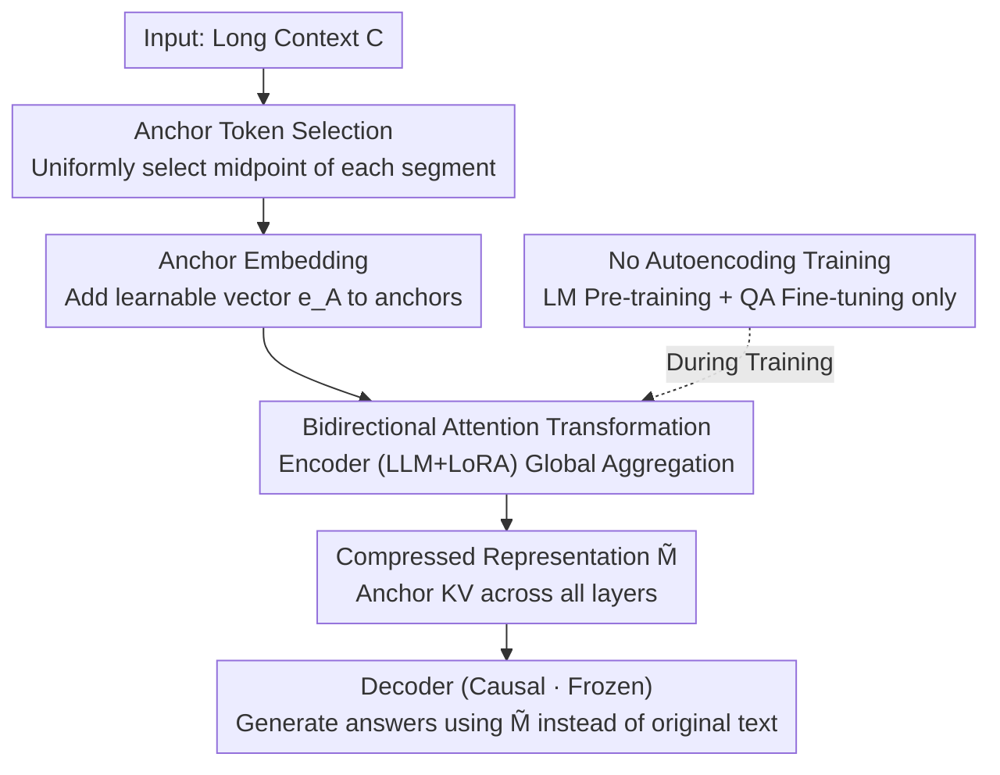

# Autoencoding-Free Context Compression for LLMs via Contextual Semantic Anchors

**Conference**: ICLR2026  
**OpenReview**: [https://openreview.net/forum?id=8Pi6Du0n7F](https://openreview.net/forum?id=8Pi6Du0n7F)  
**Code**: https://github.com/lx-Meteors/SAC  
**Area**: LLM Efficiency / Context Compression  
**Keywords**: Context Compression, Semantic Anchors, KV Representation, Bidirectional Attention, Autoencoding-free

## TL;DR
Instead of appending randomly initialized "compression tokens" and relying on autoencoding pre-training for context reconstruction like ICAE, SAC directly selects several "anchor tokens" from the original text. It adds a learnable anchor embedding to these tokens and employs bidirectional attention to aggregate global information into the anchors' KV caches. By completely discarding the autoencoding task, SAC consistently outperforms current compression methods in question answering and long-document summarization.

## Background & Motivation
**Background**: Feeding long contexts into LLMs is slow, expensive, and often triggers "lost-in-the-middle" issues. The mainstream approach to context compression involves appending a set of special "compression tokens" at the end of the context. Using the LLM's causal attention, global information is aggregated into these tokens to generate a compact representation $\tilde{M}$. Subsequently, the LLM generates responses based only on $\tilde{M}$ (instead of the original text), significantly saving inference time and VRAM.

**Limitations of Prior Work**: These compression tokens are **randomly initialized** and possess no inherent semantics. To enable them to "carry context," ICAE and its successors (500xCompressor, EPL, etc.) almost always require a round of expensive **autoencoding (AE) pre-training** to force $\tilde{M}$ to reconstruct the entire original text verbatim.

**Key Challenge**: The authors argue that the AE objective of "reconstructing the full text" is **misaligned** with what downstream tasks truly require (e.g., answering a question correctly from the compressed representation). AE forces the model to pack all tokens into a limited capacity, including many tokens irrelevant to downstream tasks that crowd out capacity for critical information. Furthermore, empirical tests show that the gradients of the AE loss and LM loss **rapidly become orthogonal** (cosine similarity approaches 0) after a brief alignment period early in training, causing the two tasks to interfere within the parameter space.

**Goal**: Is it possible to design an architecture with **inherent compression capabilities** to bypass this expensive and potentially harmful AE stage?

**Key Insight**: If the compression carriers are tokens selected from the original text that already possess semantics (rather than added blank tokens), they naturally carry semantic priors and do not need to learn "what they represent" from scratch via AE.

**Core Idea**: Replace "appending random compression tokens + autoencoding pre-training" with "selected semantic anchor tokens from the context + anchor embeddings + bidirectional attention" to compress the context into the anchors' KV representations.

## Method

### Overall Architecture
Context compression is formally defined as: An encoder $E$ compresses the context $C=(c_1,\dots,c_{|C|})$ into a compact representation $\tilde{M}=E(C)$. The target LLM then uses $\tilde{M}$ instead of the original context $C$ for tasks like QA. All modifications in SAC are concentrated on the encoder side: it **does not append any new tokens**. Instead, it selects a subset $S\subseteq C$ from the original text as "anchor tokens," adds a learnable anchor embedding $e_A$ as a marker to each anchor, and replaces the encoder's causal attention with bidirectional attention to allow anchors to see the entire context. Finally, the KV pairs of the anchors across all layers are taken as the compressed representation $\tilde{M}$. The encoder is an LLM with LoRA, while the target LLM (decoder) parameters remain frozen and use causal attention, directly taking $\tilde{M}$ as the KV cache for the context to generate answers. Training completely eliminates AE, using only LM pre-training and QA fine-tuning.

### Key Designs

**1. Anchor Token Selection: Providing Semantic Priors for Compression Carriers**

To bypass AE, the compression carriers must be "tokens with existing semantics in the original text" rather than randomly initialized blank tokens. SAC selects $|S|=\lfloor L/r\rfloor$ anchors from context $C$ ($r$ is compression ratio, $L$ is sub-context length), defaulting to the uniform strategy used in EPL: the context is divided into $|S|$ segments, and the middle token of each segment is selected to maximize coverage. Ablation shows that the selection strategy is critical: random selection leads to a significant performance drop (ID F1 falls from 63.63 to 59.54) due to a lack of semantic importance and poor coverage from scattered positions. Uniform selection performs similarly to selection based on Lingua-2 importance scores, suggesting that the SAC architecture "amplifies" any high-quality selection strategy rather than being tied to one—meaning SAC can work plug-and-play with existing token importance methods.

**2. Anchor Embedding: Learnable Markers for Compression Carriers**

Selecting original tokens is not enough—the model must know these tokens are acting as "compression carriers" rather than ordinary words. SAC adds a learnable anchor embedding $e_A$ to each selected anchor, resulting in the input embedding sequence:

$$e_i = \mathrm{Emb}(c_i) + \mathbb{1}_{c_i\in S}\cdot e_A$$

where $\mathbb{1}_{c_i\in S}$ is an indicator function (1 for anchors, 0 otherwise). This allows the model to distinguish anchors from ordinary tokens and clear targets for information aggregation. Compared to learning a set of compression tokens from scratch, reusing original tokens with a marker vector significantly improves learning efficiency. Removing the anchor embedding (w/o anchor) reduces the average ID F1 from 66.24 to 64.58, proving that this explicit structural signal guides the model in accurately identifying and processing anchors.

**3. Bidirectional Attention Transformation: Global Contextual Awareness for Anchors**

If the encoder uses causal attention, an anchor can only see the tokens preceding it, limiting its representational capacity—anchors at earlier positions would lack information from the later text. SAC transforms the encoder's causal attention **into bidirectional attention**, applied across **all tokens** (not just among anchors), allowing the model to capture richer global dependencies. Note that only the **encoder** is modified to be bidirectional; the decoder remains causal. This modification draws on findings from NV-Embed and LLM2Vec that removing unidirectional constraints enhances representation. Removing bidirectional attention (w/o mask) resulted in the largest performance drop (ID average F1 66.24 → 63.62), identifying it as the most critical component.

**4. Autoencoding-Free Training: Performance Gains by Removing AE**

With the previous three designs, the anchors already carry sufficient contextual semantics. Consequently, SAC uses **only the LM loss and entirely discards the AE loss** during the pre-training stage. In the fine-tuning stage, only the QA loss is used: $L_{QA}=-\log P(A|\tilde{M},Q)$. The authors explain why AE is harmful from two perspectives: Intuitively, AE forces the model to reconstruct all tokens within a limited capacity, wasting it on tokens useless for downstream tasks. Mechanistically, the gradient cosine similarity between AE and LM approaches 0 early in training; they are nearly orthogonal in parameter space, so AE optimization interferes with LM updates. The ablation (Table 5) is compelling—adding AE back (w/ AE only or w/ AE+LM) drags down performance; for instance, at 15× compression, the ID F1 drops from SAC's 54.95 to 49.93 with AE-only. This challenges the traditional assumption that AE is a prerequisite for context compression.

### Loss & Training
A two-stage training approach is used: first, pre-training on SlimPajama-6B with the LM objective for 20,000 steps, followed by fine-tuning on MRQA with the QA objective for 20,000 steps, both with a batch size of 16. Both the encoder and target LLM are Llama-3.2-1B, with LoRA applied to the encoder (rank=128, $\alpha$=256) and the target LLM frozen. Each sub-context is 510 tokens, and the number of anchors $|S|=\lfloor L/r\rfloor$ is determined by the compression ratio. The encoder reuses original KV caches, allowing the decoder to understand the compressed representation without additional semantic alignment.

## Key Experimental Results

### Main Results
Datasets used: SlimPajama-6B for pre-training, MRQA (including in-domain and out-of-domain sets) for QA, using ROUGE-1 F1 / EM metrics. The table below shows results at a 15× compression ratio compared against the strong baseline EPL and the weaker ICAE.

| Setting | Metric | SAC | EPL | ICAE | Relative Gain (vs ICAE/EPL) |
|------|------|-----|-----|------|------|
| In-domain Avg | F1 | **54.95** | 51.52 | 44.50 | Up to +23.5% / Min +6.7% |
| In-domain Avg | EM | **39.67** | 36.65 | 31.28 | Up to +26.8% / Min +8.2% |
| Out-of-domain Avg | F1 | **39.26** | 36.74 | 30.81 | Up to +27.4% / Min +6.9% |
| Out-of-domain Avg | EM | **26.02** | 23.83 | 20.18 | Up to +28.9% / Min +9.2% |

SAC outperforms all baselines on every ID/OOD sub-dataset and achieves the best average scores across 5×, 15×, and 51× compression ratios. Regarding scalability (Table 6), SAC consistently beats EPL when switching to Llama-3.2-3B and Llama-3.1-8B (3B: 50.48/34.73 vs 47.46/31.82; 8B: 52.31/35.93 vs 50.82/34.42), with gains not diminishing as the model size increases. Long-text summarization (QMSum/GovReport, 32K input, 15× compression) shows an average ROUGE-1 of 18.49, exceeding EPL’s 17.61, indicating that removing AE does not impair long-text modeling.

### Ablation Study

| Configuration | ID Avg F1/EM | OOD Avg F1/EM | Description |
|------|---------------|----------------|------|
| SAC (Full) | 66.24 / 53.11 | 48.45 / 32.19 | Full model |
| w/o mask | 63.62 / 50.35 | 45.11 / 30.16 | Largest drop; most critical component |
| w/o anchor | 64.58 / 51.56 | 47.65 / 31.99 | Significant drop |

(Note: The ablation table uses a subset average of TriviaQA+HotpotQA / BioASQ+TextbookQA, so absolute values differ slightly from the 15× main table.) AE Ablation (Table 5, 15×): Full SAC ID F1 54.95; adding AE-only drops to 49.93, and AE+LM drops to 51.73, both performing worse than without AE.

### Key Findings
- **Bidirectional Attention is the primary contributor**: Its removal causes the steepest performance decline, proving that "whether anchors can aggregate global information" determines compression quality.
- **AE is not only unnecessary but harmful**: Gradient visualization shows that AE and LM gradients rapidly become orthogonal, providing mechanistic evidence that AE hinders downstream performance.
- **Representation Space Analysis**: t-SNE shows that SAC's anchor KVs are closest to and uniformly mixed with original token KVs in key/value space, whereas 500xCompressor's compression tokens form a distinct cluster. Embedding anchors directly in the text keeps their representation semantically aligned with the context.
- **Sharper Attention Focus**: At high compression ratios, SAC anchors maintain clear local diagonal attention, focusing only on a few critical tokens, whereas attention in EPL/500x tends to become diffuse.

## Highlights & Insights
- **"Carrier with Inherent Semantics" is a simplifying insight**: Shifting from "creating random tokens and teaching them to hold information" to "requisitioning existing meaningful tokens" eliminates the entire AE pre-training stage, saving compute and reducing potential failure points.
- **Empirical Proof of AE Harm through Gradient Orthogonality**: While many works assume AE is mandatory for context compression, SAC uses the visualization of near-zero cosine similarity between AE and LM gradients to ground the "task misalignment" intuition into a mechanistic proof.
- **Orthogonal to Token Selection Methods**: SAC essentially combines "token selection" with "compression token training" and can plug-in any high-quality selection strategy (like Lingua-2).
- **Reusable Trick**: The "Asymmetric Encoder-Decoder" configuration (bidirectional encoder, causal decoder) could be transferred to other compression or retrieval scenarios requiring global representation but autoregressive generation.

## Limitations & Future Work
- **Narrow Task Scope**: Main experiments focus on MRQA and two summarization sets, without covering multi-turn dialogue, RAG, or code, where generalization remains to be verified.
- **Dependency on Anchor Selection**: Random selection causes significant drops, indicating that SAC's performance is still sensitive to "which tokens are selected as anchors."
- **Training Still Required**: Although AE is removed, LM pre-training and QA fine-tuning (20k steps each) with LoRA are still necessary; it is not a zero-shot method.
- **Same-Model Constraint**: The encoder and decoder must use the same LLM (to avoid semantic gaps), limiting flexibility for cross-model or heterogeneous deployment.

## Related Work & Insights
- **vs ICAE**: ICAE appends random compression tokens and uses joint AE+LM pre-training; SAC uses original tokens as anchors and removes AE. SAC outperforms ICAE across all datasets (15× ID F1 +6.7%~23.5%).
- **vs 500xCompressor**: 500x uses KV caches across all layers to increase compression ratios, but its tokens form clusters in representation space with diffuse attention. SAC also uses KV caches but maintains semantic alignment and focused attention.
- **vs EPL**: EPL aligns representations by distributing position IDs of compression tokens (sharing RoPE angles with original text). SAC can be seen as an enhancement over EPL by using anchors and removing AE.
- **vs LLMLingua-2 (Hard Compression/Token Selection)**: These methods delete tokens via small models based on entropy. They prove representational tokens suffice but do not train for availability; SAC combines selection with training to make anchors more "usable" for the target LLM.

## Rating
- Novelty: ⭐⭐⭐⭐⭐ 
- Experimental Thoroughness: ⭐⭐⭐⭐ 
- Writing Quality: ⭐⭐⭐⭐ 
- Value: ⭐⭐⭐⭐ 

<!-- RELATED:START -->

## Related Papers

- [\[ICLR 2026\] RMAAT: Astrocyte-Inspired Memory Compression and Replay for Efficient Long-Context Transformers](rmaat_astrocyte-inspired_memory_compression_and_replay_for_efficient_long-contex.md)
- [\[ICLR 2026\] Command-V: Training-Free Representation Finetuning Transfer](command-v_training-free_representation_finetuning_transfer.md)
- [\[ICML 2026\] Proxy Compression for Language Modeling](../../ICML2026/llm_efficiency/proxy_compression_for_language_modeling.md)
- [\[ACL 2026\] RACER: Retrieval-Augmented Contextual Rapid Speculative Decoding](../../ACL2026/llm_efficiency/racer_retrieval-augmented_contextual_rapid_speculative_decoding.md)
- [\[ICLR 2026\] Extending the Context of Pretrained LLMs by Dropping Their Positional Embedding](extending_the_context_of_pretrained_llms_by_dropping_their_positional_embedding.md)

<!-- RELATED:END -->
