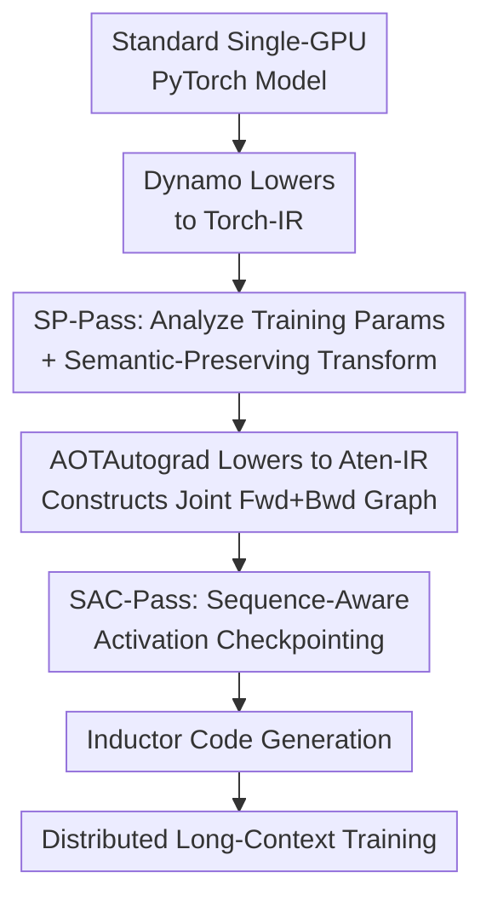

# AutoSP: Unlocking Long-Context LLM Training Via Compiler-Based Sequence Parallelism

**Conference**: ICLR 2026  
**OpenReview**: [https://openreview.net/forum?id=0fgsHvmBBI](https://openreview.net/forum?id=0fgsHvmBBI)  
**Code**: Committed to open source (the paper states code and benchmarks will be public; no link yet), implementation integrated into the DeepSpeed project  
**Area**: LLM Efficiency / Long-Context Training / Compilers  
**Keywords**: Sequence Parallelism, Long-Context Training, PyTorch-2.0 Compiler, Activation Checkpointing, DeepSpeed-Ulysses

## TL;DR
AutoSP elevates Sequence Parallelism (SP) from manual, framework-coupled operators to two specialized passes within the PyTorch-2.0 compiler stack: an SP-Pass on Torch-IR that automatically inserts communication and resizes activation buffers, and a Sequence-Aware Checkpointing (SAC-Pass) on the joint Aten-IR graph that relaxes min-cut constraints to recompute compute-intensive operators. This allows users to compile single-GPU models into distributed long-context training pipelines with a few lines of code, extending trainable sequence lengths by up to 2.7× on NVIDIA and 2.5× on AMD with near-zero throughput loss.

## Background & Motivation
**Background**: LLMs are increasingly trained on long-context data (document understanding, multi-step reasoning, multi-turn dialogue), where inputs often reach tens or hundreds of thousands of tokens, causing activation memory to explode and leading to OOM on single GPUs. To bypass OOM, the community proposed Sequence Parallelism (SP): partitioning activations along the sequence dimension across multiple GPUs to aggregate memory. Representative solutions include DeepSpeed-Ulysses (using all-to-all to switch activation layouts at attention boundaries) and RingAttention (ring-based K/V exchange).

**Limitations of Prior Work**: Existing SP implementations are entirely manual in eager mode and strongly coupled with specialized frameworks like DeepSpeed or Megatron-LM. Integrating SP into a new training pipeline requires intrusive code changes: manual insertion of `all2all` communication primitives between operators requiring full sequences (like attention), managing cross-device activation layouts, and ensuring correctness for both forward and backward passes. This requires deep system expertise, slows down research productivity, and limits portability across model architectures and hardware.

**Key Challenge**: Meanwhile, the industry has begun "lifting" distributed strategies like ZeRO-3/FSDP into the PyTorch-2.0 compiler (e.g., SimpleFSDP, DeepCompile) to automate manual tasks via compiler passes. However, these works focus only on **how to shard model parameters** for large-scale models; **none** are specifically optimized for long-context training. Consequently, a natural question arises: can SP also be lifted into the deep learning compiler stack to achieve automated sequence parallelism?

**Goal**: To implement SP as native PyTorch-2.0 compiler passes, enabling users to automatically obtain distributed long-context training capabilities by writing standard single-GPU PyTorch models with a few registration lines. This requires overcoming three specific challenges: (1) PyTorch-2.0 has multi-layered intermediate representations (Torch-IR, Aten-IR, Inductor-IR) with varying granularities; selecting the layer for "extracting model information and performing semantic-preserving rewrites" is critical. (2) Inferring "sequence-length-dependent tensor shapes" within a compiler is difficult during the lowering process, as operators like transpositions frequently change the sequence axis. AutoSP must distinguish which tensors (e.g., tokens, position IDs) should be resized and which (e.g., attention masks) should not. (3) Compressing SP into the compiler stack conflicts with PyTorch's native Activation Checkpointing (AC) pass, as naive combinations trigger redundant communication in the backward pass, hurting performance.

**Core Idea**: The authors use a compiler "analyze-and-rewrite" framework to automate SP. They perform program analysis and semantic-preserving transformations (automatic communication insertion, buffer resizing, and manual index recomputation) on **Torch-IR**, which is closest to the user's neural network semantics. This is paired with a **Sequence-Aware Checkpointing** strategy based on the observation that the FLOPs proportion of linear projections/MLPs in long-context scenarios decays at $O(1/s)$ as sequence length increases. By allowing the recomputation of traditionally "forbidden" compute-intensive operators, the system achieves massive memory gains at minimal throughput cost.

## Method

### Overall Architecture
AutoSP integrates sequence parallelism as a set of compiler passes into the PyTorch-2.0 stack. Users write standard single-GPU PyTorch models and only need to register the `auto_sp` and `sp_ac` passes, initialize the distributed environment, and call `model.compile()`. During the training loop, the batch is simply partitioned according to the SP group size—all cross-device layout management, communication primitive insertion, and forward/backward correctness are handled by the compiler.

The pipeline interfaces with the PyTorch-2.0 lowering process in two stages: Dynamo first traces the model into a Torch-IR graph, where the **SP-Pass** performs analysis and transformation. Subsequently, AOTAutograd lowers Torch-IR further to the finer-grained Aten-IR to construct a joint forward-backward graph, where the **SAC-Pass** rewrites the AC network flow to decide which activations to recompute. Finally, Inductor consumes the Aten-IR to generate backend kernels.

### Key Designs

**1. SP-Pass: Analysis and Semantic-Preserving Transformation on Torch-IR**

This is the core of AutoSP's automated sequence parallelism. The primary difficulty lies in selecting the IR layer. AutoSP chooses **Torch-IR** over the finer Aten-IR for three reasons: (1) Torch-IR is closer to the user-defined network; operators remain high-level concepts like `linear` or `attention`, making it easy to determine which part of the graph belongs to a specific layer and how to resize it. (2) Lowering from Torch-IR to Aten-IR inserts layout transformations (reshape, permute) that blur information about which dimension corresponds to sequence, batch, or hidden size. (3) Torch-IR only describes the forward pass, making transformations simpler—one only needs to register the corresponding backward gradient operators for newly added nodes.

The pass follows two steps. **Analysis**: To correctly instantiate communication token-buffers, the system must obtain batch, sequence, and hidden dimensions, which are not explicitly present in the IR. AutoSP inspects the input nodes of the computational graph to determine the batch and sequence lengths (e.g., `[batch, seq_len]` in NLP). It then traverses the graph to the first attention operator to inspect the output's last two dimensions `[num_heads, head_dim]`, the product of which is the model dimension. **Transformation**: Given $b, s, h, d$, the pass traverses the graph and performs three actions for each node: (1) If it belongs to the `RESIZE_BUFS` set, it resizes buffers based on whether it is in an attention or MLP layer (e.g., in Ulysses, attention operators are resized to `[b, s, h/WS, d]`, while MLP operators are resized to `[b, s/WS, d]`, where WS is world size). (2) If it belongs to `INDEX_OPS` (e.g., manual indexing for causal masks), it recalculates indices to match the new shapes. (3) If it is the first or last operator of an attention layer, it inserts `all-to-all` primitives with appropriately sized buffers.

**2. SAC-Pass: Sequence-Aware Activation Checkpointing by Relaxing Min-Cut Constraints**

While SP helps, Activation Checkpointing (AC) is also vital for saving memory in long-context training. However, PyTorch's native AC pass performs poorly when combined with SP. PyTorch's AC pass works on Aten-IR and models the selection of recomputable activations as a network flow problem: it constructs a joint forward-backward graph where the source connects to input tensors and the sink connects to gradient-reachable nodes. It then finds a **min-cut** to determine which activations to store.

The issue is that PyTorch-2.0 is too conservative: it forbids the recomputation of many compute-intensive operators (mat-mul, scaled mat-mul, etc.) by connecting source-to-operator edges with $\infty$ capacity, forcing these nodes to be stored. AutoSP observes that for long sequences, this rule is sub-optimal. For a transformer with hidden dimension $d$ and sequence length $s$, the FLOPs for attention scale as $O(s^2)$, while linear projections and MLPs scale as $O(s)$. As $s \to \infty$, the proportion of computation for linear projections and MLPs decays:

$$\frac{8bhsd^2 + 4bhsd_{ffn}d}{2bhs^2d + 8bhsd^2 + 4bhsd_{ffn}d} \approx O\!\left(\frac{1}{s}\right), \quad s \to \infty$$

Thus, as sequences lengthen, the cost of recomputing these "compute-intensive" operators becomes negligible. The SAC-Pass rewrites the joint graph to remove the $\infty$ capacity constraints on these operators, allowing the AC solver to recompute them. This exchange of minimal throughput for significant memory gains is a major driver of AutoSP's superior performance compared to manual SP.

## Key Experimental Results

### Main Results
Evaluated on NVIDIA GH200 (96GB) / A100 (80GB) and AMD MI250 (64GB) using PyTorch-2.7. Models include Llama-3.2 (1B/3B), Llama-3.1 (8B), and Llama-2 (13B). Baselines: ZeRO-3 (FSDP) under `torch.compile`, and Inductor-compiled manual DS-Ulysses and RingAttention. The primary metric is **trainability**—the maximum sequence length before OOM.

| Comparison (8×A100) | 3B | 8B | 13B |
|---|---|---|---|
| AutoSP vs. ZeRO-3 (FSDP) | 5× | 5.6× | 2.5× |
| AutoSP vs. DS-Ulysses | 2.14× | 3× | 1.88× |
| AutoSP vs. RingAttention | 2.14× | 3× | 1.6× |

**Portability**: On NVIDIA GH200, AutoSP achieves 1.58×/2.70× longer sequences for 1B/3B models. On AMD MI250, it achieves 2×/2.5×.  
**Throughput**: In overlapping sequence lengths, AutoSP maintains ~97% (NVIDIA) and 87-97% (AMD) of the throughput of the highly optimized manual Inductor baseline while providing up to 2.7× trainability gains.

### Ablation Study
Llama-3.1 1B, itemized optimization (Table 1):

| Configuration | Max Tokens | Step Time (s) | Description |
|---|---|---|---|
| DS-Ulysses (Manual Baseline) | 81,000 | 1.06 | Highly optimized manual SP |
| AutoSP (SP-Pass Only) | 77,000 | 1.09 | Generic pass achieves 97% baseline speed |
| AutoSP (SP + SAC-Pass) | 128,000 | 1.19 | SAC adds 1.66× trainability over SP |

**Operator Breakdown**: AutoSP reduces attention operator activation memory by 13.03× and MLP memory by 2.22×. The cost is a 1.14× overhead in the backward pass, while the forward pass remains nearly identical.

### Key Findings
- **SAC-Pass is the differentiator**: Without SAC-Pass, AutoSP is slightly below the manual DS-Ulysses baseline (77k vs 81k). Adding SAC pushes it to 128k, proving that the $O(1/s)$ observation is the key to exceeding manual implementations.
- **Model Size Scaling**: Gains are most significant for 8B models. For 13B models, the gain decreases as optimizer states consume roughly 50% of memory, leaving less room for activation optimization.
- **Ulysses vs. Ring**: DS-Ulysses is faster because RingAttention requires $p$-step (where $p$ is SP size) ring communication, whereas Ulysses uses a single efficient `all-to-all`.

## Highlights & Insights
- **Systems Optimization as Compiler Passes**: AutoSP transforms sequence parallelism from a "dirty" manual task into a native compiler pass, shifting the paradigm of expert knowledge into the compiler stack for better portability across NVIDIA and AMD.
- **IR Design Choice**: The decision to use Torch-IR for analysis (semantic layer identification) and Aten-IR for AC decisions (joint graph rewriting) demonstrates a sophisticated understanding of compiler abstractions.
- **The $O(1/s)$ Insight**: This mathematical observation changes the recomputation strategy from "operator-type-based" to "workload-characteristic-based," relaxing conservative constraints to achieve order-of-magnitude memory savings.

## Limitations & Future Work
- **Manual Sets**: The `RESIZE_BUFS` and `ATTN_OPS` sets are currently curated by analyzing Transformer FX graphs; automation for non-standard architectures is not yet 100%.
- **Single SP Strategy**: The current implementation primarily "lifts" the Ulysses strategy. Future work could explore RingAttention or hybrid SP+TP/PP configurations.
- **Optimizer State Dominance**: For very large models (e.g., >13B), optimizer states dominate memory. Deep integration with ZeRO-3 is needed to simultaneously optimize parameters and activations.

## Related Work & Insights
- **Comparison to FSDP/TP/PP**: While standard parallelisms shard parameters or layers, they do not explicitly target sequence length scaling. AutoSP is orthogonal and complementary to these.
- **Comparison to XLA/GSPMD**: Unlike GSPMD, which requires user annotations, AutoSP is fully automated within the PyTorch-2.0 native stack.
- **Comparison to Traditional AC**: Traditional AC uses static block partitioning or ILP search. SAC-Pass bypasses the need for manual intervention by using sequence-aware heuristics directly in the compiler's flow solver.

## Rating
- **Novelty**: ⭐⭐⭐⭐⭐ First to lift SP to a native PyTorch-2.0 pass with the $O(1/s)$ recomputational insight.
- **Experimental Thoroughness**: ⭐⭐⭐⭐ Solid cross-platform coverage; however, it lacks comparisons with more complex parallel hybrid configurations.
- **Writing Quality**: ⭐⭐⭐⭐ Clear progression from challenges to solutions; intuitive IR and flow diagrams.
- **Value**: ⭐⭐⭐⭐⭐ Directly addresses the engineering bottleneck of long-context training with a high-performance, portable solution.

<!-- RELATED:START -->

## Related Papers

- [\[ICLR 2026\] Long-Context Attention Benchmark: From Kernel Efficiency to Distributed Context Parallelism](long-context_attention_benchmark_from_kernel_efficiency_to_distributed_context_p.md)
- [\[ICLR 2026\] ParaRNN: Unlocking Parallel Training of Nonlinear RNNs for Large Language Models](pararnn_unlocking_parallel_training_of_nonlinear_rnns_for_large_language_models.md)
- [\[ICLR 2026\] EntropyLong: Effective Long-Context Training via Predictive Uncertainty](entropylong_effective_long-context_training_via_predictive_uncertainty.md)
- [\[ICLR 2026\] SoLoPO: Unlocking Long-Context Capabilities in LLMs via Short-to-Long Preference Optimization](solopo_unlocking_long-context_capabilities_in_llms_via_short-to-long_preference_.md)
- [\[ICLR 2026\] Unlocking Full Efficiency of Token Filtering in Large Language Model Training](unlocking_full_efficiency_of_token_filtering_in_large_language_model_training.md)

<!-- RELATED:END -->
