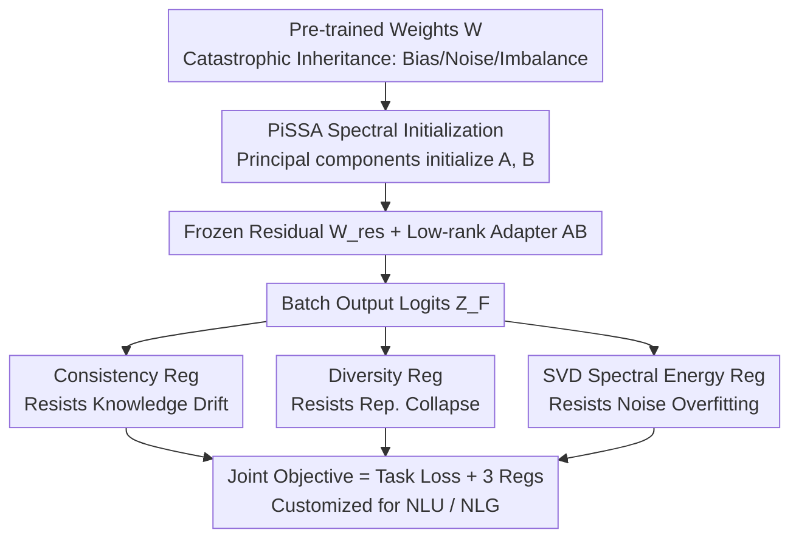

# BA-LoRA: Bias-Alleviating Low-Rank Adaptation to Mitigate Catastrophic Inheritance in Large Language Models

**Conference**: ICLR2026  
**OpenReview**: [https://openreview.net/forum?id=q0X9SiXiRO](https://openreview.net/forum?id=q0X9SiXiRO)  
**Code**: To be confirmed  
**Area**: LLM Efficiency / Parameter-Efficient Fine-Tuning (PEFT)  
**Keywords**: LoRA, Parameter-Efficient Fine-Tuning, Catastrophic Inheritance, Bias Alleviation, Output Space Regularization

## TL;DR
BA-LoRA superimposes three **output space regularizations**—consistency, diversity, and SVD—onto the PiSSA spectral-initialized LoRA framework. These specifically address knowledge drift, representation collapse, and noise overfitting caused by the amplification of pre-training biases during fine-tuning. It consistently outperforms numerous LoRA variants on both NLG and NLU tasks, showing greater gains on noisier pre-trained models.

## Background & Motivation

**Background**: Adapting Large Language Models to downstream tasks via Parameter-Efficient Fine-Tuning (PEFT) has become the de facto standard. LoRA utilizes low-rank matrices $\Delta W = AB$ ($A\in\mathbb{R}^{m\times r}$, $B\in\mathbb{R}^{r\times n}$, rank $r\ll\min(m,n)$) to approximate weight updates. By freezing the original weights $W$ and only training $A$ and $B$, the forward pass becomes $Y=X(W+AB)$, saving memory and facilitating deployment. PiSSA further uses the principal singular components of $W$ to initialize $A$ and $B$, accelerating convergence.

**Limitations of Prior Work**: Pre-training corpora consist of web-scale "dirty" data, causing models to inherit biases, noise, and long-tail imbalances—a phenomenon termed "Catastrophic Inheritance." Unfortunately, methods like LoRA restrict updates to a low-rank bottleneck, which lacks sufficient degrees of freedom to correct these inherited defects. Instead, they may **amplify** spurious correlations from pre-training on noisy or imbalanced data, further deteriorating fairness and robustness.

**Key Challenge**: There is an inherent tension between the efficiency of low-rank updates and their tendency to lack the freedom to offset inherited biases, or even amplify them. Rapid convergence (as in PiSSA) does not necessarily imply the learning of robust signals; it may simply reflect faster fitting of noise.

**Goal**: To deconstruct "Catastrophic Inheritance" into three targetable sub-problems: **Knowledge Drift** (forgetting robust pre-training knowledge while learning new tasks), **Representation Collapse** (decreased output diversity on imbalanced data, collapsing toward dominant classes), and **Noise Overfitting** (learning high-frequency spurious correlations unrelated to labels).

**Key Insight**: Rather than constraining the **weights** of the low-rank adapter, it is more effective to regularize the **output space** of the model (the batch logits matrix) to shape functional behavior. The authors observe that knowledge can be preserved by aligning with a pre-trained teacher, diversity can be maintained by decorrelating logits, and noise can be suppressed by concentrating spectral energy into principal singular components.

**Core Idea**: Building upon PiSSA initialization, three output-space regularization terms (consistency, diversity, and SVD-based) are appended to the task loss. Each term targets a specific failure mode, with implementations customized for NLU and NLG tasks.

## Method

### Overall Architecture
The overall architecture of BA-LoRA retains the low-rank adaptation backbone: the pre-trained weights $W$ are decomposed via SVD following PiSSA, with principal components initializing trainable $A$ and $B$. The remaining components are placed into a **frozen residual matrix** $W_{res}=U_{[:,r:]}S_{[r:,r:]}V_{[:,r:]}^\top$, ensuring $W=W_{res}+AB$ at the start of training to preserve pre-training capabilities. The primary novelty lies in the training objective: in addition to standard task loss, three regularization terms are calculated on the batch output logits $Z_F$ to suppress knowledge drift, representation collapse, and noise overfitting. Since NLU (classification with small $D$) and NLG (autoregressive with large $|V|$) differ significantly in output structure, the three regularizers take different computational forms for each task type.

### Key Designs

**1. PiSSA Spectral Initialization: Starting on the Principal Directions**

This step addresses the issue where random initialization of low-rank updates deviates from pre-training capabilities and slows convergence. BA-LoRA follows PiSSA: $W=USV^\top$ is partitioned by rank $r$. The adapter is initialized as $A=U_{[:,:r]}S_{[:r,:r]}^{1/2}$ and $B=S_{[:r,:r]}^{1/2}V_{[:,:r]}^\top$, while $W_{res}$ is frozen. Thus, fine-tuning begins by aligning updates with the highest-energy singular directions. While this preserves capacity and speeds convergence, it also necessitates the subsequent output space regularizations to prevent these principal directions from amplifying noise.

**2. Consistency Regularization: Anchoring Knowledge with a Pre-trained Teacher**

To combat knowledge drift, the authors use a knowledge distillation approach to align the fine-tuned "student" model's output distribution with the **pre-trained teacher**. Given batch logits $Z_P$ and $Z_F$ for the pre-trained and fine-tuned models respectively, the KL divergence is computed after softening the distributions with temperature $T$:

$$\mathcal{L}_{CR\_NLU} = T^2 \cdot \mathrm{KL}\big(\mathrm{softmax}(Z_P/T)\;\|\;\mathrm{softmax}(Z_F/T)\big)$$

$T^2$ is used to scale gradients back to levels comparable to standard cross-entropy. The NLG version generalizes this to the token level, averaging the KL divergence across $M$ valid (non-padding) tokens in a sequence. This forces the student to mimic the teacher's decision-making on samples/tokens where the teacher signal is reliable, thereby "pinning" fundamental knowledge.

**3. Diversity Regularization: Decorrelating Logits to Prevent Representation Collapse**

To address representation collapse caused by imbalanced data, NLU tasks compute the $D\times D$ covariance matrix $C(Z_F)=\frac{1}{N-1}Z_{centered}^\top Z_{centered}$ of batch logits and penalize its **off-diagonal elements**:

$$\mathcal{L}_{DR\_NLU} = \frac{1}{D}\sum_{i\neq j}[C(Z_F)]_{i,j}^2$$

This prevents excessive correlation between predictions of different classes. In NLG, maximizing the entropy of the entire vocabulary would conflict with generating coherent text. Instead, **constrained entropy regularization** is applied within the Top-K candidate set $V_{top\text{-}K}$, maximizing entropy (minimizing negative entropy) for re-normalized candidate probabilities $P'_F(v|h_i)$ to encourage diversity among the most likely candidates.

**4. SVD Spectral Energy Regularization: Concentrating Energy to Resist Noise**

To mitigate noise overfitting, the authors posit that principal singular values capture the most significant data patterns. They apply SVD to the batch logits matrix and encourage spectral energy to concentrate in the top $k$ singular values. In NLU, where the number of classes is moderate, exact SVD cost is negligible:

$$\mathcal{L}_{SVDR\_NLU} = -\frac{\sum_{i=1}^k \sigma_i}{\sum_{j=1}^{\min(N,D)} \sigma_j}$$

In NLG, where $|V|$ is massive, **randomized SVD** is used to approximate singular values $\tilde\sigma_i$, normalized by the Frobenius norm to avoid full spectral computation: $\mathcal{L}_{SVDR\_NLG} = -\frac{\sum_{i=1}^k \tilde\sigma_i}{\|Z_{valid}\|_F}$. The intuition is to force the model to form simpler, more coherent decision boundaries.

### Loss & Training
The joint objective is a weighted sum of the task loss and the three regularizers. For NLU:

$$\mathcal{L}_{NLU} = \mathcal{L}_{task\_NLU} + \lambda_1\mathcal{L}_{CR\_NLU} + \lambda_2\mathcal{L}_{DR\_NLU} + \lambda_3\mathcal{L}_{SVDR\_NLU}$$

The NLG objective is isomorphic, with $\mathcal{L}_{task}$ replaced by causal language modeling loss. hyperparameters: For NLG, $\lambda_1=0.025, \lambda_2=0.005, \lambda_3=0.005$ with $k=10$. For NLU, $\lambda_1=0.15, \lambda_2=0.03, \lambda_3=0.03$ with $k=5$.

## Key Experimental Results

### Main Results

NLG (LLaMA-2-7B, 100K data, single epoch; Accuracy for GSM8K/MATH, Pass@1 for HumanEval/MBPP, GPT-4 first-turn score for MT-Bench):

| Method | GSM8K | MATH | HumanEval | MBPP | MT-Bench | Avg |
|------|------|------|-----------|------|----------|-----|
| Full FT | 48.9 | 7.48 | 20.52 | 23.64 | 4.85 | 21.08 |
| LoRA | 42.68 | 5.92 | 16.80 | 21.51 | 4.60 | 18.30 |
| PiSSA | 51.48 | 7.60 | 19.48 | 23.84 | 4.92 | 21.46 |
| CorDA++ | 55.03 | 8.95 | 21.76 | 24.74 | **5.64** | 23.22 |
| **BA-LoRA** | **55.86** | **9.47** | **23.58** | **36.86** | 5.11 | **26.18** |

BA-LoRA achieves an average of 26.18, outperforming CorDA++ by **2.96** points. The largest single gain is on MBPP (36.86 vs 24.74), suggesting that output space regularization is particularly effective in code generation scenarios with noisy/limited supervision.

NLU (DeBERTa-v3-base, GLUE tasks):

| Method | #Params | MNLI | CoLA | RTE | QQP | Avg |
|------|--------|------|------|-----|-----|-----|
| Full FT | 184M | 90.34 | 71.43 | 83.75 | 92.11 | 88.65 |
| LoRA | 1.33M | 90.71 | 70.05 | 85.43 | 92.07 | 88.56 |
| PiSSA | 1.33M | 90.47 | 72.27 | 87.14 | 92.21 | 89.47 |
| **BA-LoRA** | 1.33M | **91.26** | **75.46** | **88.58** | **93.63** | **90.67** |

BA-LoRA exceeds all PEFT baselines across all eight tasks, averaging **1.20 / 2.11** points higher than PiSSA / LoRA, respectively.

### Key Analysis: Noisy Pre-training Comparison

To test the core hypothesis, the authors compared RoBERTa-base (trained on ~160GB of curated data) with T5-base (trained on ~750GB of noisier C4 web crawl data):

| Model | Method | CoLA | MRPC | Avg |
|------|------|------|------|-----|
| RoBERTa (Cleaner) | PiSSA | 67.28 | 88.11 | 85.23 |
| RoBERTa (Cleaner) | **BA-LoRA** | **67.91** | **90.07** | **86.34** (+1.11) |
| T5 (Noisier) | PiSSA | 74.27 | 76.31 | 84.71 |
| T5 (Noisier) | **BA-LoRA** | **80.19** | **83.43** | **87.97** (+3.26) |

**Key Finding**: BA-LoRA provides a significantly larger gain on the **noisier** T5 model (+3.26) compared to the cleaner RoBERTa (+1.11), supporting the claim that BA-LoRA primarily benefits from alleviating inherited noise.

## Highlights & Insights
- **From Weight Constraints to Output Space Constraints**: While most LoRA improvements modify the adapter matrices, BA-LoRA directly regularizes the functional behavior of batch logits. This perspective is more general and aligns with the fact that bias, collapse, and noise manifest in output distributions.
- **Deconstructing Vague Concepts**: Breaking down "Catastrophic Inheritance" into knowledge drift, representation collapse, and noise overfitting allows for a clean modeling approach where each regularizer maps to a specific problem.
- **Pragmatic NLU/NLG Customization**: Applying the same principles but switching to Top-K constrained entropy and randomized SVD for NLG demonstrates a thoughtful balance of theory and computational feasibility.
- **Brilliant Noise Comparison Design**: Verifying the "noise alleviation" hypothesis using "Clean vs. Dirty" pre-trained models is far more convincing than simple leaderboard chasing.

## Limitations & Future Work
- The noise comparison uses RoBERTa and T5, which have different architectures. The confounding factors mean the causal strength of the conclusion from that specific testbed is limited.
- The introduction of three regularizers adds three hyperparameters ($\lambda_{1,2,3}$) and the SVD rank ($k$), requiring grid searches. Tuning costs for new tasks may be non-trivial.
- Consistency regularization requires a forward pass of the pre-trained teacher, and randomized SVD in NLG adds overhead, slightly sacrificing training efficiency compared to vanilla LoRA.
- Bias alleviation is mainly measured via proxy metrics (performance/stability). Systemic evaluation on standard fairness/bias benchmarks (e.g., toxicity, stereotypes) is currently lacking.

## Related Work & Insights
- **vs LoRA / PiSSA**: BA-LoRA inherits PiSSA's spectral initialization but adds output space constraints. While the former focuses on "how to initialize/update matrices," this work focuses on "what properties the output distribution should satisfy," making it more robust to noisy data.
- **vs CorDA++**: These methods focus on adapter architecture. BA-LoRA's regularization is orthogonal. It excels in tasks with objective labels/noisy supervision but slightly lags in specific dialogue metrics (MT-Bench).
- **Inspiration**: The concept of "Output Space Regularization = Functional Behavior Shaping" can be transferred to continual learning (consistency), long-tail classification (diversity), or training with noisy labels (spectral regularization).

## Rating
- Novelty: ⭐⭐⭐⭐ The combined perspective of three output regularizers and the deconstruction of catastrophic inheritance is clear, though individual components have precedents.
- Experimental Thoroughness: ⭐⭐⭐⭐ Broad coverage of NLG/NLU tasks; the noise comparison is a highlight.
- Writing Quality: ⭐⭐⭐⭐ Logical flow from problem decomposition to methodology.
- Value: ⭐⭐⭐⭐ Plug-and-play and orthogonal to existing LoRA variants; high practical value for "noisy data fine-tuning."

<!-- RELATED:START -->

## Related Papers

- [\[ICLR 2026\] BoRA: Towards More Expressive Low-Rank Adaptation with Block Diversity](bora_towards_more_expressive_low-rank_adaptation_with_block_diversity.md)
- [\[ICLR 2026\] LoRA-S: An Efficient Low Rank Adaptation scheme via Sylvester equation](lora-s_an_efficient_low_rank_adaptation_scheme_via_sylvester_equation.md)
- [\[ICLR 2026\] PLoP: Precise LoRA Placement for Efficient Finetuning of Large Models](plop_precise_lora_placement_for_efficient_finetuning_of_large_models.md)
- [\[ICLR 2026\] Meta-UCF: Unified Task-Conditioned LoRA Generation for Continual Learning in Large Language Models](meta-ucf_unified_task-conditioned_lora_generation_for_continual_learning_in_larg.md)
- [\[ICLR 2026\] FLoRG: Federated Fine-tuning with Low-rank Gram Matrices and Procrustes Alignment](florg_federated_fine-tuning_with_low-rank_gram_matrices_and_procrustes_alignment.md)

<!-- RELATED:END -->
