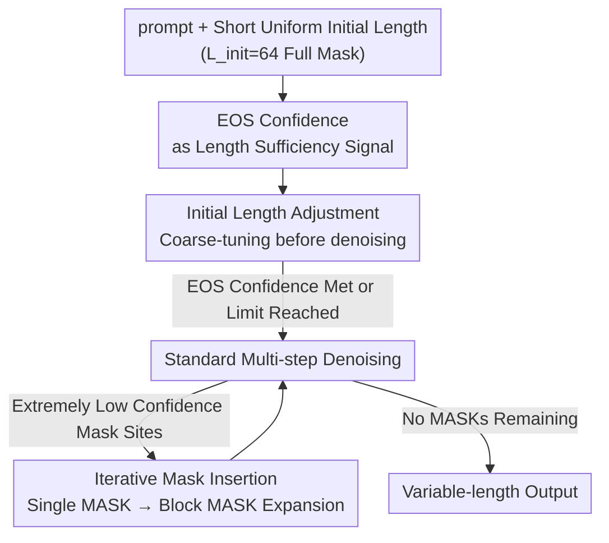

# Beyond Fixed: Training-Free Variable-Length Denoising for Diffusion Large Language Models

**Conference**: ICLR2026  
**OpenReview**: [https://openreview.net/forum?id=Ic2A2gCseC](https://openreview.net/forum?id=Ic2A2gCseC)  
**Code**: https://github.com/Li-Jinsong/DAEDAL  
**Area**: LLM Efficiency / Diffusion Language Models / Inference Decoding  
**Keywords**: Diffusion Large Language Models, Variable-Length Denoising, Training-Free, EOS Confidence, Inference Efficiency

## TL;DR
DAEDAL utilizes the internal signal of EOS token prediction confidence in Diffusion Large Language Models (DLLMs) during denoising. Without training, it coarse-tunes the sequence length from a short uniform initial value to a task-appropriate length prior to denoising, and locally inserts masks for expansion at low-confidence regions during the denoising process. This overcomes the constraint of "manually presetting generation length," achieving or exceeding the accuracy of fine-tuned fixed-length baselines across four math/code benchmarks while significantly increasing the proportion of effective tokens.

## Background & Motivation
**Background**: Diffusion Large Language Models (DLLMs, such as LLaDA and Dream) are emerging as competitive alternatives to AutoRegressive (AR) LLMs. Instead of generating next-tokens sequentially, DLLMs start from a sequence entirely composed of [MASK] tokens and iteratively refine the masked sequence into coherent text through multi-step denoising with bidirectional attention, naturally supporting parallel generation and global planning.

**Limitations of Prior Work**: DLLM inference faces a rigid architectural constraint: **the generation length must be statically specified before denoising begins**. Denoising starts with a full-mask sequence of fixed length $L$, and the final output length is locked to this $L$. If the length is too short, complex tasks (e.g., multi-step reasoning, long code) lack sufficient tokens and fail; if too long, computational waste is severe due to the quadratic complexity of bidirectional attention. Empirically, **excessive initial lengths can actually lead to performance drops** (Fig 1a). Consequently, users are forced to manually grid-search for the optimal length for each benchmark, which is cumbersome and non-transferable.

**Key Challenge**: This represents a fundamental difference between AR and DLLM—**AR models dynamically decide output length based on the task, whereas DLLMs must force a task to fit a preset length**. Worse, DLLMs lack the test-time scaling capabilities of AR models (unable to dynamically extend for self-correction like "Wait, let me rethink…"). Combined with non-sequential generation (where a model might write the beginning and end first only to realize there is insufficient space for intermediate reasoning), this leads to logical incompleteness and performance degradation.

**Key Insight**: The authors discovered that the solution lies within the global planning capacity of the DLLM itself. During each denoising step, the model predicts all mask positions simultaneously with varying degrees of confidence. A critical observation (Fig 2) is: **When the length is sufficient for the task, the model predicts the EOS (end-of-sequence) token with high confidence at the end of the sequence; when insufficient, the model tends to fill all available space, resulting in significantly lower EOS confidence.** Thus, EOS confidence serves as a free, universal internal signal for length sufficiency.

**Core Idea**: Instead of manual external tuning, the model’s own EOS confidence signal is used to allow the DLLM to start from a short, uniform initial length and expand dynamically. This is DAEDAL (Dynamic Adaptive Length Expansion), a **completely training-free** two-stage variable-length denoising strategy.

## Method

### Overall Architecture
DAEDAL requires no changes to model weights or additional training. It wraps two stages around standard DLLM denoising to transform "length" from a hard-coded hyperparameter into a dynamically adjustable quantity. The input consists of a prompt and a **short, uniform initial length** ($L_{init}=64$) of [MASK] tokens. The output is a complete generation with a length adapted to the task complexity. The core of this pipeline is the internal signal: **the model's own prediction confidence for mask positions (especially EOS)**. High EOS confidence implies sufficient length, while extremely low confidence signals a need for more "thinking space."

DAEDAL operates in two stages: **Stage 1 (Initial Length Adjustment)** performs a lightweight length estimation loop **before denoising begins**, coarse-tuning the sequence from the initial 64 tokens to a task-appropriate length. **Stage 2 (Iterative Mask Insertion)** identifies "stuck" positions with extremely low prediction confidence **during the denoising process** and replaces single [MASK] tokens with localized mask blocks for expansion. The two stages are complementary: one provides a global one-time adjustment, while the other provides local, real-time refinement.

### Key Designs

**1. EOS Confidence as a Length Sufficiency Signal: Transforming Sufficiency into a Self-Reported Internal Metric**

The entire mechanism of DAEDAL rests on this single observation. In standard DLLMs, the first denoising step ($t=1$) involves predicting all positions simultaneously, including whether the end of the sequence is an EOS. The authors categorized tasks into "solved within 128 tokens" (sufficient length) and "unsolved at 128 tokens" (insufficient length) and measured the difference in average EOS prediction confidence within a tail window (Fig 2 heatmap). The difference was consistently positive (green), meaning **EOS confidence is systematically higher when the length is sufficient.** Intuitively, if the model feels the length is insufficient to complete the answer, it uses all available space and avoids committing to an EOS, leading to low confidence. This signal is **universal, free, and training-free**.

**2. Initial Length Adjustment (Stage 1): Coarse-tuning from Short Initial Values Before Denoising**

To address the preset length problem, Stage 1 inserts a length estimation loop **before** the main denoising process. Starting from a short initial length, it performs a single forward pass per iteration to check the average EOS prediction confidence within a window $W_{eos}$ at the end of the sequence. If confidence is below a threshold, it classifies the length as "insufficient," implying the model is forced to truncate prematurely. It then appends [MASK] tokens (controlled by an expansion factor $E_{factor}$) and repeats until the threshold is met or a maximum limit is reached. This provides a **reasonable global planning framework** before refinement. Ablation studies (Table 2) show that starting with Stage 2 alone at length 64 is insufficient because the initial global planning is severely constricted.

**3. Iterative Mask Insertion (Stage 2): Local Block Expansion for "Stuck" Points During Denoising**

Even a well-adjusted initial length may prove insufficient for certain complex reasoning segments. The authors argue that **extremely low prediction confidence at a position indicates not just a "hard token," but a "crowded context"**—as if the model is signaling a need for more space for complex thoughts. During each denoising step, beyond standard token filling, the method identifies the mask position with the **lowest** confidence below a threshold and marks it as an "expansion point." Instead of a simple re-masking, this single [MASK] is replaced with a block of multiple [MASK] tokens, effectively inserting additional space locally. This grants the model "breathing room" for complex reasoning or detailed expansion in subsequent rounds.

### Loss & Training
DAEDAL is **completely training-free**: it requires no fine-tuning or additional parameters. It solely re-engineers the denoising inference process. Key hyperparameters (EOS threshold, expansion thresholds, $W_{eos}$, $E_{factor}$, etc.) are kept **identical across all experiments and models** without model-specific tuning (defaults: $L_{init}=64$, $W_{eos}=32$, $E_{factor}=8$).

## Key Experimental Results

### Main Results
Models used: LLaADA-Instruct-8B, LLaADA-1.5-8B, and Dream-Instruct-7B. Benchmarks: GSM8K, MATH500 (Accuracy), MBPP, HumanEval (Pass@1). Baselines were tested at fixed lengths from 64 to 2048; the best performing length for each baseline is compared against DAEDAL (uniform $L_{init}=64$). Results for LLaADA-Instruct-8B are shown below:

| Benchmark | Metric | Baseline Best (Fixed) | Ours (init=64) | Description |
|-----------|--------|-----------------------|-----------------|-------------|
| GSM8K     | Acc    | 83.8 (@1024)          | **85.8**        | Total length 1024→363, $E_{ratio}$ 27.7%→73.5% |
| MATH500   | Acc    | 39.6 (@2048)          | **44.2**        | Gain +4.6 with total length only 704 |
| MBPP      | Acc    | 38.8 (@2048)          | **40.8**        | Outperforms with shorter total length |
| HumanEval | Pass@1 | 47.6 (@1024)          | **48.2**        | Slightly exceeds peak |
| Average   | Acc    | 52.05 (@1024)         | **54.75**       | Uniform short initial value beats all fixed-length averages |

Conclusion: DAEDAL consistently exceeds the baseline at the same initial length and reaches or surpasses the **peak performance of manually tuned** fixed-length baselines. While baseline optimal lengths vary across benchmarks (1024 vs 2048), DAEDAL is robust. Efficiency-wise, DAEDAL significantly reduces total tokens ($N_{token}$) for a similar number of effective tokens ($E_{token}$), dramatically increasing the effective token ratio ($E_{ratio}$) and reducing bidirectional attention overhead.

### Ablation Study
Breakdown of the two stages on GSM8K using LLaADA-Instruct-8B (Table 2):

| Configuration | Acc | $E_{ratio}$ | Description |
|---------------|-----|-------------|-------------|
| Best Baseline (@1024) | 83.8 | 27.7% | Requires manual tuning |
| w/ Stage 1 (init=64) | 84.1 | 81.3% | Stage 1 alone beats baseline peak |
| w/ Stage 2 (init=64) | 72.3 | 83.1% | Initial length too short; poor global plan |
| w/ Stage 2 (init=256) | 84.7 | 75.3% | Beats peak with relaxed initial length |
| **DAEDAL (Both, init=64)** | **85.8** | 73.5% | Optimal synergy between stages |

Hyperparameter sensitivity (Tables 3/4): $L_{init}$ from 32 to 256 yields stable results (GSM8K: 85.8, HumanEval: 48.2), dropping only slightly at 512, showing strong robustness. $E_{factor}$ from 8 to 24 slightly improves accuracy but reduces $E_{ratio}$. $W_{eos}$ from 8 to 32 shows monotonic improvement.

### Key Findings
- **Synergy of Two Stages**: Both stages outperform the baseline individually, but their combination is essential for optimal performance; Stage 1 sets the "foundation," and Stage 2 provides "localized expansion."
- **Dependence of Stage 2 on Initialization**: Stage 2 alone fails at extremely short initial lengths (64) due to poor initial global planning, highlighting the necessity of Stage 1.
- **Robustness and Efficiency**: Performance is largely insensitive to $L_{init}$, and the effective token ratio increases from ~28% (baseline peak) to ~73%.

## Highlights & Insights
- **Turning External Hyperparameters into Internal Signals**: EOS confidence is computed in every forward pass; identifying its correlation with length sufficiency is an elegant, zero-cost, and training-free insight.
- **Global Planning vs. Local Refinement**: The two-stage division addresses different granularities. Setting the frame (global) and then filling space (local) is a versatile approach for tasks requiring dynamic budgets.
- **"Low Confidence = Need for Space"**: Interpreting low confidence as a "crowded context" rather than just "difficulty" provides a novel trigger for dynamic allocation of generation budgets.
- **Resolving the Efficiency-Performance Trade-off**: Unlike conventional DLLMs where higher accuracy requires longer sequences and more compute, DAEDAL achieves higher accuracy with a higher effective token ratio.

## Limitations & Future Work
- **Reliance on EOS Confidence Integrity**: The method assumes a strong correlation between EOS confidence and length sufficiency, which holds for LLaDA/Dream but may vary across different DLLM architectures or training regimes.
- **Limited Benchmark Scope**: Evaluation focused on mathematical and code reasoning. The stability and benefits of dynamic expansion in open-ended generation or dialogue tasks remain to be fully tested.
- **Threshold Dependencies**: While a single set of hyperparameters was used, metrics like the EOS threshold still require pre-setting; their portability across wider model families requires further study.
- **Optimization Stacking**: The authors deliberately avoided caching or other acceleration techniques for fair comparison; the synergy with such optimizations is yet to be explored.

## Related Work & Insights
- **vs. Fixed-Length Denoising**: Baselines require manual grid searches per task, and lengths do not transfer. DAEDAL provides a self-adaptive alternative that is both more accurate and more efficient.
- **vs. AR LLM Test-Time Scaling**: AR models can extend reasoning via tokens like "Wait...", whereas DLLMs were historically locked. DAEDAL's iterative mask insertion provides a compensatory "re-thinking" mechanism for DLLMs.
- **vs. Trained Length Control**: DAEDAL is fully training-free, making it immediately applicable to existing DLLMs with zero training cost.

## Rating
- Novelty: ⭐⭐⭐⭐⭐ Elegant use of EOS signals for training-free variable-length denoising.
- Experimental Thoroughness: ⭐⭐⭐⭐ Three models and four benchmarks with detailed ablations, though open-ended generation is missing.
- Writing Quality: ⭐⭐⭐⭐⭐ Clear logic from motivation to insight to implementation.
- Value: ⭐⭐⭐⭐⭐ Directly addresses the primary "length bottleneck" for DLLMs with a high-utility, plug-and-play solution.

<!-- RELATED:START -->

## Related Papers

- [\[ICLR 2026\] Hierarchy Decoding: A Training-free Parallel Decoding Strategy for Diffusion Large Language Models](hierarchy_decoding_a_training-free_parallel_decoding_strategy_for_diffusion_larg.md)
- [\[ICLR 2026\] UltraLLaDA: Scaling the Context Length to 128K for Diffusion Large Language Models](ultrallada_scaling_the_context_length_to_128k_for_diffusion_large_language_model.md)
- [\[ICLR 2026\] Training-Free Loosely Speculative Decoding: Accepting Semantically Correct Drafts Beyond Exact Match](training-free_loosely_speculative_decoding_accepting_semantically_correct_drafts.md)
- [\[ICLR 2026\] Beyond Masks: Efficient, Flexible Diffusion Language Models via Deletion-Insertion Processes](beyond_masks_efficient_flexible_diffusion_language_models_via_deletion-insertion.md)
- [\[ICLR 2026\] Dynamic-dLLM: Dynamic Cache-Budget and Adaptive Parallel Decoding for Training-Free Acceleration of Diffusion LLM](dynamic-dllm_dynamic_cache-budget_and_adaptive_parallel_decoding_for_training-fr.md)

<!-- RELATED:END -->
