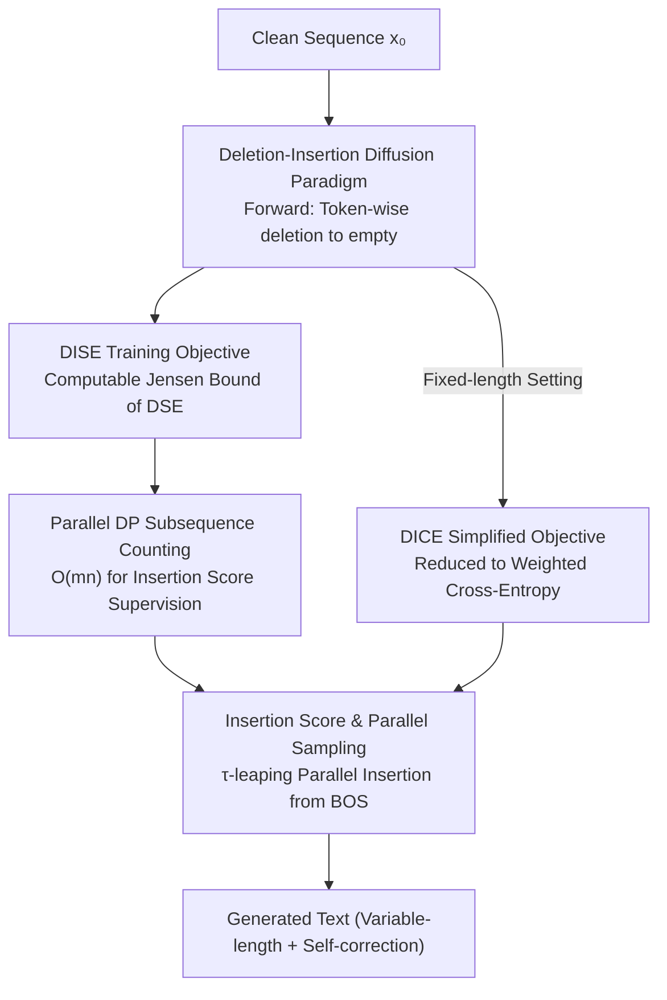

# Beyond Masks: Efficient, Flexible Diffusion Language Models via Deletion-Insertion Processes

**Conference**: ICLR 2026  
**OpenReview**: [https://openreview.net/forum?id=VbvXjs5f72](https://openreview.net/forum?id=VbvXjs5f72)  
**Code**: https://github.com/FMD-NEXT/DID  
**Area**: Diffusion Language Models / Language Model Pre-training  
**Keywords**: Discrete Diffusion, Deletion-Insertion Process, Insertion Score, Variable-length Generation, Self-correction

## TL;DR
DID completely replaces the "mask-unmask" paradigm in diffusion language models with two continuous-time Markov chains (CTMC) representing "deletion-insertion": the forward process reduces a sequence to empty by deleting tokens, while the backward process reconstructs it by inserting tokens. By incorporating an "insertion score"-based DISE training objective and parallel dynamic programming, DID eliminates `<MASK>` and `<PAD>` tokens that consume nearly half of the computational budget. It natively supports variable-length generation and self-correction, achieving up to 3.42× training speedup and 3.79× inference speedup.

## Background & Motivation
**Background**: Diffusion Language Models (DLMs) are considered a promising paradigm for language modeling beyond Auto-Regressive (AR) models due to their bidirectional context and parallel decoding capabilities. The most studied variant is the Masked Diffusion Language Model (MDLM, e.g., LLaDA, RADD), where the forward process corrupts tokens into an absorbing `<MASK>` state, and the backward process iteratively "unmasks" tokens from a fixed-length sequence of masks.

**Limitations of Prior Work**: MDLMs are constrained by the "fixed sequence length" requirement, leading to two fundamental issues. First is **inflexible generation**: sequence length is fixed throughout the diffusion process. For variable-length data, samples must be padded, causing `<PAD>` tokens to waste computation—short sentences do not generate faster. Second, once a token is unmasked, its content and absolute position are locked, potentially accumulating early errors without a mechanism for self-correction. Second is **computational waste**: models must perform forward passes on the full-length sequence at every step. Under common log-linear noise schedules, approximately **half of the FLOPs during training and inference are spent on uninformative `<MASK>` tokens**.

**Key Challenge**: These issues stem from the "mask-unmask" paradigm itself, which mandates constant sequence length. This makes uninformative tokens like `<MASK>` (for placeholder) and `<PAD>` (for alignment) inevitable, sacrificing both flexibility and efficiency.

**Goal**: To build a diffusion language model that maintains the advantages of discrete diffusion (likelihood bounds, parallel decoding) while eliminating the need for `<MASK>` and `<PAD>` tokens and natively supporting variable length and self-correction.

**Key Insight**: The authors realized that "Deletion" and "Insertion" operations can be strictly formulated as discrete diffusion forward and backward CTMCs. The forward process gradually shortens a sequence to empty via deletion, and the backward process reconstructs it from an empty sequence via insertion. This naturally enables dynamic sequence lengths, avoids `<MASK>`/`<PAD>` tokens, and inherently allows self-correction by inserting new tokens between existing ones.

**Core Idea**: Replace the "mask-unmask" process with a "deletion-insertion" process and derive an efficiently-trainable "insertion score" objective (DISE) with guaranteed likelihood upper bounds.

## Method

### Overall Architecture
DID (Deletion-Insertion Diffusion language model) reframes training and generation around deletion and insertion. **Forward Process**: A CTMC acting on the state space of all variable-length sequences. Each token is independently deleted (transitioning to the null state $\varnothing$) at a rate $\sigma(t)$. The sequence shortens until only a non-deletable `<BOS>` remains. **Backward Process**: The time-reversal of the forward process consisting only of "single-token insertions." Starting from `<BOS>`, tokens are inserted step-by-step to reconstruct the full sequence—this serves as the generation process.

Training is challenging because insertion ("where to insert which token") involves variable-shaped outputs. DID solves this by defining a regularly shaped ($|x_t|\times|V|$) **insertion score** $\bar s$. The authors prove that the concrete score is a scaled average of insertion scores, allowing the sampling to be rewritten as pure insertion operations. They use Jensen's inequality to relax the standard diffusion objective DSE into a computable upper bound, **DISE**. The "subsequence counting ratio" in DISE is calculated exactly using $O(mn)$ **parallel dynamic programming**. In fixed-length settings, DISE simplifies to **DICE**, which resembles weighted cross-entropy. The pipeline is as follows:

### Key Designs

**1. Deletion-Insertion Diffusion Paradigm: Replacing Mask-Unmask with Deletion/Insertion CTMCs**
To address the necessity of `<MASK>`/`<PAD>`, DID defines the forward process as independent token-level deletion. In infinitesimal time $\Delta t$, token $v$ is deleted with probability $\sigma(t)\Delta t$. This allows the sequence-level transition probability to be written analytically:
$$p_{t|s}(x_t|x_s)=(1-e^{-(\bar\sigma(t)-\bar\sigma(s))})^{|x_s|-|x_t|}\,e^{-(\bar\sigma(t)-\bar\sigma(s))|x_t|}\,N(x_t,x_s),$$
where $\bar\sigma(t)=\int_0^t\sigma(\tau)\,d\tau$ is the accumulated noise and $N(x_t,x_s)$ counts the occurrences of $x_t$ as a subsequence in $x_s$. Since each step deletes at most one token, the transition rate $Q_t(y,x_t)=\sigma(t)N(x_t,y)$ is non-zero only if $x_t$ is obtained by deleting one token from $y$. The "fully noisy state" is a single `<BOS>`, which acts as the empty sequence input for generation.

**2. Insertion Score and Parallel Sampling: Replacing Variable-shaped Concrete Scores**
Learning the concrete score directly is infeasible because the number of possible insertions $y$ from $x_t$ varies. DID instead learns an **insertion score** $\bar s$ defined for an action $(i,v)$ (inserting token $v$ after position $i$):
$$\bar s(x_t,t)[i,v]\;\stackrel{\text{def}}{=}\;\frac{\mathbb E_{x_0}[(1-e^{-\bar\sigma(t)})^{|x_0|}N(\mathrm{Ins}(x_t,i,v),x_0)]}{\mathbb E_{x_0}[(1-e^{-\bar\sigma(t)})^{|x_0|}N(x_t,x_0)]}.$$
Its shape is fixed at $|x_t|\times|V|$, matching standard transformer outputs. Sampling is performed by independently sampling (position, token) pairs:
$$p^\theta_{t-\Delta t|t}((i,v)|x_t)=\frac{\sigma(t)e^{-\bar\sigma(t)}}{1-e^{-\bar\sigma(t)}}\,\bar s_\theta(x_t,t)[i,v]\,\Delta t\quad(v\neq\varnothing)$$
Parallel decoding is achieved via $\tau$-leaping. Since scores are tied to relative positions, early mistakes can be corrected by inserting new tokens between them, providing intrinsic self-correction.

**3. DISE Training Objective: A Computable Bound for Deletion-Insertion Processes**
To avoid the log-sum structure in standard diffusion objectives, the authors apply Jensen's inequality to derive the **Denoising Insertion Score Entropy (DISE)**:
$$L^{\text{DISE}}_\theta(x_0)=\mathbb E_{t,x_t}\Big\{\tfrac{\sigma(t)e^{-\bar\sigma(t)}}{1-e^{-\bar\sigma(t)}}\sum_{i,v}\big[\bar s_\theta(x_t,t)[i,v]-\tfrac{N(\mathrm{Ins}(x_t,i,v),x_0)}{N(x_t,x_0)}\log\bar s_\theta(x_t,t)[i,v]+C\big]\Big\}.$$
This objective uses the ratio of subsequence counts $N(\mathrm{Ins}(x_t,i,v),x_0)/N(x_t,x_0)$ as the supervision signal, maintaining a strict likelihood bound.

**4. Parallel DP for Subsequence Counting: Reducing $O(mn^2V)$ to $O(mn)$**
Calculating $N(\mathrm{Ins}(x_t,i,v),x_0)$ for all $i, v$ is bottlenecked by $O(mn^2V)$ complexity. The authors prove that by using **prefix DP** and **suffix DP** matrices, all insertion counts can be calculated in one pass:
$$N(\mathrm{Ins}(x_t,i,v),x_0)=\sum_{j=1}^{m}\big[\delta(x_0[j],v)\cdot N(x_t[:i],x_0[:j-1])\cdot N(x_t[i:],x_0[j:])\big].$$
Total complexity drops to $O(mn)$ as prefix/suffix DP are vectorized across $i$.

**5. DICE Fixed-length Simplification**
For fixed $|x_0|$, the term $(1-e^{-\bar\sigma(t)})^{|x_0|}$ cancels out, making the insertion score time-independent and the objective equivalent to a weighted cross-entropy called **DICE** (Denoising Insertion Cross Entropy).

### Loss & Training
Variable-length settings use DISE (Eq. 12), while fixed-length settings use DICE (Eq. 18). Both optimize insertion action scores based on subsequence counting ratios. Generation utilizes $\tau$-leaping for parallel decoding.

## Key Experimental Results

### Main Results
Fixed-length setting (OpenWebText, RADD baseline): DID-S (step-aligned) and DID-F (FLOPs-aligned). DID-F consumes roughly the same compute as RADD but benefits from excluding `<MASK>` tokens.

| Scale | Method | WikiText | Lambada | AG News | LM1B |
|------|------|----------|---------|--------|---------|
| Small | RADD | 38.27 | 51.82 | 73.18 | 72.99 |
| Small | DID-F | **36.91** | **48.00** | **71.48** | **72.04** |
| Medium | RADD | 28.44 | 44.10 | 48.96 | 60.32 |
| Medium | DID-F | **28.35** | **41.00** | **48.84** | **58.05** |

Variable-length setting (Stories dataset): DID maintains lower PPL and significantly higher speed compared to RADD and ILM.

| Method | Steps=64 PPL | 128 | 512 | Inference Speedup |
|------|------|------|------|------|
| RADD | 81.92 | 50.89 | 26.78 | 1× |
| DID | **22.78** | **21.07** | **23.88** | Max **3.79×** |

### Ablation Study
- **DICE Optimization**: Fixed-length DICE outperforms RADD; removing DICE simplification (using raw DISE) degrades performance to RADD levels.
- **Speedup**: Training acceleration ranges from 1.89× (fixed) to 3.42× (variable).

### Key Findings
- **Compute saved from non-informative tokens**: Eliminating `<MASK>` provides ~2× theoretical FLOP savings. Variable-length data sees higher gains (3.42×) by also removing `<PAD>`.
- **Robustness**: DID is far more robust to fewer sampling steps than MDLMs (e.g., PPL of 22.78 vs 81.92 at 64 steps).

## Highlights & Insights
- **Rigorous CTMC formulation**: Leveraging the independence of deletions allows sequence-level transitions to have closed-form subsequence counts, avoiding auxiliary "edit path" latent variables.
- **Insertion Score Reparameterization**: Converting variable-form concrete scores into fixed-shape positional scores makes transformer implementation straightforward.
- **Parallel DP**: Reducing complexity from $O(mn^2V)$ to $O(mn)$ is the engineering key to making the theoretical objective trainable.
- **Intrinsic Self-correction**: Relative positioning allows the model to "fix" previously generated tokens by inserting more appropriate tokens between them.

## Limitations & Future Work
- **System Support**: Variable-length acceleration is currently constrained by immature system-level support for dynamic sequences.
- **Small Scale**: Experiments are limited to small/medium models; behavior at large scale (7B+) remains to be verified.
- **Dataset Specificity**: On specific datasets like PTB, DID does not always outperform RADD, suggesting the paradigm might favor certain data distributions.

## Related Work & Insights
- **vs. MDLM**: MDLM consumes compute on `<MASK>`/`<PAD>` and absolute positions lock quickly; DID removes these tokens and corrects errors via relative positioning.
- **vs. ILM**: ILM is heuristic and slow (one token at a time); DID is a principled diffusion model with parallel $\tau$-leaping.
- **vs. Edit Flows**: Edit Flows requires MCMC to estimate objectives; DID uses exact closed-form counting.

## Rating
- **Novelty**: ⭐⭐⭐⭐⭐ Paradigm shift from mask-unmask to deletion-insertion.
- **Experimental Thoroughness**: ⭐⭐⭐⭐ Solid across fixed/variable settings, though lacking large-scale tests.
- **Writing Quality**: ⭐⭐⭐⭐⭐ Rigorous derivations and clear logic.
- **Value**: ⭐⭐⭐⭐ Provides a highly efficient and flexible alternative to existing DLMs.

<!-- RELATED:START -->

## Related Papers

- [\[ICLR 2026\] Beyond Fixed: Training-Free Variable-Length Denoising for Diffusion Large Language Models](beyond_fixed_training-free_variable-length_denoising_for_diffusion_large_languag.md)
- [\[ICLR 2026\] DPad: Efficient Diffusion Language Models with Suffix Dropout](dpad_efficient_diffusion_language_models_with_suffix_dropout.md)
- [\[ICLR 2026\] Diffusion Language Models Know the Answer Before Decoding](diffusion_language_model_knows_the_answer_before_it_decodes.md)
- [\[ICLR 2026\] FlashDLM: Accelerating Diffusion Language Model Inference via Efficient KV Caching and Guided Diffusion](flashdlm_accelerating_diffusion_language_model_inference_via_efficient_kv_cachin.md)
- [\[ICLR 2026\] UltraLLaDA: Scaling the Context Length to 128K for Diffusion Large Language Models](ultrallada_scaling_the_context_length_to_128k_for_diffusion_large_language_model.md)

<!-- RELATED:END -->
