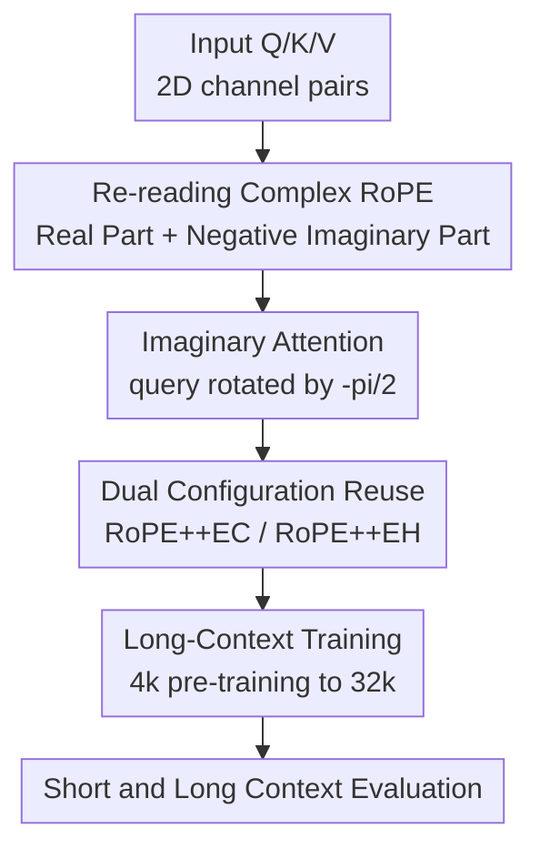

# Beyond Real: Imaginary Extension of Rotary Position Embeddings for Long-Context LLMs

**Conference**: ICLR2026  
**OpenReview**: [https://openreview.net/forum?id=D5PJX02Jki](https://openreview.net/forum?id=D5PJX02Jki)  
**Code**: https://github.com/OpenMOSS/rope_pp  
**Area**: LLM Efficiency  
**Keywords**: Long Context, RoPE, Position Embedding, KV Cache, Length Extrapolation  

## TL;DR
RoPE++ reclaims the negative imaginary part discarded in standard RoPE complex attention and utilizes it as a parallel imaginary attention head, enhancing long-context modeling capabilities without increasing KV cache or while directly halving the cache configuration.

## Background & Motivation
**Background**: Currently, most mainstream LLMs adopt RoPE as the default choice for position embedding. It treats 2D channel pairs of queries and keys as complex numbers or rotation matrices, encoding absolute positions through position-dependent rotation angles. This naturally yields the relative distance $t-s$ in the attention score. This allowed RoPE to retain the advantages of both absolute and relative positioning, explaining its presence in fundamental implementations of long-context models like LLaMA and Qwen.

**Limitations of Prior Work**: In long-context extension, extensive research has focused on the external usage of RoPE, such as adjusting the rotary base, position interpolation, YaRN or NTK scaling, partitioning different frequency dimensions, or pairing it with sparse attention to reduce computation. Most assume the internal calculation of standard RoPE is already optimal and merely seek ways to prevent the performance curve from collapsing outside the training length. However, a fundamental detail exists in the standard implementation: the complex product in RoPE originally consists of a real part and an imaginary part, but only the real part enters the attention score, while the imaginary part is discarded.

**Key Challenge**: The real part is not the "complete RoPE" but rather half of the full complex relationship. Feature curves corresponding to the real part are biased toward local semantic aggregation and decay significantly as relative distance increases. The discarded negative imaginary part also carries relative position information and, on average, is more inclined to attend to distant tokens. In other words, the phase relationships most needed for long contexts might be exactly what standard real-only RoPE scoring eliminates.

**Goal**: The authors aim to answer three questions: first, whether the imaginary part can still be formulated as a relative/absolute position encoding like RoPE; second, whether adding the imaginary part to attention truly aids long-range dependencies rather than just adding noise; and third, whether this modification is controllable regarding KV cache, parameter count, and inference throughput, which are most sensitive in long-context scenarios.

**Key Insight**: The paper re-derives from the complex form of RoPE rather than starting from empirical interpolation rules. The authors observe that the negative imaginary part only requires an additional rotation of $-\pi/2$ for the query, while the key's position encoding remains unchanged. Thus, imaginary attention can reuse the unified absolute-relative structure of standard RoPE and naturally integrate with existing implementations of FlashAttention / GQA.

**Core Idea**: Reinject the negative imaginary part discarded in standard RoPE complex attention as a set of attention heads into the model, allowing the real part to handle stronger local semantic aggregation while the imaginary part supplements long-range phase dependencies.

## Method

### Overall Architecture
The workflow of RoPE++ is straightforward: first, compute the real part attention according to standard RoPE; then, perform parallel attention between the same set of queries (rotated by $-\pi/2$) and the same set of keys to obtain the negative imaginary attention. Finally, based on resource targets, choose RoPE++EC or RoPE++EH to output the real and imaginary parts as different heads to subsequent layers. It does not change the Transformer backbone nor require new position embedding parameters; the core modification occurs in the organization of QK attention scores.

Notationally, standard RoPE applies rotation to each 2D channel pair $(2n, 2n+1)$, where the complex form is $\tilde q_t^{(n)} \tilde k_s^{(n)*} e^{i\theta_n(s-t)}$. Standard attention only takes its real part $A^{Re}_{t,s}$. RoPE++ additionally takes the negative imaginary part $A^{Im}_{t,s}$ and organizes it into a rotation form isomorphic to standard RoPE:

$$
A^{Re}_{t,s} = (R_{\Theta,t}q_t)^\top R_{\Theta,s}k_s = q_t^\top R_{\Theta,s-t}k_s
$$

$$
A^{Im}_{t,s} = (R_{\Theta,t}R_{-\pi/2}q_t)^\top R_{\Theta,s}k_s = (R_{-\pi/2}q_t)^\top R_{\Theta,s-t}k_s
$$

These formulas are crucial: the imaginary part is not an arbitrary added branch; it remains a valid position encoding within the RoPE family, where the query is simply rotated an extra quarter-circle. Since the key rotation is identical to standard RoPE, the KV cache does not need to store a separate version for imaginary attention.

### Key Designs
**1. Complex RoPE Re-reading: Transforming discarded negative imaginary parts into trainable signals**

The vector rotation in standard RoPE can be equivalently viewed as complex multiplication. Past implementations, to obtain real-valued attention scores, directly took the real part of the complex product, which was natural for engineering but erased phase-directional relationships from the imaginary part. The paper does not simply claim "the imaginary part also has information" but proves that the negative imaginary part can also be written in a relative position form: it similarly depends on $\theta_n(t-s)$ and can be decomposed into absolute position rotations for the query and key, with the query requiring $R_{-\pi/2}$.

The advantage of this design is its clear boundary. RoPE++ does not invent a new frequency table or require the model to learn additional position parameters; it restores the other half of the computation within the pre-existing complex structure. Thus, it preserves RoPE's most valuable property—"absolute encoding input, relative distance appearing in attention score"—avoiding becoming a black-box variant relying solely on empirical validation.

**2. Imaginary Attention: Supplementing long-range dependencies with sine-type feature curves**

The paper describes the average behavior of the real and negative imaginary parts as frequency integrals. The real part corresponds to a curve similar to a cosine integral, which is intuitively stronger at short distances and decays as distance increases. The negative imaginary part corresponds to a sine integral type curve:

$$
c^{Im}(\Delta t)=\frac{2}{d}\sum_{n=0}^{d/2-1}\sin(10^{-8n/d}\Delta t),\quad
\tilde c^{Im}=Si(\Delta t)-Si\left(\frac{\Delta t}{10^4}\right)
$$

Because $\sin(0)=0$, the imaginary attention is not strongest at zero distance, differing from the local aggregation bias of the real part. The authors choose the negative imaginary part so that similar query-key pairs still yield positive gains on average; meanwhile, the sine-type curve descends more slowly in distant regions, allowing imaginary heads to more easily distribute attention to global information in long contexts. Subsequent visualizations confirm this: imaginary heads frequently attend to initial positions and global anchors, while real heads favor local neighborhoods.

**3. Dual Configuration Reuse: One mechanism serving "stronger with same cache" and "efficient with fewer heads"**

The most practical aspect of RoPE++ is that it does not build long-context gains on top of a larger KV cache. RoPE++EC (Equal Cache) maintains the same KV cache as standard RoPE, reuses the same batch of keys/values, and interleaves the original query with $R_{-\pi/2}q$ into attention, effectively doubling the number of heads. Its cost is mainly extra attention computation and a larger output projection $W_o$, but it does not expand the KV cache, which is the most expensive part of long-context inference.

RoPE++EH (Equal Head) keeps the total number of attention heads consistent with the original model, allowing QKV parameters and KV cache to be halved, with the real and imaginary parts together restoring head representational capacity. In long-context decoding, cache memory and bandwidth are often more critical than raw computation; thus, the EH version's purpose is not to chase the highest score but to achieve performance comparable to or better than RoPE while trading for lower VRAM and faster TPOT. The paper emphasizes that real and imaginary attention must share $W_q$ and cannot arbitrarily assign 75% of heads to imaginary and 25% to real; the imaginary part is a $-\pi/2$ rotation relative to the same real query, not an independent parameter head.

**4. Better Coverage of Position Values: Reducing OOD position patterns during extrapolation**

Failure in RoPE length extrapolation is partly because certain dimensions only encounter one-sided positive/negative position encoding values within the training window, meeting unseen negative or extreme values only when inference length exceeds training range. By adding imaginary attention, the same dimension combination experiences different sign relationships of cosine and sine simultaneously. Some value ranges that originally only appeared at long distances are exposed to the model during the pre-training window.

This explanation does not imply that RoPE++ can achieve infinite zero-shot extension like some extrapolation methods. The paper's claim is more cautious: RoPE++ still requires training from scratch or continued long-context training, and perplexity will eventually rise beyond supported lengths; however, because more dimensions have seen complete positive/negative position patterns, its perplexity curve rises more slowly, and it can be combined with techniques like Linear PI, YaRN, and NTK scaling.

### Mechanism
Consider the attention calculation for token $t$ in a layer as two parallel reads of the context. The first branch is standard RoPE: query $q_t$ and historical key $k_s$ are each rotated by position then dot-producted to get real part attention. This is akin to asking if there are "semantically similar tokens nearby," making it suitable for local coherence modeling.

The second branch does not regenerate or re-cache keys. It takes the same $q_t$, rotates it by $-\pi/2$, and dot-products it with the same batch of rotated keys $k_s$. For the same distant token $s$, this branch sees a relationship shifted by a quarter-cycle in phase. If that distant position carries chapter beginnings, global facts, "needle" info, or long-range references, the imaginary head is more likely to preserve its influence. Finally, both outputs enter subsequent projections like different attention heads, allowing the model to learn when to rely on local real heads and when to rely on more global imaginary heads.

### Loss & Training
RoPE++ is not a new loss function but a modification of the attention structure and position encoding computation. The training objective remains the standard autoregressive language modeling loss using the AdamW optimizer with a weight decay of 0.1, a maximum learning rate of $5\times 10^{-4}$, and a warmup-stable-decay schedule: warmup for the first 0.5B tokens and decay to 0 for the last 5B tokens.

Experimental training is divided into two stages. Stage one involves pre-training with a 4k context on DCLM-Baseline-1.0; 376M and 776M models were trained for 50B tokens each with a batch size of 0.5M tokens. Stage two performs long-context continued training for RoPE and RoPE++ on a 32k context for 10B tokens, adjusting the rotary base from 10,000 to 500,000. The paper also tests the combination of RoPE++ with long-context techniques like YaRN and Linear PI, demonstrating that RoPE++ is an enhancement of the underlying RoPE mechanism rather than a mutually exclusive replacement for interpolation routes.

## Key Experimental Results

### Main Results
Short-context evaluation uses OpenCompass, including WikiText / LAMBADA perplexity and various benchmarks (TruthfulQA, PIQA, etc.). The following table extracts average scores and perplexity to show if RoPE++ holds up without sacrificing short-text capabilities.

| Scale & Stage | Method | Wiki ppl ↓ | LAMBADA ppl ↓ | Short Avg ↑ | Note |
|--------|------|------:|------:|------:|------|
| 376M Short | RoPE | 19.9 | 32.7 | 40.1 | Standard RoPE Baseline |
| 376M Short | RoPE++EH | 20.8 | 33.6 | 40.3 | 1/2 QKV & Cache, Avg still slightly higher |
| 376M Short | RoPE++EC | 19.4 | 32.6 | 41.0 | Equal Cache, Best Avg |
| 376M Long | RoPE | 20.4 | 33.8 | 39.6 | Baseline after 32k training |
| 376M Long | RoPE++EC | 20.0 | 33.9 | 40.1 | Still outperforms RoPE after long training |
| 776M Short | RoPE | 14.8 | 27.3 | 42.0 | Larger model baseline |
| 776M Short | RoPE++EC | 14.8 | 27.3 | 42.8 | Equal Cache, Highest Short Avg |
| 776M Long | RoPE | 14.6 | 27.3 | 41.3 | Baseline after 32k training |
| 776M Long | RoPE++EC | 14.4 | 27.1 | 43.5 | Gain more significant after long training |

Long-context experiments use RULER and BABILong, covering 4k to 64k or 2k to 64k. The key conclusion: the EC version achieves the highest long-context avg score under equal KV cache, while the EH version, despite saving cache, remains close to or exceeds RoPE in many settings.

| Scale | Method | RULER Avg ↑ | BABILong Avg ↑ | 64k RULER ↑ | 64k BABILong ↑ | Resource Meaning |
|------|------|------:|------:|------:|------:|------|
| 376M Long | RoPE | 18.8 | 11.0 | 5.5 | 7.8 | Standard cache |
| 376M Long | RoPE++EH | 18.2 | 11.6 | 5.9 | 9.7 | 1/2 KV cache / 1/2 QKV |
| 376M Long | RoPE++EC | 25.0 | 16.1 | 9.0 | 12.8 | Same KV cache, increased heads |
| 776M Long | RoPE | 27.4 | 22.8 | 10.4 | 12.1 | Standard cache |
| 776M Long | RoPE++EH | 28.6 | 19.4 | 10.7 | 12.2 | 1/2 KV cache, BABILong avg weaker |
| 776M Long | RoPE++EC | 29.4 | 24.1 | 10.9 | 14.8 | Same KV cache, overall best |

### Ablation Study
Ablations mainly analyze whether "imaginary attention truly handles long-context functions." Authors observe attention patterns and inject Gaussian noise ($\sigma$) into real/imaginary attention separately to see the impact on RULER-4k scores.

| Analysis Item | Key Metric | Note |
|------|---------:|------|
| 376M, Noise in real attention ($\sigma=1.0$) | ~5 pts higher than noise in imaginary | Damaging real heads causes less long-context loss |
| 776M, Noise in real attention ($\sigma=1.0$) | ~8 pts higher than noise in imaginary | Imaginary heads' long-range role is more evident in larger models |
| 376M / 776M attention patterns | Imaginary heads attend more to start/global | Consistent with "imaginary favors long distance" theory |
| RoPE++EH Efficiency | Memory and TPOT better than RoPE | Gains from halving KV cache increase with context length |
| RoPE++ + YaRN / Linear PI | Avg scores lead in most combinations | Shows RoPE++ is stackable with external extension techs |

### Key Findings
- RoPE++EC is the performance line: Under the same KV cache, it outperforms standard RoPE in short-context, RULER, and BABILong averages for both 376M and 776M, with particularly significant long-context gains.
- RoPE++EH is the efficiency line: It halves KV cache and QKV parameters. Its VRAM and TPOT advantages during long-context inference increase with context length; the trade-off is lower stability in some tasks (e.g., 776M BABILong average lower than RoPE).
- Imaginary attention is not a decorative branch. Noise experiments show that when noise standard deviation is in the medium range, damaging imaginary heads harms long-context tasks more than damaging real heads, proving that the imaginary part serves as a long-distance information channel.
- RoPE++ does not directly solve all length extrapolation issues. It makes perplexity rise more slowly beyond training length but still requires training or combination with PI / YaRN / NTK scaling methods.

## Highlights & Insights
- The most elegant aspect of this paper is "reclaiming discarded signals from existing calculations." While many long-context methods add patches outside RoPE, RoPE++ asks: Was standard RoPE already underutilizing half its complex form? Simple question, but once the derivation holds, the explanatory power is strong.
- The positioning of imaginary attention is clear: it does not replace real attention but forms a complementary local/global bias. The real part is better for neighbor semantic aggregation, while the negative imaginary part is better for global anchors and long-distance dependencies—a more persuasive explanation than "more heads make it stronger."
- The EH/EC configurations translate research contributions into engineering trade-offs. Users wanting stronger 64k performance or lower KV cache are provided with two optional targets by the same mechanism, facilitating system selection based on VRAM budgets.
- The insight into length extrapolation is also enlightening: many extrapolation problems can be understood through "what position encoding values were unseen during training." RoPE++ allows dimensions to encounter more positive/negative values early on, a perspective that could migrate to other periodic or multimodal position encoding designs.

## Limitations & Future Work
- The primary limitation is the requirement for training intervention. RoPE++ is not a training-free extrapolation trick that can directly patch existing RoPE models; replacing position embeddings in existing large models involves significant training costs and compatibility hurdles.
- Although 1.5B scale experiments were added, there remains a gap compared to mainstream open-source LLMs at 7B, 13B, or 70B scales. Position encoding modifications often exhibit scaling effects; the gains of RoPE++ on larger models, longer training tokens, and more complex instruction data still require validation.
- While RoPE++EC does not increase KV cache, it increases attention computation and output projection scale. The paper notes that long-context inference is often IO-bound, making this cost acceptable; however, whether the extra computation is worthwhile in short-context, high-throughput training, or low-latency serving depends on specific deployment.
- The combination of imaginary attention with sparse attention, MLA, DuoAttention, or MInference compression methods has not been fully explored. Automatically identifying which heads are better suited for real or imaginary paths might further enhance efficiency.
- The paper mentions that the odd-function property of sine might suit bidirectional attention or diffusion language models, but this remains a prospective outlook. The actual performance of RoPE++ in non-autoregressive, bidirectional, or video/multimodal position encoding remains an open question.

## Related Work & Insights
- **vs Standard RoPE**: Standard RoPE uses only the real part of the complex product for simplicity and local aggregation; RoPE++ retains this while adding the negative imaginary part to provide the model with extra long-distance phase information. It supplements rather than overthrows RoPE.
- **vs ALiBi / Pythia partial RoPE / FoPE**: These change position bias forms, rotation ranges, or frequency domains. RoPE++ differs by not redesigning position functions but restoring parts of the complex calculation that were previously omitted from the attention score.
- **vs Linear PI / YaRN / NTK scaling**: These are mapping strategies between training and inference lengths, solving how to compress or scale indices. RoPE++ changes the internal representation of each position relationship. Experiments show they can be stacked.
- **vs cache compression (GQA / MLA / DuoAttention)**: These focus on KV cache storage and access. RoPE++EH also reduces cache, but by using real+imaginary shared parameters to compensate for reduced head counts, providing a position-encoding-side approach to cache optimization.

## Rating
- Novelty: ⭐⭐⭐⭐⭐ Recovering imaginary attention from RoPE complex form; direct entry point rarely analyzed systematically before.
- Experimental Thoroughness: ⭐⭐⭐⭐ Covers 376M, 776M, 1.5B, diverse tasks, and efficiency analysis, though lacks verification at the 7B+ mainstream scale.
- Writing Quality: ⭐⭐⭐⭐ Mathematical derivations, engineering configurations, and experimental logic are coherent. High information density in tables requires readers to distinguish between performance and efficiency lines.
- Value: ⭐⭐⭐⭐⭐ Provides direct insights for position encoding and KV cache design in long-context LLMs, especially suitable for training new models or architectural experiments.

<!-- RELATED:START -->

## Related Papers

- [\[ICLR 2026\] Group Representational Position Encoding (GRAPE)](group_representational_position_encoding.md)
- [\[ICLR 2026\] Extending the Context of Pretrained LLMs by Dropping Their Positional Embedding](extending_the_context_of_pretrained_llms_by_dropping_their_positional_embedding.md)
- [\[ICLR 2026\] Tactic: Adaptive Sparse Attention with Clustering and Distribution Fitting for Long-Context LLMs](tactic_adaptive_sparse_attention_with_clustering_and_distribution_fitting_for_lo.md)
- [\[ICLR 2026\] Let's (not) just put things in Context: Test-time Training for Long-context LLMs](lets_not_just_put_things_in_context_test-time_training_for_long-context_llms.md)
- [\[ICLR 2026\] SoLoPO: Unlocking Long-Context Capabilities in LLMs via Short-to-Long Preference Optimization](solopo_unlocking_long-context_capabilities_in_llms_via_short-to-long_preference_.md)

<!-- RELATED:END -->
