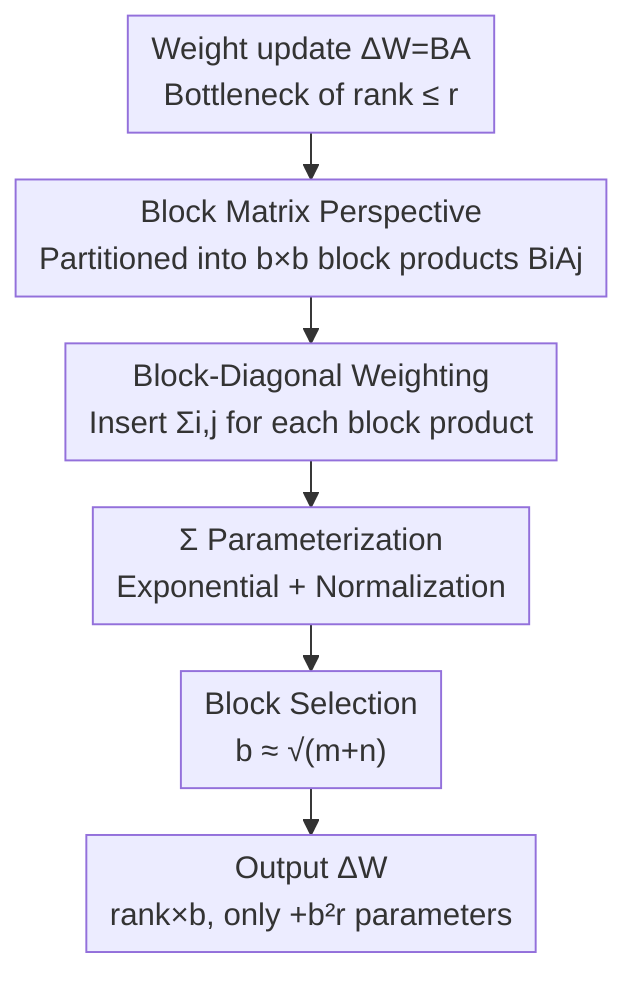

# BoRA: Towards More Expressive Low-Rank Adaptation with Block Diversity

**Conference**: ICLR2026  
**OpenReview**: [https://openreview.net/forum?id=eUMJXFgMjM](https://openreview.net/forum?id=eUMJXFgMjM)  
**Code**: https://github.com/Leopold1423/bora-iclr26  
**Area**: LLM Efficiency  
**Keywords**: LoRA, Parameter-Efficient Fine-Tuning, Block Matrix, Low-Rank Adaptation, Expressiveness  

## TL;DR
BoRA interprets the LoRA product $BA$ as block matrix multiplication and breaks inter-block correlations by inserting an independent diagonal matrix $\Sigma_{i,j}$ into each block product $B_iA_j$. Using only $b^2r$ additional parameters, BoRA scales the rank of LoRA weights by $b$ times, achieving a 2-4% accuracy improvement over LoRA on GLUE, mathematics, and commonsense reasoning tasks with comparable parameter counts.

## Background & Motivation
**Background**: Full-parameter fine-tuning (FFT) of large models is prohibitively expensive, making parameter-efficient fine-tuning (PEFT) the mainstream approach. Among these, LoRA is the most popular because it adds no inference latency. LoRA freezes pre-trained weights $W\in\mathbb{R}^{m\times n}$ and approximates weight updates as $\Delta W=BA$, where $A\in\mathbb{R}^{r\times n}$ and $B\in\mathbb{R}^{m\times r}$ are low-rank matrices with rank $r \ll \min\{m,n\}$.

**Limitations of Prior Work**: A performance gap persists between LoRA and FFT, generally attributed to the low rank of LoRA weights—$\mathrm{rank}(\Delta W)=\mathrm{rank}(BA)\le\min\{\mathrm{rank}(A),\mathrm{rank}(B)\}\le r$. Extensive research has shown that increasing the rank of LoRA weights typically improves fine-tuning performance; Zeng and Lee (2024) further quantified the approximation error between LoRA weights and the "optimal update" using rank $r$, noting that higher rank leads to smaller error. Consequently, "efficiently increasing the rank of LoRA weights" has become a consensus direction.

**Key Challenge**: The most direct way to increase rank is to increase $r$, but the parameter count expands linearly with $r$ as $(m+n)r$, which contradicts the original intent of PEFT—a direct trade-off exists between expressiveness (rank) and parameter efficiency. Existing rank-increasing methods have respective costs: MELoRA breaks correlation by zeroing out all block products except diagonal ones, which increases rank but compresses the representation space due to the high sparsity; HiRA and KronA use Hadamard or Kronecker products; ReLoRA periodically merges adapters back into the backbone.

**Key Insight**: The authors adopt a different perspective—viewing $A$ as being partitioned into $b$ column blocks and $B$ into $b$ row blocks, such that $BA$ is a concatenation of $b\times b$ block products $B_iA_j$. From this viewpoint, the true cause of limited rank is the **correlation between block products across different rows/columns**: all blocks in the same row share the same $B_i$, and those in the same column share the same $A_j$. If $B_1$ is invertible, the second row can be obtained by left-multiplying the first row by $B_2B_1^{-1}$, meaning the second row contributes nothing to the rank. The same applies to the column direction.

**Core Idea**: Instead of the blunt zeroing used in MELoRA, one can assign an individual diagonal matrix $\Sigma_{i,j}$ to each block product, allowing $B_i\Sigma_{i,j}A_j$ to differ across rows and columns. This breaks correlations and increases rank without introducing zero values that impair expressivity.

## Method

### Overall Architecture
The core of BoRA (Block-Diversified Low-Rank Adaptation) is to insert a learnable diagonal matrix $\Sigma_{i,j}\in\mathbb{R}^{r\times r}$ on top of the standard LoRA $BA$ structure for each block pair $(i,j)$, writing the update for the $(i,j)$-th block as $\Delta W_{i,j}=B_i\Sigma_{i,j}A_j$. These diagonal matrices amplify the differences between block products in row and column directions, thereby increasing the rank of LoRA weights from $r$ to at most $br$, while the only additional parameters are $b^2r$ (significantly fewer than the $(m+n)br$ required to increase the LoRA rank directly). The pipeline is: start from LoRA $\Delta W=BA$ $\rightarrow$ diagnose the source of rank bottlenecks via a block matrix perspective $\rightarrow$ add block-diagonal weighting $\Sigma_{i,j}$ to each block product $\rightarrow$ parameterize $\Sigma$ using exponential and normalization for optimization $\rightarrow$ select the number of blocks $b \approx \sqrt{m+n}$. The result is a weight update with $b$ times the rank and nearly no additional parameters.

### Key Designs

**1. Block Matrix Perspective: Pinpointing the Rank Bottleneck as "Inter-block Correlation"**

The difficulty in increasing LoRA rank was previously loosely attributed to "$r$ being too small." BoRA's first contribution is clarifying this bottleneck using block matrix multiplication: after partitioning $A=[A_1, \dots, A_b]$ into column blocks and $B=[B_1, \dots, B_b]^\top$ into row blocks, each sub-block of $\Delta W$ is $\Delta W_{i,j}=B_iA_j$. The rank depends on the number of linearly independent row (column) vectors, yet all blocks in the $i$-th row differ only by $B_i$. This means any row can be generated from another by the same linear transformation (e.g., $B_2B_1^{-1}$); thus, "repeated rows" contribute nothing to the rank. This analysis reformulates "increasing rank" from "increasing $r$" to "breaking inter-block correlation," pointing to a specific design focus and providing a unified framework where LoRA and MELoRA are special cases.

**2. Block-Diagonal Weighting: Breaking Correlation Without Introducing Zeros**

To address the correlation bottleneck, BoRA learns a diagonal matrix for each block product, such that $\Delta W_{i,j}=B_i\Sigma_{i,j}A_j$. Intuitively, $\Sigma_{i,j}$ performs element-wise rescaling of the $r$ rank channels along the diagonal. Since different $(i,j)$ use different rescalings, rows and columns can no longer be generated from one another by a single transformation, breaking correlation and increasing rank. The total update can be written as a three-matrix product $\Delta W=B'\Sigma'A'$, where $A'\in\mathbb{R}^{br\times n}$ and $B'\in\mathbb{R}^{m\times br}$ are block-diagonal matrices composed of the blocks, and $\Sigma'$ is concatenated from all $\Sigma_{i,j}$. This yields the rank upper bound (Proposition 1):

$$\mathrm{rank}(\Delta W)\le\min\{m,n,br\}$$

The upper bound is reached when the three matrices are full rank. The key comparison is that, unlike MELoRA which zeros out non-diagonal blocks, BoRA uses diagonal matrices rather than zero matrices. This achieves a higher rank without the loss of expressiveness caused by extensive zero elements. Formally, LoRA is a special case with $\Sigma_{i,j}=I$, and MELoRA is a special case with $\Sigma_{i,j}=I\ (i=j)$ and $\Sigma_{i,j}=0\ (i\ne j)$. BoRA unifies and generalizes both using a continuously learnable $\Sigma$.

**3. Exponential-Normalization Parameterization: Making Diagonal Weights Learnable**

Directly learning $\Sigma$ leads to optimization difficulties. BoRA parameterizes it as a 3D tensor $\sigma\in\mathbb{R}^{b\times b\times r}$ and uses the same Kaiming initialization as matrix $A$ so they can be trained with the same learning rate. The formula for generating $\Sigma$ is:

$$\Sigma_{i,j}=\mathrm{Diag}\Big(\mathrm{Exp}\big(\tfrac{\sigma[i][j]}{\mathrm{Mav}(\sigma)}\big)\Big),\quad \mathrm{Mav}(\sigma)=\frac{\lVert\sigma\rVert_1}{b^2r}$$

Here, $\mathrm{Mav}(\sigma)$ is the mean absolute value of $\sigma$, $\mathrm{Exp}(\cdot)$ is the element-wise exponential, and $\mathrm{Diag}(\cdot)$ converts a vector into a diagonal matrix. Each operation has a motivation: **Normalization** solves the issue where small initial variance of $\sigma$ results in $\Sigma$ values close to 1, suppressing block diversity. Dividing by the mean absolute value weakens the suppression of small initial values on the distribution. **Exponential** solves the issue where zero-centered $\sigma$ after normalization might result in 0 or near-0 values, zeroing out entire columns of $B_i$ or $A_j$ and causing info loss. The exponential ensures all $\Sigma$ values are positive. Ablations show normalization is more critical than the exponential, confirming this intuition.

**4. Selection of Block Number $b$: Balancing Rank Gain and Parameter Cost**

The benefit of BoRA's rank increase is linear ($br$), but the cost $b^2r$ grows quadratically. Thus, $b$ cannot be increased indefinitely. To achieve a target rank $R=br$, the parameters required are $N=(m+n+b^2)r=R(\tfrac{m+n}{b}+b)$. Minimizing $N$ with respect to $b$ yields $b=\sqrt{m+n}$. This means if $b$ exceeds $\sqrt{m+n}$, it is more cost-effective to increase the base rank $r$ than to add more blocks. In practice, the authors set $b=\lfloor\sqrt{n}\rfloor$. This rule transforms "number of blocks" from an empirical hyperparameter to one with a closed-form optimal value, providing a theoretical basis for BoRA's parameter efficiency over increasing $r$.

### Mechanism: Efficient Segmented Forward Pass
BoRA's forward pass does not require explicitly forming the large matrix but computes the output by segmenting the input. Let the input token be $X\in\mathbb{R}^n$. Standard LoRA forward is $Y=WX+BAX$. BoRA partitions $X$ uniformly into $b$ segments $\{X_1,\dots,X_b\}$, where each segment corresponds to an output segment:

$$Y_j=B_j\sum_{k=1}^{b}\Sigma_{j,k}A_kX_k$$

The process: first, each segment $X_k$ is projected to $r$ dimensions by $A_k$ to get $A_kX_k\in\mathbb{R}^r$; then, it is element-wise multiplied by the diagonal $\Sigma_{j,k}$ (low cost); then summed over $k$ and projected back by $B_j$ to get $Y_j$; finally, $b$ segments of $Y_j$ are concatenated. Compared to LoRA, BoRA adds only $b^2r$ floating-point operations per token. The forward FLOPs are $mn+(m+n)r+b^2r$—this value is also exactly the number of trainable parameters, indicating that its "computation density" is identical to LoRA. Since $b\ll\min\{m,n\}$, the extra memory and compute overhead are negligible, allowing BoRA to retain LoRA's advantage of adding no inference latency.

### Loss & Training
BoRA does not modify the training objective, using standard downstream task losses. On the training side, only the tensor $\sigma$ is added (initialized via Kaiming and optimized jointly with $A$). Experiments use AdamW, linear learning rate decay, LoRA dropout 0.05, and no weight decay. On GLUE, the warm-up ratio is 0.03; RoBERTa-Base/Large use learning rates of 3e-4/1e-4, applied only to query and value weights. Math/common sense tasks use 1e-4, 100 warm-up steps, 1 epoch, applied to query, key, and value. Default setting is $r=8$ and $b=8$ or $16$.

## Key Experimental Results

### Main Results
Evaluated on GLUE (NLU, RoBERTa-Base/Large), Math10K (math reasoning), and Commonsense170K (reasoning, Gemma-7B / LLaMA-3-8B / Qwen2.5-14B) comparing LoRA, DoRA, MELoRA, and HydraLoRA. Core conclusion: BoRA achieves or exceeds the performance of LoRA($r=32$) using parameter counts similar to LoRA($r=8$).

| Benchmark (Avg Acc) | Model | BoRA(r=8,b=16) | LoRA(r=8) | LoRA(r=32) |
|------|------|------|------|------|
| GLUE | RoBERTa-Base | **83.78** | 82.55 | 83.60 |
| GLUE | RoBERTa-Large | **86.51** | 84.38 | 86.35 |
| Math Reasoning | Gemma-7B | **73.10** | 71.44 | 72.71 |
| Math Reasoning | LLaMA-3-8B | **72.24** | 68.19 | 71.67 |
| Math Reasoning | Qwen2.5-14B | **80.60** | 79.09 | 80.15 |
| Commonsense | Gemma-7B | **87.04** | 85.95 | 86.61 |

In math reasoning, BoRA at $r=8$ is 2.4% higher than LoRA on average, whereas scaling LoRA's rank by 4x (to 32) only yields a 1.9% improvement. In commonsense reasoning, BoRA at the same rank leads by 0.95%, while LoRA with 4x rank only gains 0.77%. Effectively, BoRA achieves better results than加 rank versions of LoRA with 1/4th the parameters. While MELoRA also increases rank, its zero elements cause info loss, often performing worse than standard LoRA in math tasks.

### Ablation Study
Ablation of Exponential (Exp) and Normalization (Norm) in $\Sigma$ parameterization:

| Configuration | Gemma-7B | LLaMA-3-8B | Qwen2.5-14B | Description |
|------|------|------|------|------|
| BoRA (Full) | **73.10** | **72.24** | **80.60** | Both Exp + Norm |
| w/o Exp | 71.77 | 68.51 | 79.79 | No exponential, zeros possible |
| w/o Norm | 72.15 | 68.48 | 79.26 | No normalization, $\Sigma$ close to 1 |

Both operations are essential, but **Normalization is more critical**: without it, the initial $\Sigma$ values are too close to 1, diversity cannot be established, and expressivity is suppressed (LLaMA-3-8B drops from 72.24 to 68.48).

### Key Findings
- **Scalability of Rank and Blocks**: Even at $b=2$, BoRA consistently outperforms LoRA. Performance improves as $b$ increases, but once $b$ exceeds the theoretical threshold at high $r$, accuracy begins to decline due to overfitting from excessively high ranks—consistent with the $b\approx\sqrt{m+n}$ analysis. At $b=64$, parameters are roughly 1.6x that of LoRA.
- **Fine-tuning Granularity**: BoRA outperforms LoRA regardless of which layers are tuned (Q, QV, QKV, etc.), demonstrating that the gain is universal across various projection layers.
- **Rank Validation via SVD**: Using a 0.005 threshold to count "effective rank," BoRA's weights show significantly more singular values above the threshold and a larger sum of squared singular values compared to LoRA, directly proving that BoRA successfully increases weight rank.

## Highlights & Insights
- **Unified Perspective**: Recasting LoRA and MELoRA as special cases of BoRA ($\Sigma=I$ or diagonal $I$/off-diagonal $0$) provides a clean theoretical map of rank-increasing methods.
- **Weighting vs. Zeroing**: To break block correlation, MELoRA chose to zero out blocks (losing expressivity), whereas BoRA uses continuously learnable diagonal weighting. This "non-zeroing" detail is key to its superiority over MELoRA.
- **Transferable Idea**: The concept of inserting lightweight per-channel scaling to decouple shared sub-modules is not limited to LoRA. It can be applied to any scenario involving structural weight sharing (e.g., grouped convolutions, MoE expert sharing) to increase diversity efficiently.
- **Closed-form Optimal $b$**: $b\approx\sqrt{m+n}$ transforms a hyperparameter into a calculated value, making it engineering-friendly.

## Limitations & Future Work
- **Quadratic Parameter Growth**: $b^2r$ becomes non-negligible at large $b$ (1.6x LoRA at $b=64$), and excessive $b$ leads to overfitting. BoRA's rank increase has a ceiling.
- **Diagonal Constraint**: $\Sigma_{i,j}$ is restricted to diagonal matrices (per-channel scaling), which limits the degrees of freedom for breaking correlation. Whether richer structures (like low-rank or banded $\Sigma$) provide further gains remains unexplored.
- **Scale and Tasks**: Evaluation focused on models up to 14B and tasks in NLU/reasoning. Benefits for larger models, long-form generation, or multimodal tasks need further validation.
- **Theoretical Uppper Bound vs. Practice**: The rank upper bound in Proposition 1 requires all three matrices to be full rank. How close the learned $\Sigma$ gets to this upper bound during training requires deeper characterization.

## Related Work & Insights
- **vs LoRA**: LoRA's rank is locked at $r$. BoRA achieves rank $br$ with $b^2r$ parameters, offering higher expressivity under the same parameter budget.
- **vs MELoRA**: Both break inter-block correlation. MELoRA's zeroing of non-diagonal blocks harms expressivity, while BoRA's weighting approach maintains information density.
- **vs DoRA**: DoRA decomposes weight into magnitude and direction. BoRA focuses on increasing rank. These routes are orthogonal and can potentially be combined.
- **vs HydraLoRA / MoELoRA**: MoELoRA uses LoRA experts with a router, resulting in $\Delta W=\sum_k B_kA_k$. BoRA differs in the partitioning and combination mechanism of $A$ and $B$.

## Rating
- Novelty: ⭐⭐⭐⭐⭐ Unified perspective and diagonal weighting cleanly solve the rank bottleneck.
- Experimental Thoroughness: ⭐⭐⭐⭐ Broad coverage of tasks and models with detailed scaling analysis, though lacking massive models or generative-heavy tasks.
- Writing Quality: ⭐⭐⭐⭐⭐ Clear motivation, derivation, and relationship to special cases.
- Value: ⭐⭐⭐⭐ Plug-and-play with zero inference overhead; highly attractive for PEFT practitioners.

<!-- RELATED:START -->

## Related Papers

- [\[ICLR 2026\] BA-LoRA: Bias-Alleviating Low-Rank Adaptation to Mitigate Catastrophic Inheritance in Large Language Models](ba-lora_bias-alleviating_low-rank_adaptation_to_mitigate_catastrophic_inheritanc.md)
- [\[ICLR 2026\] LoRA-S: An Efficient Low Rank Adaptation scheme via Sylvester equation](lora-s_an_efficient_low_rank_adaptation_scheme_via_sylvester_equation.md)
- [\[ICLR 2026\] FLoRG: Federated Fine-tuning with Low-rank Gram Matrices and Procrustes Alignment](florg_federated_fine-tuning_with_low-rank_gram_matrices_and_procrustes_alignment.md)
- [\[ICLR 2026\] CR-Net: Scaling Parameter-Efficient Training with Cross-Layer Low-Rank Structure](cr-net_scaling_parameter-efficient_training_with_cross-layer_low-rank_structure.md)
- [\[ICLR 2026\] PARD: Accelerating LLM Inference with Low-Cost Parallel Draft Model Adaptation](pard_accelerating_llm_inference_with_lowcost_parallel_draft_model_adaptation.md)

<!-- RELATED:END -->
