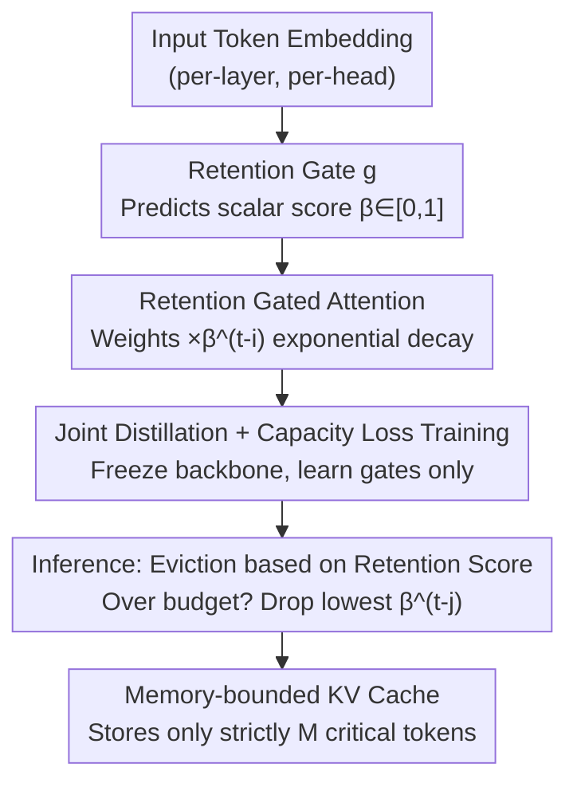

# Cache What Lasts: Token Retention for Memory-Bounded KV Cache in LLMs

**Conference**: ICLR2026  
**OpenReview**: [https://openreview.net/forum?id=qCaq3jGb0S](https://openreview.net/forum?id=qCaq3jGb0S)  
**Code**: https://github.com/ngocbh/trimkv  
**Area**: LLM Efficiency / KV Cache Compression  
**Keywords**: KV Cache Eviction, Retention Gated Attention, Long-Context Inference, Distillation Fine-Tuning, Interpretability

## TL;DR
TRIM-KV inserts a lightweight "retention gate" into each attention head of a pre-trained LLM to predict the intrinsic long-term importance of a token (a scalar score that decays exponentially over time) at the time of generation. When the memory budget is exceeded, tokens with the lowest scores are evicted. By freezing the backbone and fine-tuning these gates with distillation and capacity losses, the method incurs almost zero overhead during inference while consistently outperforming heuristic eviction and learnable retrieval baselines across benchmarks such as mathematical reasoning and long-context memory. In memory-constrained scenarios, it even surpasses full-cache performance.

## Background & Motivation
**Background**: The two primary bottlenecks in long-context LLM inference are the quadratic complexity of self-attention and the ever-expanding KV cache. To perform inference under a fixed memory budget, the community generally follows three paths: compression/quantization (compressing past keys/values into compact representations), offloading/retrieval (moving the cache to CPU and retrieving on-demand via similarity), and direct **KV cache eviction** (discarding certain tokens from the cache).

**Limitations of Prior Work**: Compression and quantization are primarily effective during the prefill stage and lose efficacy as generation length grows. Offloading/retrieval reduces GPU utilization, but the CPU–GPU coordination overhead accumulates during long generation, hindering end-to-end throughput. Most mainstream eviction methods are **attention-guided heuristics**—tracking the attention of new queries on cached tokens and retaining those frequently attended to recently.

**Key Challenge**: These heuristics assume that "recent attention is a reliable proxy for future importance." However, this assumption often fails in long-range reasoning: a token might become critical much later even if it was not recently attended to. Furthermore, attention itself possesses biases (temporarily ignoring a necessary token when distracted by context), leading to premature eviction. A few works attempting to "learn eviction decisions" suffer from poor scalability regarding sequence length and are restricted to the prefill stage.

**Goal**: To design a learnable eviction strategy that strictly adheres to memory budgets, is applicable to **long-range generation** (not just prefill), and does not rely on attention proxies.

**Key Insight**: The authors shift the perspective—instead of using "current query attention" to judge importance, they judge the intrinsic long-term value of a token **at the moment it is created**. Intuitively, tokens are not created equal: key facts, answered questions, and initial "sink" tokens carry significant semantic/task weight, whereas filler words, stop words, and trivial arithmetic steps in a Chain-of-Thought are less significant. Furthermore, importance systematically varies across different layers and heads, reflecting functional specialization. A token's contextual embedding already encodes its long-term utility.

**Core Idea**: A **retention gate** is added to each attention layer/head to map token embeddings to a scalar retention score $\beta \in [0,1]$, allowing its influence to **decay exponentially** as the context grows (modeling the Ebbinghaus forgetting curve). Important tokens with $\beta \approx 1$ decay slowly and persist in the cache, while unimportant tokens with $\beta$ near 0 disappear quickly. The eviction strategy is simple: when the cache exceeds the budget, the token with the **lowest current retention score** is discarded—this is Token RetentIon for Memory-bounded KV cache (TRIM-KV).

## Method

### Overall Architecture
TRIM-KV aims to decide which token to discard at each step under a fixed memory budget $M$ without relying on attention proxies. It operates in two phases: **During training**, standard attention blocks of a pre-trained LLM are replaced with "Retention Gated Attention." A lightweight retention gate $g$ produces $\beta_t$ to modulate attention weights. **Only the gates are trained** (backbone remains frozen) using distillation loss for quality and capacity loss for sparsity. **During inference**, the gates serve as "eviction decoders." For each generated token, its $\beta$ is computed; if the cache exceeds $M$, the token with the smallest $\beta^{t-j}_j$ is evicted, incurring almost no additional overhead.

The core difficulty is that eviction during inference is **discrete and non-differentiable** (a token is either in the cache $\alpha=1$ or discarded $\alpha=0$). TRIM-KV addresses this by using a **smooth exponential decay curve** $\bar\alpha_{ti}=\beta_i^{t-i}$ to approximate hard eviction during training, enabling gradient-based optimization while allowing simple comparisons for eviction during inference.

### Key Designs

**1. Retention Gated Attention: Differentiable training signals via smooth exponential decay**

Eviction during inference is a binary switch: $\alpha_{ti}\in\{0,1\}$ where $\alpha_{ti}\ge\alpha_{t+1,i}$ (monotonicity ensures a discarded token cannot be retrieved). This discrete signal lacks gradients. A naive alternative might use sigmoid to predict "when to evict," but it suffers from unnormalized domains and vanishing gradients. TRIM-KV uses **exponential decay** $\bar\alpha_{ti}=\beta_i^{t-i}$ ($\beta_i\in[0,1]$) to model the retention rate of token $i$ over time. Incorporating this into attention:

$$o_t=\sum_{i=1}^{t}\frac{\beta_i^{t-i}\exp(q_t^\top k_i)}{\sum_{j=1}^{t}\beta_j^{t-j}\exp(q_t^\top k_j)}v_i.$$

This formulation means the **retention score is equivalent to an additive bias on attention logits**: $\exp\big(q_t^\top k_i+(t-i)\log\beta_i\big)$. It reduces to standard attention when all $\beta_t=1$. Unlike standard attention $a_{ti}\propto\exp(q_t^\top k_i)$, which is query-dependent and short-sighted, the retention score is based on information present at token creation, fitting long-horizon eviction decisions.

**2. Lightweight Retention Gate g: Extracting "Long-term Utility"**

The gate $g$ maps the token representation to a scalar $\beta_t=g(x_t)$ using a light network, such as a linear projection $g(x)=\sigma(W_\beta x_t+b)$ or a simple MLP. In the implementation, each transformer block uses a single-layer MLP (hidden dimension 512, $d\to512\to h$ where $h$ is the number of KV heads), providing **independent $\beta$ values for each head**. This "plug-and-play" design allows application to off-the-shelf pre-trained LLMs with negligible inference overhead, contrasting with mechanisms that require retraining attention dynamics from scratch.

**3. Joint Distillation + Capacity Loss: Frozen backbone and global coordination**

The training objective balances prediction quality and cache budget. Quality is maintained via distillation and standard Next-Token Prediction (NTP):

$$L_{\text{quality}}=L_{\text{KL}}+L_{\text{NTP}}=D_{\text{KL}}\big(p(\cdot|x)\,\|\,q_\theta(\cdot|x)\big)+\mathbb{E}_{(x,y)}[-\log q_\theta(y|x)],$$

where $p$ is the original LLM and $q_\theta$ is the retention-gated model. The budget is enforced via a hinge-style capacity regularization:

$$L_{\text{cap}}=\frac{1}{T}\sum_{t=1}^{T}\frac{1}{t}\max\Big\{0,\ \sum_{i=1}^{t}\beta_i^{t-i}-M\Big\},$$

penalizing cases where the effective retention exceeds $M$. This allows the model to learn a globally coordinated, near-optimal cache strategy. Utilizing FlexAttention and custom Triton kernels, the authors achieve training on 128K token contexts using 4 H100 GPUs.

**4. Simplified Eviction during Inference: Sustaining budgets via dynamic re-evaluation**

During inference, the gate acts as an independent eviction decider. When a new token $t+1$ is added and the cache exceeds capacity $M$, the token with the lowest retention score is evicted:

$$j_{\text{evic}}=\arg\min_{j\in S_t}\{\beta_j^{t-j}\}.$$

This naturally favors "globally important" tokens while maintaining a preference for newer tokens due to the $t-j$ decay term.

### Loss & Training
- Total loss: $L_{\text{quality}}+\lambda_{\text{cap}}L_{\text{cap}}$; main experiments use $\lambda_{\text{cap}}=1.0$ and $M=256$.
- Gate bias $b$ is initialized to a large value (e.g., $18.0$) to start training from a "no-forgetting" state.
- Gates were trained on OpenR1-MATH-220k for math reasoning and sequences like SynthLong/BookSum/Buddhi ($M=1024$) for long-context tasks.
- Only gates are trained; the backbone is frozen (4×H100 80G).

## Key Experimental Results

### Main Results
The base models include Qwen3-series (1.7B–14B) and DeepSeek-R1-Distill variants. Baselines include SeerAttn-R (learnable retrieval) and heuristics like R-KV, SnapKV, H2O, and StreamingLLM.

| Task / Setting | Metric | TRIM-KV | Comparison | Conclusion |
|--------|------|------|----------|------|
| Math Reasoning (Same Budget) | pass@1 Relative Gain | — | vs R-KV/SnapKV | **+198.4%** (Even at 4× budget, baselines fail to match) |
| Math Reasoning (Same Budget) | pass@1 Relative Gain | — | vs SOTA SeerAttn-R | **+58.9%** |
| LongMemEvalS (128K) | Acc, KV=32768 | **44.8** | FullKV 49.4 / SnapKV 27.8 | Near FullKV with only 25% budget |
| LongBench-V2 (chunk prefill) | Acc | **34.09** | FullKV 28.79 / LocRet 28.03 | **+18.41%**, exceeding FullKV |
| LongProc CountDown (KV=2048) | Acc | **93.5** | FullKV 90.0 / R-KV 81.0 | Mathematical gates generalize to non-math tasks |

On SCBench, TRIM-KV is competitive in most tasks (e.g., En.MultiChoice 23.58 vs SnapKV 10.04), but like all eviction methods, it struggles with "incompressible" retrieval tasks (Retr.KV, Code.RepoQA) where discarded tokens cannot be recovered.

### Ablation Study
Qwen3-4B on AIME24, KV=4096:

| Configuration | pass@1 | Description |
|------|---------|------|
| Full KV (32768) | 65.5 | Reference |
| TRIM-KV (4096) | **75.8** | Full model, outperforms FullKV at 1/8 budget |
| − $L_{\text{KL}}$ | 72.1 | Without distillation |
| − $L_{\text{NTP}}$ | 72.5 | Without NTP |
| − $L_{\text{cap}}$ | 42.9 | Without capacity loss (drops **32.9**) |

### Key Findings
- **Capacity loss is critical**: Removing $L_{\text{cap}}$ leads to a performance collapse, indicating gates do not learn sparsity without explicit constraints.
- **Selective retention acts as a regularizer**: In several settings, TRIM-KV outperforms full cache, likely by suppressing noise from non-informative, redundant tokens.
- **Emergent heuristics**: Learned scores align with intuition—high scores for task-related tokens and sinks, low scores for whitespace. Patterns like "attention sinks" and "sliding windows" emerge naturally without hard-coding.
- **Interpretability byproduct**: Retention scores serve as probes for functional role discovery in KV heads (e.g., some heads focus on recency, others on operators or punctuation).

## Highlights & Insights
- **"Softening" discrete eviction**: The use of $\beta_i^{t-i}$ elegantly bridges the gap between discrete inference needs and differentiable training while revealing the additive bias relationship with attention.
- **Pricing at creation**: Shifting from "current query relevance" to "intrinsic long-term utility" allows for stable decisions during long-range generation.
- **Plug-and-play, zero retraining**: Training cost is comparable to PEFT, making it highly practical for deployment without re-engineering model weights.

## Limitations & Future Work
- **Weak on incompressible retrieval**: Tasks like Retr.KV remain a challenge for eviction-only paradigms; offloading methods are better suited here.
- **Training-Inference Gap**: While training uses gated attention, inference uses it only for decision-making. Future work may involve joint pre-training.
- **Heterogeneous budgets**: Supporting per-head variable budgets is limited by current KV cache/FlashAttention implementations which assume uniform sequence lengths.

## Related Work & Insights
- **Heuristic Eviction**: Heuristics rely on recency as a proxy. TRIM-KV uses intrinsic importance, achieving ~198% gains over heuristics even when they have significantly more memory.
- **Learnable Retrieval**: Methods like SeerAttn-R retain all information but face high CPU–GPU coordination costs.
- **Linear/Recurrent Variants**: These require retraining from scratch. TRIM-KV is an additive plugin for existing pre-trained LLMs.

## Rating
- Novelty: ⭐⭐⭐⭐⭐ 
- Experimental Thoroughness: ⭐⭐⭐⭐⭐ 
- Writing Quality: ⭐⭐⭐⭐ 
- Value: ⭐⭐⭐⭐⭐ 

<!-- RELATED:START -->

## Related Papers

- [\[ICLR 2026\] DefensiveKV: Taming the Fragility of KV Cache Eviction in LLM Inference](defensivekv_taming_the_fragility_of_kv_cache_eviction_in_llm_inference.md)
- [\[ICLR 2026\] IceCache: Memory-Efficient KV-cache Management for Long-Sequence LLMs](icecache_memory-efficient_kv-cache_management_for_long-sequence_llms.md)
- [\[AAAI 2026\] Judge Q: Trainable Queries for Optimized Information Retention in KV Cache Eviction](../../AAAI2026/llm_efficiency/judge_q_trainable_queries_for_optimized_information_retention_in_kv_cache_evicti.md)
- [\[ICLR 2026\] Attention Is All You Need for KV Cache in Diffusion LLMs](attention_is_all_you_need_for_kv_cache_in_diffusion_llms.md)
- [\[ICML 2026\] CriticalKV: Optimizing KV Cache Eviction from an Output Perturbation Perspective](../../ICML2026/llm_efficiency/criticalkv_optimizing_kv_cache_eviction_from_an_output_perturbation_perspective.md)

<!-- RELATED:END -->
