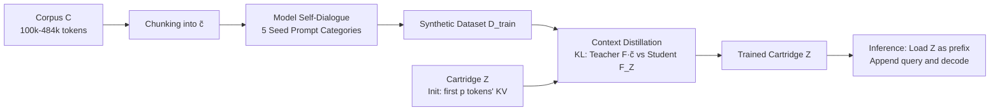

# Cartridges: Lightweight and General-Purpose Long Context Representations via Self-Study

**Conference**: ICLR 2026  
**OpenReview**: [https://openreview.net/forum?id=0k5w8O0SNg](https://openreview.net/forum?id=0k5w8O0SNg)  
**Code**: To be confirmed  
**Area**: Efficient LLM Inference / Long Context / KV Cache Compression  
**Keywords**: KV Cache, Long Context, Context Distillation, prefix-tuning, Offline Training, Synthetic Data  

## TL;DR
Replace "online prefilling of long documents into KV cache" with "offline training of a small learnable KV cache (Cartridge) for each corpus." Use **Self-Study** (self-generated synthetic dialogues + context distillation) to replicate the general-purpose In-Context Learning (ICL) capabilities in the small cache, achieving a 38.6× reduction in memory and a 26.4× increase in throughput on average.

## Background & Motivation
- **Background**: Users frequently input entire large corpora (codebases, financial reports, legal documents, medical records) into the context window to answer various queries via in-context learning (ICL). Modern models support 100K–10M tokens, but KV cache memory grows linearly—answering a 128k token question with LLaMA-70B requires 84 GB of memory.
- **Limitations of Prior Work**: The cost of ICL services is extremely high. When expanding context from 1k to 120k for LLaMA-8B on an H100 GPU, peak throughput drops by 77×. Existing prompt compression and KV cache compression methods face a "memory-quality" trade-off, where quality collapses sharply once the compression ratio exceeds 2×.
- **Key Challenge**: KV cache is general (a single cache supports factoid QA, reasoning, creative writing, etc.) because it is large and complete. Compressing it risks losing this generality. Simply training a small cache on the corpus via next-token prediction allows perfect "memorization" with 107× less memory, but it **only recovers the original text and fails to generalize to diverse queries**.
- **Goal**: Train a small "virtual KV cache" such that the model performs as if the entire corpus were in its context, saving memory while preserving ICL generality.
- **Key Insight**: **[Offline training for online memory]** Since the same corpus is queried repeatedly, the cost of constructing representations can be amortized offline. **[Synthetic Dialogues + Context Distillation]** The model "proctors its own exam" by generating training data from the corpus, using KL distillation to align the "student with cache" token distribution with the "teacher with full context" distribution, thereby distilling generality into the small cache.

## Method

### Overall Architecture
The approach consists of two layers: the **Cartridge Paradigm**, which defines "what parameters carry the corpus, and how to train/serve," and **Self-Study**, which defines "what data and objectives enable generalization." Given a corpus $C$ and a frozen LLM $F$, a set of learnable key/value vectors $Z=\{z^k, z^v\}\in\mathbb{R}^{p\times d}$ is allocated as a Cartridge using prefix-tuning. $C$ is distilled into $Z$ offline via Self-Study. During inference, $Z$ is loaded as a prefix KV cache of length $p$, concatenated with the user query for decoding.

### Key Designs

**1. Cartridge Parameterization: Writing the corpus into a learnable KV cache (prefix-tuning instead of LoRA).** A Cartridge is a set of trainable key/value vectors $Z\in\mathbb{R}^{L\times p\times d\times 2}$, where $p$ controls the size. During training, the KV pairs corresponding to $C$ in ICL are replaced by $Z$. All model weights are frozen, and loss is backpropagated only into the key/values of $Z$—equivalent to prefix-tuning. Comparison shows that for the same 0.6 GB scale on MTOB, prefix-tuning outperforms LoRA by 4.5 ChRF. More importantly, prefix-tuning generalizes better: when cache size increases from 0.15 GB to 0.96 GB, prefix-tuning's MMLU only drops from 54.7 to 54.3, while LoRA's performance plummets to 45.3. Prefix-tuning also offers engineering benefits: as a native KV cache, it fits directly into existing managers (e.g., vLLM/SGLang), requiring no custom infrastructure for multi-user serving.

**2. Cartridge Initialization: Starting with the real KV cache of the first p tokens.** Prior work found that optimizing randomly initialized caches is unstable. This study finds that the full-sized cache can be optimized without re-parameterization if initialized properly: $Z$ is initialized as the KV cache of the first $p$ tokens of $C$. This step is critical—on LongHealth, this initialization yields 55.3% accuracy vs. 29.9% for random vectors. Interestingly, even using the KV cache of a **completely unrelated corpus** recovers most of the gap (51.3%), indicating that "resembling the geometric structure of a real KV cache" is more important than the corpus content itself.

**3. Self-Study Synthetic Data: Model "self-testing" to force generalization.** To avoid overfitting the original text (and thus only being able to repeat it), the model generates training data via self-dialogue (Algorithm 1). First, it takes a sub-corpus chunk $\tilde c$ (512–4096 tokens). Then, it uses a `seed_prompt` to guide a conversation between two participants A and B (sharing the same model). A's history includes the seed prompt, while B's does not; both have $\tilde c$ in their system prompts. Two "knobs" control the distribution: **Chunking** focuses the model on different parts of the corpus (allowing training on documents exceeding the window size), and **Seed Prompts** use 5 categories (structuring, summarization, question, use case, creative) to ensure variety. Using 5 categories increases performance by +7.9 ChRF on MTOB compared to a single prompt.

**4. Context Distillation: Aligning distributions.** Given the synthetic dataset $D_{train}$, the teacher is the model $F(\cdot|\tilde c)$ with the sub-corpus in context, and the student is the same model $F_Z(\cdot)$ with only the trainable cache. The objective minimizes the KL divergence across every position in the sequence:

$$\arg\min_{Z}\sum_{(x,\tilde c)\in D_{train}}\sum_{i=1}^{|x|} D_{KL}\!\left(F(\cdot|\tilde c\oplus x[:i])\,\|\,F_Z(\cdot|x[:i])\right)$$

Distilling soft labels provides richer supervision than simple next-token prediction, improving MTOB scores by +8.6 ChRF (24.9→33.5). This is the key step in injecting ICL "generality" into the small cache.

## Key Experimental Results

### Main Results: Quality-Memory Frontier (LLaMA-3, C within 128k window)

| Dataset | Metric | Cartridge vs ICL Memory | Throughput Gain |
|--------|------|----------------------|----------|
| LongHealth | Accuracy | 13.8× saving at same quality | 11.5× |
| QASPER | log-perplexity | 97.0× saving | 76.6× |
| Multi-key NIAH | Accuracy | 648.3× saving | — |
| Average (Across Bench) | — | **38.6×** | **26.4×** |

- All KV cache compression baselines (including SOTA DuoAttention) fail to match ICL quality at 2–4× compression ratios.
- Qwen3 series shows even larger gains: Cartridge is 106.4× smaller while exceeding full ICL accuracy by 3.8 on LongHealth.

### Out-of-Context Extrapolation: MTOB (LLaMA-8B, 128k Window)
- Cartridge was trained using chunking for a **484k token** textbook (far exceeding the 128k window).
- It outperformed ICL on the first 130k tokens by **11.0 chrF** and matched the quality of ICL on a human-curated 60k version, despite using significantly less memory.

### Ablation Study

| Dimension | Comparison | Result |
|------|------|------|
| Parameterization | prefix-tuning vs LoRA (~0.6 GB, MTOB) | +4.5 ChRF; MMLU Generalization 54.3 vs 45.3 |
| Initialization | First p token KV vs Random (LongHealth) | 55.3% vs 29.9% (Unrelated KV: 51.3%) |
| Objective | Context Distillation vs Next-token (MTOB) | +8.6 ChRF (24.9→33.5) |
| Seed Prompts | 5 Categories vs Single (MTOB / LongHealth) | +7.9 ChRF / +4.8 acc |

### Key Findings
- **No Free Lunch**: Matching ICL quality at high compression ratios requires 2–4 orders of magnitude more offline FLOPs than standard prefilling. The value of Self-Study lies in "providing an option to trade offline compute for online memory," which is practical for peak-hour efficiency and high-query-volume scenarios.
- **Compositionality**: Two independently trained Cartridges (e.g., Pepsi 10-K and AMD 10-K) can be concatenated along the sequence dimension without joint training. The model can then answer multi-document questions, significantly outperforming single cartridges or window-limited ICL.

## Highlights & Insights
- **Paradigm Shift**: Transforms "long context representation" from an online prefill artifact into an offline trained asset, opening a new scaling axis for inference.
- **Self-Generated Supervision**: Using the model's own in-context behavior as a teacher for distillation bypasses the difficulty of not knowing future queries—instead of guessing queries, it directly aligns the distribution.
- **Engineer Friendly**: Cartridges are standard KV caches, allowing zero-modification integration with multi-user KV management in existing inference servers—a much lower deployment barrier than LoRA-based solutions.
- **Unexpected Compositionality**: The ability to plug-and-play independent caches suggests these representations have a linear or additive structure in KV space, hinting at the potential for "assembling context by document."

## Limitations & Future Work
- **High Offline Training Cost**: The training cost of Self-Study is not yet optimized (e.g., via shared-prefix attention kernels or better data ratios).
- **Long-range Dependency Limits**: While matching ICL on LongHealth and MTOB, there is still headroom. Scenarios like codebases with extremely strong long-range dependencies require more robust Self-Study variants.
- **Composition is "Viable," not "Equivalent"**: While concatenated Cartridges produce coherent answers, they are not yet claimed to be as effective as single-use cases. Efficiently combining Cartridges remains an open problem.

## Related Work & Insights
- **Parameter-Efficient Fine-Tuning (PEFT)**: Unlike LoRA-based knowledge injection, this work focuses on memory and throughput gains and highlights the necessity of prefix-tuning for this task.
- **Prompt / KV Cache Compression**: Methods like summarization or token dropping are limited by a quality bottleneck at 2–4× compression; this work bypasses that trade-off via offline training.
- **Architectural Changes**: Unlike Linear Attention or Mamba which require retraining/complex conversion, Self-Study can be applied to any pre-trained Transformer.
- **Inspiration**: For services where the same corpus is queried repeatedly (code agents, long-term chatbot memory, medical history), offline distillation of KV cache is more economical than scaling context windows.

## Rating
- **Novelty**: ⭐⭐⭐⭐⭐ Redefining long context as an offline asset and solving generalization via distillation is a significant paradigm shift.
- **Experimental Thoroughness**: ⭐⭐⭐⭐ Balanced benchmarks (NIAH, LongHealth, MTOB, QASPER) and comprehensive ablations; quantification of offline training costs could be more detailed.
- **Writing Quality**: ⭐⭐⭐⭐ Clear logic, self-consistent charts, and honest discussion of trade-offs.
- **Value**: ⭐⭐⭐⭐⭐ Real-world improvements in memory (38.6×) and throughput (26.4×) that are practically deployable.

<!-- RELATED:START -->

## Related Papers

- [\[ICLR 2026\] Smooth Reading: Bridging the Gap of Recurrent LLM to Self-Attention LLM on Long-Context Understanding](smooth_reading_bridging_the_gap_of_recurrent_llm_to_self-attention_llm_on_long-c.md)
- [\[ICLR 2026\] Reasoning Language Model Inference Serving Unveiled: An Empirical Study](reasoning_language_model_inference_serving_unveiled_an_empirical_study.md)
- [\[ICLR 2026\] Let's (not) just put things in Context: Test-time Training for Long-context LLMs](lets_not_just_put_things_in_context_test-time_training_for_long-context_llms.md)
- [\[ICLR 2026\] Tactic: Adaptive Sparse Attention with Clustering and Distribution Fitting for Long-Context LLMs](tactic_adaptive_sparse_attention_with_clustering_and_distribution_fitting_for_lo.md)
- [\[ICLR 2026\] Predicting LLM Output Length via Entropy-Guided Representations](predicting_llm_output_length_via_entropy-guided_representations.md)

<!-- RELATED:END -->
