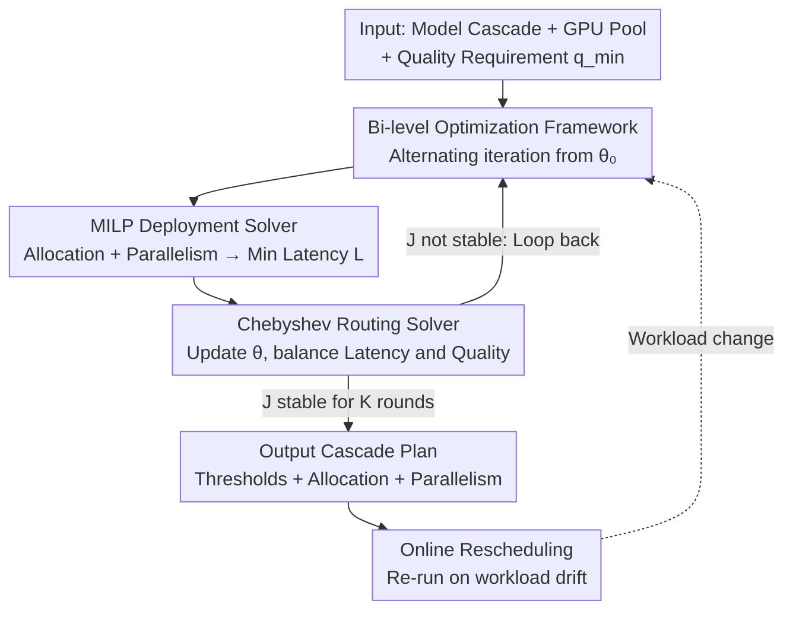

# Cascadia: An Efficient Cascade Serving System for Large Language Models

**Conference**: ICLR2026  
**OpenReview**: [https://openreview.net/forum?id=wkrWbrHTJQ](https://openreview.net/forum?id=wkrWbrHTJQ)  
**Code**: TBD  
**Area**: LLM Efficiency / LLM Serving / Inference Systems  
**Keywords**: Model Cascade, LLM Serving System, Bi-level Optimization, MILP, Request Routing

## TL;DR
Cascadia is a cascade serving system for large language models. it formulates the decisions of "which model size to use, how many GPUs to allocate, and which parallelism strategy to apply" as a constrained optimization problem. By using a bi-level iterative framework that combines MILP for deployment and Chebyshev-guided search for routing, it jointly solves these variables. While maintaining answer quality, it tightens latency SLOs by up to 4$\times$ and improves throughput by up to 5$\times$ compared to single-model deployment.

## Background & Motivation

**Background**: Larger models offer higher quality but suffer from higher latency, while smaller models are faster but less capable. A recurring trade-off is the **model cascade**—dispatching simple requests to a small model and only upgrading to a larger model if the small model "underperforms." This approach controls costs while preserving quality for complex requests. Works like FrugalGPT, AutoMix, and CascadeServe follow this line of research.

**Limitations of Prior Work**: Implementing the cascade idea in actual LLM serving is significantly harder than proposing the concept. The authors identify three areas where existing frameworks struggle. First, **Model Heterogeneity**: Memory and compute requirements vary drastically between small, medium, and large models (e.g., DeepSeek-671B vs. dist-70B); haphazard allocation in a fixed GPU pool degrades overall efficiency. Second, **Workload Heterogeneity**: Different models face different request distributions (input/output lengths, arrival rates), leading to preferences for different deployment strategies (replica counts, tensor vs. pipeline parallelism). Figure 2 shows that choosing the right parallel strategy can lead to a 3$\times$ throughput difference. Third, **Cascade-aware Load Balancing**: The routing policy determines the request volume for each model, which in turn determines its system load. Thus, **deployment must be optimized jointly with routing**, whereas existing systems treat them as decoupled tasks.

**Key Challenge**: The routing policy determines the request distribution across models $\rightarrow$ which determines the optimal deployment plan $\rightarrow$ which determines system latency $\rightarrow$ which in turn affects routing decisions. This is a mutually dependent closed loop with an exponentially expanding search space. The authors prove that finding the optimal cascade plan is NP-hard. Existing systems optimize either deployment or routing, lacking a mechanism to integrate both.

**Goal**: In a setting where the service provider hosts all models in the cascade, the goal is to **simultaneously** determine (i) the deployment plan—GPU allocation and parallel strategy for each model; and (ii) the routing policy—the threshold for each request to progress through the cascade, balancing latency and quality.

**Key Insight**: Given the mutual dependence of the two layers, Cascadia formalizes the problem as a **constrained optimization problem** and employs bi-level optimization for system-algorithm co-design, allowing the two layers to be solved iteratively until convergence.

**Core Idea**: Use a bi-level iteration of "MILP for deployment + Chebyshev-guided search for routing" to **jointly optimize** cascade serving deployment and routing toward convergence, rather than optimizing them in isolation.

## Method

### Overall Architecture

Cascadia addresses a scheduling problem: given a set of models $\{c_1, c_2, \dots, c_C\}$ ordered by size, a total of $N$ GPUs, and a user-specified quality requirement $q_{\min}$, it seeks a **cascade plan**. This plan includes the GPU count and parallel strategy for each model (deployment $D$), and the acceptance/forwarding thresholds for each stage (routing policy $\theta$).

Because deployment and routing are interdependent, Cascadia employs a **bi-level iterative loop** (Algorithm 1). Starting from an initial routing policy $\theta_0$, each round first derives the workload distribution $W$ and quality $Q$ for each model. It then calls the **MILP Deployment Solver** to calculate a deployment plan $D$ that minimizes the maximum latency $L$ under resource constraints. Next, it feeds $L$ and the quality requirements into the **Chebyshev Routing Solver** to update the routing policy $\theta$ and the latency-quality score $J$. The process concludes when $J$ remains stable for $K$ consecutive rounds, returning the final $(\theta, D)$. An **Online Rescheduling** mechanism periodically samples real workloads; if a significant drift in workload characteristics is detected, the entire scheduling algorithm is re-run.

### Key Designs

**1. Bi-level Optimization Framework: Decoupling the "Deployment ↔ Routing" Loop**

Solving for the optimal cascade plan directly is NP-hard because routing, workload distribution, deployment, and latency are all interconnected. Cascadia breaks this by adopting a **bi-level structure**: routing is the outer layer, and deployment is the inner layer. The algorithm starts with an initial policy $\theta_0$ (e.g., proportional routing). In each round, it fixes the routing, calls the inner deployment solver to obtain the minimum latency $L(\theta)$, and then uses $L$ to update the outer routing. This repeats until the latency-quality score $J$ stabilizes. This approach reduces a coupled global optimization into two sub-problems (one MILP, one one-dimensional penalty optimization) that can be solved efficiently while maintaining feedback between layers.

**2. MILP Deployment Solver: Minimizing Bottleneck Latency for a Given Workload**

The deployment layer addresses resource misallocation caused by model and workload heterogeneity in two steps. First, **Parallel Strategy Search**: for each model type $i$ and candidate GPU count $f_i$, it enumerates all valid combinations of Data Parallelism (DP), Tensor Parallelism (TP), and Pipeline Parallelism (PP) satisfying resource constraints $(\sum_{j=1}^{dp_i} tp_{i,j}\times pp_{i,j}) \le f_i$. A simulator $\text{Sim}(\cdot)$ estimates the p95 latency $l_i = \text{Sim}(w_i, f_i)$, and the best entry is selected. This can be precomputed into a lookup table. Second, **Resource Allocation MILP**: it introduces 0/1 variables $x_{i,f}$ (whether model $i$ is assigned $f$ GPUs). Constraints ensure each model has one allocation ($\sum_f x_{i,f}=1$), the total GPU limit is respected ($\sum_i \sum_f f\,x_{i,f}=N$), and the maximum latency $L$ is at least the latency of any selected allocation ($L\ge \sum_f l_i(f)\,x_{i,f}$). The objective is:

$$\min_{x}\ L \quad \text{s.t. } L \ge \sum_{f=1}^{N} l_i(f)\,x_{i,f},\ \forall i$$

This "lookup table + integer programming" design compresses an exponential search space into a problem sized for standard solvers.

**3. Chebyshev-guided Routing Solver: Minimizing Latency while Meeting Quality Floors**

The routing layer uses threshold-based cascading: each request starts at model $c_1$, a judger (e.g., GPT-4o) scores the output, and thresholds $H=\{h_1,\dots,h_{C-1}\}$ decide whether to accept or forward. Cascadia uses a **Chebyshev-guided approach** to merge "latency minimization" and "quality compliance" into a single-objective penalty problem. It defines a utopia point $z_1^*$ (all requests to the largest model $c_C$, best quality) and a nadir point $z_2^*$ (all requests to the smallest model $c_1$, worst quality), then solves:

$$\arg\min_{\theta}\ J(\theta) = \arg\min_{\theta}\ \Big[L(\theta) + \mu\,\max\{0,\ (q_{\min}-Q(\theta))/(z_1^*-z_2^*)\}\Big]$$

Where $L(\theta)$ is system latency, $Q(\theta)$ is quality, and $\mu>0$ is a penalty weight. If quality meets the requirement ($Q(\theta)\ge q_{\min}$), the penalty is zero, and the goal is pure latency minimization. If quality falls short, the normalized gap is penalized heavily by $\mu$. This design cleanly expresses quality as a hard constraint and latency as the optimization target in a continuous scalar form.

**4. Online Rescheduling: Adapting to Workload Drift**

To handle real-world LLM workload drift (changes in length distribution, arrival rates, or complexity), Cascadia includes a lightweight rescheduling loop. It periodically **sub-samples** real-time workload features. If a significant drift is detected, the bi-level scheduling algorithm is re-executed using recent historical data. Since the scheduler is fast (under 20s for 32 GPUs, within a minute for 80 GPUs), the cost of rescheduling is easily amortized.

---

### Mechanism Example

Consider Trace 1 with a quality requirement of 90 and models $c_1$ (DeepSeek-dist-7B), $c_2$ (dist-70B), and $c_3$ (671B). After convergence, the plan might process 100%, 94%, and 50% of requests through each respective stage, with GPU allocations of 4, 8, and 20. If the quality requirement is relaxed to 85, fewer requests reach $c_3$ (dropping from 50% to 21%), allowing $c_3$ to release GPUs (from 20 down to 16) to earlier stages to balance the load.

## Key Experimental Results

### Main Results

Hardware: 4 servers with 8$\times$ H100-80GB each (NVLink 400GB/s, InfiniBand 200GB/s). Cascade: DeepSeek-dist-7B / dist-70B / 671B (AWQ INT4). Judger: GPT-4o. Metrics: SLO attainment (minimum SLO Scale for 95% compliance) and throughput.

| Comparison | Latency SLO (Lower Scale is Better) | Throughput | Observation |
|--------|------|------|------|
| vs. Single Model (SGLang DeepSeek) | Up to 4$\times$, avg 2.8$\times$ tighter | Up to 5$\times$, avg 3$\times$ higher | Trace 3 (Q85): Single model needs 11.88 Scale; Cascadia needs 3.75 |
| vs. CascadeServe (SOTA) | Up to 2.5$\times$, avg 1.7$\times$ tighter | Up to 3.3$\times$, avg 1.7$\times$ higher | Trace 1 (Q90): CascadeServe needs 17.3 Scale; Cascadia needs 11.73 |
| Llama Cascade (Llama3-8B/70B) | Up to 3.8$\times$, avg 2.6$\times$ | — | Validates generality across models |
| vs. Sarathi-Serve | — | 1.95$\times$ peak, 1.64$\times$ avg | Outperforms systems with scheduling-only optimizations |
| vs. RouteLLM | Avg 21.3% lower Scale | Avg 18.8% higher | Gains from system-algorithm co-design |

**Cost**: Reduction of 20–39% vs. CascadeServe and 33–61% vs. single-model deployment.

### Ablation Study

| Configuration | Performance Drop | Description |
|------|---------|------|
| Full Cascadia | — | Complete system |
| w/o Parallel Optimization | Up to 1.6$\times$, avg 1.4$\times$ | Uniform strategy fails to meet disparate needs of 7B/671B |
| w/o Allocation Optimization | Up to 2.1$\times$, avg 1.7$\times$ | Uniform GPU allocation leads to severe load imbalance |

### Key Findings

- **Resource allocation is more critical than parallel strategy**: Disabling allocation optimization causes a larger performance drop (up to 2.1$\times$) than disabling parallel strategy optimization (up to 1.6$\times$).
- **Quality requirement is the main control lever**: Relaxing quality allows resources to flow from the large model back to smaller ones, triggering a global re-optimization.
- **Efficient Scaling**: The scheduling algorithm is lightweight and scales linearly with CPU cores.
- **Robustness to Drift**: In scenarios where workloads switch (Trace 1 $\rightarrow$ 2 $\rightarrow$ 3), rescheduling allows Cascadia to maintain its lead.

## Highlights & Insights

- **Computational Bi-level Structure**: Translates the ambiguous concept of "co-optimization" into a concrete, alternating algorithm (Chebyshev outer, MILP inner).
- **Practical Engineering Split**: Precomputing latency lookup tables before solving the MILP manages the exponential search space effectively while maintaining optimality.
- **Elegant Penalty Modeling**: Using normalized quality gaps in the Chebyshev objective handles hard constraints in a way that remains compatible with continuous optimization.
- **Quantified Transparency**: It clearly demonstrates how quality requirements drive resource redistribution through specific GPU counts and routing ratios.

## Limitations & Future Work

- **Judger Dependency**: Routing relies on the scores from an external judge (GPT-4o), which introduces its own latency ($\sim$0.27s) and cost. Judge errors can directly degrade routing decisions.
- **Simulator Accuracy**: Deployment depends on the ETH EASL Scratchpad simulator; discrepancies with real-world queuing or network jitter could impact the MILP solution.
- **Reactive vs. Proactive**: Rescheduling is triggered by detected drift; a predictive approach could better handle sudden traffic spikes.
- **Workload Scope**: Evaluation focused on conversation, coding, and math; performance on long-context or multi-turn agentic workloads remains to be seen.

## Related Work & Insights

- **vs. CascadeServe**: CascadeServe selects plans based on real-time system load but ignores LLM-specific features (input/output length, complexity). Cascadia explicitly models these, leading to 1.7–3.3$\times$ better performance.
- **vs. FrugalGPT / AutoMix**: These focus on the algorithmic side of threshold cascading without considering the underlying system deployment; Cascadia integrates the two.
- **vs. RouteLLM**: RouteLLM is a routing-only framework; Cascadia's co-design allows for significantly better SLO attainment.

## Rating
- **Novelty**: ⭐⭐⭐⭐ First system to truly co-solve cascade deployment and routing using a bi-level (MILP + Chebyshev) framework.
- **Experimental Thoroughness**: ⭐⭐⭐⭐⭐ Comprehensive evaluation across model families, traces, quality requirements, and online drift.
- **Writing Quality**: ⭐⭐⭐⭐ Logic and derivations are clear, though some notation requires careful reading of examples.
- **Value**: ⭐⭐⭐⭐ Directly applicable to providers hosting multi-model cascades, offering significant latency and cost benefits.

<!-- RELATED:START -->

## Related Papers

- [\[ICLR 2026\] Out of the Memory Barrier: A Highly Memory-Efficient Training System for LLMs with Million-Token Contexts](out_of_the_memory_barrier_a_highly_memory-efficient_training_system_for_llms_wit.md)
- [\[ACL 2026\] Lizard: An Efficient Linearization Framework for Large Language Models](../../ACL2026/llm_efficiency/lizard_an_efficient_linearization_framework_for_large_language_models.md)
- [\[ICLR 2026\] DPad: Efficient Diffusion Language Models with Suffix Dropout](dpad_efficient_diffusion_language_models_with_suffix_dropout.md)
- [\[ICLR 2026\] Inference-Cost-Aware Dynamic Tree Construction for Efficient Inference in Large Language Models](inference-cost-aware_dynamic_tree_construction_for_efficient_inference_in_large_.md)
- [\[ICLR 2026\] Beyond Fixed: Training-Free Variable-Length Denoising for Diffusion Large Language Models](beyond_fixed_training-free_variable-length_denoising_for_diffusion_large_languag.md)

<!-- RELATED:END -->
## Related Papers

- [\[ACL 2026\] Lizard: An Efficient Linearization Framework for Large Language Models](../../ACL2026/llm_efficiency/lizard_an_efficient_linearization_framework_for_large_language_models.md)
- [\[ICLR 2026\] DPad: Efficient Diffusion Language Models with Suffix Dropout](dpad_efficient_diffusion_language_models_with_suffix_dropout.md)
- [\[ICLR 2026\] Inference-Cost-Aware Dynamic Tree Construction for Efficient Inference in Large Language Models](inference-cost-aware_dynamic_tree_construction_for_efficient_inference_in_large_.md)
- [\[ICLR 2026\] Beyond Fixed: Training-Free Variable-Length Denoising for Diffusion Large Language Models](beyond_fixed_training-free_variable-length_denoising_for_diffusion_large_languag.md)
- [\[ACL 2026\] Tandem: Riding Together with Large and Small Language Models for Efficient Reasoning](../../ACL2026/llm_efficiency/tandem_riding_together_with_large_and_small_language_models_for_efficient_reason.md)

<!-- RELATED:END -->
