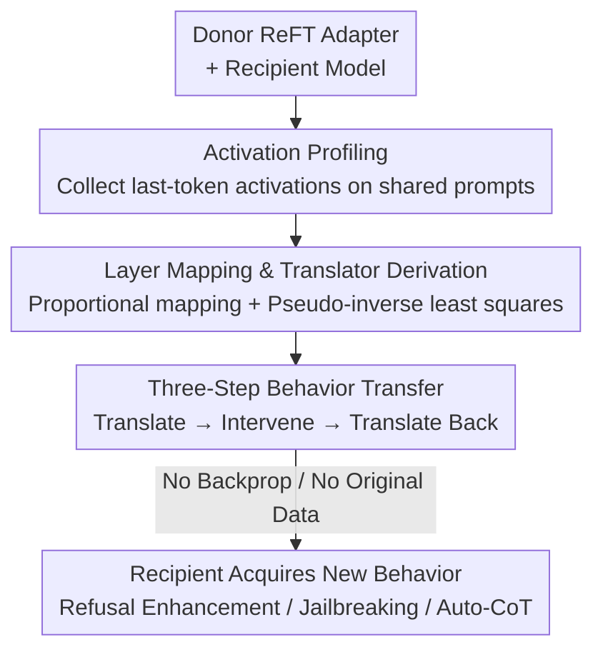

# Command-V: Training-Free Representation Finetuning Transfer

**Conference**: ICLR2026  
**OpenReview**: [https://openreview.net/forum?id=oRYzpI3cmJ](https://openreview.net/forum?id=oRYzpI3cmJ)  
**Code**: https://github.com/ippolito-cmu/Command-V/  
**Area**: LLM Efficiency / Parameter-Efficient Fine-Tuning / Behavior Transfer  
**Keywords**: Training-Free Transfer, ReFT, Representation Finetuning, Activation Profiling, Model Editing

## TL;DR
Command-V (⌘V) transfers a Representation Finetuning (ReFT) adapter trained on one model to another model with a different architecture through a pair of linear "translators" without any backpropagation or original training data. This allows the recipient to "freely" acquire new behaviors from the donor (e.g., refusal enhancement, jailbreaking, auto-CoT) with performance close to direct fine-tuning while reducing computational costs by several orders of magnitude.

## Background & Motivation
**Background**: To "instill" new behaviors into Large Language Models (LLMs)—such as safer refusal or a willingness to reason step-by-step—prevailing methods include Supervised Fine-Tuning (SFT), Instruction Tuning, RLHF, or Parameter-Efficient Fine-Tuning (PEFT like LoRA, prefix-tuning, or ReFT). While effective, these methods must be repeated for every new model architecture.

**Limitations of Prior Work**: The cost of fine-tuning or distillation is twofold: it requires curated data and significant computational resources. Furthermore, these methods treat each model as "learning from scratch," failing to exploit the fact that many existing models already possess the desired behaviors. If Model A has already been tuned for a capability, why should Model B relearn it from data?

**Key Challenge**: Behaviors are "encoded" within the weights or activation spaces of specific models. Different models (even within the same family or at different scales) have varying hidden dimensions and layer counts, meaning their activation spaces are mutually incompatible. Directly attaching an adapter from Model A to Model B is impossible due to dimension and layer misalignment—the fundamental barrier to "behavioral reuse."

**Goal**: The objective is to "translate" a trained representation adapter from a donor model into the activation space of a recipient model without accessing original training data or performing backpropagation on the recipient.

**Key Insight**: The authors rely on the observation that LLMs across different architectures converge to a **shared representation space** (universal geometry, aligned activation neighborhoods), and layer functions scale approximately linearly with depth (e.g., layer 2 of a shallow network $\approx$ layer 4 of a deeper network). Since the structures of the two spaces are similar, they can potentially be aligned using a **linear mapping**.

**Core Idea**: Use "activation profiling" to establish layer-wise linear correspondences (translators) between the donor and recipient. During inference, the recipient's activations are temporarily translated into the donor's space, subjected to the donor's adapter intervention, and then translated back. This essentially "cuts and pastes" the effect of an adapter from one model to another.

## Method

### Overall Architecture
⌘V involves three models: a donor base $M_D$, its ReFT-tuned version $M_{D'}$ (differing only by intervention modules $I$), and a recipient model $M_R$ with a different architecture. The goal is to migrate the added behavior in $M_{D'}$ relative to $M_D$ (i.e., the intervention $\Delta I$) to $M_R$. The pipeline consists of four steps: first, collect layer-wise activations from both models on a small set of shared prompts to create "activation profiles"; second, map donor layers with adapters to corresponding recipient layers based on depth ratio; third, derive bidirectional linear translators using pseudo-inverse least squares on the paired activations; fourth, during recipient inference, perform "translate-intervene-translate back" to inject the donor behavior. The entire process requires only forward passes, and translators can be computed on a CPU in seconds.

### Key Designs

**1. Activation Profiling: Fingerprinting Models with Universal Prompts**

To establish a mapping, paired materials are required. ⌘V feeds the same set of prompts $P=\{p_1,\dots,p_N\}$ to both the donor and recipient, recording the **last-token activations** for every layer (following RepE best practices and matching the adapter configuration which only acts on the last token). For layer $l$ of model $m$, the activations of $N$ prompts are stacked into a matrix $A_m^{l}\in\mathbb{R}^{N\times d_m}$. For instance, using 100 prompts for Llama3.1-8B (4096 dimensions, 32 layers) results in one $(100, 4096)$ matrix per layer. Intuitively, this profile encodes how each residual dimension responds to diverse user prompts, serving as a stable fingerprint of the layer's activation space. Crucially, this is **task-agnostic**: the authors use 1030 diverse prompts from the LIMA dataset (Q&A, creative writing, facts) rather than task-specific data (e.g., safety or jailbreaking), allowing a single profile per model to be amortized across multiple tasks.

**2. Layer Mapping & Translator Derivation: Linear Alignment of Activation Spaces**

With profiles ready, layer and dimension correspondence must be resolved. For layer mapping, based on the observation that layer functionality scales linearly with depth, the authors use a simple ratio $l_R = \lfloor \alpha \cdot l_D \rfloor$, where $\alpha = |L_R|/|L_D|$ is the ratio of layer counts. For dimension alignment, bidirectional linear translators $C_{l_D\to l_R}$ and $C_{l_R\to l_D}$ are defined to preserve structure and maintain **cycle consistency**: $C_{l_R\to l_D}(h_R) \approx h_D$ and $C_{l_D\to l_R}(C_{l_R\to l_D}(h_R)) \approx h_R$. Letting the paired activation matrices be $X \in \mathbb{R}^{N\times d_R}$ for the recipient and $Y \in \mathbb{R}^{N\times d_D}$ for the donor, the translators are the closed-form solutions to the least squares problem:

$$C_{R\to D}=X^{\dagger}Y,\qquad C_{D\to R}=Y^{\dagger}X$$

where $X^{\dagger}$ is the Moore-Penrose pseudo-inverse. Between Llama3.2-3B ($d=3072$) and Llama3.1-8B ($d=4096$), the translators have shapes $(3072, 4096)$ and $(4096, 3072)$. The elegance lies in the fact that **the entire derivation requires no backpropagation, is pure linear algebra, and takes an average of 6.35 seconds on a CPU for all 14–18 layer pairs**. This contrasts sharply with distillation or fine-tuning, which require retraining the recipient.

**3. Three-Step Behavior Transfer: Translate-Intervene-Translate Back during Inference**

The translators serve as a bridge. Actual behavior injection occurs during the recipient's forward pass. The donor's adapter is DiReFT, which intervenes on hidden states as $I(h) = h + W_2^{\top}(W_1 h + b)$ (low-rank, rank 4–32), with the delta denoted as $\Delta I(h) = I(h) - h$. ⌘V executes three steps at each recipient layer $l_R$: (1) translate recipient activation to donor space $h_D^{\text{temp}} = h^{l_R} C_{R\to D}$; (2) apply donor intervention $\Delta I_{l_D}(\cdot)$ in donor space; (3) translate the result back to recipient space and add it to the original activation:

$$h^{l_R}_{\text{intervened}} = h^{l_R} + C_{l_D\to l_R} \big( \Delta I_{l_D} \big( C_{l_R\to l_D}(h^{l_R}) \big) \big)$$

Because interventions only act on a few last tokens and happen once per generation (rather than every decoded token), additional latency is minimal. More importantly, it offers **VRAM advantages**: no backprop or training is required. If activation profiles are pre-prepared, edge devices could use an 8B adapter on a 3B model without ever downloading or being able to run the full 8B model.

## Key Experimental Results

The authors selected three types of behaviors with significant pre- and post-tuning differences to validate ⌘V: refusal enhancement, refusal suppression (jailbreaking), and auto-CoT reasoning.

### Main Results

**Refusal Enhancement** (Adapter trained on WildJailbreak, evaluated using ASR↓ on 2000 adversarial harmful prompts):

| Transfer Direction | Recipient off-shelf ASR | After ⌘V ASR | Contrast: Direct ReFT on Recipient |
|--------------------|-------------------------|--------------|------------------------------------|
| 3B → 8B            | 36.85%                  | **20.40%**   | 28.55% (minimum 21.05%)            |
| 8B → 3B            | 31.30%                  | **16.40%**   | 12.20% (minimum 5.65%)             |

Notably: the 3B adapter moved to 8B (20.40%) actually **outperforms** direct training on the 8B model (28.55%), suggesting that transfer is not merely a suboptimal approximation.

**Refusal Suppression / Jailbreaking** (AdvBench training, AdvBench + HarmBench evaluation ASR↑): Most models initially had single-digit jailbreak rates. After ⌘V, rates generally rose to 20–80%. The strongest donor, Qwen2.5-7B, pushed recipients to average rates of 41.2% (AdvBench) and 46.9% (HarmBench), reaching up to 80.7%/81.5% for Qwen2.5-1.5B. Within-family transfer performed best; Gemma2-2B-it was most resistant to transfer.

**Auto-CoT** (OpenMathReasoning training, Big Bench Hard evaluation): Following 8B→3B within-family transfer, models were more inclined to reason before answering. Qwen2.5-3B saw up to a +50% improvement on Multistep Arithmetic, with some transfers rivaling direct training.

### Ablation Study

| Configuration | Key Metric | Description |
|---------------|------------|-------------|
| Translator Derivation Time | 6.35 seconds | 14–18 layer pairs, MacBook Pro CPU |
| Adapter Extra Parameters | <0.04% | One DiReFT per layer, only last-token |
| Activation Profile N | 1030 (LIMA) | Task-agnostic, one-time amortization per model |
| ARC-Challenge (8B) | 85.75→86.43% | General reasoning stays intact after ⌘V |

### Key Findings
- **Behavior transfer quality depends on the donor adapter's impact on the donor**: If the adapter provides minimal gain to the donor (e.g., on common sense or factual knowledge datasets), the recipient gains almost nothing.
- **Within-family transfer > Cross-family transfer**: Behaviors like jailbreaking can transfer across families, but refusal enhancement and reasoning are more sensitive to architectural similarity.
- **Side effects**: Refusal enhancement can lead to over-refusal (8B: 1.36%→4.52%, 3B: 3.17%→14.48%); CoT transfer sometimes harms instruction following (up to 28.8% of responses failing JSON formats) or causes output collapse, especially for small models requiring precise token generation (e.g., `<thinking>`).

## Highlights & Insights
- **"Cut-and-paste behavior" paradigm**: The authors reframe "learning a new capability" as "translating an existing one." This is a clean implementation based on the universal representation space hypothesis—linear alignment makes behaviors portable assets.
- **Closed-form + No Backprop**: Deriving translators via least squares pseudo-inverse takes seconds on a CPU, pushing the cost of model editing down to the inference level. This trick for aligning activation spaces via paired activations is applicable to any scenario requiring representation alignment.
- **3B→8B Outperforming Direct Training**: The fact that a small model's adapter can outperform direct training on a large model suggests that transfer might provide regularization or generalization benefits rather than just loss.
- **Honest Presentation of Two-Sided Capabilities**: The authors explicitly address both jailbreak transfer (lowering barriers for harmful use) and over-refusal, acknowledging the safety risks of behavioral transfer.

## Limitations & Future Work
- **Dependency on Donor Gains**: ⌘V is largely ineffective if the adapter itself does not significantly modify the donor's behavior.
- **Occasional Utility Loss**: Small recipient models may suffer from output collapse, linguistic drift, or format failure, similar to "oversteering." Behaviors requiring precise tokens are most fragile. The authors mitigated this by using natural language instead of tags like `<thinking>`, suggesting lightweight methods like classifier-free guidance might help, though they were not implemented.
- **Model Pair Prediction is Open**: Determining which model pairs or tasks will transfer well currently relies on empirical observation (e.g., Llama3.2-3B and 3.1-8B are good matches). Reliable signals for predicting transfer quality are still needed.
- **Linear Translator Ceiling**: Currently, only least-squares linear mapping is used. Non-linear mappings, trainable translators, or adapters beyond ReFT (e.g., JoLA) could offer further improvements.

## Related Work & Insights
- **vs. Knowledge Distillation**: Distillation requires generating massive data from a teacher and retraining a student; ⌘V directly transfers the **functional effect of an existing adapter** via activation mapping, requiring no data generation or retraining.
- **vs. Model Merging / Task Vectors / ROME·MEMIT**: These mostly work on weight arithmetic or specific facts within the **same architecture and parameter size**; ⌘V operates in the **activation space**, enabling cross-architecture transfer.
- **vs. Activation Steering / Steering Vectors**: Steering vectors typically edit the activations of the **same target model**; ⌘V uses the activations/interventions of a **donor** to guide a **different recipient**.
- **vs. ReFT / LoRA**: ReFT performs low-rank representation intervention and claims 15–65× higher parameter efficiency than LoRA; ⌘V goes further by **reusing** a trained ReFT adapter, removing the need for original training data or backpropagation on the target.

## Rating
- Novelty: ⭐⭐⭐⭐⭐ Transforming "representation universality" into a training-free, cross-architecture behavior transfer is a clear and novel paradigm.
- Experimental Thoroughness: ⭐⭐⭐⭐ Three behavior types across multiple model families with cost/utility ablations is solid, though more systematic predictive analysis for transferability is missing.
- Writing Quality: ⭐⭐⭐⭐ Pseudocode, formulas, and charts are clear; limitations and safety risks are honestly stated.
- Value: ⭐⭐⭐⭐⭐ Bringing model editing costs down to inference level for edge devices creates immense potential for capability reuse and composition.

<!-- RELATED:START -->

## Related Papers

- [\[ICLR 2026\] Beyond Fixed: Training-Free Variable-Length Denoising for Diffusion Large Language Models](beyond_fixed_training-free_variable-length_denoising_for_diffusion_large_languag.md)
- [\[ICLR 2026\] Dynamic-dLLM: Dynamic Cache-Budget and Adaptive Parallel Decoding for Training-Free Acceleration of Diffusion LLM](dynamic-dllm_dynamic_cache-budget_and_adaptive_parallel_decoding_for_training-fr.md)
- [\[ICML 2026\] Hyperparameter Transfer with Mixture-of-Experts Layers](../../ICML2026/llm_efficiency/hyperparameter_transfer_with_mixture-of-expert_layers.md)
- [\[ICLR 2026\] Hierarchy Decoding: A Training-free Parallel Decoding Strategy for Diffusion Large Language Models](hierarchy_decoding_a_training-free_parallel_decoding_strategy_for_diffusion_larg.md)
- [\[ICLR 2026\] Training-Free Loosely Speculative Decoding: Accepting Semantically Correct Drafts Beyond Exact Match](training-free_loosely_speculative_decoding_accepting_semantically_correct_drafts.md)

<!-- RELATED:END -->
