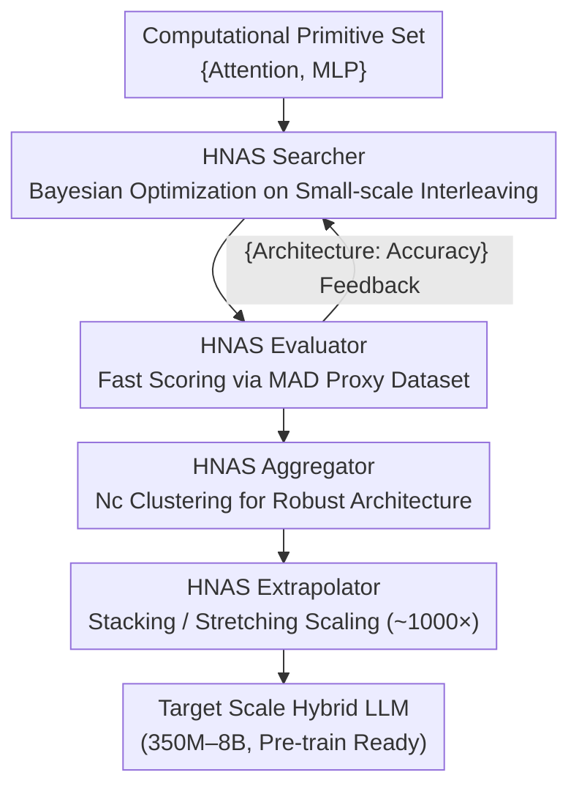

# Composer: A Search Framework for Hybrid Neural Architecture Design

**Conference**: ICLR2026  
**OpenReview**: [https://openreview.net/forum?id=m00gjQfpCc](https://openreview.net/forum?id=m00gjQfpCc)  
**Code**: To be confirmed  
**Area**: LLM Efficiency / Neural Architecture Search  
**Keywords**: Hybrid Architecture, Neural Architecture Search, Computational Primitive Interleaving, Small-scale Search Extrapolation, Bayesian Optimization

## TL;DR
Composer transforms the manual design process of "how to interleave computational primitives like Attention and MLP into superior LLMs" into an automated search framework. By employing Bayesian optimization on million-parameter small models to discover optimal interleaving patterns and extrapolating them ~1000× to 3B/8B scales, the resulting Composite architectures consistently outperform Llama 3.2 across the 350M–8B range. This achieves an average downstream accuracy gain of 2–2.1% while providing 1.25× training throughput and a 1.69× reduction in KV cache size.

## Background & Motivation
**Background**: Standard Transformers stack self-attention and MLP layers in a fixed 1:1 ratio, a structure that has dominated LLMs for years. However, recent works suggest that "hybrid architectures"—those deviating from this fixed stack—can further improve quality. For instance, Qwen3-Next, Mamba-2, and MAD adjust the ratio of Attention to SSM primitives, DeepSeek-V3 utilizes dense MLPs in early layers followed by sparse MoE, and Sandwich Transformer rearranges interleaving orders without changing ratios. These cases imply that **the ratio and interleaving of primitives are themselves optimizable design dimensions**.

**Limitations of Prior Work**: Existing hybrid architectures are manually designed based on researcher intuition, lacking a systematic framework for automated and efficient search. The design space is astronomical—a 32-layer model with only two primitives (Attention/MLP) yields $2^{32}$ (over 4 billion) possible permutations. Evaluating each via full pre-training is entirely infeasible.

**Key Challenge**: To ensure search affordability, it must be performed at a "small scale" (small models, small data). However, architectures performing well at small scales do not necessarily maintain superiority when scaled up. A key finding of this paper is that **scaling down both model and data according to Chinchilla scaling laws leads to quality rankings that do not reflect true performance at large scales**—small-scale search signals become distorted, resulting in "small-but-wide" deformed architectures. While prior attempts like STAR searched directly on target datasets (targeting edge-side small models), this work finds that searching on web-scale data is either ineffective or impractical.

**Goal**: Design a search framework that automatically and efficiently discovers hybrid LLM architectures for pre-training that remain superior to SOTA after scaling. The framework should be modularized to answer four design questions: search algorithm choice, evaluation dataset, candidate aggregation, and large-scale extrapolation.

**Key Insight**: Instead of "proportional scaling" which distorts signals, it is more effective to **scale down only to a model size that preserves the width-to-depth ratio and switch to a proxy dataset (MAD synthetic tasks) learnable by small models that represents large-scale tasks**. This ensures small-scale rankings faithfully reflect large-scale performance (achieving a Spearman rank correlation of 0.97 between 6-layer search and 1B scale).

**Core Idea**: Formalize "primitive interleaving design" as a discrete sequence search problem and utilize a modular HNAS framework (Search → Evaluate → Aggregate → Extrapolate) to search at a small scale and extrapolate to larger scales.

## Method

### Overall Architecture
Composer takes a set of computational primitives as input (focusing on Attention and MLP) and outputs a hybrid LLM of a specified size (e.g., 3B) ready for pre-training. A hybrid LLM is formalized as a sequence of primitives $a=(a_1,\dots,a_N)$ of length $N$, where each $a_i$ is drawn from the primitive set $P=\{p_1,\dots,p_Z\}$. The discrete search space size is $|A_N|=Z^N$, expanding exponentially with the target depth.

The pipeline comprises four core components: the **HNAS Searcher** uses Bayesian optimization on million-parameter models to find candidate patterns; the **HNAS Evaluator** quickly trains and scores candidates using a proxy dataset (MAD synthetic tasks); the **HNAS Aggregator** clusters the top candidates to synthesize a robust small architecture; and the **HNAS Extrapolator** scales this small architecture ~1000× to the target size via stacking or stretching. The first two form a search loop where evaluation scores guide the next round of sampling.

### Key Designs

**1. HNAS Searcher: Searching for Interleaving Patterns in Exponential Space**

The search space $Z^N$ grows exponentially with depth. The searcher employs **Bayesian Optimization (BO) with a Gaussian Process surrogate model** (SingleTaskGP based on Ax/BoTorch, RBF kernel + qLogNEI acquisition function). The optimization objective is a black-box function $f(a)=\text{Accuracy}(\text{PreTrain}(a,D_{train}),D_{val})$. BO is chosen over reinforcement learning or evolutionary search for its superior sample efficiency. Three strategies are proposed: **One-Shot Search** searches $n \le N$ layers directly; **End-Layer Incremental Search** prunes the space by searching $n$ layers at a time while fixing the previously determined prefix; **Middle-Layer Incremental Search** splits the previous architecture and searches only the middle $n$ layers. One-Shot search provides the best balance of quality and cost (Attention layers account for only 33% of the model; search cost is 1.4–2.1× lower than End-Incremental). A key efficiency tactic is **simultaneously reducing primitive width**; without width reduction, cost is prohibitive and results in models that do not scale well.

**2. HNAS Evaluator: Using Representative Proxy Datasets for Faithful Signals**

Using the target web-scale data (DCLM) for search is problematic: proportional scaling (Small-Scale DCLM) yields signals that vanish as budgets increase, while large models (Large-Scale DCLM) incur costs $>25$ GPU-days. The paper utilizes **MAD (a suite of synthetic token manipulation tasks)** as a proxy. This reduces search costs by $>8×$ compared to Large-Scale DCLM while producing architectures that consistently outperform Llama 3.2 after scaling. This success is attributed to MAD being learnable by small models while remaining representative of large-scale LLM token manipulation capabilities.

**3. HNAS Aggregator: Synthesizing Robust Architectures via Nc Clustering**

To avoid overfitting to small-scale noise, the aggregator uses **Nc Clustering**. Given a set of top candidates $C$ (selected via K-means on validation accuracy into 5 clusters), primitives for each layer are chosen by taking the mode conditioned on the previous $c$ layers: $\hat a_i=\text{mode}(\{a_i^{(m)}\mid a^{(m)}\in C,\, a^{(m)}_{i-c:i-1}=\hat a_{i-c:i-1}\})$. **$N_0$ clustering** (per-layer independent mode without prefix conditioning) performed best, effectively "smoothing" noise and providing more stability than selecting any single best candidate from the search.

**4. HNAS Extrapolator: Scaling to Target Dimensions via Stacking and Stretching**

Searched small architectures (depth $n$) must be scaled to target depth $N$ (~1000× increase in total parameters). **Stretching** maintains the interleaving ratio by proportionally lengthening continuous segments of the same primitive. **Stacking** treats the small architecture as a repeatable block. Experimental results show a clear transition point: stacking is robust for all search depths, but **stretching surpasses stacking when search depth is $\ge 16$**. Larger search spaces allow Composer to find creative patterns that stretching preserves, facilitating global dependency capture via gradient propagation across transition points. The final recommendation: **use stacking for 6-layer searches and stretching for 16-layer searches**.

### Loss & Training
The search objective is maximizing black-box validation accuracy $f(a)$ via BO within fixed trial budgets. The evaluator performs fast pre-training on MAD for each candidate. Final Composite architectures are pre-trained on DCLM. IsoFLOP analysis covers models from 350M to 8B using budgets from $2 \times 10^{19}$ to $4 \times 10^{20}$ FLOPs. Width parameters are aligned with Llama 3.2 (e.g., 2048 width for 1B) to ensure performance differences stem solely from interleaving and ratios.

## Key Experimental Results

### Main Results
Two discovered Composite architectures are: 6-layer search = 2A + 4M (Stacked); 16-layer search = 2A + 5M + 2A + 3M + 1A + 3M (Stretched). At the 1B scale, compared to SOTA hybrid architectures (trained on DCLM with fixed 37.5B tokens):

| Model (1B) | Loss ↓ | Arc C. | Hella. | Wino. | SciQ | PIQA | Arc E. | Avg. ↑ |
|-----------|--------|--------|--------|-------|------|------|--------|--------|
| Llama 3.2 | 2.80 | 29.8 | 53.1 | 55.8 | 80.6 | 71.8 | 61.03 | 58.69 |
| Sandwich Transformer | 2.77 | 30.8 | 54.93 | 55.25 | 83.4 | 71.5 | 63.43 | 59.88 |
| 1:2 Striped Attn. | 2.81 | 29.0 | 52.9 | 56.4 | 80.0 | 72.6 | 62.92 | 58.97 |
| STAR* | - | 27.9 | 52.6 | 53.9 | 87 | 71.8 | 60.8 | 59 |
| **Composite: Stacked** | **2.77** | 28.84 | 54.56 | 55.72 | 87.6 | 73.56 | 64.73 | **60.83** |
| **Composite: Stretched** | **2.77** | 32.25 | 54.96 | 53.9 | 87.9 | 72.3 | 63.26 | **60.76** |

Across sizes (350M–8B), Composite consistently reduces loss by 0.05–1.0 compared to Llama 3.2, with downstream task gains up to 2.8–8.3% (averaging 1.1–3.1%). Efficiency metrics: 1.25× training throughput, 1.33× 1B inference latency improvement, and 1.69× smaller KV cache (due to 1:2 ratio and fewer total layers).

### Ablation Study
Ablation of component methodologies (1B scale, DCLM validation loss):

| Component / Configuration | Key Conclusion | Explanation |
|------|---------|------|
| Search: End vs Middle vs One-Shot | One-Shot wins | All beat Llama; One-Shot has lowest cost and only 33% Attention |
| Evaluation: DCLM vs MAD | MAD wins | DCLM scaling is ineffective; MAD is >8× cheaper and scales reliably |
| Aggregation: $N_0$ vs $N_1$ vs Best | $N_0$ wins | Layer-wise majority vote smooths small-scale noise/overfitting |
| Extrapolation: Stacking vs Stretching | Context-dependent | Stacking for 6-layer; Stretching for $\ge 16$-layer |
| Width Scaling: On vs Off | Width scaling better | Reduces cost 6.38× and loss by 0.02–0.04 |

### Key Findings
- **Ranking reliability depends on the dataset, not just scaling laws**: A 0.97 Spearman correlation is achievable if using proxy datasets like MAD and preserving width-depth ratios, rather than simply shrinking web-scale data.
- **1:2 Attention:MLP ratio is a source of quality**: Reducing Attention layers improves both quality and efficiency compared to the 1:1 Transformer stack.
- **"Attention-first, MLP-later" preference**: Early Attention layers favor deep context understanding, while late MLP layers excel at refinement and projection. $N_0$ clustered architectures naturally satisfy these properties.

## Highlights & Insights
- **Formalizing architectural intuition into a searchable problem**: Converts "interleaving" into a $Z^N$ search space, providing the first end-to-end framework for automating this design choice.
- **Proxy data as the key to trustworthy small-scale NAS**: Challenges the "proportional scaling" inertia, showing that learnable synthetic tasks provide more stable signals for NAS than web-scale data.
- **Practical extrapolation boundary**: Establishes clear engineering rules (Stacking vs. Stretching) for scaling searched patterns ~1000×.
- **Extensible modular design**: Components are interchangeable; the framework can technically support various primitives like Mamba, Gated Delta Net, or Sliding Window Attention.

## Limitations & Future Work
- **Limited primitive types**: Tested only Attention and MLP; the impact of incorporating SSMs or recurrent blocks into the search space remains unverified.
- **Downstream task scope**: Evaluations focused on standard NLU (PIQA, SciQ, etc.). Performance on long-context and complex reasoning requires further verification and potentially new proxy datasets.
- **Proxy data characterization**: The reason MAD works well is hypothesized but not deeply formalized. The design of "what makes a good proxy task" remains an open question.
- **Trial budget limits**: Search quality for $>16$ layers degrades due to exponential space expansion exceeding fixed budgets, making the framework reliant on extrapolation for very deep models.

## Related Work & Insights
- **Comparison with STAR**: STAR searches directly on target datasets for edge models. Composer finds that web-scale data search is impractical and uses proxy data + extrapolation, achieving better quality (0.03 lower loss) at similar token counts.
- **Comparison with Nemotron's PostNAS**: PostNAS performs post-hoc replacement/pruning; Composer searches the interleaving structure from scratch before pre-training.
- **Comparison with traditional NAS**: Traditional NAS typically fixes the interleaving and searches for width/depth. Composer fixes hyperparameters and searches the interleaving pattern and ratios—representing an orthogonal design dimension.

## Rating
- Novelty: ⭐⭐⭐⭐⭐ First systematic framework for searching hybrid LLM interleaving with reliable small-scale signals.
- Experimental Thoroughness: ⭐⭐⭐⭐ Solid scaling from 350M–8B and thorough component ablation; however, primitive variety and task types are somewhat limited.
- Writing Quality: ⭐⭐⭐⭐⭐ Clear decomposition of components and well-structured presentation of observations.
- Value: ⭐⭐⭐⭐ Provides reusable methodology and engineering insights for designing efficient hybrid architectures in pre-training.

<!-- RELATED:START -->

## Related Papers

- [\[NeurIPS 2025\] Jet-Nemotron: Efficient Language Model with Post Neural Architecture Search](../../NeurIPS2025/llm_efficiency/jet-nemotron_efficient_language_model_with_post_neural_architecture_search.md)
- [\[ICLR 2026\] Distilling to Hybrid Attention Models via KL-Guided Layer Selection](distilling_to_hybrid_attention_models_via_kl-guided_layer_selection.md)
- [\[ICLR 2026\] Demystifying and Enhancing the Efficiency of Large Language Model Based Search Agents](demystifying_and_enhancing_the_efficiency_of_large_language_model_based_search_a.md)
- [\[ICLR 2026\] CONCUR: A Framework for Continual Constrained and Unconstrained Routing](concur_a_framework_for_continual_constrained_and_unconstrained_routing.md)
- [\[ICLR 2026\] A Two-Phase Deep Learning Framework for Adaptive Time-Stepping in High-Speed Flow Modeling](a_two-phase_deep_learning_framework_for_adaptive_time-stepping_in_high-speed_flo.md)

<!-- RELATED:END -->
