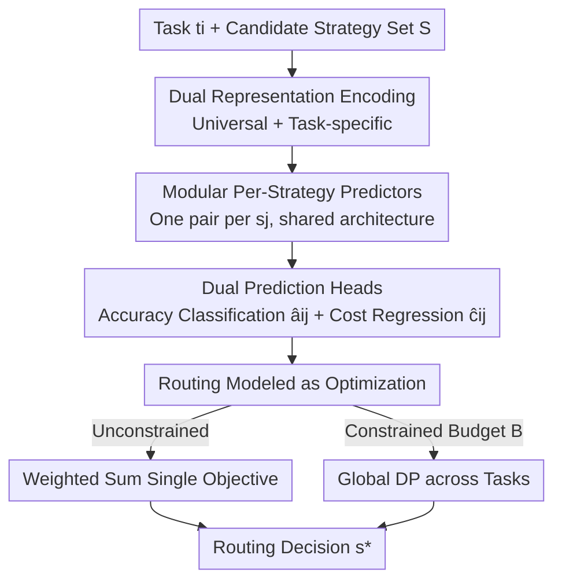

# CONCUR: A Framework for Continual Constrained and Unconstrained Routing

**Conference**: ICLR2026  
**OpenReview**: [https://openreview.net/forum?id=gCUY6QIv8r](https://openreview.net/forum?id=gCUY6QIv8r)
**Code**: https://peterbaile.github.io/concur/  
**Area**: LLM Efficiency / Model Routing  
**Keywords**: LLM routing, continual learning, modular predictors, accuracy-cost trade-off, constrained optimization

## TL;DR
CONCUR trains a pair of (accuracy classifier + cost regressor) predictors individually for each "model + decoding method" strategy. It then formulates the task assignment as an optimization problem with or without a budget. Consequently, when new strategies emerge, only new predictors need to be added without retraining the entire router. It achieves higher accuracy and lower inference FLOPs than the strongest single strategy and existing routing methods in both in-distribution and out-of-distribution, as well as constrained and unconstrained settings.

## Background & Motivation
**Background**: Different AI tasks vary significantly in difficulty, requiring different "compute strategies" (e.g., choice of large/small models, or whether to use Chain-of-Thought (CoT) decoding). An effective **router** should assign each task to the most cost-effective strategy, simultaneously improving overall accuracy while reducing latency and cost. Mainstream routing works (RouteLLM, EmbedLLM, RTR, etc.) typically **train a single model jointly on mixed data from all strategies** to predict the performance of each strategy at once.

**Limitations of Prior Work**: This monolithic "one model for all strategies" design has two major drawbacks. First, it involves **high costs in continual settings**: as stronger and more efficient models or decoding methods constantly emerge, incorporating a new strategy requires retraining the entire router from scratch using data from both "old and new strategies," which is computationally expensive. Failing to incorporate them timely results in missed opportunities for cost savings and performance gains. Second, the **representation is too thin**: existing methods often rely on a single representation (either only task-level or only strategy-level), which limits the expressive power and quality of routing decisions.

**Key Challenge**: Achieving "continual scalability" requires decoupling the model to a per-strategy granularity. However, existing modular attempts (Wang et al., 2025 uses different architectures for each strategy; Jitkrittum et al., 2025 relies on pre-defined prompts for zero-shot routing) sacrifice **generalization**—as architectures vary by strategy or are tied to specific prompts, it is difficult to extend seamlessly to unseen strategies. Thus, "modular scalability" and "generalization to new strategies" exist in tension.

**Goal**: To build a unified routing framework that covers four types of settings: ① continual/non-continual and ② constrained (with budget)/unconstrained (without budget), enabling the low-cost inclusion of new strategies while maintaining end-to-end accuracy and efficiency.

**Key Insight**: Routing is split into two steps—**prediction** (predicting accuracy and cost for each strategy on a given task) and **optimization** (solving the assignment problem using predicted values). The prediction step uses a **modular** structure (one pair of architecture-sharing predictors per strategy), where extending to a new strategy only affects the new predictors. Simultaneously, **multiple representations** (universal + task-specific) are fed into each predictor to enhance expressive power.

**Core Idea**: Replace joint prediction with "independent isomorphic predictors per strategy + dual-representation input + routing modeled as optimization," making continual routing both cost-effective and generalizable.

## Method

### Overall Architecture
CONCUR addresses the problem of determining which strategy to use for each task in a batch, given a set of candidate compute strategies $S$, to achieve high overall accuracy and low inference cost. It ensures minimal cost for extension when new strategies $S'$ are added. The process is divided into two sequential stages: "prediction" and "routing."

Prediction Stage: The task $t_i$ and strategy $s_j=(m_j, d_j)$ (model + decoding method) are encoded into **universal representations** and **task-specific representations**. These are fed into a **pair of predictors dedicated to strategy $s_j$**, which output the predicted accuracy $\hat a_{ij}$ and predicted cost $\hat c_{ij}$ (measured in FLOPs). Crucially, each strategy has its own pair of predictors, and all predictors share the same architecture—adding a new strategy only requires training its own predictors while keeping old ones intact.

Routing Stage: After obtaining all $(\hat a_{ij}, \hat c_{ij})$, the task assignment is formulated as an optimization problem. For unconstrained routing, this is a weighted trade-off between accuracy and cost. For constrained routing, it is accuracy maximization under a budget constraint (solved globally across the entire batch). The final routing decision is obtained by solving these problems.

### Key Designs

**1. Dual Representation Encoding: Enhancing routing expressive power**

To address the limitations of single-representation methods, CONCUR constructs and concatenates two sets of representations for each (task, strategy) pair. The **universal representation** uses a **frozen, off-the-shelf text embedding model** $R$ to encode task text, model descriptions, and decoding method descriptions: $g^t_i=R(t_i)$, $g^m_j=R(m_j)$, and $g^d_j=R(d_j)$, combined as $g_{ij}=[g^t_i; g^m_j; g^d_j]\in\mathbb{R}^{3k}$ to provide semantic signals. The **task-specific representation** utilizes learnable parameters: the task side uses a learnable linear projection $W_t R(t_i)$, while the model and decoding sides use **learnable embedding lookup tables** $E_M[m_j]$ and $E_D[d_j]$ to map IDs to trainable dense vectors, combined as $s_{ij}\in\mathbb{R}^{3k}$. Ablations (Table 7) show both complement each other—the universal representation provides transferable semantic priors, while the task-specific representation learns discriminative signals for specific model/decoding pairs.

**2. Modular Per-Strategy Predictors: Enabling low-cost strategy extension**

This is the core contribution. Unlike monolithic models trained on joint data, CONCUR **trains predictors for each strategy $s_j$ independently**, with all predictors **sharing the same architecture**. This design offers two properties: first, training a predictor for a strategy **only requires data for that strategy**, making strategies independent; second, when a new strategy $s'_j$ is introduced, **only its specific predictors are trained**, keeping old ones unchanged. This distinguishes CONCUR from Wang et al. (2025) and Jitkrittum et al. (2025) by being both modular and generalizable.

**3. Dual Prediction Heads: Independent estimation of accuracy and cost**

CONCUR **parameterizes two independent predictors** for each strategy: an accuracy predictor $f^a$ (binary classifier) and a cost predictor $f^c$ (regressor). Both use concatenated representations passed through two linear layers: $\hat a_{ij}=f^a([g_{ij}; s^a_{ij}])$ and $\hat c_{ij}=f^c([g_{ij}; s^c_{ij}])$. Training uses separate losses—cross-entropy $L_{acc}=-a_{ij}\log\hat a_{ij}-(1-a_{ij})\log(1-\hat a_{ij})$ for accuracy and mean squared error $L_{cost}=(c_{ij}-\hat c_{ij})^2$ for cost. FLOPs are used for cost to allow standardized comparisons across heterogeneous models. This separation allows each objective (discrete correctness vs. continuous compute) to be optimized independently.

**4. Routing Modeled as Optimization: Weighted sum and global DP**

With $\hat a_{ij}$ and $\hat c_{ij}$, routing is formulated explicitly as optimization. **Unconstrained routing** seeks an optimal trade-off using a weight $w$ to convert the dual objective into a single objective, solved independently for each task:

$$\max_j \sum_i \big(w\cdot a_{ij} + (1-w)\cdot(-c_{ij})\big) = \sum_i \max_j \big(w\cdot a_{ij}+(1-w)\cdot(-c_{ij})\big)$$

**Constrained routing** aims to maximize accuracy given a budget $B$ per task. The paper notes that "local" task-wise optimization is not globally optimal—averaging budget across tasks is wasteful; difficult tasks should receive more budget. Thus, **global optimization** is performed over $n$ tasks: $\max_{j,\,\sum_i c_{ij}\le nB}\sum_i a_{ij}$, solved via **dynamic programming (DP)** with complexity $O(n^2\cdot B|S|)$. This is efficient for reasonable batch sizes and strategy counts. Table 4 shows that transitioning from local to global optimization significantly improves accuracy (up to +5.7 / +4.0).

### Loss & Training
The accuracy predictor uses cross-entropy $L_{acc}$, and the cost predictor uses MSE $L_{cost}$, both trained independently per strategy. Ground truth labels are collected offline by running each strategy on every task. The modularity ensures that each predictor is only trained on its own strategy's data, which is the source of training time savings in continual settings.

## Key Experimental Results

### Main Results
Evaluation covers three task categories, each with one in-distribution and one out-of-distribution dataset: Multi-hop QA (2WikiMultiHop / HotpotQA), General Reasoning (MMLU / GPQA), and Math (GSM8k / SVAMP). The strategy set includes 5 LLMs (Qwen2.5 1.5B/3B/7B, Llama-3.2-3B, Llama-3.1-8B) × 2 decoding types (vanilla / CoT) = 10 strategies.

Unconstrained Routing · In-Distribution (Avg., Acc / FLOPs↓):

| Method | Avg. Acc | Avg. FLOPs↓ | Notes |
|------|---------|------------|------|
| Best single strategy | 74.3 | 41.63 | Qwen7B-CoT for all |
| RouteLLM | 53.5 | 10.20 | Accuracy below single strategy |
| EmbedLLM | 73.4 | 34.21 | Still below single strategy |
| RTR | 74.3 | 40.52 | Equal to single strategy |
| **CONCUR** | **75.2** | **36.50** | Highest Acc, lowest FLOPs among superior methods |

In out-of-distribution settings, CONCUR remains superior: Acc 62.6 vs. Single strategy 62.3 / RTR 62.4, with FLOPs 43.23 lower than RTR 45.00.

### Ablation Study
Representation Ablation (Unconstrained, In-Distribution Avg., Table 7):

| Configuration | Avg. Acc | Avg. FLOPs↓ | Notes |
|------|---------|------------|------|
| Universal only | 73.3 | 35.53 | Lacks discriminative signals |
| Task-specific only | 72.3 | 37.32 | Lacks semantic priors (MMLU drops to 68.5) |
| **Combined (CONCUR)** | **75.2** | 36.50 | Best performance |

Continual Routing training cost (Setting 2: Large + Small models mixed, relative training time, Table 5): CONCUR serves as the 1.00x baseline, achieving the highest Acc (75.2) and lowest FLOPs (36.50). In contrast, RTR with full retraining (FS) takes 7.66x, and EmbedLLM-FS takes 3.08x training time.

### Key Findings
- **Dual representations are essential**: Removing either reduced accuracy, proving that universal semantic priors and task-specific signals are complementary.
- **Global optimization significantly outperforms local**: In constrained settings, global allocation improved accuracy by up to +5.7 (low budget), showing that flexible budget allocation (spending more on hard tasks) is more effective.
- **Gains come from downgrading easy tasks**: Analysis in Table 6 shows CONCUR routes many tasks to smaller models or simpler decoding; most tasks maintain correctness with significantly lower FLOPs, while some even improve from incorrect to correct.
- **Continual setting saves training time**: Modularity allows CONCUR to skip retraining old predictors when introducing new ones, resulting in much lower training times than baselines.

## Highlights & Insights
- **Clean decomposition of "Modular Prediction + Optimized Routing"**: Replacing end-to-end routing with independent predictors + optimization makes continual extension additive and allows global DP solutions for constrained routing. This "learn to predict, don't learn to decide" paradigm is transferable to other "selection + budget" problems.
- **Using FLOPs instead of token counts** is a critical detail: Heterogeneous models have different per-token compute costs; token counts systematically underestimate large model costs, whereas FLOPs provide a fair efficiency proxy.
- **Global DP budget allocation** highlights that local task-wise optima $\neq$ global batch optima. Moving budget between tasks provides extra performance gains, which is valuable for real-world deployments with QPS or cost ceilings.

## Limitations & Future Work
- **Predictor quality determines routing upper bounds**: Large biases in accuracy or cost prediction will lead to suboptimal optimization results; generalization on out-of-distribution tasks remains a concern.
- **Strategy representations become fixed after training**, meaning CONCUR's modeling of "context-dependent behavior" of strategies might be limited—differences in a strategy's performance across tasks are mostly captured by task representations.
- **Ground truth labels require running every (task, strategy) pair**, which involves significant offline annotation costs when the number of strategies or training tasks is large.
- The DP complexity $O(n^2 B|S|)$ might struggle with very large batches or budgets; scalability under extreme settings remains to be verified.

## Related Work & Insights
- **vs RouteLLM (Ong et al., 2024)**: RouteLLM uses a single task representation and does not consider budget. CONCUR uses dual representations + modular predictors + explicit optimization, supporting constrained routing and improving accuracy from 53.5 to 75.2.
- **vs EmbedLLM (Zhuang et al., 2024)**: EmbedLLM predicts accuracy to select the best strategy but relies on a single task-specific representation. CONCUR wins on both accuracy and FLOPs.
- **vs RTR (Pan et al., 2025)**: RTR jointly predicts accuracy and cost but uses only a single universal representation. CONCUR is more comprehensive and reduces training time from 7.66x (RTR-FS) to 1.00x in continual settings.
- **vs Modular/Zero-shot routing**: CONCUR maintains isomorphism across predictors and does not restrict prompt diversity, balancing modularity and generalization better than prior attempts.

## Rating
- Novelty: ⭐⭐⭐⭐ The combination of modular per-strategy prediction and global DP for constrained routing is clear and effectively addresses continual routing pain points.
- Experimental Thoroughness: ⭐⭐⭐⭐ Covers various task types and settings (OOD, constrained, etc.) with solid ablation and source analysis; strategy set size is relatively small.
- Writing Quality: ⭐⭐⭐⭐ Logic is clear from motivation to experiments; high information density in tables and figures.
- Value: ⭐⭐⭐⭐ Continual routing is a real-world necessity. The modular design, FLOP-based measurement, and global allocation are highly practical.

<!-- RELATED:START -->

## Related Papers

- [\[ICLR 2026\] Merge before Forget: A Single LoRA Continual Learning via Continual Merging](merge_before_forget_a_single_lora_continual_learning_via_continual_merging.md)
- [\[ICML 2026\] Variational Routing: A Scalable Bayesian Framework for Calibrated MoE Transformers](../../ICML2026/llm_efficiency/variational_routing_a_scalable_bayesian_framework_for_calibrated_mixture-of-expe.md)
- [\[ICLR 2026\] Cactus: Accelerating Auto-Regressive Decoding with Constrained Acceptance Speculative Sampling](cactus_accelerating_auto-regressive_decoding_with_constrained_acceptance_specula.md)
- [\[ICLR 2026\] One-Prompt Strikes Back: Sparse Mixture of Experts for Prompt-based Continual Learning](one-prompt_strikes_back_sparse_mixture_of_experts_for_prompt-based_continual_lea.md)
- [\[ICLR 2026\] Efficient Resource-Constrained Training of Transformers via Subspace Optimization](efficient_resource-constrained_training_of_transformers_via_subspace_optimizatio.md)

<!-- RELATED:END -->
