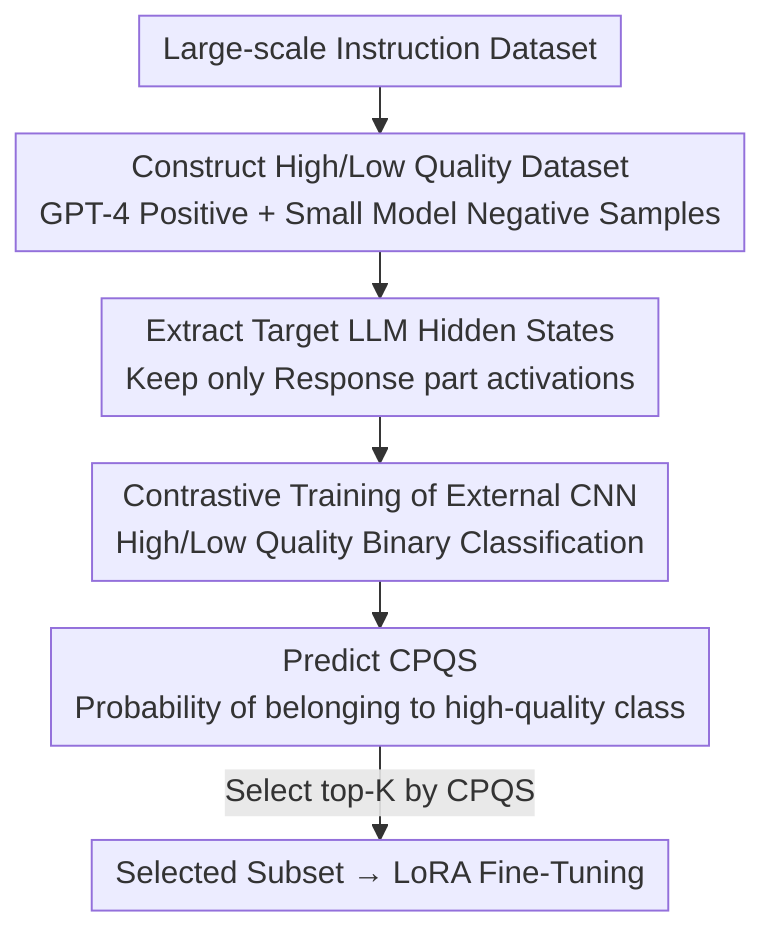

# CPQS-Tuning: A Model Self-Perception-Based Data Filtering Algorithm for Efficient Instruction Fine-Tuning

**Conference**: ICLR2026  
**OpenReview**: [https://openreview.net/forum?id=d57KvqmcBA](https://openreview.net/forum?id=d57KvqmcBA)  
**Code**: TBD  
**Area**: LLM Efficiency / Instruction Fine-Tuning / Data Filtering  
**Keywords**: Data Filtering, Instruction Fine-Tuning, Hidden States, Contrastive Perception Quality Score, Efficient Training

## TL;DR
This paper proposes CPQS-Tuning: instead of using external scoring models or manual metrics to filter instruction fine-tuning data, it directly reads the hidden states of the target LLM. A small CNN translates the model's "implicit evaluation" of data into a Contrastive Perception Quality Score (CPQS). Selecting less than 10% of high-quality data based on this score results in training performance that exceeds using the full dataset.

## Background & Motivation
**Background**: Instruction fine-tuning is a key method for improving LLM capabilities, but training corpora often contain large amounts of low-quality and redundant samples. Works like LIMA have demonstrated that a model can be well-tuned using only a thousand carefully selected high-quality instructions. Thus, selecting a small yet high-quality subset from large datasets has become a prominent direction for efficient fine-tuning. Prevailing methods generally fall into two categories: those using predefined reward models (e.g., ALPAGASUS using ChatGPT for scoring) and those using manually designed multi-dimensional metrics such as quality, coverage, and necessity (e.g., MoDS).

**Limitations of Prior Work**: The scoring criteria of these methods are all "external"—originating either from another strong model's preference or human-defined metrics. They **completely neglect information from the target LLM itself that is to be fine-tuned**. Whether a piece of data is "good" or not is determined by an external judge rather than the model that will eventually be trained on it.

**Key Challenge**: There is a mismatch between the evaluation criteria and the actual needs of the fine-tuned model. Data deemed high-quality by external models may not necessarily be useful for the target LLM; the value of the same data inherently differs across different models. Using a ruler unrelated to the target model naturally weakens the fine-tuning effect.

**Goal**: To make the filtering criteria "native to the target model"—finding a signal that reflects the target LLM's own perception of data quality and filtering data accordingly.

**Key Insight**: The authors propose a new perspective: **the hidden states (neuron activations) of an LLM implicitly encode its evaluation of training data quality**. To verify this hypothesis, they conducted a preliminary experiment: using Alpaca GPT4 generated by GPT-4 as high-quality data and responses re-generated by small models (Llama-3.2-1B, Qwen2.5-1.5B) as low-quality data. They took the last-layer hidden states of Qwen2.5-7B as embeddings to train a logistic regression classifier. The 5-fold cross-validation AUC reached 1.00, indicating that high and low-quality data are **linearly separable** in the hidden state space. This proves that hidden states indeed carry quality signals.

**Core Idea**: Use the hidden states generated when the target LLM processes data as features, and train a small external model (CNN) to decode this implicit evaluation, outputting a Contrastive Perception Quality Score (CPQS). Data is selected by ranking top-K based on CPQS, ensuring filtering criteria come from the model itself rather than external judges.

## Method

### Overall Architecture
The core of CPQS-Tuning is **training an external CNN specifically to "read" the hidden states generated by the target LLM while processing each data point, decoding the model's implicit judgement of quality**. The process involves four steps: constructing a dataset with high/low-quality labels → feeding them into the target LLM to extract hidden states → training a binary classification CNN using these hidden states → predicting CPQS during inference, where the probability of a sample belonging to the "high-quality" class serves as the score. The full dataset is ranked to select a top-K subset for LoRA fine-tuning.

### Key Designs

**1. Hidden States Encoding Quality Signals: Anchoring Filtering Standards to the Target Model**

This is the foundation of the paper, addressing the mismatch between external scoring and target model needs. Instead of asking other models or metrics, the data is fed to the **target LLM to be fine-tuned**, and its internal neuron activations (hidden states) are used as an "implicit score." Empirical evidence shows that in the hidden state space of Qwen2.5-7B, high and low-quality samples are linearly separable, with logistic regression reaching a 5-fold CV AUC of 1.00. This implies the model already "knows" which data is good during forward propagation; CPQS-Tuning simply extracts this information.

**2. High/Low-Quality Contrastive Dataset Construction: Creating Labels via Model Capability Gaps**

To train a classifier that reads hidden states, labeled data is needed, but "quality" is hard to annotate manually. The authors use a clever proxy: **Capability Difference = Quality Difference**. Positive samples (5,000) are randomly drawn from Alpaca GPT4 (triplets generated by GPT-4). Negative samples take the ⟨Instruction, Input⟩ from Alpaca GPT4 and use small models (Llama-3.2-1B-Instruct and Qwen2.5-1.5B-Instruct) to re-generate the Response (5,000 each, totaling 10,000). By using the same prompt with strong vs. weak models, the systematic difference lies primarily in "response quality," providing a clean contrastive signal for the CNN.

**3. Response Hidden State Extraction: Focusing on the Response Part**

Instruction fine-tuning quality primarily depends on the quality of the response rather than the instruction itself. Therefore, the internal reaction to the "Response" segment is where quality signals are most concentrated. The authors extract hidden states for **all layers** but **only for tokens corresponding to the Response**. Ablations show that using all layers is superior to any single segment of layers.

**4. Contrastive Training of CNN + CPQS Scoring: Quantifying Implicit Evaluation**

A simple CNN is used (outperforming MLPs) with 2D and 1D convolutions to capture spatial and sequential patterns in hidden state vectors. It is trained as a binary classifier using cross-entropy loss. Inspired by contrastive learning, the ratio of positive to negative samples is set to 1:2. During prediction, the probability of the CNN outputting "class 1 (high quality)" is taken as the CPQS:

$$\text{CPQS}_i = p_i = f(x_i)$$

Where $f(x_i)$ is the high-quality class probability. A higher CPQS indicates the LLM "values" the data more. The top-K samples are selected for the final subset:

$$D_{\text{selected}} = \text{topK}\big(\{\text{CPQS}_i\}_{i=1}^{N}\big)$$

## Key Experimental Results

Experiments used RTX 4090 GPUs, LLaMA-Factory for LoRA fine-tuning (bf16, 3 epochs, lr=5e-5, batch=16, α=8, r=16, max_len=2048), and vLLM for inference. Baseline methods include ALPAGASUS, MoDS, and Superfiltering.

### Main Results

General Domain Alpaca GPT4 (Llama2-7B), average scores across benchmarks and AlpacaEval win rates:

| Data Vol | Algorithm | Avg. Score (4 Benchmarks) | AlpacaEval |
|----------|-----------|---------------------------|------------|
| 1k       | **Ours**  | **52.68**                 | **55.98**  |
| 1k       | Superfiltering | 52.53                | 55.87      |
| 1k       | Alpagasus | 51.92                     | 49.65      |
| 5k       | **Ours**  | **54.40**                 | **59.94**  |
| 12k      | Alpagasus | 54.20                     | 58.80      |
| 52k      | Full      | 54.37                     | 59.81      |

Key conclusion: Using only 5k (less than 10% of 52k) outperforms the 12k Alpagasus subset and the full 52k dataset.

Reasoning Domain Reasoning-DeepSeek (Qwen2.5-7B-Instruct):

| Data Vol | Model | GSM8K | Math500 | HumanEval | GPQA | Avg. |
|----------|-------|-------|---------|-----------|------|------|
| —        | Base  | 76.27 | 73.40   | 64.02     | 30.30| 61.00|
| 10k      | **Ours**| 85.37 | 72.40   | 67.68     | 36.36| **65.45**|
| 113k     | Alpagasus | 84.84 | 66.52 | 64.63     | 28.18| 61.04|
| 146k     | Full  | 85.06 | 70.60   | 57.32     | 30.71| 60.92|

The 10k subset average (65.45) is 3.48 points higher than the full 146k dataset, indicating significant noise and redundancy in the full data.

### Ablation Study

Hidden layer selection ablation (Qwen2.5-7B-Instruct, CNN training with different layer segments):

| Segment | GSM8K | HumanEval | HumanEval-Plus |
|---------|-------|-----------|----------------|
| Full    | **84.91** | **80.0** | **74.4** |
| Early(9)| 84.23 | 75.0      | 70.1     |
| Middle(9)| 83.85 | 77.4     | 71.3     |
| Last(11)| 83.70 | 79.3      | 73.8     |
| Final(1)| 83.70 | 78.7      | 72.6     |

### Key Findings
- **Full Layers > Any Single Segment**: Using all hidden layers is optimal for math and code; different tasks rely on different layers, but combining all layers is most robust.
- **More Data is not Necessarily Better**: The 10k reasoning subset outperforms 146k, confirming noise/redundancy in full datasets.
- **CNN beats simpler models**: Simple CNNs capture spatial and sequential patterns in hidden state vectors better than MLPs.

## Highlights & Insights
- **The perspective of "model as its own judge" is clean**: It bypasses external rulers and aligns filtering standards with the target model directly.
- **The AUC=1.00 evidence is the highlight**: Proving linear separability of quality in hidden state space turns intuition into a verifiable fact.
- **Creating labels via capability gaps is a reusable trick**: This provides clean contrastive signals without manual annotation.
- **CPQS is prompt-insensitive**: It does not rely on the design of scoring prompts, making evaluation more stable and cheaper.

## Limitations & Future Work
- **Proxy assumption dependence**: Using small model responses as low-quality samples may not perfectly represent real-world low-quality distributions.
- **CNN training set is narrow**: Whether the classifier generalizes to vastly different domains (e.g., long-chain reasoning) requires further investigation.
- **Hidden state costs**: Storing all layers' hidden states for large models involves significant memory and storage overhead.
- **Future directions**: Diversifying negative samples, exploring joint/online updates of the LLM and CNN, and adding coverage/diversity constraints to CPQS.

## Related Work & Insights
- **vs ALPAGASUS**: ALPAGASUS uses an external strong model (ChatGPT) for scoring; CPQS-Tuning uses the target model's internal hidden states, avoiding prompt sensitivity and aligning criteria.
- **vs MoDS**: MoDS uses manual dimensions (quality, coverage, necessity); CPQS-Tuning internalizes quality judgment into a learned CNN, simplifying the process but currently lacking explicit coverage modeling.
- **vs Superfiltering**: Superfiltering uses small models to filter by "instruction following difficulty"; CPQS-Tuning focuses on the target model's implicit perception of quality.

## Rating
- Novelty: ⭐⭐⭐⭐⭐ The perspective that "hidden states encode data quality" is novel and supported by strong evidence (AUC=1.00).
- Experimental Thoroughness: ⭐⭐⭐⭐ Broad coverage of tasks and models; however, the proxy assumption for negative samples needs more robust analysis.
- Writing Quality: ⭐⭐⭐⭐ Clear methodology and well-supported motivation.
- Value: ⭐⭐⭐⭐ High practical value for efficient instruction fine-tuning, achieving better results with < 10% of data.

<!-- RELATED:START -->

## Related Papers

- [\[ICLR 2026\] Difficulty–Diversity Collaborative Filtering for Data-Efficient LLM Fine-Tuning](difficultydiversity_collaborative_filtering_for_data-efficient_llm_fine-tuning.md)
- [\[ICLR 2026\] Neuron-Aware Data Selection in Instruction Tuning for Large Language Models](neuron-aware_data_selection_in_instruction_tuning_for_large_language_models.md)
- [\[ICLR 2026\] Explainable Token-level Noise Filtering for LLM Fine-tuning Datasets](explainable_token-level_noise_filtering_for_llm_fine-tuning_datasets.md)
- [\[ICLR 2026\] Influence-Preserving Proxies for Gradient-Based Data Selection in LLM Fine-Tuning](influence-preserving_proxies_for_gradient-based_data_selection_in_llm_finetuning.md)
- [\[ACL 2026\] Small Data, Big Noise: Adversarial Training for Robust Parameter-Efficient Fine-Tuning](../../ACL2026/llm_efficiency/small_data_big_noise_adversarial_training_for_robust_parameter-efficient_fine-tu.md)

<!-- RELATED:END -->
