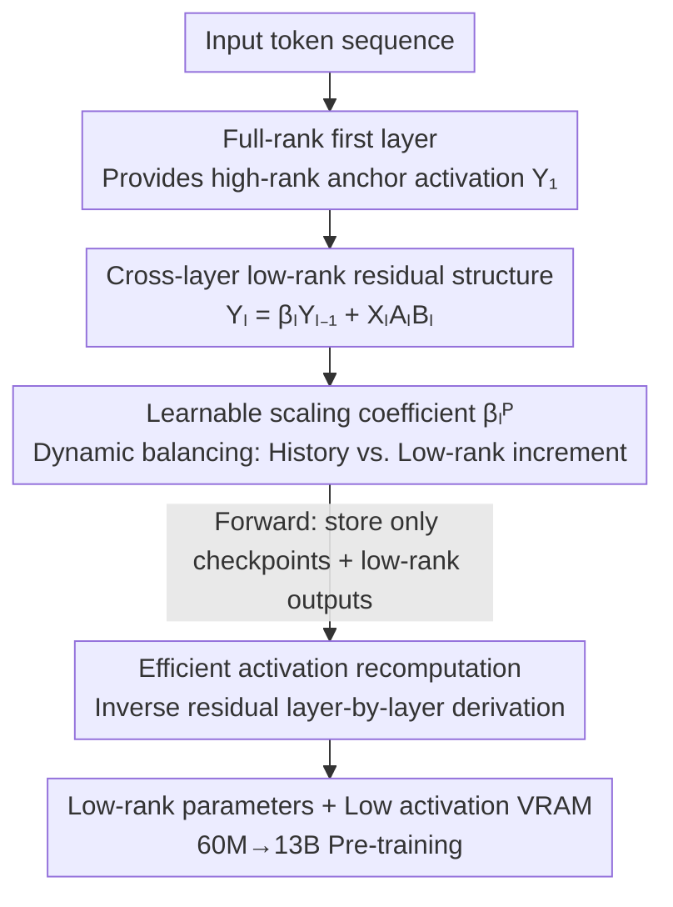

# CR-Net: Scaling Parameter-Efficient Training with Cross-Layer Low-Rank Structure

**Conference**: ICLR2026  
**OpenReview**: [https://openreview.net/forum?id=VVruwk9404](https://openreview.net/forum?id=VVruwk9404)  
**Code**: https://github.com/KongBoao/CR-Net  
**Area**: LLM Efficiency / Parameter-Efficient Training  
**Keywords**: Low-rank structure, Cross-layer residual, Efficient pre-training, Activation recomputation, Memory optimization

## TL;DR
CR-Net discovers that the "difference between adjacent layer activations" possesses a strong low-rank structure. Consequently, it reformulates every linear mapping as "previous layer activation × learnable scaling + low-rank increment." This design reduces parameters by half without losing high-rank information. When combined with an activation recomputation strategy specifically designed for this cross-layer dependency, it scales pre-training from 60M to 13B, consistently outperforming existing low-rank methods while consuming less VRAM and computation.

## Background & Motivation
**Background**: LLM pre-training is becoming increasingly expensive—scaling from GPT-3 2.7B to 175B increases VRAM and compute requirements by 66x. To suppress costs, low-rank structures have become the mainstream direction, primarily divided into two camps: **low-rank parameters** (LoRA and its variants, using two small matrices $A, B$ to replace full-rank weight updates) and **low-rank gradients** (GaLore, Apollo, etc., which project optimizer states into low-dimensional subspaces).

**Limitations of Prior Work**: The authors categorize the shortcomings of existing low-rank methods into three points. First (L1), low-rank parameterization leads to **performance degradation**—transformer weights are empirically near full-rank, and forcing low-rank constraints limits model capacity. While full-rank initialization, update aggregation, or non-linear operators can mitigate this, they consume the saved compute. Second (L2), low-rank gradient methods have **computation bottlenecks**—GaLore/FIRA require SVD to find subspaces, significantly slowing throughput, while random subspaces may cause degradation. Third (L3), almost all methods focus only on parameters/gradients/optimizer states, yet **ignore activation memory**—cached intermediate activations are typically 1–4x the model parameters and scale with batch size.

**Key Challenge**: A trade-off exists between low-rank cost savings and model capability. The root cause is that existing methods directly perform low-rank approximations on the **single-layer activation $Y_l^P$ itself**, which is actually near full-rank, leading to inevitable information loss.

**Goal**: To find a truly "naturally low-rank" target for approximation, thereby saving parameters without performance loss while simultaneously reducing activation memory.

**Key Insight**: The authors observe a structural property previously unreported—it is the **difference between adjacent layer activations $Y_l^P - \beta_0 Y_{l-1}^P$ that is truly low-rank**, rather than the activations themselves. Intuitively, the transformer's residual structure makes adjacent layer activations highly correlated, leaving only a small amount of "incremental information" in the difference.

**Core Idea**: Reconstruct the current layer activation using "previous layer activation + low-rank difference," i.e., $Y_l^P \approx \beta_0 Y_{l-1}^P + \mathrm{LR}_r(\Delta_{\beta_0} Y_l^P)$. This formula is directly solidified into the network architecture (cross-layer low-rank residual), representing high-rank activations with low-rank parameters.

## Method

### Overall Architecture
CR-Net (Cross-layer low-Rank residual Network) is built on the LLaMA-2 architecture (including SwiGLU, omitting LayerNorm and RoPE for simplification). Its core modification is that, **except for the first layer, every linear projection $P\in\{Q,K,V,O,\text{gate},\text{up},\text{down}\}$ in every layer no longer uses full-rank weights $W_l^P$ but calculates output via "cross-layer residual + low-rank increment."**

The pipeline operates as follows: inputs first pass through a **full-rank first layer** (providing high-rank "anchor" activations to prevent initial low-rank collapse). From the second layer onwards, each linear layer's activation = previous layer's corresponding activation multiplied by a **learnable scaling coefficient $\beta_l^P$** + low-rank increment obtained by passing the current input through two small matrices $A_l^P B_l^P$. During backpropagation, most activations are not stored; instead, a **custom recomputation strategy** is used—storing only activations of a few "checkpoint layers" and all low-rank outputs, while other activations are derived layer-by-layer via the inverse operation of the cross-layer residual. This saves half the parameters, significantly reduces activation memory, and preserves high-rank information throughout the residual chain starting from the full-rank first layer.

### Key Designs

**1. Cross-layer low-rank activation difference: Applying "low-rank" to truly low-rank objects**

This is the foundation of the paper, targeting L1—the near full-rank nature of single-layer activations. The authors first verify an observation: reconstructing $Y_l^P$ using "historical activation + low-rank difference" $\tilde Y_{l,\beta_0}^P := \beta_0 Y_{l-1}^P + \mathrm{LR}_r(\Delta_{\beta_0} Y_l^P)$ yields a much smaller relative error than a direct low-rank approximation $\mathrm{LR}_r(Y_l^P)$ of the same rank. Here $\mathrm{LR}_r(A):=\arg\min_{\Lambda}\|A-\Lambda\|_F^2,\ \text{s.t.}\ \mathrm{rank}(\Lambda)\le r$ is the optimal $r$-rank approximation in the Frobenius sense. Using LLaMA-3 8B and GPT-2 small with $r=0.25h$, the relative error at all projection points is reduced to 0.4–0.97x. This confirms that "low-rank activation difference" is a genuine structure across models and training stages. CR-Net is therefore **not a simple extension of LoRA**—it changes the object being low-ranked.

**2. Cross-layer low-rank residual structure: Solidifying observations into weights**

Since $\Delta_{\beta_0}Y_l^P$ is naturally low-rank, the authors decompose the full-rank weights $W_l^P\in\mathbb{R}^{h_{in}\times h_{out}}$ into two low-rank learnable matrices $A_l^P\in\mathbb{R}^{h_{in}\times r}$ and $B_l^P\in\mathbb{R}^{r\times h_{out}}$ ($r<\min\{h_{in},h_{out}\}$). From the second layer, activations are computed as $Y_l^P = \beta_0 Y_{l-1}^P + X_l^P A_l^P B_l^P$. This step transforms the "low-rank difference approximation" into a forward computation graph. Unlike the LoRA family which repeatedly approximates activations and accumulates loss, CR-Net only applies low-rank to the "increment," allowing high-rank information to pass losslessly through the residual chain. This simultaneously addresses L1 (no degradation) and L2 (no SVD required, standard optimization is sufficient).

**3. Learnable scaling coefficient $\beta_l^P$ and full-rank first layer: Stabilizing high-rank information**

A fixed $\beta_0$ lacks flexibility, so the authors upgrade it to a **per-layer, per-position learnable scalar $\beta_l^P$**, formulated as $\mathrm{sign}(\beta_l^P)(|\beta_l^P|+\varepsilon)$ (where $\varepsilon=10^{-6}$ prevents zero coefficients). The complete structure is:

$$Y_l^P = \begin{cases} X_l^P W_l^P, & l=1,\\ \mathrm{sign}(\beta_l^P)(|\beta_l^P|+\varepsilon)\,Y_{l-1}^P + X_l^P A_l^P B_l^P, & l=2,\dots,L. \end{cases}$$

$\beta_l^P$ allows the model to adaptively balance between "historical activation" and "low-rank increment." This enables the network to interpolate smoothly between shallow, expressive layers and deep, low-rank transitional layers. Combined with the **full-rank first layer $W_1^P$** providing a high-rank anchor, CR-Net avoids the collapse into low-dimensional subspaces or numerical instability common in low-rank training without requiring hard projection constraints like QR/SVD. Table 6 confirms this: on a 350M model, applying low-rank to the first layer degrades PPL from 18.95 to 19.68 at 6.4B tokens.

**4. Efficient activation recomputation: Backpropagation strategy tailored for cross-layer dependency**

Cross-layer residuals introduce a side effect—a layer's activation depends on all preceding layers (L2-level dependency). Standard gradient checkpointing (GCP) would require re-running all preceding layers, incurring $O(L^2)$ overhead. The authors customize recomputation: forward storage includes only three things—layer inputs $X_l$, a **subset of checkpoint layers** $A$ (size $|A|=L/8$, forcing $L\in A$ and $1\notin A$), and all low-rank outputs $X_l^P A_l^P$. During backpropagation, if $Y_l^P$ is cached, it is used directly; otherwise, it is derived via the **inverse operation**:

$$Y_l^P = \frac{1}{\mathrm{sign}(\beta_{l+1}^P)(|\beta_{l+1}^P|+\varepsilon)}\big(Y_{l+1}^P - X_{l+1}^P A_{l+1}^P B_{l+1}^P\big).$$

This strategy allows lossless layer-by-layer activation recovery while preventing cumulative error. Ultimately, CR-Net reduces total compute overhead by 67.4% compared to vanilla GCP and 8.0% compared to CoLA-M, with even lower activation memory.

### Loss & Training
The training objective is standard LLM pre-training (language modeling on C4-en) using the Adam optimizer, without extra subspace projection steps. In terms of complexity, the first layer is the same as full-rank, while remaining layers have parameters totaling $(L-1)(11hr+3h_{ff}r)$. At $r\approx 0.25h$, parameters are reduced by ~50%. Since LLaMA uses $h_{ff}\approx 8h/3$, CR-Net's FLOPs per step are lower than full-rank as long as $r<0.5h$.

## Key Experimental Results

### Main Results
Pre-training LLaMA-2 on C4-en across scales from 60M to 13B. Comparisons are made against parameter-efficient methods by alignment of parameter counts (marked ♢) and optimizer-efficient methods by alignment of memory (marked †). Validation Perplexity (PPL, lower is better):

| Model Scale | Metric | CR-Net | Full-rank | CoLA | Apollo |
|-------------|--------|-------|-----------|------|--------|
| 60M | PPL | **32.76** | 34.06 | 34.04 | 31.55 |
| 130M | PPL | 24.31♢ | 24.36 | 24.48 | 22.94 |
| 350M | PPL | 18.95♢ | 18.80 | 19.40 | 16.85 |
| 1B | PPL | 15.22♢ | 15.56 | 15.52 | 14.20 |
| 1B | Params(M)| **583** | 1339 | 609 | 1339 |

When aligned by parameters, CR-Net at 1B even outperforms full-rank training while reducing parameters by 56.5% and compute by 63.2%. When aligned by memory (†) at scales > 1B, it outperforms optimizer-efficient methods like GaLore/RSO/Apollo.

LLaMA-2 7B (with recomputation) and 13B:

| Task | Steps | CR-Net | Best Baseline |
|------|-------|--------|---------------|
| 7B | 80K | **13.72** | CoLA-M 13.82 |
| 7B | 65K | **16.01** | CoLA-M 16.21 |
| 13B | 40K | 18.12 | 8-bit Adam 17.85 |

At 7B, CR-Net consistently outperforms CoLA-M with lower VRAM. At 13B, it saves 50%+ parameters with only ~2% PPL degradation.

### Ablation Study

| Configuration | Key Metric | Description |
|---------------|------------|-------------|
| CR-Net (Full-rank first layer, 350M/6.4B) | PPL 18.95 | Complete model |
| Low-rank first layer | PPL 19.68 | Removing full-rank first layer causes significant drop |
| Removing learnable $\beta_l^P$ | Worse convergence | Scaling coefficients aid convergence (Sec 5.2) |
| Rank configuration | — | Higher rank in middle layers, lower at ends is best |

Activation memory and recomputation complexity (LLaMA2-7B, $r=512$, batch 16): CR-Net recomputation memory is 23.35 GB (0.456x vanilla GCP), and FLOPs are $0.692\times10^{15}$ (0.326x), both superior to CoLA-M.

### Key Findings
- **Full-rank first layer is crucial for stable training**: Removing it degrades PPL significantly, supporting the "high-rank anchor" motivation.
- **Rank should be allocated by layer**: Granting higher rank to middle layers and lower rank to prefix/suffix layers yields better results, indicating non-uniform information density.
- **Learnable $\beta_l^P$ improves convergence**: Adaptive balancing is more stable than fixed coefficients.
- **Advantages scale with model size**: In scales > 1B, particularly 7B/13B, CR-Net's lead over optimizer-efficient methods becomes more prominent.

## Highlights & Insights
- **Shifting the target of low-rank**: While others apply low-rank to "activations" or "gradients," CR-Net identifies that "activation differences" are truly low-rank. By applying the compression to the right target, it saves parameters without loss.
- **Embedding empirical observations into architecture**: The design is highly self-consistent—from the observation of "low-rank differences" to the forward formula $Y_l = \beta Y_{l-1} + XAB$, to the inverse recomputation.
- **Invertibility solves activation memory for free**: The residual structure's invertibility allows layer-by-layer back-derivation of activations, naturally benefiting activation VRAM as a side effect of structural design.
- **Stability without hard constraints**: Using a full-rank first layer and learnable scalars instead of QR/SVD is efficient and avoids training collapse.

## Limitations & Future Work
- **Reliance on empirical observation**: While "low-rank activation difference" was verified across models, it lacks a rigorous theoretical guarantee in this paper. Its validity on non-LLaMA architectures remains to be tested.
- **Slightly behind full-rank at 13B**: CR-Net (18.12 PPL) trails 8-bit Adam (17.85 PPL) at 13B/40K, suggesting potential capacity limits at larger scales.
- **Extra storage in recomputation**: Compared to vanilla GCP, CR-Net's recomputation caches low-rank outputs—trading a small amount of VRAM for significant compute savings, which may need consideration in extremely VRAM-constrained scenarios.
- **Manual rank allocation**: The "middle-high, ends-low" rank configuration was found experimentally; an automated mechanism for determining per-layer rank is missing.

## Related Work & Insights
- **vs. LoRA / ReLoRA**: These replace weight updates with low-rank matrices, causing information loss; CR-Net applies low-rank only to "increments" while the high-rank backbone remains lossless, achieving better PPL at the same parameter count.
- **vs. CoLA**: CoLA adds non-linearity to low-rank outputs to recover capacity but adds compute; CR-Net simplifies this with cross-layer residuals, achieving better performance at lower $r$ and saving 8% compute over CoLA-M.
- **vs. GaLore / Apollo**: These compress gradients via SVD or random projections; SVD hurts throughput and random projections hurt performance. CR-Net is parameter-side low-rank with standard Adam, outperforming them when memory is aligned at > 1B scales.
- **vs. Gradient Checkpointing (GCP)**: Vanilla GCP would suffer $O(L^2)$ overhead due to CR-Net's cross-layer dependencies; the custom strategy reduces this to manageable levels.

## Rating
- Novelty: ⭐⭐⭐⭐⭐ Proposes and verifies the "low-rank activation difference" property and engineers it fully.
- Experimental Thoroughness: ⭐⭐⭐⭐⭐ Covers scales from 60M to 13B with multi-dimensional comparisons of parameters/VRAM/throughput.
- Writing Quality: ⭐⭐⭐⭐ Logically self-consistent (observation → structure → recomputation), with minor layout/typing flaws.
- Value: ⭐⭐⭐⭐⭐ High practical value by changing the object of low-rank compression to save half the parameters without degradation.

<!-- RELATED:START -->

## Related Papers

- [\[ICLR 2026\] LoRA-S: An Efficient Low Rank Adaptation scheme via Sylvester equation](lora-s_an_efficient_low_rank_adaptation_scheme_via_sylvester_equation.md)
- [\[ICLR 2026\] BoRA: Towards More Expressive Low-Rank Adaptation with Block Diversity](bora_towards_more_expressive_low-rank_adaptation_with_block_diversity.md)
- [\[ICLR 2026\] Reconstructing KV Caches with Cross-Layer Fusion for Enhanced Transformers](reconstructing_kv_caches_with_cross-layer_fusion_for_enhanced_transformers.md)
- [\[ICLR 2026\] Revisiting Parameter Server in LLM Post-Training](revisiting_parameter_server_in_llm_post-training.md)
- [\[ICLR 2026\] BA-LoRA: Bias-Alleviating Low-Rank Adaptation to Mitigate Catastrophic Inheritance in Large Language Models](ba-lora_bias-alleviating_low-rank_adaptation_to_mitigate_catastrophic_inheritanc.md)

<!-- RELATED:END -->
