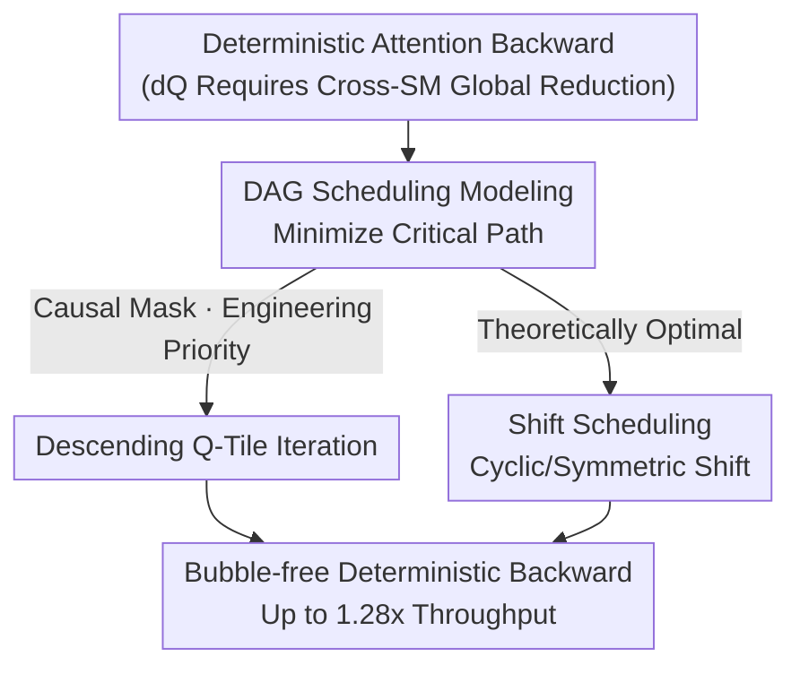

# DASH: Deterministic Attention Scheduling for High-throughput Reproducible LLM Training

**Conference**: ICLR2026  
**OpenReview**: [https://openreview.net/forum?id=bMi5ssfPoM](https://openreview.net/forum?id=bMi5ssfPoM)  
**Code**: https://github.com/SJTU-Liquid/deterministic-FA3  
**Area**: LLM Efficiency / GPU Kernel Optimization / Training Systems / Reproducibility / Attention  
**Keywords**: Deterministic Training, FlashAttention, Backward Scheduling, Critical Path, Pipeline Bubble

## TL;DR
DASH abstracts deterministic attention backward propagation as a DAG scheduling problem with the goal of minimizing critical path length. By employing two complementary strategies—"Descending Q-Tile Iteration" and "Shift Scheduling"—it eliminates pipeline bubbles, achieving up to a $1.28\times$ throughput improvement for deterministic attention backward operators on H800 compared to FlashAttention-3's deterministic mode, making reproducible LLM training nearly cost-free.

## Background & Motivation
**Background**: Large-scale LLM training involves tens of thousands of GPUs and extreme costs. Determinism (bit-wise consistency across runs) has become standard industry practice for reproducing loss spikes, diagnosing training instabilities, and evaluating architectural changes cleanly. FlashAttention-3 provides a "deterministic mode" for this purpose.

**Limitations of Prior Work**: Determinism is particularly expensive in attention backward propagation. FlashAttention-3's deterministic backward can lose up to 37.9% throughput compared to its non-deterministic version. The root cause is that $dQ$ requires reduction along the KV-axis. To expose parallelism, implementations partition the KV dimension across different SMs, meaning each query's $dQ$ is scattered and requires **cross-SM global reduction**. Non-deterministic implementations use concurrent `atomicAdd`, but floating-point addition is non-associative ($(10^8+10^{-6})-10^8=0$ while $10^8-10^8+10^{-6}=10^{-6}$); inconsistent completion orders lead to bit-wise discrepancies. Determinism requires using barriers to force **serialization into a fixed order** (e.g., by CTA ID), which results in pipeline stalls.

**Key Challenge**: The authors point out that the 37.9% loss is **not an inevitable cost of serialization itself**, but rather a conflict between "tile computation scheduling" and a "rigid, pre-defined accumulation order." Computation scheduling and accumulation order are tightly coupled and cannot be optimized in isolation—naive scheduling forces reductions to start sequentially, creating bottlenecks, whereas ideal scheduling could allow different SMs to begin reductions on different tiles in parallel.

**Goal**: To **jointly optimize** the execution scheduling and accumulation order of backward propagation while maintaining determinism (fixed accumulation order), thereby minimizing pipeline bubbles (SM idling).

**Key Insight**: Since "scheduling + accumulation order" is essentially a scheduling problem with dependency constraints, it can be formalized as a graph theory problem using critical path length as an optimizable objective with theoretical guarantees.

**Core Idea**: Model deterministic attention backward as a DAG, prove a lemma regarding which dependency edges can be inserted without extending the critical path, and design schedules that allow SMs to perfectly offset and perform reduction without conflicts.

## Method

### Overall Architecture
DASH is a **pure scheduling-layer** optimization: it does not change the mathematics of attention backward ($dQ/dK/dV$ calculations remain the same) nor does it relax determinism constraints (accumulation order remains fixed). It simply Rearranges "which SM handles which tile at what time, and in what order reductions are performed" to squeeze out pipeline bubbles introduced by serialization.

The logic is: first, **abstract the backward execution into a DAG** (each tile task is a chain of "compute $C_{i,j} \rightarrow$ reduce $R_{i,j}$", with zero-weight dependency edges inserted between tasks to encode valid accumulation orders), aiming to minimize the critical path length of this graph. All operations for the same KV tile must run **continuously** on the same SM to reuse $dK/dV$ accumulators in registers (a core constraint). Under this model, the authors provide two complementary strategies: a simple heuristic for causal masks (Descending Q-Tile Iteration) and a **provably optimal** Shift Scheduling (Cyclic Shift for full masks, Symmetric Shift + Two-stage Folding for causal masks). Finally, a lemma proves these schedules do not extend the critical path.

### Key Designs

**1. DAG Scheduling Modeling: Turning Deterministic Backward into a Provable Scheduling Problem**

The authors formalize backward propagation as a Directed Acyclic Graph: each tile task is built as a linear path consisting of two edges—a computation phase (duration $c$) and a subsequent global reduction phase (duration $r$), where edge weights represent execution time. Zero-weight dependency edges are inserted between tasks to encode valid accumulation orders and data dependencies. Thus, edge weights characterize "duration," the topology characterizes "sequential constraints," and the optimization goal is to minimize the $\text{critical path}$ length, which directly corresponds to end-to-end latency. A hard constraint from GPU architecture: to keep $dK/dV$ accumulation in the fastest registers, all edges for a KV tile must form an **uninterruptible continuous chain** on a single SM. The value of this modeling lies in turning "scheduling quality" from empirical tuning into a provable graph theory proposition. Under this model, the authors analyze the FlashAttention-3 baseline: under a full mask, bubbles only exist during the startup phase ($T_{\text{full}}\approx m\cdot n\cdot(c+r)+(n-1)\cdot r$); however, with a causal mask, dependencies insert a large bubble **inside every attention head**, causing the critical path $T_{\text{head}}=n(c+r)+(n-1)r$ to repeat for each head, which is the root cause of causal slowness.

**2. Descending Q-Tile Iteration: Reversing Q-Tile Traversal to Release Dependencies Early and Fill Pipelines Across Heads**

This is a "simple but effective" heuristic for causal masks: **reverse** the traversal order of query (Q) tiles. In causal scenarios, task lengths for different Q-tiles are uneven (earlier KV tiles participate in more interactions). Forward traversal keeps long tasks at the front, leaving SMs for shorter tasks idle early with nothing to do. By reversing the order, **short tasks complete first**, releasing SMs earlier so that the **next attention head can immediately take over these idle SMs**. This almost flattens the gaps between heads, forming a tightly coupled pipeline. With an even number of $m$ heads, total execution time drops to $T_{\text{reversed}}\approx \frac{m(n+1)(c+r)}{2}+(n-1)\cdot r$, a significant contraction compared to the baseline's one-large-bubble-per-head. Its advantage is extremely low implementation cost (just reversing the loop direction) without increasing register pressure, making it more practical than theoretical optima in resource-constrained scenarios like large head dimensions (headdim=128).

**3. Shift Scheduling: Cyclic/Symmetric Shift for Collision-Free Reduction Approaching DAG Theoretical Lower Bounds**

This is the **provably optimal** scheduling under the DAG model, relying on a lemma: given a set of parallel isomorphic chains with zero-weight dependency edges, the critical path length remains unchanged if and only if every new edge $(u,v)$ satisfies $\text{depth}(u)\le \text{depth}(v)$. Physically, this means two tiles contributing to the same $dQ_j$ **cannot execute simultaneously on different SMs**; otherwise, the reduction would conflict and force serialization (inserting a reverse edge $\text{depth}(u)>\text{depth}(v)$), violating the lemma and lengthening the critical path. The goal becomes twofold: load balancing + collision-free reduction order. For **full masks**, where KV tile workloads are identical, the authors use Cyclic Shift: $SM_i$ processes KV blocks in the order $(i, i+1, \dots, n-1, 0, \dots, i-1)$. This offset naturally creates a conflict-free serial reduction order for each $dQ$ block that is balanced and satisfies the lemma, making it theoretically optimal ($T_{\text{full opt}}=m\cdot n\cdot(c+r)$). For **causal masks**, where workloads decrease linearly and are highly imbalanced, the authors use **Symmetric Shift Scheduling**: SMs pair KV blocks $i$ and $n-1-i$ (longest with shortest) to level the chain length for each SM. They then use **two-stage scheduling**: Phase 1 performs cyclic shifts on the dense lower-left rectangle to fill the pipeline; Phase 2 uses "workload folding" to logically map the lower-right triangle onto the masked empty slots of the upper-left, forming a conceptual square without data movement. This is equivalent to a diagonal-initialized shift schedule on that square. This maintains balance, ensures continuous computation for each KV block, and satisfies Lemma 1's monotonic depth accumulation, ultimately zeroing out causal bubbles ($T_{\text{causal opt}}=\frac{m(n+1)(c+r)}{2}$).

### Loss & Training
Ours does not involve changes to training objectives or loss functions; it is a pure GPU kernel scheduling optimization. All kernels are extended from the FlashAttention-3 implementation using Triton 3.4 / CUDA 12.6, evaluated on NVIDIA H800 with BF16 random inputs.

## Key Experimental Results

### Main Results
Total tokens fixed at 16,384, hidden dimension at 2,048, sequence lengths from 512 to 16,384, head dimensions 64/128, measuring backward operator throughput (TFLOPS).

| Scenario | Method | Relative to FA3 Deterministic | Remarks |
|------|------|------|------|
| Backward Operator (Overall) | DASH (Both strategies) | **Up to 1.28x** | Significantly narrows the gap with non-deterministic |
| Full mask | Shift Scheduling | Better than baseline for most seqlen | Slight drop at seqlen=16384 due to remote L2 access |
| Causal mask, headdim=64 | Symmetric Shift | Highest | Maximum load balancing gain |
| Causal mask, headdim=128 | Descending | Surpasses Symmetric Shift | Symmetric shift spills under register pressure |

### End-to-end and Numerical Validation

| Configuration | Metric | Result |
|------|------|------|
| Causal Models (LLaMA3-8B/Qwen2.5-7B/Mistral-8x7B, 8k/16k/32k) | Transformer block speedup | 2%–10% |
| Full mask Models (SAM-ViT-Huge / SD3.5 / LLaDA-1b, 4k, bs=16) | Speedup | ≈4% |
| Overall Average | End-to-end speedup | ≈5% (consistent with mega-GPU cluster training experience) |
| Bit-wise Consistency (Table 1) | Non-deterministic run-to-run dev | Full $2.4\times10^{-4}$ / Causal $4.9\times10^{-4}$; Deterministic always **0** |

### Key Findings
- **Theoretical optimum $\neq$ practical optimum**: This is the most important insight. Symmetric Shift is provably optimal in the DAG model, but at headdim=128, its complex folding state uses ~10 additional registers, pushing the per-thread count over the hardware limit. This triggers register spilling to slow local memory, allowing the simpler Descending method to surpass it.
- **Hardware realities can override algorithmic advantages**: Shift Scheduling degrades at seqlen=16384 because the model assumes zero-cost dependency edges. In reality, cross-SM synchronization goes through L2 cache (~200 cycles local, >500 cycles remote). Under extreme parallelism (128 SMs), the frequency of remote L2 signals makes complex dependency graphs more sensitive.
- Thus, the two causal strategies are **complementary**: Symmetric Shift is theoretically optimal, while Descending is the practical choice for current GPU head dimensions. The authors expect Symmetric Shift’s advantages to fully realize on Blackwell (larger registers/TMEM).

## Highlights & Insights
- **Translating engineering performance into provable graph theory**: Using DAGs, critical paths, and a "monotonic depth" lemma transforms the question of "how to schedule" from guesswork into a proof. This paradigm is highly transferable to other deterministic operators (GEMM split-K, normalization, etc.).
- **One-line engineering tricks can be invaluable**: Descending Q-Tile Iteration is essentially just "reversing the Q loop." With near-zero implementation cost, it fills causal bubbles by ensuring "short tasks release SMs first for the next head to take over."
- **Symmetric pairing + two-stage folding is clever**: Mapping triangular imbalanced workloads into a logical square without moving data fulfills both load balancing and deterministic order constraints simultaneously.
- **Honesty regarding the theory-hardware gap**: The paper does not hide Shift Scheduling's degradation at long sequences/large head dimensions. Instead, it explains register spilling and remote L2 latency, providing more value than just reporting a new SOTA.

## Limitations & Future Work
- **DAG model is a simplified abstraction**: The model assumes zero-cost dependency edges and does not predict real execution times, leading to gaps with actual GPU behavior at high sequence lengths.
- **Optimal strategies are constrained by current hardware**: Symmetric Shift's theoretical edge is blunted by register pressure on H800. It requires larger on-chip resources (Blackwell/TMEM) or kernel designs with looser register constraints.
- **Gains are concentrated in the backward operator**: While the operator gains up to $1.28\times$, end-to-end gains are ~5% because attention backward is only part of the transformer block. Gains are diluted in models with larger FFN ratios.
- **Scope**: The method assumes the number of KV tiles equals the number of SMs (aligned via conceptual refinement/head aggregation) and specifically targets global reduction in attention backward. Other sources of non-determinism (e.g., small batch GEMM requiring split-K) are not covered.

## Related Work & Insights
- **vs FlashAttention-3 Deterministic Mode**: FA3 uses barriers to force serial accumulation by CTA ID, but rigid coupling between scheduling and order creates bubbles. DASH jointly optimizes these to eliminate bubbles under the same constraints.
- **vs Triton tutorial Deterministic / FlashAttention-2**: These either split $dK/dV$ and $dQ$ into different passes (extra K/V reads) or materialize per-tile $dQ$ partials (extra memory + reduction kernels). DASH avoids extra I/O by optimizing execution and accumulation order.
- **vs Distributed Cyclic Scheduling (RingAttention / StripedAttention / LoongTrain)**: These methods use ring/phase-shifts to overlap communication and computation **across devices**. DASH applies shift strategies **within a single GPU** to coordinate deterministic accumulation and load balancing.
- **vs Inference Determinism (batch-invariant kernels)**: Prior work attributes inference non-reproducibility to a lack of "batch-invariance." DASH targets run-to-run determinism during training (where batch config is fixed).

## Rating
- Novelty: ⭐⭐⭐⭐⭐ First to formalize deterministic attention backward as a DAG with optimality proofs.
- Experimental Thoroughness: ⭐⭐⭐⭐ Complete operator, end-to-end, and numerical validation with honest analysis of degradation, though limited to H800.
- Writing Quality: ⭐⭐⭐⭐⭐ Clear logic chain from problem modeling to lemmas and scheduling diagrams.
- Value: ⭐⭐⭐⭐⭐ Makes deterministic reproducible training nearly "free," highly relevant to industry.

<!-- RELATED:START -->

## Related Papers

- [\[NeurIPS 2025\] Efficient Training-Free Online Routing for High-Volume Multi-LLM Serving](../../NeurIPS2025/llm_efficiency/efficient_training-free_online_routing_for_high-volume_multi-llm_serving.md)
- [\[ICLR 2026\] Revisiting Parameter Server in LLM Post-Training](revisiting_parameter_server_in_llm_post-training.md)
- [\[ICLR 2026\] A Two-Phase Deep Learning Framework for Adaptive Time-Stepping in High-Speed Flow Modeling](a_two-phase_deep_learning_framework_for_adaptive_time-stepping_in_high-speed_flo.md)
- [\[ICLR 2026\] RACE Attention: A Strictly Linear-Time Attention Layer for Training on Outrageously Large Contexts](race_attention_a_strictly_linear-time_attention_layer_for_training_on_outrageous.md)
- [\[ICLR 2026\] Dynamic-dLLM: Dynamic Cache-Budget and Adaptive Parallel Decoding for Training-Free Acceleration of Diffusion LLM](dynamic-dllm_dynamic_cache-budget_and_adaptive_parallel_decoding_for_training-fr.md)

<!-- RELATED:END -->
