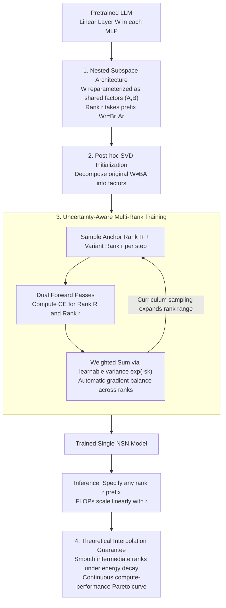

# Deep Hierarchical Learning with Nested Subspace Networks for Large Language Models

**Conference**: ICLR 2026  
**arXiv**: [2509.17874](https://arxiv.org/abs/2509.17874)  
**Code**: [https://github.com/pauliusrauba/nested-subspace-networks](https://github.com/pauliusrauba/nested-subspace-networks)  
**Area**: LLM Efficiency  
**Keywords**: Nested subspaces, dynamic inference, low-rank decomposition, uncertainty-aware training, elastic computation

## TL;DR
The paper proposes Nested Subspace Networks (NSN), which utilize low-rank decomposition to form strictly nested subspace hierarchies in linear layers. Combined with uncertainty-aware multi-rank training, a single model can adjust the trade-off between computation and performance on-the-fly during inference (50% FLOPs reduction with only 5% accuracy loss) and can be applied post-hoc to pretrained LLMs.

## Background & Motivation

**Background**: Large neural networks typically have fixed computation budgets, lacking flexibility in resource-constrained or dynamic environments. Prevailing compression methods (pruning, distillation, LoRA) produce static models that cannot be adjusted at runtime.

**Limitations of Prior Work**:
   - Training independent models for each computational budget is prohibitively expensive.
   - Slimmable Networks require training from scratch and cannot be applied to pretrained models.
   - Existing methods provide only a few discrete operating points rather than a continuous smooth spectrum.

**Key Challenge**: How to satisfy three requirements in a single model—(D1) instant adjustability at inference time, (D2) post-hoc applicability to any pretrained model, and (D3) a continuous and smooth compute-performance Pareto frontier?

**Key Insight**: Low-rank decomposition $W = BA$ naturally supports compute adjustment by truncating the rank $r$. The critical insight is that if models of different ranks form a strictly nested subspace hierarchy, performance degradation will be monotonic and smooth.

**Core Idea**: Linear layers are reparameterized as shared $(A, B)$ factor pairs. A model of rank $r$ utilizes the first $r$ rows of $A$ and the first $r$ columns of $B$, naturally forming a nested hierarchy. This is optimized via uncertainty-weighted training to achieve Pareto optimality.

## Method

### Overall Architecture
NSN addresses the "one model, multiple power levels" problem: once trained, inference can be adjusted to save 50% FLOPs with smooth, non-catastrophic performance decay. The approach replaces linear layers in pretrained LLM MLPs with NSN layers. Instead of a dense weight $W$, the layer stores shared factors $(A, B)$, where the effective weight for rank $r$ is $W_r = B_r A_r$. For post-hoc application, factors are initialized via SVD ($W \approx BA$) to ensure the low-rank prefixes represent meaningful approximations rather than noise. The entire hierarchy is then optimized using "uncertainty-aware multi-rank training," where each step calculates losses for both an anchor rank and a random variant rank, automatically balancing gradients using learnable variances. During inference, specifying rank $r$ utilizes the first $r$ components, with FLOPs scaling linearly. Theoretical bounds under energy decay ensure that intermediate ranks not explicitly trained remain smooth and reliable.

### Key Designs

**1. Nested Subspace Architecture: Strictly Hierarchical Models**

Elastic inference often suffers from inconsistent behavior across different compute points. NSN resolves this through "strict nesting": reparameterizing linear layers into shared factors $(A, B)$, where rank $r$ weights use $W_r = B_r A_r$. The function class of a rank $r$ model is a strict subset of rank $r+1$. Increasing the rank monotonically adds expressive power without overturning existing behavior. Unlike Slimmable Networks, NSN does not change input/output dimensions or tensor shapes, allowing direct insertion into existing Transformers to meet the post-hoc applicability (D2) requirement.

**2. Post-hoc SVD Initialization: Seamless Weight Transfer**

To avoid losing pretrained information, NSN uses SVD to initialize factor matrices ($W \approx BA$) from existing MLP linear layers. SVD preserves major components based on singular value magnitude; prefix truncation corresponds to "preserving directions with maximum energy," aligning naturally with energy decay assumptions and ensuring low-rank prefixes start as decent approximations.

**3. Uncertainty-Aware Multi-Rank Training: Joint Optimization as Multi-Task Learning**

To ensure all ranks are performant, NSN treats different ranks as tasks of varying difficulty. Low-rank models are harder to learn; shared loss weights would lead gradients to be dominated by easier high-rank tasks. NSN employs uncertainty weighting, assigning a learnable variance $\sigma_k^2$ (implemented as $s_k = \log \sigma_k^2$) to each rank $k$. The objective samples an anchor rank $\tilde{R}$ (maximum rank) and a variant rank $r$:

$$\mathcal{L} = \big(\exp(-s_{\tilde{R}}) \cdot \mathcal{L}_{CE}(\tilde{R}) + s_{\tilde{R}}\big) + \big(\exp(-s_r) \cdot \mathcal{L}_{CE}(r) + s_r\big).$$

The optimal weight $w_k^* = 1/L_k$ ensures that ranks with larger losses (harder to learn) receive larger weights. Curriculum learning gradually expands the sampled rank range to stabilize training.

**4. Theoretical Interpolation Guarantee: Reliable Intermediate Ranks**

NSN provides theoretical bounds under the energy decay hypothesis: when base vector energy $\|a_i\|$ decreases with index $i$, the expected loss difference between any two ranks is bounded by the cumulative energy of the intermediate vectors. Multi-rank training encourages the model to pack critical information into lower indices, satisfying the hypothesis and ensuring the Pareto frontier (D3) is smooth rather than volatile.

### Loss & Training
The training target uses the uncertainty-aware multi-rank loss. The gradient is expressed as:

$$\nabla_\theta \mathcal{L} = \exp(-s_{\tilde{R}}) \nabla \mathcal{L}_{CE}(\tilde{R}) + \exp(-s_r) \nabla \mathcal{L}_{CE}(r),$$

Each iteration updates shared parameters $(A, B)$ and log-variances $s_k$. Training overhead is approximately 2x that of standard training due to dual forward passes.

## Key Experimental Results

### Main Results

| Model | Task | Accuracy Loss at 50% FLOPs | Pareto Boundary |
|-------|------|---------------------------|-----------------|
| Pythia-2.8B | NLI | **Only 5 pp** | Smooth & Monotonic |
| GPT-Neo-2.7B | Classification | ~6 pp | Smooth & Monotonic |
| Gemma-2B | Classification | ~5 pp | Smooth & Monotonic |
| Qwen2-0.5B | Classification | ~4 pp | Smooth & Monotonic |

### Ablation Study (CIFAR-10 MLP)

| Training Strategy | Anchor Acc | Avg ID | Avg OOD (Interpolation) |
|-------------------|------------|--------|-------------------------|
| CE Only (Single Rank) | 0.87 | 0.48 | 0.57 |
| Two CEs (Ours) | **0.88** | **0.79** | **0.81** |
| + Logits Reg | 0.87 | 0.64 | 0.64 |
| + Residual Ortho | 0.88 | 0.78 | 0.80 |

### Key Findings
- **Two CEs are sufficient**: The joint training of an anchor rank and a variant rank outperforms complex regularizations.
- **Energy decay hypothesis holds**: SVD initialization combined with multi-rank training naturally yields decreasing base vector energy.
- **Reliable interpolation**: Untrained intermediate ranks demonstrate smooth performance, validating theoretical guarantees.
- **Learnable log-variance reflects expressivity**: High ranks result in lower variance (easier to learn), while low ranks result in higher variance.
- **Consistency across LLMs**: Post-hoc adaptation consistently produces smooth Pareto boundaries across different model architectures.

## Highlights & Insights
- **Elegant "Nested Subspace" concept**: More general than Slimmable Networks (no shape changes), more flexible than LoRA (continuous rank adjustment), and more reversible than pruning.
- **Multi-task perspective**: Treating "different ranks as different difficulties" cleverly applies uncertainty weighting to balance the hierarchy.
- **Theoretical + Empirical validation**: The formal energy decay bound ensures reliability for deployment, as users can trust intermediate rank performance.

## Limitations & Future Work
- Uniform rank across layers—per-layer adaptive rank allocation may further optimize the Pareto boundary.
- Currently limited to MLP layers—Attention QKV projections could also be modernized with NSN.
- Scale of experimentation—validation on 7B+ models is required.
- Task variety—effects on generation tasks (e.g., perplexity) remain unexplored.
- Training cost—approximately 2x standard training due to dual forward passes.

## Related Work & Insights
- **vs LoRA**: LoRA produces static weights for a fixed rank; NSN encodes all ranks in a single parameter set for instant selection.
- **vs Slimmable Networks**: Changing tensor shapes limits post-hoc utility; NSN modifies rank without altering dimensions.
- **vs MatFormer**: While MatFormer offers elastic inference, it depends on specific granular Transformer structures; NSN is a more general replacement for any linear layer.

## Rating
- Novelty: ⭐⭐⭐⭐⭐ 
- Experimental Thoroughness: ⭐⭐⭐⭐ 
- Writing Quality: ⭐⭐⭐⭐⭐ 
- Value: ⭐⭐⭐⭐⭐ 

<!-- RELATED:START -->

## Related Papers

- [\[ICLR 2026\] DND: Boosting Large Language Models with Dynamic Nested Depth](dnd_boosting_large_language_models_with_dynamic_nested_depth.md)
- [\[ICLR 2026\] Learning to Parallel: Accelerating Diffusion Large Language Models via Learnable Parallel Decoding](learning_to_parallel_accelerating_diffusion_large_language_models_via_learnable_.md)
- [\[ICLR 2026\] Expert Divergence Learning for MoE-based Language Models](expert_divergence_learning_for_moe-based_language_models.md)
- [\[ICLR 2026\] Meta-UCF: Unified Task-Conditioned LoRA Generation for Continual Learning in Large Language Models](meta-ucf_unified_task-conditioned_lora_generation_for_continual_learning_in_larg.md)
- [\[ICLR 2026\] Understanding and Improving Length Generalization in Hierarchical Sparse Attention Models](understanding_and_improving_length_generalization_in_hierarchical_sparse_attenti.md)

<!-- RELATED:END -->
