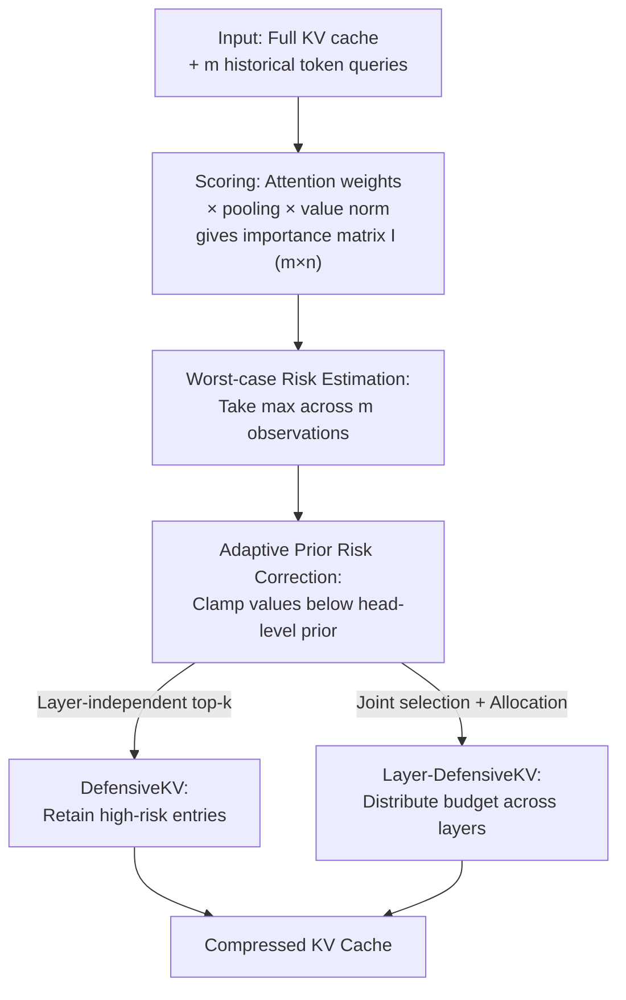

# DefensiveKV: Taming the Fragility of KV Cache Eviction in LLM Inference

**Conference**: ICLR2026  
**OpenReview**: [https://openreview.net/forum?id=nJgS06sX3O](https://openreview.net/forum?id=nJgS06sX3O)  
**Code**: https://github.com/FFY0/DefensiveKV  
**Area**: LLM Efficiency / KV Cache Compression  
**Keywords**: KV Cache Eviction, Worst-case Risk, Defensive Aggregation, Long-context Inference, Inter-layer Budget Allocation

## TL;DR
Addressing the issue where the "importance stability assumption" relied upon by KV cache eviction is fragile, and standard mean aggregation fails during critical moments, this paper proposes linear-time "Defensive Aggregation" (estimating worst-case risk using historical maximums + adaptive prior correction). Based on this, DefensiveKV and its cross-layer version Layer-DefensiveKV are constructed, reducing generation quality loss by 2.3$\times$ and 4.3$\times$ compared to the strongest baseline across 18 datasets with a 20% cache budget.

## Background & Motivation
**Background**: Autoregressive generation in Transformer LLMs requires maintaining a KV cache to store historical token Keys/Values. However, the cache grows linearly with sequence length (a 70B model with batch 8 and 128k context consumes approximately 330GB VRAM), creating memory and I/O bottlenecks. The current mainstream solution is "selective cache eviction," which builds on an underlying **importance stability assumption**: a fixed subset of KV entries remains consistently important throughout the generation process, allowing for approximations with much smaller memory footprints. This is typically implemented via a **scoring-aggregation framework**: the scoring step uses queries from historical tokens to assign importance scores to KV entries, while the aggregation step merges these scores into a scalar to decide which entries to evict.

**Limitations of Prior Work**: Research over the past few years has focused almost exclusively on the scoring step—ranging from naive attention weights (H2O, Scissorhands) to pooling in SnapKV and norm-based scoring in CriticalKV. In contrast, the **aggregation step has been largely ignored**, with most methods defaulting to simple mean aggregation $S_i = \frac{1}{m}\sum_{j=1}^m I_{j,i}$ under the logic that averaging multiple observations reduces noise to capture consistently important entries.

**Key Challenge**: The authors demonstrate that the stability assumption is **inherently fragile**. Experiments on Llama-3.1-8B for summarization tasks show that while 50% eviction based on single-token observations often maintains over 0.8 coverage of full cache importance (averaging 0.92), the assumption collapses in certain segments (e.g., steps 150–320). In these cases, retained importance drops to 0.34, and outliers where the "retained 50% cache covers less than half of the importance" occur frequently (89 times in one trial). The problem is that mean aggregation only optimizes for the "expected case" and is defenseless against these rare but extreme collapses—when most single-token observations fail simultaneously, averaging them merely produces another poor result, still resulting in 65 outliers.

**Key Insight**: The authors draw a lesson from finance: strategies that only optimize for average returns (expectation) are fundamentally flawed because they ignore rare but fatal worst-case risks. Applying this to cache eviction: instead of refining "more accurate scoring metrics," it is better to replace the aggregation step with **worst-case risk management**.

**Core Idea**: Abandon "optimizing the average case" in favor of "controlling the worst case" by proposing **Defensive Aggregation**. This strategy uses two linear-time operations—computationally equivalent to mean aggregation—to preserve critical entries during assumption collapses, forming the basis for the DefensiveKV series.

## Method

### Overall Architecture
DefensiveKV does not invent new scoring metrics or alter the overall eviction pipeline; it **only replaces the "aggregation" step** within the scoring-aggregation framework. The input for eviction consists of the full KV cache $(K, V)$ and queries from the $m$ most recent tokens. The process involves: retaining the most recent KV entries, calculating an importance matrix $I \in \mathbb{R}^{m\times n}$ (using attention weights + SnapKV pooling + CriticalKV value norm scaling), and replacing the standard mean aggregation with **Defensive Aggregation**. This involves using the maximum value to estimate worst-case risk for each entry, followed by an adaptive prior correction to obtain a risk score $R \in \mathbb{R}^n$. Top-risk entries are then retained. Applying this layer-wise yields **DefensiveKV**, while joint cross-layer selection with budget allocation yields **Layer-DefensiveKV**. The pipeline is training-free and plug-and-play.

### Key Designs

**1. Worst-case Risk Estimation: Replacing mean with max to account for collapses**

This step addresses the "risk-blindness" of mean aggregation. From a risk control perspective, the cost of evicting a KV entry equals the importance score it would have had in the future. The true worst-case risk for entry $i$ is its peak importance in future generation steps $R^*_i = \max_{t\in L} I_{t,i}$. Since the future is unknown, the authors approximate it using the maximum value observed over historical tokens:

$$\tilde{R}_i = \max_{1\le j\le m} I_{j,i}, \quad \forall i = 1,\dots,n$$

Unlike mean aggregation, this uses $\max$ instead of $\frac{1}{m}\sum$. The computational complexity remains $O(n)$, but the semantics shift from "average importance" to "potential maximum importance." Intuitively, if an entry spikes in even a few observations, the max function preserves it, whereas mean aggregation would evict it as "unimportant," leading to massive losses when it becomes critical again. (Under GQA, the risk is the max across all shared heads in the KV group.)

**2. Adaptive Prior Risk Correction: Compensating for short observation windows**

Using $\max$ alone is insufficient: to minimize overhead, eviction methods use short observation windows (e.g., 32 tokens). Such short windows may miss rare risks, causing $\tilde{R}_i$ to be underestimated. Inspired by Laplace smoothing in Bayesian estimation, the authors introduce a head-level prior risk—the mean of all entries' worst-case risks within that head $\bar{R} = \frac{1}{n}\sum_{i=1}^n \tilde{R}_i$—and perform a lower-bound correction:

$$R_i = \max\!\left(\tilde{R}_i,\ \bar{R}\right)$$

If an entry's observed risk is lower than the head's overall prior, it is treated as "insufficiently observed" rather than unimportant, raising its risk to the prior level. This design is **adaptive**: heads with higher overall risk receive larger priors and rely less on limited historical observations. These two steps (Algorithm 1) constitute Defensive Aggregation. In summarization tasks, this raised the worst-case retained importance from 0.33 to 0.61 and eliminated all 65 outliers.

**3. DefensiveKV: Seamlessly embedding defensive aggregation**

This is the minimal implementation version. it follows the standard eviction flow—retaining recent tokens, calculating importance using attention weights, pooling, and value norm scaling ($R_i \leftarrow R_i \times \text{norm}(v_i W_O)$)—where the **only change is replacing mean aggregation with Defensive Aggregation**. By changing just one step, it cuts generation quality loss by over 2$\times$, proving the bottleneck lies in aggregation rather than scoring metrics.

**4. Layer-DefensiveKV: Joint selection for risk-based budget allocation**

DefensiveKV allocates fixed budgets per layer. Layer-DefensiveKV introduces two enhancements: first, **inter-layer normalization** of risk scores $R_i \leftarrow R_i / \sum_i \text{norm}(v_i W_O)$ to make scores comparable across layers; second, **joint selection** of the highest-risk entries across all layers. This automatically shifts more cache budget to layers with higher risk, further reducing quality loss.

## Key Experimental Results

### Main Results
Evaluated on three LLMs (Llama-3.1-8B-Instruct, Mistral-7B-Instruct-v0.3, Qwen2.5-32B-Instruct) across 18 datasets (LongBench + Needle-in-a-Haystack). The table shows quality loss at a 20% cache budget (lower is better):

| Model (20% cache) | StreamingLLM | SnapKV | AdaKV | CAKE | CriticalKV (Prev. SOTA) | DefensiveKV | Layer-DefensiveKV |
|---|---|---|---|---|---|---|---|
| Llama-3.1-8B | -40.7% | -20.1% | -16.8% | -16.2% | -9.6% | **-4.6%** | **-2.1%** |
| Mistral-7B | -47.6% | -27.8% | -25.4% | -27.3% | -13.4% | **-4.4%** | **-1.4%** |
| Qwen2.5-32B | -37.8% | -24.6% | -22.9% | -27.9% | -8.6% | **-2.7%** | **-1.7%** |

On LongBench, at a 20% budget, CriticalKV loses 11.1%, whereas DefensiveKV drops to 4.8% and Layer-DefensiveKV to 2.6%—representing 2.3$\times$ and 4.3$\times$ reductions in loss, respectively. At a 40% budget, DefensiveKV is virtually lossless.

### Ablation Study

| Configuration | Effect | Description |
|---|---|---|
| Mean Aggregation (Baseline) | Worst-case coverage 0.33, 65 outliers | Current standard practice |
| Max Risk Estimation Only | Significant improvement over mean | Shift from expectation to worst-case |
| + Adaptive Prior Correction | Worst-case coverage 0.61, 0 outliers | Eliminates outliers entirely |
| DefensiveKV → Layer-DefensiveKV | Loss reduced by another half | Gain from inter-layer budget allocation |

### Key Findings
- **Aggregation is the bottleneck**: Changing only the aggregation step (DefensiveKV) yields a >2$\times$ reduction in loss, suggesting the aggregation step is a neglected optimization space.
- **Stability fragility is intermittent**: High average coverage (0.92) masks local collapses (0.34). These rare moments degrade mean aggregation, explaining why expectation-based methods fail at low budgets.
- **Superiority in extreme cases**: As the cache budget decreases from 40% to 20%, baselines deteriorate sharply, while DefensiveKV series remain stable, maximizing gains under high compression.

## Highlights & Insights
- **Applying Financial Risk Management to KV Cache**: The intuition of "controlling tail risk rather than optimizing expectation" identifies the blind spot of mean aggregation.
- **Simplicity and Efficiency**: The core method uses just $\max$ and a prior lower bound. It maintains $O(n)$ complexity, requires no training, and is plug-and-play.
- **Orthogonal and Additive**: Defensive Aggregation is orthogonal to scoring metrics (SnapKV/CriticalKV) and budget strategies (AdaKV/PyramidKV). It is a universal module that can improve existing eviction methods.

## Limitations & Future Work
- **Risk Approximation via History**: $\tilde{R}_i$ uses historical observations to estimate the unknown future; prior correction mitigates but does not fully solve the issue of missing rare risks outside the window.
- **Coarse Prior Correction**: The adaptive prior uses a simple head-level mean; more refined or dynamically updated priors could be explored.
- **Task Evaluation**: Evaluated primarily on long-context understanding; the nature of worst-case risk in multi-turn dialogues or agentic reasoning and its generalization remains to be tested.

## Related Work & Insights
- **vs CriticalKV / SnapKV / H2O**: These focus on refining scoring (importance metrics) but default to mean aggregation. Ours shows aggregation is a critical bottleneck and provides higher gains or additive benefits.
- **vs StreamingLLM / LaCache**: Fixed-rule methods have lower overhead for constant compression but poor quality (StreamingLLM loses >40% at 20% budget). DefensiveKV targets high-quality compression in the scoring-aggregation lineage.
- **vs AdaKV / PyramidKV / CAKE**: These focus on budget distribution. Layer-DefensiveKV incorporates budget allocation to demonstrate that defensive aggregation is compatible with these strategies.

## Rating
- Novelty: ⭐⭐⭐⭐⭐ First to systematically reveal the fragility of the stability assumption and mean aggregation, introducing worst-case risk management as a new dimension.
- Experimental Thoroughness: ⭐⭐⭐⭐ 18 datasets across 3 models with multiple budgets, including comparisons with training-based methods.
- Writing Quality: ⭐⭐⭐⭐⭐ Excellent use of the financial analogy; strong visualization of fragility.
- Value: ⭐⭐⭐⭐⭐ Highly practical for long-context deployment due to its simplicity, lack of training requirements, and orthogonality.

<!-- RELATED:START -->

## Related Papers

- [\[ICLR 2026\] Cache What Lasts: Token Retention for Memory-Bounded KV Cache in LLMs](cache_what_lasts_token_retention_for_memory-bounded_kv_cache_in_llms.md)
- [\[AAAI 2026\] Judge Q: Trainable Queries for Optimized Information Retention in KV Cache Eviction](../../AAAI2026/llm_efficiency/judge_q_trainable_queries_for_optimized_information_retention_in_kv_cache_evicti.md)
- [\[ICLR 2026\] ReST-KV: Robust KV Cache Eviction with Layer-wise Output Reconstruction and Spatial-Temporal Smoothing](rest-kv_robust_kv_cache_eviction_with_layer-wise_output_reconstruction_and_spati.md)
- [\[ICML 2026\] OBCache: Optimal Brain KV Cache Pruning for Efficient Long-Context LLM Inference](../../ICML2026/llm_efficiency/obcache_optimal_brain_kv_cache_pruning_for_efficient_long-context_llm_inference.md)
- [\[ICML 2026\] CriticalKV: Optimizing KV Cache Eviction from an Output Perturbation Perspective](../../ICML2026/llm_efficiency/criticalkv_optimizing_kv_cache_eviction_from_an_output_perturbation_perspective.md)

<!-- RELATED:END -->
