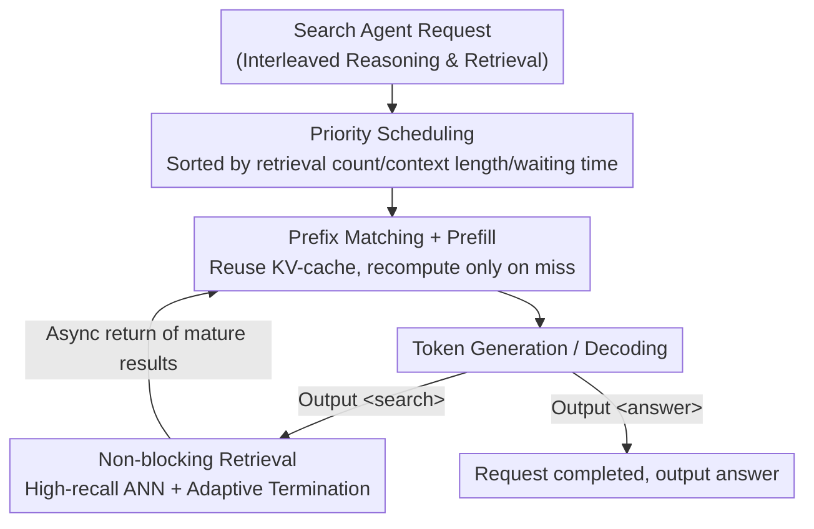

# Demystifying and Enhancing the Efficiency of Large Language Model Based Search Agents

**Conference**: ICLR2026  
**OpenReview**: [https://openreview.net/forum?id=BtWBi17eVi](https://openreview.net/forum?id=BtWBi17eVi)  
**Code**: https://github.com/tiannuo-yang/SearchAgent-X  
**Area**: LLM Efficiency / Inference Systems / Retrieval-Augmented Generation  
**Keywords**: Search Agents, Inference Systems, KV-cache, Approximate Nearest Neighbor (ANN) Search, Priority Scheduling

## TL;DR
This paper systematically analyzes the inefficiency of LLM search agents (interleaved reasoning and retrieval). It reveals that retrieval accuracy does not monotonically improve end-to-end efficiency (low recall forces more retrieval rounds, while high recall has excessive overhead) and shows extreme sensitivity to retrieval latency (FCFS scheduling and retrieval-induced pauses repeatedly evict KV-cache of long requests). The authors propose SearchAgent-X, an inference system utilizing high-recall approximate retrieval, priority scheduling, and non-blocking retrieval to achieve up to 3.4× throughput and 0.2–0.6× latency while maintaining generation quality.

## Background & Motivation
**Background**: Traditional RAG follows a fixed "retrieve-then-generate" pipeline. A new generation of "Search Agents" (RAG 2.0, e.g., Search-R1, ReCall) leverages LLM reasoning to dynamically interleave reasoning steps and retrieval calls. The model decides when and what to retrieve during generation; upon encountering a `<search>` tag, it pauses decoding, initiates a query, appends the retrieved documents back to the sequence, and resumes reasoning. This significantly improves answer quality at the cost of efficiency.

**Limitations of Prior Work**: The interleaved paradigm introduces two overlooked efficiency bottlenecks. First, retrieval accuracy and end-to-end efficiency do not share a monotonic relationship. Second, the system is exceptionally sensitive to retrieval latency—even minor retrieval delays are amplified into significant end-to-end latency increases. Existing inference frameworks like vLLM, with optimizations like sequence concatenation or prefix caching, are not designed for the unique workload of "multi-step reasoning tightly coupled with dynamic retrieval."

**Key Challenge**: The authors decompose efficiency degradation into two root causes. The first is **Non-monotonicity of Retrieval Precision**: if recall is too low, the model receives insufficient context and compensates by initiating more retrieval rounds, lengthening the reasoning chain (ANN search with small ranges results in average 6.5 retrievals/request, dropping throughput to 2.1). If recall is too high (e.g., exact retrieval ENN), the retrieval overhead itself becomes prohibitive. The second is the **Latency Amplification Effect**: while retrieval time in naive RAG is negligible, it is comparable to token generation time in search agents. An increase in average retrieval latency from 0.6s to 4.4s causes end-to-end latency to explode by 83×, while prefix KV-cache hit rates drop from 30%+ to below 21%, forcing expensive recomputations.

**Mechanism of Latency Amplification**: Latency amplification stems from two factors. **① Improper Scheduling**: FCFS is oblivious to the "reuse value" of requests. If a long request #a (6 retrievals, long prefix) finishes retrieval slightly after a short request #b (1 retrieval), FCFS serves #b first. #b occupies KV-cache space and evicts #a's prefix, forcing #a to recompute from scratch upon resumption (55.9% of tokens in affected requests are recomputed, increasing computation time by 108%+). **② Retrieval-Induced Pauses**: Asynchronous retrieval and generation lead to timing mismatches. If a long request misses the cul-off for the current generation batch, it waits for the next; during this wait, its cache is often evicted by shorter requests (25%+ of sequences experience such pauses).

**Goal / Core Idea**: Rather than pursuing extreme precision, the system should be built on **high-recall approximate retrieval** complemented by two strategies: **Priority Scheduling** to enhance KV-cache reuse and **Non-blocking Retrieval** to eliminate pauses. This result is SearchAgent-X, a deployable inference system that maximizes end-to-end efficiency without sacrificing quality.

## Method

### Overall Architecture
SearchAgent-X is a tightly coupled inference system operating at the token generation grain. Each LLM output step checks for special tags: `<search>` triggers the ANN retriever to query a pre-built graph index, and `<answer>` signifies request completion. The system uses a **Priority Scheduler** to rank concurrent requests based on real-time metrics (retrieval count, context length, waiting time), prioritizing requests with "longer prefixes and higher reuse potential." The prefill stage reuses existing KV-cache via prefix matching, recomputing only on misses. Retrieval and generation run in parallel, using **Non-blocking Retrieval** with an adaptive termination strategy to prevent the generation engine from idling while ensuring retrieval results are sufficiently mature. The design objective is to maximize prefix KV-cache reuse and minimize recomputation.

### Key Designs

**1. High-recall Approximate Retrieval: Replacing "More Accurate is Better" with "Good Enough"**

This design addresses the non-monotonicity of retrieval precision. Sweeping ANN search ranges on Search-R1 7B reveals a "less is more" phenomenon: at a search range of 10, recall is poor, requiring 6.5 retrievals per request with a throughput of 2.1. Increasing the range to 500 provides sufficient quality, reducing retrieval counts to ~5.7 and boosting throughput to 3.2+. However, increasing the range beyond 10,000 only marginally reduces retrieval counts while throughput drops due to expensive ANN overhead. Thus, SearchAgent-X avoids full-recall exact retrieval (ENN) in favor of high-recall ANN based on HNSW graph indices, targeting the "sweet spot" where retrieval is just sufficient for reasoning.

**2. Priority Scheduling: Prioritizing "Cache-reusable" Requests without Starvation**

This addresses the FCFS scheduler's inability to perceive reuse value. Each request $i$ corresponds to a sequence $[s_{i,0}, s_{i,1}, \dots, s_{i,r_i}]$, where $r_i$ is the number of completed retrievals. Requests with higher $r_i$ have longer shared prefixes and benefit more from cache reuse. To avoid starving new requests, SearchAgent-X uses a multi-tier scheduler based on three metrics: completed retrievals $R_i = r_i$, current context length $C_i = L_{seq,i}$, and initial waiting time $W_i = t_{now} - t_{arr,i}$. 

Instead of weighted scoring, each metric is discretized into $G$ priority levels. For a metric $M \in \{R, W, C\}$, the lower threshold for level $k$ is defined as:

$$T_{M,k} = \min(M) + \frac{k}{G}\cdot(\max(M)-\min(M)), \quad 0 \le k < G$$

Request $i$ is assigned the highest level $k$ where at least one metric exceeds the threshold:

$$k = \max\{\, j \in [0, G-1] \mid R_i > T_{R,j} \lor W_i > T_{W,j} \lor C_i > T_{C,j} \,\}$$

Within the same level, requests are sorted by current queuing time $W^{cur}_i = t_{now} - t^{(r_i)}_{arr,i}$ in descending order. This improves prefix cache hit rates from 0.07 to 0.51 and reduces end-to-end latency by 35.55%.

**3. Non-blocking Retrieval: Early Stopping at ANN "Knee Points" to Align Async Execution**

Standard ANN search iterates until a preset condition (nodes explored, list stability) is met, which can stall the pipeline. SearchAgent-X utilizes adaptive early termination based on retrieval maturity and LLM engine readiness. A "soft cap" is applied based on the observation that ANN quality follows a diminishing returns pattern, reaching a "knee point" where further exploration yields negligible improvement. Maturity is evaluated using a normalized metric $RQ_t = (d_t - d_{best})/(d_{worst} - d_{best})$, where $d_t$ is the distance of the new candidate to the query. If the smoothed quality signal passes a threshold $\tau$ and the LLM engine is ready for the next generation step, retrieval stops immediately. This aligns asynchronous retrieval with generation, utilizing the "free lunch" of overlapping execution. This increases hit rate to 0.65.

### Mechanism Example
Consider a long request #a (6 retrievals) and a short request #b (1 retrieval). Under FCFS, if #a finishes retrieval slightly later than #b, the scheduler runs #b, evicting #a's long prefix. #a must then recompute entirely. In SearchAgent-X, the priority scheduler recognizes #a's higher $R$ and $C$, placing it in a higher priority tier to prevent eviction. Simultaneously, #a's ANN retrieval terminates early once maturity reaches the knee point and the engine is ready, ensuring it does not miss the generation batch and avoids idle time.

## Key Experimental Results

### Main Results
Evaluation used Search-R1 and ReCall search agents (7B on L20, 14B on A100) with Wikipedia indexed via HNSWlib. Baselines included vLLM ENN, vLLM ANN, and CachevLLM ANN.

| Scenario | Metric | SearchAgent-X vs. Best Baseline |
|------|------|------|
| Offline Inference | Throughput | 1.3–3.4× higher |
| Offline Inference | E2E Latency | 0.2–0.6× only |
| Offline top-k=5 | Throughput / Latency | 1.5× / 0.6× |
| Online Inference (Rate 1–6) | Completed Requests | 1.5× avg, 3.5× max |
| Online Inference | Pending Sequence Ratio | ≈0.2 (baseline >0.6) |

Generation quality remains consistent with exact retrieval (avg EM 0.430 across 6 datasets). Some datasets showed slight improvements (NQ 0.320 vs. 0.316), as full recall does not always equate to optimal generation and search agents can adaptively adjust reasoning length.

### Ablation Study (Search-R1 7B / MuSiQue / top-k=5)

| Configuration | Prefix Cache Hit Rate | Description |
|------|---------------|------|
| vLLM ANN | 0.07 | Baseline |
| + Prefix Cache | — | Only 1.01× gain at top-k=5; requires scheduling to be effective |
| + Priority Scheduling | 0.51 | E2E Latency reduced by 35.55% |
| + Non-blocking Retrieval | 0.65 | Latency further reduced by 6.3% |

### Key Findings
- **Priority Scheduling is the Primary Driver**: It increases hit rate from 0.07 to 0.51, reducing both prefill and decode time by ensuring long requests release GPU resources earlier via successful reuse.
- **Non-blocking Retrieval Offers High Leverage**: Although it saves only ~0.01s of retrieval time and affects ~24% of retrievals, it pushes the hit rate to 0.65, proving that minor retrieval delays have outsized effects on end-to-end pipelines.
- **Standalone Prefix Caching is Insufficient**: In difficult tasks (top-k=5), cache alone provides almost no benefit (1.01×) without proper scheduling.
- **Higher Task Complexity Yields Greater Gains**: Throughput improvement on MuSiQue (difficult) was 1.84× vs. 1.52× on HotpotQA (easy).

## Highlights & Insights
- **"Diagnosis-before-prescription" Paradigm**: The paper quantifies counter-intuitive phenomena (non-monotonicity and 83× latency amplification) before proposing targeted designs for each root cause.
- **Transferability of "Knee Points"**: Monitoring diminishing returns via $RQ_t$ can be generalized to any asynchronous sub-task with monotonic quality improvements (e.g., tool calls, speculative decoding).
- **Discretization over Weighted Scoring**: Using $G$ levels and a "max of any threshold" rule avoids complex hyperparameter tuning required for weighted sum scores.
- **Zero Quality Loss, Pure System Gain**: Achieves 3.4× throughput at the system level without altering model weights or training, making it highly valuable for engineering deployment.

## Limitations & Future Work
- Evaluation focused on Search-R1/ReCall with HNSW on Wikipedia. Performance on larger knowledge bases or different retrieval backends (e.g., IVF-PQ) requires further validation.
- The maturity threshold $\tau$ and discretization levels $G$ are hyperparameters; their sensitivity and cross-task adaptability were not fully explored.
- The soft-cap relies on the assumption of monotonic quality improvement; robustness in worst-case scenarios where critical documents appear late in retrieval needs investigation.

## Related Work & Insights
- **vs. RAG Pipeline Optimizations (RAGCache, PipeRAG)**: These typically focus on separates stages; SearchAgent-X specifically addresses the dynamic interleaving of search agents.
- **vs. vLLM FCFS Scheduling**: vLLM's FCFS fails to account for the unique priority of search agent requests, leading to poor cache utilization.
- **vs. Traditional ANN**: SearchAgent-X replaces fixed termination criteria with generation-ready adaptive termination.

## Rating
- Novelty: ⭐⭐⭐⭐ Solid system contribution by diagnosing counter-intuitive efficiency bottlenecks and providing precise solutions.
- Experimental Thoroughness: ⭐⭐⭐⭐ Comprehensive offline/online benchmarks across multiple datasets and top-k values.
- Writing Quality: ⭐⭐⭐⭐⭐ Extremely clear logic following the "Phenomenon → Attribution → Design → Verification" loop.
- Value: ⭐⭐⭐⭐⭐ Significant practical value for search agent deployment and RL rollout acceleration with model-agnostic 3.4× speedup.

<!-- RELATED:START -->

## Related Papers

- [\[ICLR 2026\] Unlocking Full Efficiency of Token Filtering in Large Language Model Training](unlocking_full_efficiency_of_token_filtering_in_large_language_model_training.md)
- [\[ICLR 2026\] ReFusion: A Diffusion Large Language Model with Parallel Autoregressive Decoding](refusion_a_diffusion_large_language_model_with_parallel_autoregressive_decoding.md)
- [\[ICLR 2026\] Composer: A Search Framework for Hybrid Neural Architecture Design](composer_a_search_framework_for_hybrid_neural_architecture_design.md)
- [\[ICLR 2026\] Scaling Large Vision-Language Model RL Training via Efficient Load Balancing](scaling_large_vision-language_model_rl_training_via_efficient_load_balancing.md)
- [\[NeurIPS 2025\] Jet-Nemotron: Efficient Language Model with Post Neural Architecture Search](../../NeurIPS2025/llm_efficiency/jet-nemotron_efficient_language_model_with_post_neural_architecture_search.md)

<!-- RELATED:END -->
