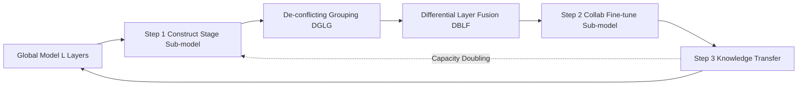

# Developmental Federated Tuning: A Cognitive-Inspired Paradigm for Efficient LLM Adaptation

**Conference**: ICLR 2026  
**OpenReview**: [https://openreview.net/forum?id=htbzmulSaG](https://openreview.net/forum?id=htbzmulSaG)  
**Code**: To be confirmed  
**Area**: Federated Fine-Tuning / LLM Efficient Adaptation  
**Keywords**: Federated Fine-Tuning, LoRA, Progressive Training, Curriculum Learning, Edge Devices, Layer Fusion  

## TL;DR
DEVFT decomposes federated fine-tuning into "small-to-large" developmental stages, growing from a compact sub-model to a full LLM. By employing de-conflicting layer grouping and differential layer fusion to enable cross-stage knowledge transfer, it achieves 4.59× convergence acceleration, 10.67× communication savings, and a 9.07% average performance improvement on edge devices.

## Background & Motivation

**Background**: Federated fine-tuning (FedFT) allows LLMs to collaboratively adapt to downstream tasks without pooling private data. Parameter-efficient fine-tuning (PEFT) methods, particularly LoRA-based approaches, have become the mainstream due to freezing majority weights and training only low-rank increments (e.g., FedIT, FLoRA, FedSA-LoRA).

**Limitations of Prior Work**: Even with LoRA, existing methods still fine-tune the entire LLM **end-to-end**—requiring forward and backward passes through all layers. Figure 1 quantifies this gap: a single step for LLaMA2-13B requires 415.2 TFLOPs, which is 112.2× that of BERT; even the compact TinyLLaMA requires 9.3×. For edge devices with limited compute, memory, and communication, these overheads fundamentally hinder deployment.

**Key Challenge**: There is an inherent contradiction between resource efficiency and model capability. Saving resources typically necessitates small models, which lack sufficient capability. Conversely, large models offer strength but are untrainable and untransmittable at the edge, while their high-dimensional parameter spaces possess rugged loss surfaces prone to poor local minima.

**Goal**: To transform the "full-load throughout" process of federated fine-tuning into a "gradual load increase" paradigm without sacrificing final performance, ensuring edge devices only need to train small sub-models for the majority of the time.

**Core Idea (Developmental Fine-Tuning)**: Inspired by human cognitive development, learning is a progressive process rather than an instantaneous one. **DEVFT decomposes the fine-tuning process into $S$ developmental stages with increasing capability**: starting from a compact sub-model ("childhood"), expanding the sub-model capacity once current skills are mastered ("growth"), and migrating learned knowledge to initialize the next stage ("adulthood"), repeating until the target capacity is reached. Smaller models exhibit smoother loss surfaces and are less likely to trap in local minima; the knowledge distilled early provides a superior initialization for subsequent larger models, achieving both resource savings and performance gains.

## Method

### Overall Architecture

DEVFT partitions the entire federated fine-tuning process into $S$ stages. The sub-model capacities (number of layers) form a strictly increasing sequence $\{L_1, L_2, \dots, L_S\}$, where the final stage $L_S = L$ covers all layers (in implementation, capacity doubles each stage, e.g., $\{4,8,16,32\}$ for 7B/8B models). Each stage iterates through three steps: the server constructs the sub-model for the stage, devices collaboratively train it, and at the end of the stage, knowledge is synchronized back to the global model and migrated to the next stage.

### Key Designs

**1. De-conflicting Layer Grouping (DGLG): Grouping "compatible" layers together.** To compress $L$ layers into an $L_s$-layer sub-model, one must essentially create a representative layer for each group. However, if layers with opposing parameter signs or conflicting functions are forced into one group, they will cancel each other out during fusion, leading to significant information loss. DEVFT employs cosine similarity to measure parameter conflict between layers: $\mathrm{sim}(\theta_i, \theta_j) = \frac{\langle \theta_i, \theta_j \rangle}{\|\theta_i\|\|\theta_j\|}$ (including associated LoRA parameters). Higher similarity indicates less conflict. Using the similarity matrix $W$ as edge weights, a complete graph is constructed. The objective is to partition the graph into $L_s$ groups to minimize inter-group cut weights: $\min \sum_n \sum_{m\neq n} \mathrm{cut}(g_n, g_m)$. This is solved via spectral clustering—constructing the Laplacian matrix $\mathcal{L} = D - W$, extracting eigenvectors corresponding to the smallest $L_s$ eigenvalues into an embedding matrix $E$, and applying k-means to $E$ to obtain $L_s$ disjoint groups. This ensures minimal intra-group conflict and clean knowledge sharing.

**2. Differential Layer Fusion (DBLF): Distilling only the "unique information" into the representative layer.** Once groups are formed, a representative layer must be synthesized. A naive approach would be summing all layer parameters within a group, but since grouped layers are already functionally homogeneous, simple summation introduces redundancy and suppresses representational diversity. DBLF designates the first layer in a group as the anchor layer $\theta_{\text{anchor}}$. It then subtracts the anchor from other layers to extract the "information difference" $\theta_j - \theta_{\text{anchor}}$, which is then weighted by $\beta$ and accumulated into the anchor: $\vartheta_{g_n} = \theta_{\text{anchor}} + \beta \sum_{j\in g_n}(\theta_j - \theta_{\text{anchor}})$. This layer arithmetic (Figure 4) performs fine-grained knowledge editing in parameter space—addition merges semantics, while subtraction distills unique information, preserving critical functions while eliminating redundancy. Sequential concatenation of representative layers from all groups forms the sub-model.

**3. Cross-stage Knowledge Transfer: Standing on the shoulders of the small model.** After a stage concludes, the representative layer knowledge $\{\vartheta_{g_n}\}$ is reused. Since DGLG ensures functional homogeneity and similar parameter distributions within groups, the knowledge of each representative layer can be directly written back to update all original layers in its group (specifically updating LoRA parameters). This redistributes the learning from $L_s$ layers back to the $L$-layer global model. This updated global model serves as the basis for sub-model construction in the next stage, enabling seamless knowledge inheritance. The significance lies in ensuring the larger sub-model of the subsequent stage does not start from pre-trained weights cold, but rather from an initialization already partially aligned with the task, accelerating convergence and avoiding poor local minima.

## Key Experimental Results

Setup: LLaMA2-7B / LLaMA3.1-8B / LLaMA2-13B (all INT4), Alpaca-GPT4 fine-tuning, $S=4$, capacity doubling per stage. Closed-ended benchmarks: TruthfulQA/MMLU/IFEval/BBH; Open-ended benchmarks: Vicuna-Bench/MT-Bench.

### Main Results (Closed-ended Benchmark Average Score ↑)

| Method | LLaMA2-7B | LLaMA3.1-8B | LLaMA2-13B |
|------|-----------|-------------|-----------|
| FedIT | 40.27 | 55.35 | 48.58 |
| DoFIT | 40.89 | 57.79 | 49.74 |
| ProgFed | 41.00 | 60.12 | 50.22 |
| FedSA-LoRA | 40.81 | 60.97 | 50.84 |
| **Ours (DEVFT)** | **42.33** | **64.25** | **52.77** |

Ours (DEVFT) ranks first across all three models in closed-ended benchmarks, improving by 8.9% over FedIT on LLaMA3.1-8B. It also leads on the open-ended MT-Bench (e.g., 7.79 vs. 7.12 for FedSA-LoRA on the 8B model).

### Efficiency & Ablation

| Dimension | Result |
|------|------|
| Convergence Training Time (7B) | DEVFT 0.81h vs. C2A 3.72h, up to **4.59× speedup** |
| Communication Overhead (13B) | DEVFT 3.93GB vs. C2A 41.95GB, up to **10.67× savings** |
| First Stage Single Round (7B) | 10.3× time, 4× communication, 4× memory savings; final stage still 1.44× speedup |
| DGLG Ablation (8B) | RANDOM ↓3.56%, EVEN ↓6.49% |
| DBLF Ablation (8B) | Anchor only (R-ONE) ↓10.96%, Direct Sum (SUM) ↓3.05% |
| Compatibility | FedSA-LoRA+DEVFT on 7B: ↑3.51% score, 3.31× faster, 2.14× less data |

### Key Findings
- **Small model starting saves resources and improves performance**: The developmental paradigm offers a smoother loss surface. Combined with knowledge transfer, it accelerates convergence and avoids local minima, outperforming end-to-end methods.
- **Grouping and fusion strategies are both indispensable**: DGLG groups layers with minimal conflict, while DBLF distills unique information. Ablations showing drops up to 10.96% indicate that "constructing a high-fidelity representative layer" is critical for performance.
- **Plug-and-play capability**: DEVFT acts as an outer scheduling framework and can be stacked on top of FedIT or FedSA-LoRA, further reducing resources by 2–3× while improving performance.

## Highlights & Insights
- **Shifting "Curriculum Learning" to the resource dimension**: Rather than varying data difficulty, the **model capacity** is varied from small to large, directly addressing the core pain points of edge compute and communication bottlenecks.
- **Layer arithmetic for model construction**: Using cosine similarity for de-conflicting grouping and anchor subtraction for differential distillation provides a clean, interpretable solution for "compressing $L$ layers into $L_s$ layers while maintaining knowledge transfer."
- **Orthogonality to existing methods**: As an outer framework, it can be combined with most LoRA-based federated methods, making it highly practical for deployment.

## Limitations & Future Work
- The number of stages $S$, capacity sequence, and fusion weight $\beta$ (0.15 for 13B, 0.1 otherwise) are currently manually tuned hyperparameters lacking adaptive mechanisms.
- Spectral clustering requires eigen-decomposition of the $L\times L$ similarity matrix on the server—the cost and the "inter-layer independence/homogeneity" assumption for extremely deep models remain to be explored.
- Evaluation is concentrated on the LLaMA family and instruction fine-tuning tasks. Robustness across different architectures, tasks (e.g., code/math), and strong data heterogeneity has not yet been fully validated.

## Related Work & Insights
- **Parameter-Efficient Federated Fine-Tuning**: Categorized into Prompt-based, Adapter-based, and LoRA-based; for heterogeneous resources, HETLoRA/FlexLoRA assign different ranks, Fed-pilot/Fed-HeLLo schedule by layer contribution, and FwdLLM/FedKSeed use zeroth-order optimization. DEVFT is orthogonal—optimizing "how many layers to train when" rather than "how to train each layer."
- **Progressive Training**: ProgFed adds model blocks progressively, which is the closest baseline; DEVFT differs through its explicit layer grouping/fusion and cross-stage knowledge write-back.
- **Insight**: This "small model distillation → large model initialization" developmental approach could be extended to non-federated efficient pre-training or continual learning scenarios.

## Rating
- Novelty: ⭐⭐⭐⭐ — The combination of a cognitive development-inspired "model capacity curriculum + layer arithmetic sub-model construction" is rare in the federated fine-tuning space and hits a solid entry point.
- Experimental Thoroughness: ⭐⭐⭐⭐ — Comprehensive across three models, both closed/open benchmarks, efficiency, ablation, and compatibility, though task types are somewhat limited and data heterogeneity is not deeply explored.
- Writing Quality: ⭐⭐⭐⭐ — Clear motivation-method-experiment logic, effective diagrams (Figure 2/3/4), and standardized formula notation.
- Value: ⭐⭐⭐⭐ — Directly lowers the threshold for federated fine-tuning at the edge and serves as a plug-and-play addition to existing methods, showing strong deployment potential.

<!-- RELATED:START -->

## Related Papers

- [\[ICLR 2026\] FLoRG: Federated Fine-tuning with Low-rank Gram Matrices and Procrustes Alignment](florg_federated_fine-tuning_with_low-rank_gram_matrices_and_procrustes_alignment.md)
- [\[ICLR 2026\] On-the-Fly Adaptation to Quantization: Configuration-Aware LoRA for Efficient Fine-Tuning of Quantized LLMs](on-the-fly_adaptation_to_quantization_configuration-aware_lora_for_efficient_fin.md)
- [\[ICLR 2026\] Mitigating Non-IID Drift in Zeroth-Order Federated LLM Fine-Tuning with Transferable Sparsity](mitigating_non-iid_drift_in_zeroth-order_federated_llm_fine-tuning_with_transfer.md)
- [\[ICLR 2026\] Difficulty–Diversity Collaborative Filtering for Data-Efficient LLM Fine-Tuning](difficultydiversity_collaborative_filtering_for_data-efficient_llm_fine-tuning.md)
- [\[ICLR 2026\] LoRA-S: An Efficient Low Rank Adaptation scheme via Sylvester equation](lora-s_an_efficient_low_rank_adaptation_scheme_via_sylvester_equation.md)

<!-- RELATED:END -->
