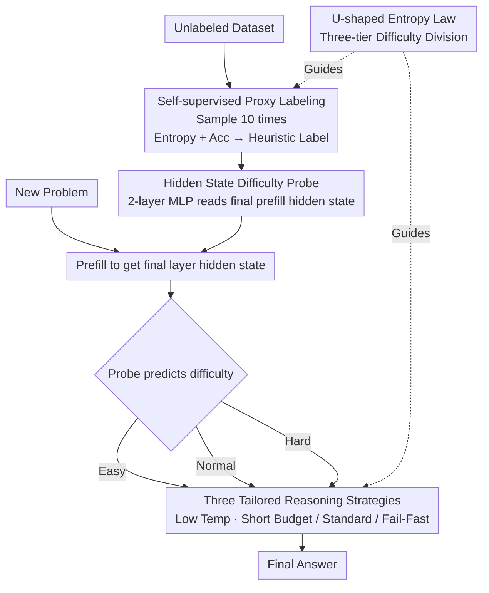

# DiffAdapt: Difficulty-Adaptive Reasoning for Token-Efficient LLM Inference

**Conference**: ICLR2026  
**OpenReview**: [https://openreview.net/forum?id=644FH1vVIl](https://openreview.net/forum?id=644FH1vVIl)  
**Code**: To be confirmed (authors committed to open-sourcing upon publication)  
**Area**: LLM Inference Efficiency  
**Keywords**: Reasoning LLMs, Overthinking, Token Budget, Difficulty-Adaptive, Hidden State Probe

## TL;DR
Authors discovered that reasoning LLMs present a "U-shaped entropy curve" across different problem difficulties—easy problems are answered correctly but with high entropy (overthinking). Consequently, a lightweight probe reading only the model's hidden states is trained to dynamically select among Easy, Normal, and Hard reasoning strategies for each problem. Without fine-tuning the base model, this method reduces token consumption by up to 22.4% and end-to-end latency to 1/6 of the original, while maintaining or even improving accuracy.

## Background & Motivation
**Background**: Reasoning LLMs, represented by DeepSeek-R1 and Qwen3, enhance math, code, and logical reasoning capabilities by generating lengthy "chains-of-thought" (CoT). This "test-time scaling" has become the mainstream paradigm.

**Limitations of Prior Work**: Models indiscriminately generate ultra-long CoT for **every problem**. Significant compute is wasted on easy problems (e.g., a simple GSM8K arithmetic problem might trigger hundreds of tokens), while truly difficult problems may not be solved correctly even with more tokens. This "one-size-fits-all" fixed budget is both expensive and increases latency.

**Key Challenge**: Existing efficiency optimization methods either require fine-tuning the base model with reinforcement learning (high cost, requires large-scale rollout data) or are training-free early-exit methods (e.g., DEER relies on confidence to stop early, but generalizes poorly and often pushes generation to the token limit). The fundamental issue is the lack of a cheap yet accurate "difficulty signal" to guide compute allocation for each problem.

**Goal**: Enable LLMs to adaptively allocate reasoning budgets based on problem difficulty without modifying base model weights or introducing additional large models.

**Key Insight**: Instead of directly predicting "how long to write," the authors first made an counter-intuitive observation: plotting generation entropy (uncertainty in token probability distribution) against problem difficulty reveals a **U-shaped curve**. Entropy is high for easy problems, low for medium problems, and high again for hard problems. The entropy drop from easy to medium is as high as 22–25%, indicating that the model indeed "overthinks" on simple tasks. This curve naturally segments problems into three zones, each requiring a different strategy.

**Core Idea**: A small probe (MLP) reading the last layer's hidden states of the base model classifies problems into Easy, Normal, or Hard categories. Each category is assigned a fixed set of prompt + temperature + maximum length, thereby providing a "tailored" token allocation without fine-tuning the base model itself.

## Method

### Overall Architecture
The goal of DiffAdapt is: given a new problem, use a hyper-lightweight probe to determine if it is Easy, Normal, or Hard before the base model actually begins reasoning, then apply the corresponding reasoning strategy. The pipeline consists of three sequential phases: **offline training data generation, probe training, and online strategy selection using the probe**—with the category thresholds and strategy designs derived from the prior U-shaped entropy analysis.

Specifically: The first phase uses the base model as a "proxy model" to sample 10 outputs per problem on an unlabeled dataset, calculating generation entropy and accuracy to assign Easy/Normal/Hard labels via heuristic rules. The second phase extracts the hidden state $h_L$ from the last layer after the base model finishes the prefill stage and trains a two-layer MLP probe to predict the difficulty label. In the third phase during online inference, the probe reads the hidden state, predicts difficulty, maps it to one of the three strategies, and finally generates the answer with the selected prompt/temperature/length. Since the probe only intervenes after prefill and before decoding, it does not interfere with the base model's KV cache, batching, or prefix cache, allowing for seamless integration with existing inference optimizations.

### Key Designs

**1. U-shaped Entropy Law: Quantifying "Overthinking" into Three Actionable Difficulty Tiers**

This is the empirical foundation of the paper. On DeepMath-103K (which includes difficulty ratings from 1–10), the authors sampled 300 problems per difficulty tier, running each 10 times. They used **generation entropy** to measure uncertainty—for each token position $t$, entropy is $H_t = -\sum_{j=1}^{V} p_{t,j}\log p_{t,j}$, averaged over the sequence. The "difficulty vs. entropy" curve revealed an counter-intuitive U-shape: easy problems have high accuracy but high entropy (the model is capable but uncertain, i.e., the overthinking zone); medium problems have the lowest entropy (the "sweet spot" where capability matches difficulty); and hard problems have high entropy again (the limit of capability). The 22–25% entropy drop from easy to medium provides a theoretical basis for assigning different compute budgets: less for simple tasks, standard for medium tasks, and "Fail-Fast" for hard tasks.

**2. Three Tailored Reasoning Strategies: Independent Prompts, Temperatures, and Lengths**

Targeting the three U-shaped zones, the authors designed three fixed configurations (hyperparameters determined by grid search): **Easy** uses a low temperature of 0.5, a token budget of $0.4\times|\text{Max}|$, and prompts encouraging "direct solution + verification" to avoid blind exploration. **Normal** uses a temperature of 0.8, the full budget of $1.0\times|\text{Max}|$, and prompts for "step-by-step systematic reasoning." **Hard** uses a low temperature of 0.4 and a budget of $0.5\times|\text{Max}|$ with prompts for "resource-aware strategic reasoning." The core is the **Fail-Fast** mechanism—since analysis shows hard problems are unlikely to be solved even with more tokens, it is better to strictly limit length and cut losses early to reallocate compute. Oracle experiments show that selecting the right strategy can save ~50% tokens while increasing accuracy by 10%.

**3. Self-supervised Proxy Labeling: Automated Training Set Construction via Entropy and Accuracy**

Training the probe requires difficulty labels, but manual labeling is expensive and subjective. The authors let the base model act as its own proxy, sampling 10 times per problem on an unlabeled dataset to calculate average entropy and accuracy. Labels are then assigned via heuristic rules: **Accuracy $\geq \alpha$ and Entropy $\leq \beta$ is labeled Normal; Accuracy $< \gamma$ is labeled Hard; others are labeled Easy** (typically the low-difficulty anomaly zone with medium accuracy but abnormally high entropy). Thresholds $\alpha, \beta, \gamma$ are set based on the observed entropy-accuracy distribution and checked for stability on a small validation set. This self-supervised labeling avoids expensive human annotation or large-scale RL rollouts.

**4. Hidden State Difficulty Probe: A Two-layer MLP Without Touching Base Weights**

This is the key to the affordability of DiffAdapt. The authors freeze the base model and only train a tiny probe $C$. After prefilling the question, the last-layer hidden state $h_L$ is passed through a two-layer MLP to obtain the difficulty distribution $d = \mathrm{softmax}(W_2 \cdot \mathrm{ReLU}(W_1 h_L + b_1) + b_2)$, optimized using cross-entropy loss $L(\theta) = -\frac{1}{N}\sum_{i=1}^{N}\log P(d_i = y_i \mid h_L^{(i)};\theta)$. Compared to methods using auxiliary models like BERT or R1-7B as "switchers," this probe has negligible parameters and near-zero latency. Because it only extracts hidden states once after prefill, it does not interrupt decoding and is compatible with KV/prefix cache and batching. Ablation shows that replacing the MLP with a linear head drops accuracy by ~3.2%, indicating non-linearity is necessary.

### Loss & Training
The probe is optimized with AdamW, a learning rate of 1e-3, and trained for 100 epochs. Training data is a subset of DeepMath-103K (300 problems per difficulty). The base model remains frozen; the only learnable parameters are the probe's $\{W_1, W_2, b_1, b_2\}$, resulting in extremely low training costs.

## Key Experimental Results

### Main Results
Evaluated across 5 models (Qwen3-4B, DeepSeek-R1-Qwen-7B, DeepSeek-R1-Llama-8B, Nemotron-1.5B, ThinkPrune-7B) on 8 benchmarks (GSM8K, MATH500, AIME24/25, OlympiadBench as in-domain; Minerva, GPQA, MMLU-Pro as out-of-domain). The core comparison is the token saving rate (relative to the Normal fixed strategy):

| Model | DiffAdapt Token Saving | DEER Token Saving |
|------|----------------------|------------------|
| DeepSeek-R1-Qwen-7B | **9.7%** | −53.3% (More tokens) |
| Qwen3-4B | **22.4%** | −27.5% (More tokens) |
| ThinkPrune-7B | **10.1%** | — |

DiffAdapt consistently outperforms fixed strategies across all models and domains. Compared to the training-free baseline DEER, it achieves up to a 62% reduction in tokens with an 18% performance improvement. DEER often uses more tokens than Normal because its confidence-based stop condition frequently pushes generation to the maximum limit.

End-to-end latency (Qwen3-4B, 40 OlympiadBench problems, batch size 10, single A800, vLLM backend):

| Method | Time (mins) ↓ |
|------|--------------|
| vLLM Baseline | 64 |
| + DEER | 57 |
| + DiffAdapt | **10** |

DiffAdapt is ~6× faster than the vLLM baseline and ~5× faster than DEER, demonstrating that token savings effectively translate into runtime acceleration.

### Ablation Study
Averaged across different token budgets (33%–100%) on Qwen3-4B:

| Configuration | Avg. Performance | Description |
|------|---------|------|
| DiffAdapt (Default) | 70.9 | Full method |
| Transferred Thresholds (from DeepSeek-R1) | 71.2 | Only ~0.3% difference, almost parameter-free |
| Linear Probe Head | 67.7 | Removing non-linearity loses ~3.2% |
| 30% Training Data | 68.5 | Minimal drop when reducing data to 30% |

### Key Findings
- **Probe non-linearity is necessary**: Reaping the benefits of the 2-layer MLP's expressive power is essential; a purely linear head consistently drops performance by ~3.2%.
- **Almost parameter-free transferability**: Transferring thresholds across model families results in only a ~0.3% difference, supporting "plug-and-play" deployment without per-model recalibration.
- **Extreme data efficiency**: Reducing training data to 30% causes negligible performance loss, making it far more efficient than RL methods requiring large-scale rollouts.
- **Orthogonal to RL length control**: Layering DiffAdapt onto models already trained with RL for length control (e.g., Nemotron-1.5B, ThinkPrune-7B) still achieves SOTA under high token budgets, showing it complements rather than conflicts with training-side optimizations.
- **Preserves reasoning integrity**: Using Qwen3-30B as a blind judge on 50 GSM8K problems, DiffAdapt won 76% vs. 12% for the baseline. Only 2% of cases saw logic failure due to early truncation, alleviating concerns that saving tokens might "break" reasoning chains.

## Highlights & Insights
- **Inverting compute allocation from "Entropy"**: The U-shaped entropy curve is a remarkable observation—easy problems with high entropy indicate overthinking. Quantifying abstract "overthinking" into actionable three-tier signals is the most insightful part of the paper.
- **The "Cheap" Philosophy of Hidden State Probing**: By freezing the base model and inserting an MLP after prefill, the authors maintain compatibility with KV/prefix caching while keeping overhead near zero. This idea of "reading internal representations for lightweight decision-making" is transferable to routing, early-exit, and difficulty-aware sampling.
- **Counter-intuitive but effective Fail-Fast**: Assigning **fewer** rather than more tokens to hard problems acknowledges that model capability has limits. Hard problems are often wastes of compute; redirecting those resources to solvable problems is a pragmatic trade-off.
- **Orthogonality**: The ability to layer atop RL-length-controlled models makes it a "patch-style" gain with a low entry barrier for deployment.

## Limitations & Future Work
- **Reliance on three-tier discrete classification**: Hard-coding the continuous difficulty spectrum into Easy/Normal/Hard is coarse; problems on the boundary may be misclassified. Continuous budget regression could be a future direction.
- **Strategy configuration depends on grid search**: The three sets of prompts/temperatures/lengths are determined empirically; these may need recalibration for non-math domains like coding or agents.
- **Circular dependency in proxy labeling**: Labels are derived from the base model's own samples. If the base model is weak, the accuracy/entropy estimates will be noisy, limiting label quality.
- **Threshold robustness boundaries**: While thresholds transfer well between similar model scales, their validity across significantly different model architectures is not fully explored.

## Related Work & Insights
- **vs. DEER (Training-free early exit)**: DEER monitors transition tokens and confidence but often hits the token limit in fixed budgets, increasing token usage (e.g., −27.5% on Qwen3-4B); DiffAdapt uses a "learned difficulty model" for more stable and efficient allocation.
- **vs. Training-side budget control (ThinkPrune, LC-R1)**: These methods integrate budget control into the training phase via RL/GRPO, which is costly. DiffAdapt is frozen-model-based and can be **combined** with these models for orthogonal gains.
- **vs. Methods requiring auxiliary models**: Approaches using BERT to predict remaining length or R1-7B as a switcher increase compute and deployment complexity. DiffAdapt's probe attaches directly to hidden states with nearly zero latency.

## Rating
- Novelty: ⭐⭐⭐⭐ The U-shaped entropy observation is counter-intuitive and insightful.
- Experimental Thoroughness: ⭐⭐⭐⭐⭐ Extensive validation across 5 models, 8 benchmarks, and latency/blind-judging.
- Writing Quality: ⭐⭐⭐⭐ Clear logical chain from phenomenon to method with good visualization.
- Value: ⭐⭐⭐⭐⭐ Plug-and-play, no fine-tuning required, 6× latency reduction; highly practical.

<!-- RELATED:START -->

## Related Papers

- [\[ICLR 2026\] Difficulty–Diversity Collaborative Filtering for Data-Efficient LLM Fine-Tuning](difficultydiversity_collaborative_filtering_for_data-efficient_llm_fine-tuning.md)
- [\[ICLR 2026\] MoL: Adaptive Mixture-of-Length Reasoning for Efficient Question Answering with Context](mol_adaptive_mixture-of-length_reasoning_for_efficient_question_answering_with_c.md)
- [\[ICLR 2026\] ThinKV: Thought-Adaptive KV Cache Compression for Efficient Reasoning Models](thinkv_thought-adaptive_kv_cache_compression_for_efficient_reasoning_models.md)
- [\[ICLR 2026\] Reasoning Language Model Inference Serving Unveiled: An Empirical Study](reasoning_language_model_inference_serving_unveiled_an_empirical_study.md)
- [\[ICLR 2026\] Universal Model Routing for Efficient LLM Inference](universal_model_routing_for_efficient_llm_inference.md)

<!-- RELATED:END -->
