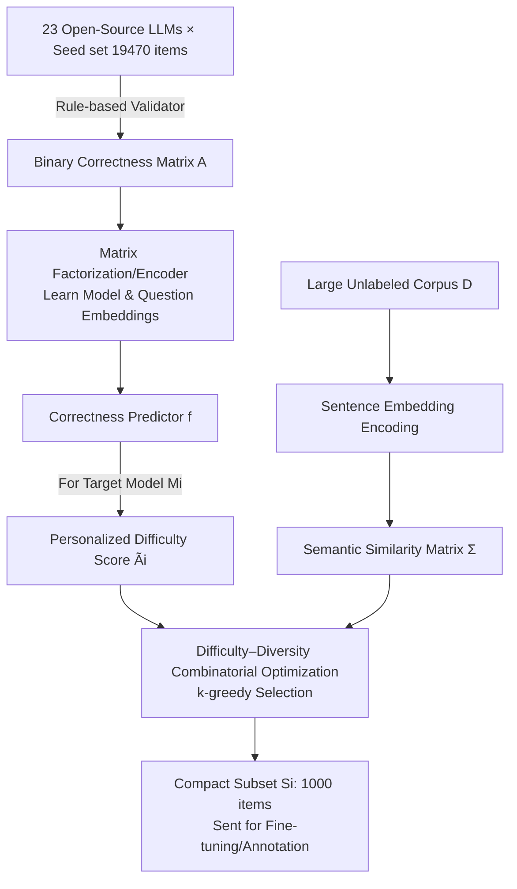

# Difficulty–Diversity Collaborative Filtering for Data-Efficient LLM Fine-Tuning

**Conference**: ICLR 2026  
**OpenReview**: [https://openreview.net/forum?id=n9mXlqD2SJ](https://openreview.net/forum?id=n9mXlqD2SJ)  
**Code**: [https://github.com/iNLP-Lab/DDCF](https://github.com/iNLP-Lab/DDCF)  
**Area**: LLM Data-Efficient Fine-Tuning / Data Selection  
**Keywords**: Data Selection, Collaborative Filtering, Difficulty–Diversity Trade-off, Less-is-More, Supervised Fine-Tuning, Matrix Factorization  

## TL;DR
This paper treats the interaction matrix of "model-question" correctness as a recommendation system rating matrix. It employs collaborative filtering to learn **personalized question difficulty for each target model**, then performs combinatorial optimization with semantic diversity. By selecting the 1000 most valuable samples from large-scale unlabeled corpora, it reduces annotation costs by 100–200x while achieving downstream performance close to full-dataset fine-tuning.

## Background & Motivation
**Background**: Supervised Fine-Tuning (SFT) typically relies on hundreds of thousands of human-annotated samples. However, the Less-is-More hypothesis suggests that downstream tasks often require only a small amount of high-quality data to "awaken" knowledge encoded during pre-training. Selecting a few hundred samples can sometimes outperform blind usage of the entire corpus. Theoretically, when the base model is strong, selecting harder samples offers provable advantages.

**Limitations of Prior Work**: To identify "hard and diverse" high-quality data, existing approaches either rely on evolving human expert experience (laborious and rigid), post-hoc filtering after full-corpus fine-tuning (e.g., S2L clustering by loss trajectories), gradient matching to a target set (LESS), or scoring via closed-source models like ChatGPT (AlpaGasus). These assume expensive pre-conditions. Crucially, **difficulty is not an inherent attribute of a question**: a question difficult for one model might be easy for another. Most methods use unified perplexity or reasoning length to define difficulty, ignoring individual model differences.

**Key Challenge**: There is a need to perform selection **before annotation** to save costs, while ensuring the selected subset is both difficult and diverse for a **specific target model**. Existing methods struggle to satisfy the requirements of "personalized" difficulty and "zero-annotation requirement" simultaneously.

**Goal**: Given only a small labeled seed set, automatically select a compact, challenging, and broad-coverage training subset from large-scale unlabeled corpora for any target model.

**Core Idea**: **Recast data selection as a recommendation problem**—treating models as "users," questions as "items," and correctness as "ratings." Collaborative filtering via matrix factorization is used to learn a personalized difficulty predictor that generalizes to unseen questions. The selection is then framed as a "Difficulty + Diversity" combinatorial optimization objective solved via greedy search.

## Method

### Overall Architecture
DDCF consists of two phases: First, 23 open-source LLMs are evaluated on a small seed set to generate a binary "correctness matrix." A **correctness predictor** is trained to learn "whether model $i$ answers question $j$ correctly." Second, for a target model, this predictor assigns **personalized difficulty scores** to each question in a large corpus. These scores are combined with **semantic similarity** derived from sentence embeddings into a difficulty–diversity combinatorial optimization, where the final subset is selected item-by-item using k-greedy.

### Key Designs

**1. Correctness Predictor: Factorizing the Correctness Matrix into a Generalizable Difficulty Model.** Given $m$ models and $n$ seed questions with ground truth, a binary matrix $A\in\{0,1\}^{m\times n}$ is constructed ($A_{ij}$ indicates whether model $i$ answered question $j$ correctly). While vanilla collaborative filtering decomposes this as $A\approx E_M E_Q^\top$, it only works for questions within the training set. Ours parameterizes the decomposition as an encoder: a model encoder $\phi_M$ maps model indices to a latent space, and a question encoder $\phi_Q=h_Q\circ g_Q$ uses pre-trained sentence embeddings (Qwen3-Embedding-4B) to encode the question text $g_Q$ followed by an MLP $h_Q$. A classification head scores the Hadamard product of the two embeddings, $f(M_i,q_j)=\psi(\phi_M(M_i)\odot\phi_Q(q_j))$, trained via binary cross-entropy. The predicted probability $\hat A_{ij}=\sigma(f(M_i,q_j)_1)$ acts as a parameterized version of matrix factorization. The key difference is that **difficulty is no longer a global value per question but varies by model**, providing the foundation for personalized selection. Since question text is encoded via sentence embeddings, the predictor generalizes to unseen questions.

**2. Difficulty–Diversity Combinatorial Optimization: Simultaneously Minimizing Difficulty Scores and Redundancy.** For target model $M_i$ and large corpus $D$ ($|D|\gg|Q|$), the predicted correctness score $\tilde A_{ij}=\sigma(f(M_i,q_j)_1)$ is calculated; lower scores indicate higher likelihood of error (higher difficulty). Diversity is measured via a sentence embedding cosine similarity matrix $\Sigma$. Selecting $k$ questions is formulated as $\min_{x\in\{0,1\}^{|D|}}\ \lambda(x^\top\tilde A_i)+(1-\lambda)(x^\top\Sigma x),\ \text{s.t.}\ \sum_j x_j=k$, where $\lambda$ balances "selecting hard questions" (minimizing the first term) and "avoiding redundancy" (the sum of similarities between selected items). This objective is convex under continuous relaxation but NP-hard with binary constraints, and $\Sigma$ incurs $O(|D|^2)$ memory overhead.

**3. k-greedy Selection: Reducing NP-hard Selection to Online Greedy with Linear Memory.** Instead of solving for the entire similarity matrix, DDCF starts from an empty set and iteratively adds the question with the maximum marginal gain: $q_j=\arg\min_{q_j\in D\setminus S_i}\big[\lambda\tilde A_{ij}+(1-\lambda)\max_{q_u\in S_i}\Sigma_{uj}\big]$. Here, the diversity term is replaced by "similarity with the most similar item already in the set," requiring only $O(k\cdot|D|)$ online similarity computations. This bypasses NP-hardness and scales memory efficiently. t-SNE visualizations confirm the dual objective: selected subsets cover multiple semantic regions (diversity achieved) while concentrating in the hardest latent regions (difficulty achieved).

**4. Plug-and-Play Scenarios.** This selection works for two types of corpora: for **unlabeled** corpora, DDCF acts as a pre-filter to focus expensive annotations (human experts or teacher models) on $k$ selected items, reducing costs by 100–200x. For **labeled** corpora, it acts as a post-filter to remove trivial redundancy and tailor the learning path for specific models.

## Key Experimental Results

### Main Results (Selecting 1000 from OpenR1-Math-220K, 10 Reasoning Benchmarks)

| Model | Method | ID Avg | OOD Avg |
|------|------|---------|----------|
| Qwen2.5-Math-7B | Full Dataset (220K) | 75.8 | 66.1 |
| | Base Model | 55.6 | 49.2 |
| | Random | 67.8 | 60.5 |
| | Perplexity (Strong baseline) | 69.3 | 65.1 |
| | LIMO / s1.1-1K (Human-curated) | 67.4 / 68.5 | 56.0 / 61.0 |
| | **DDCF** | **70.2** | **65.4** |
| Qwen3-8B-Base | Full Dataset | 87.0 | 80.4 |
| | Random | 83.6 | 79.0 |
| | **DDCF** | **85.0** | **80.5** |

On the 7B model, DDCF's ID average of 70.2 outperforms the strongest baseline and trails the full dataset by only 5.6 points. The OOD average of 65.4 shrinks the gap with the full dataset to 0.7 points; on Gaokao, the score of 74.7 even **outperforms full fine-tuning by +2.5 Gain**. On the 8B model, the OOD 80.5 slightly exceeds the full dataset's 80.4. On the most difficult AIME24, DDCF raises the 7B from 34.6 (base) to 49.0 (+14.4 Gain vs. +10.4 for Random).

### Ablation Study (Scale $k$ from 0 to 220K)
- **Strong Model (Qwen2.5-Math-7B)**: ID performance increases monotonically with $k$. OOD performance is non-monotonic: $k=1000$ quickly reaches a peak of 65.4, drops during $k=4000\text{--}8000$, and then slowly recovers. Selecting just 1000 items captures over 70% of ID gains and nearly all OOD benefits.
- **Weak Model (Qwen2.5-Math-1.5B)**: Confirms the "small model learnability gap." At $k=1000$, ID score drops from 54.3 to 45.4 (-8.9). Performance recovers only at $k \ge 8000$. At $k=128K$, ID 59.2 / OOD 46.0 outperforms full 220K fine-tuning by +1.0 ID / +2.2 OOD.

### Difficulty-Diversity Trade-off ($\lambda$ Ablation)
As $\lambda$ increases from 0 (pure diversity) to 0.2, competition-level AMC23 performance increases and then saturates. Excessive $\lambda$ (pure difficulty) causes performance drops on simple tasks like SVAMP. The default **$\lambda=0.2$** suggests "diversity-first with moderate difficulty" is the most robust configuration.

### Key Findings
- **Personalization** of difficulty is critical: strong models benefit from hard samples, while weak models are overwhelmed by them. A unified difficulty definition cannot accommodate both.
- Compact subsets do not sacrifice generalization; they occasionally exceed full training on OOD sets (Gaokao, Minerva), suggesting that blind data scaling may dilute transferability.

## Highlights & Insights
- **Elegant Perspective Shift**: Recasting LLM data selection as a recommendation problem ("Model = User, Question = Item") allows mature tools like collaborative filtering and matrix factorization to serve data curation effectively and efficiently.
- **Personalized Difficulty** addresses a major blind spot—most methods use global perplexity, while DDCF makes difficulty model-dependent. This explains why it wins on 7B models and why 1.5B models struggle with "hard" samples.
- **Unified Framework**: This is the only method to simultaneously satisfy five criteria: difficulty awareness, diversity awareness, no requirement for full fine-tuning, nearly zero annotation cost, and no dependence on closed-source LLM feedback.

## Limitations & Future Work
- Weak models (1.5B) degrade on small, difficult subsets; "Less-is-More" requires a baseline level of model capability.
- The correctness predictor requires an initial inference budget to evaluate 23 LLMs on the seed set (though this is a one-time amortized cost).
- Experiments are focused on mathematical reasoning; generalization to code, open-domain instructions, or multi-modal tasks remains to be verified.
- Difficulty is captured only by binary "correct/incorrect" signals, without utilizing confidence scores or reasoning chain quality.

## Related Work & Insights
- **Comparison**: DDCF differs from **Influence-based** (LESS, NICE), **Heuristic-based** (Perplexity), **Feedback-driven** (AlpaGasus), and **Diversity-based** (D4) methods by unifying these needs into an annotation-free, personalized framework.
- **Inspiration**: It shares roots with **LLM Routing**. While routing uses model/question embeddings to select the best model, DDCF uses that relationship to guide **data selection**.
- For practitioners: When fine-tuning a specific model, "difficulty" should be measured against that model rather than using a general leaderboard. Diversity should be prioritized, with moderate difficulty ($\lambda \approx 0.2$) being the safest bet.

## Rating
- Novelty: ⭐⭐⭐⭐ — Recasting data selection as a recommendation problem is novel and quantifies the difficulty-diversity trade-off.
- Experimental Thoroughness: ⭐⭐⭐⭐ — Comprehensive across 10 benchmarks and multiple scales, though limited to math.
- Writing Quality: ⭐⭐⭐⭐ — Clear motivation and intuitive visualizations (t-SNE).
- Value: ⭐⭐⭐⭐ — 100–200x cost reduction with near-full performance is highly practical for low-resource fine-tuning.

<!-- RELATED:START -->

## Related Papers

- [\[ICLR 2026\] Influence-Preserving Proxies for Gradient-Based Data Selection in LLM Fine-Tuning](influence-preserving_proxies_for_gradient-based_data_selection_in_llm_finetuning.md)
- [\[ICLR 2026\] CPQS-Tuning: A Model Self-Perception-Based Data Filtering Algorithm for Efficient Instruction Fine-Tuning](cpqs-tuning_a_model_self-perception-based_data_filtering_algorithm_for_efficient.md)
- [\[ICLR 2026\] Explainable Token-level Noise Filtering for LLM Fine-tuning Datasets](explainable_token-level_noise_filtering_for_llm_fine-tuning_datasets.md)
- [\[ICLR 2026\] Neuron-Aware Data Selection in Instruction Tuning for Large Language Models](neuron-aware_data_selection_in_instruction_tuning_for_large_language_models.md)
- [\[ICLR 2026\] Mitigating Non-IID Drift in Zeroth-Order Federated LLM Fine-Tuning with Transferable Sparsity](mitigating_non-iid_drift_in_zeroth-order_federated_llm_fine-tuning_with_transfer.md)

<!-- RELATED:END -->
