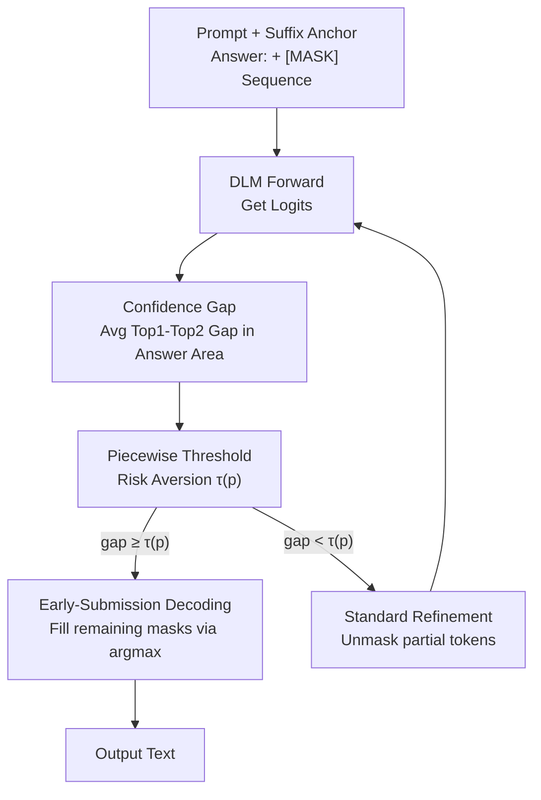

# Diffusion Language Models Know the Answer Before Decoding

**Conference**: ICLR 2026  
**OpenReview**: [https://openreview.net/forum?id=g88nt4ieTG](https://openreview.net/forum?id=g88nt4ieTG)  
**Code**: https://github.com/pixeli99/Prophet  
**Area**: LLM Efficiency  
**Keywords**: Diffusion Language Models, Inference Acceleration, Early-Submission Decoding, Confidence, Training-free

## TL;DR
Diffusion Language Models (DLMs) often internally determine the correct answer mid-way through decoding. Based on this, this paper proposes Prophet, a training-free decoding paradigm that uses the "logit gap between the top-2 candidate tokens" to judge answer convergence. Once converged, it fills all remaining positions in a single step (Early-Submission Decoding), reducing decoding steps by up to 3.4$\times$ on LLaDA-8B / Dream-7B with almost no loss in accuracy.

## Background & Motivation

**Background**: Diffusion Language Models (DLMs, such as LLaDA, Dream, and commercial models like Mercury / Gemini Diffusion) represent a sequence generation paradigm alternative to Autoregressive (AR) models. Instead of generating tokens from left to right, they initialize the entire output as a sequence of `[MASK]` tokens and iteratively denoise via "predicting clean sequences → remasking" to fill all positions in parallel. Their selling points are parallel decoding and flexible generation order.

**Limitations of Prior Work**: Despite theoretical parallelism, the actual inference speed of DLMs is often slower than AR models. This is due to two factors: first, bidirectional attention cannot easily utilize KV caching; second, to maintain quality, many refinement steps are required (often set equal to the generation length, e.g., 256 steps for 256 tokens). Aggressively decoding multiple tokens per step leads to significant quality degradation. Thus, DLMs are stuck in an "efficiency vs. accuracy" trade-off.

**Key Challenge**: Existing acceleration works (KV cache approximation, token pruning, distillation) mostly focus on reducing the "computational cost per step" while assuming the "number of steps" is necessary. However, if the model already "knows" the answer early on, the subsequent refinement steps are purely redundant calculations—a dimension that has not been systematically exploited.

**Key Insight**: The authors conducted a detailed analysis of decoding dynamics: tracking the top-1 predicted token at each position across decoding steps and recording when the "correct answer token first stabilizes as top-1." The findings are striking—on GSM8K and MMLU, 97% and 99% of samples respectively reach the correct answer using only half of the refinement steps. This "early convergence" is particularly significant under random remasking. Answer tokens stabilize much earlier than Chain-of-Thought (CoT) tokens.

**Core Idea**: Since answers converge early, DLM decoding is reformulated as an **Optimal Stopping Problem**. By monitoring confidence in the answer region in real-time, the system can "go all-in" (filling all remaining masks in one step) once convergence is detected, skipping all subsequent redundant steps. This mechanism, named **Prophet**, is training-free, incurs zero extra overhead, and can be wrapped directly around existing DLM inference loops.

## Method

### Overall Architecture

Prophet requires no changes to the model or training; it simply inserts an "early-submission check" into the standard DLM denoising loop. The input is a prompt plus a sequence of `[MASK]` tokens, and the output is the final text. At each step, the model performs a standard forward pass to compute logits. Prophet adds an extra step: calculating the average "confidence gap" $\bar g_t$ over the **answer region** $A$ and comparing it against a threshold $\tau(p)$ that varies with decoding progress. If $\bar g_t \ge \tau(p)$, the answer is deemed converged, and the remaining masks are filled via argmax in a single step (Early-Submission Decoding). Otherwise, it proceeds with a standard DLM refinement step (unmasking a portion of tokens) and enters the next iteration.

The entire process is a "denoising loop with step-wise early-stopping," relying on the coordination of three elements: the convergence metric (confidence gap), the time-varying threshold (piecewise risk aversion), and the termination action (all-in submission). Additionally, adding a semantic anchor suffix ("Answer:") to the prompt further accelerates early convergence.

### Key Designs

**1. Early Answer Convergence: Leveraging Step Redundancy**

This is the foundational observation. The authors analyzed decoding dynamics using LLaDA-8B on GSM8K / MMLU by recording when the top-1 predicted token first matches the ground truth. Key findings: ① A massive number of samples are solved early—under random remasking, 97.2% and 88.5% of samples are correct within 50% and 25% of steps, respectively. ② Answer tokens are significantly more stable than CoT tokens; while non-answer tokens fluctuate, answer tokens remain fixed once stabilized. ③ Current "full-length" decoding contains fundamental redundancy, providing massive room for acceleration.

**2. Confidence Gap: Measuring Convergence via Top-2 Margin**

Prophet uses the confidence gap as a reliable and cheap convergence signal. At step $t$, for each position $i$, it takes the highest logit $L^{(1)}_{t,i}$ and the second highest logit $L^{(2)}_{t,i}$:

$$g_{t,i} = L^{(1)}_{t,i} - L^{(2)}_{t,i}$$

A larger gap indicates a more certain prediction. Crucially, the metric is **averaged only over the answer region $A$** (length $N_{\text{ans}}$):

$$\bar g_t = \frac{1}{|A|}\sum_{i\in A} g_{t,i}$$

Excluding non-answer tokens (like CoT) prevents noise from diluting the signal, maximizing sensitivity. This metric has virtually zero cost as logits are already calculated.

**3. Piecewise Threshold: Progress-Dependent Risk Aversion**

The stopping decision is modeled as a trade-off between "computational cost of further steps" and "risk of early error." These vary inversely with decoding progress $p=(T_{\max}-t)/T_{\max}$. In early stages ($p$ is small), predictions are likely to improve, necessitating **risk aversion** (high threshold $\tau_{\text{high}}$). In late stages ($p$ is large), predictions are stable, allowing for **risk tolerance** (lower threshold $\tau_{\text{low}}$). This is implemented as a piecewise function:

$$\tau(p)=\begin{cases}\tau_{\text{high}} & p<0.33\\ \tau_{\text{mid}} & 0.33\le p<0.67\\ \tau_{\text{low}} & p\ge 0.67\end{cases}$$

The paper uses $\tau_{\text{high}}=7.5, \tau_{\text{mid}}=5.0, \tau_{\text{low}}=2.5$. This prevents premature termination in noisy early stages while decisively cutting redundant late-stage steps.

**4. Early-Submission Decoding + Suffix Anchor**

When $\bar g_t \ge \tau(p)$, Prophet stops iterative refinement and fills all remaining `[MASK]` positions using argmax in one parallel operation. To further assist, a **suffix semantic anchor** ("Answer:") is added. Since DLMs generate bidirectionally, this anchor conditions the model to locate the answer in the designated region, narrowing the search space and speeding up convergence (increasing the proportion of samples correct in the first 25% of steps from 7.9% to 59.7% for low-confidence remasking).

### Loss & Training
None. Prophet is entirely training-free and introduces no learnable parameters. It merely adds a confidence check to the inference loop. The only hyperparameters are the three-tier thresholds and the 33%/67% progress switching points, selected via minor pilot experiments.

## Key Experimental Results

### Main Results

Across reasoning, math, code, and planning tasks using LLaDA-8B and Dream-7B, Prophet significantly reduces steps while maintaining or improving accuracy ($\Delta$ relative to baseline):

| Task | Model | Full (%) | Prophet (Δ) | Speedup |
|------|------|----------|-------------|------|
| MMLU | LLaDA-8B | 54.1 | 54.0 (−0.1) | 2.34$\times$ |
| HellaSwag | LLaDA-8B | 68.7 | 70.9 (+2.2) | 2.14$\times$ |
| TruthfulQA | LLaDA-8B | 34.4 | 46.1 (+11.7) | 2.31$\times$ |
| GSM8K | LLaDA-8B | 77.1 | 77.9 (+0.8) | 1.63$\times$ |
| HumanEval | LLaDA-8B | 30.5 | 30.5 (0.0) | 1.20$\times$ |
| Sudoku | Dream-7B | 89.0 | 89.0 (0.0) | 3.40$\times$ |
| MMLU | Dream-7B | 67.6 | 66.1 (−1.5) | 2.47$\times$ |

**Highlights**: General reasoning tasks show the highest speedup (2–2.5$\times$) and often improved accuracy (e.g., TruthfulQA +11.7), suggesting early submission avoids noise in late refinement steps. Coding tasks (HumanEval) are more conservative (1.20$\times$), reflecting the model's adaptive nature for complex refinements. The peak speedup is 3.4$\times$ on Sudoku.

### Related Work & Insights

Prophet targets the "total number of steps," making it orthogonal to and stackable with methods that reduce "per-step cost":

| Method | Accuracy (%) | Speedup | Note |
|------|---------|------|------|
| LLaDA baseline | 77.1 | 1.00$\times$ | 256 steps |
| SDTT (Distillation) | 76.9 | 2.00$\times$ | 256→128 steps student |
| SDTT + Prophet | 76.4 | 3.21$\times$ | Distilled models retain early convergence |
| Fast-dLLM (KV + Parallel) | 76.6 | 6.82$\times$ | Reduces per-step cost |
| Fast-dLLM + Prophet | 77.3 | 7.66$\times$ | Multiplicative gains |

### Key Findings
- **More than just "running fewer steps"**: Static truncation to 16–128 steps significantly degrades accuracy compared to full decoding. Prophet adaptively stops around 160 steps and achieves higher accuracy (77.9% vs 77.1%), proving the benefits come from avoiding over-refinement of stable answers.
- **Robustness to block length**: Under semi-autoregressive block updates, static schemes crash with large blocks (e.g., 33.1% accuracy for block=128). Prophet improves this by +19.1 points, as its time-varying threshold mitigates the noise injected by aggressive block updates.
- **Independence from remasking**: Prophet consistently outperforms static baselines across Random, Low-confidence, and Top-k margin remasking strategies.

## Highlights & Insights
- **Decoding as Optimal Stopping**: The most significant insight is shifting the perspective from "how fast to compute each step" to "when is it optimal to stop." This dimension was previously overlooked by the DLM acceleration community.
- **Confidence Gap + Answer Area focus**: Using the Top-1 vs Top-2 logit margin is simple and virtually free. Limiting the calculation to the answer region is the key engineering detail that prevents CoT tokens from slowing down the decision.
- **Piecewise Threshold**: The "strict early, loose late" curve translates abstract trade-offs into an implementable and interpretable rule, allowing Prophet to beat static truncation.
- **Orthogonality**: By decoupling step reduction from per-step optimization, Prophet can be combined with Fast-dLLM or SDTT for multiplicative speedups (up to 7.66$\times$).

## Limitations & Future Work
- **Dependency on Identifiable Answer Regions**: The method is tailored for tasks with clear answer regions (Reasoning, Code, Planning). Its efficacy in open-ended long-form generation (where no clear answer zone exists) remains unexplored.
- **Manual Global Thresholds**: $\tau$ values and switching points are fixed across tasks. There is no automated or per-sample calibration mechanism.
- **Accuracy Drops in Specific Tasks**: Drops in WinoGrande (LLaDA) and MMLU (Dream) suggest that early submission is not universally beneficial for all task types.
- **Future Directions**: Converting piecewise thresholds into continuous adaptive functions; automating answer region detection; and combining with more orthogonal methods like token pruning (DPad).

## Rating
- Novelty: ⭐⭐⭐⭐⭐ Reformulating DLM decoding as an optimal stopping problem introduces a new orthogonal dimension to acceleration.
- Experimental Thoroughness: ⭐⭐⭐⭐ Broad coverage across models and tasks, with detailed ablations on budgets and remasking; however, threshold sensitivity and long-text scenarios deserve more depth.
- Writing Quality: ⭐⭐⭐⭐⭐ Logical flow from observation to action is clear, with intuitive visualizations of convergence.
- Value: ⭐⭐⭐⭐⭐ Training-free, zero overhead, and stackable; it significantly enhances the practical utility of DLM inference with low barrier to entry.

<!-- RELATED:START -->

## Related Papers

- [\[ICLR 2026\] Hierarchy Decoding: A Training-free Parallel Decoding Strategy for Diffusion Large Language Models](hierarchy_decoding_a_training-free_parallel_decoding_strategy_for_diffusion_larg.md)
- [\[ICLR 2026\] SparseD: Sparse Attention for Diffusion Language Models](sparsed_sparse_attention_for_diffusion_language_models.md)
- [\[ICLR 2026\] Accelerating Diffusion Large Language Models with SlowFast Sampling: The Three Golden Principles](accelerating_diffusion_large_language_models_with_slowfast_sampling_the_three_go.md)
- [\[ICLR 2026\] Learning to Parallel: Accelerating Diffusion Large Language Models via Learnable Parallel Decoding](learning_to_parallel_accelerating_diffusion_large_language_models_via_learnable_.md)
- [\[ACL 2026\] CreditDecoding: Accelerating Parallel Decoding in Diffusion Large Language Models with Trace Credit](../../ACL2026/llm_efficiency/creditdecoding_accelerating_parallel_decoding_in_diffusion_large_language_models.md)

<!-- RELATED:END -->
