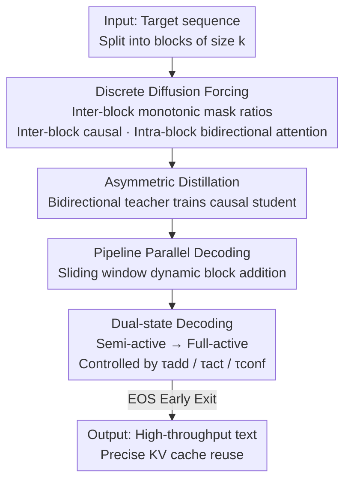

# Diffusion LLMs Can Do Faster-Than-AR Inference via Discrete Diffusion Forcing

**Conference**: ICLR2026  
**OpenReview**: [https://openreview.net/forum?id=t5uLZSRjhF](https://openreview.net/forum?id=t5uLZSRjhF)  
**Code**: https://github.com/SJTU-DENG-Lab/Discrete-Diffusion-Forcing  
**Area**: LLM Efficiency / Diffusion Language Models / Inference Acceleration  
**Keywords**: Diffusion Language Models, Discrete Diffusion Forcing, Block-level Autoregression, KV Caching, Parallel Decoding

## TL;DR
This paper proposes Discrete Diffusion Forcing (D2F), which transforms pre-trained diffusion language models (dLLMs) into a hybrid AR-diffusion paradigm featuring "block-level autoregression + inter-block parallel decoding." By acquiring this capability via low-cost asymmetric distillation and pairing it with pipeline parallel decoding, the authors demonstrate for the first time that open-source dLLM inference throughput can surpass that of autoregressive LLMs of the same scale (achieving 2.5× speedup over LLaMA3 on GSM8K and 50× over the original dLLM).

## Background & Motivation
**Background**: Autoregressive (AR) LLMs have long dominated text generation but are naturally constrained by token-by-token serial decoding. Diffusion Language Models (dLLMs, e.g., LLaDA, Dream) utilize iterative denoising from a fully masked sequence, theoretically allowing the parallel prediction of multiple tokens. This is viewed as a promising route to break the AR latency bottleneck. Closed-source dLLMs (Gemini Diffusion, Mercury, Seed Diffusion) have indeed demonstrated speeds of thousands of tokens per second, 5–10× faster than same-scale AR models.

**Limitations of Prior Work**: In the open-source community, **no dLLM has truly surpassed the inference speed of same-scale AR models**. There are two fundamental issues: ① dLLMs use bidirectional attention, which is naturally incompatible with standard KV caching—every denoising step requires recomputing the entire sequence, leading to significant redundancy. ② Parallel decoding relies on the "conditional independence assumption," making it difficult to generate interdependent tokens simultaneously, resulting in either collapsed quality or a requirement for many iteration steps to compensate.

**Key Challenge**: The requirement is to achieve two seemingly mutually exclusive goals: **a block-level causal structure for precise KV caching**, while **allowing subsequent blocks to perform parallel decoding early** before previous blocks are fully denoised. Existing works (Block Diffusion introduces block-level order for KV caching, and Fast-dLLM uses approximate KV caching + confidence re-masking) struggle to achieve both, thus failing to catch up with AR speeds.

**Goal**: To simultaneously obtain both properties—precise KV caching via block-level causality and permitted parallel decoding for subsequent blocks.

**Key Insight**: The authors note that this aligns with the spirit of "Diffusion Forcing" (DF) in continuous space diffusion (used for video generation). DF trains models to predict the next frame given "noisy and incomplete" preceding frames. Migrating DF from continuous data to discrete token sequences allows dLLMs to learn to "predict subsequent blocks based on partially denoised prefixes."

**Core Idea**: Apply a **monotonically increasing mask ratio** to different blocks in a sequence (earlier blocks are cleaner, later blocks are more masked) and constrain attention to be **inter-block causal and intra-block bidirectional**. This allows earlier blocks to finish first and cache KV states, while subsequent blocks decode in parallel based on incomplete prefixes—termed Discrete Diffusion Forcing (D2F). This capability is "retrofitted" into existing dLLMs via low-cost asymmetric distillation.

## Method

### Overall Architecture
The goal of D2F is to transform a standard bidirectional dLLM into a hybrid model supporting "precise KV caching + inter-block parallel decoding." The pipeline consists of three steps: ① **Discrete Diffusion Forcing** redefines the generation paradigm—splitting the target into blocks of size $k$, applying monotonically increasing mask ratios, and setting attention to inter-block causal/intra-block bidirectional to teach the model to "predict subsequent blocks on noisy prefixes." ② **Asymmetric Distillation**—instead of training from scratch, a global bidirectional teacher dLLM is used to train a student (D2F model) restricted to causal prefixes. ③ **Pipeline Parallel Decoding**—during inference, a sliding window of active blocks is maintained, new blocks are appended dynamically, and a dual-state mechanism controls the decoding aggressiveness of each block, leveraging KV caching.

### Key Designs

**1. Discrete Diffusion Forcing (D2F): Unlocking KV Caching and Inter-block Parallelism via Monotonic Masking**

D2F addresses the conflict between KV caching and parallelism. It splits a clean sequence $Y^0$ into $N$ blocks $\{Y_{B_1},\dots,Y_{B_N}\}$ of size $k$. The forward process applies a **monotonically increasing noise schedule** $t_1 < t_2 < \dots < t_N$, meaning earlier blocks are less masked (more complete) and later blocks are more masked (more uncertain). The reverse process trains the model to characterize:

$$p_\theta(Y^0|Y^t) = \prod_{i=1}^{N} p_\theta\big(Y^0_{B_i} \mid Y^{t_1}_{B_1}, \dots, Y^{t_i}_{B_i}\big),$$

Note that the $i$-th block is only conditioned on **itself and preceding blocks** (causal view). This yields two benefits: ① Since earlier blocks are cleaner and finish first, their KV states can be cached for precise reuse—the **inter-block causal, intra-block bidirectional** attention ensures cached KV states are not invalidated by subsequent tokens (unlike Fast-dLLM’s approximate cache, which is polluted by bidirectional attention). ② The model is forced to "predict subsequent blocks from incomplete prefixes" during training, allowing later blocks to advance in parallel during inference before earlier blocks are fully denoised. This is an extension of continuous "Diffusion Forcing" to discrete sequences.

**2. Asymmetric Distillation: Retrofitting Causal Students using Global-View Teachers**

Training a multi-billion parameter dLLM from scratch is expensive. D2F distills from existing bidirectional dLLMs. Let $p_{\phi^-}$ be the standard bidirectional teacher and $p_\theta$ be the student ($\theta$ initialized with $\phi^-$). The **only architectural difference is the attention mask**: the teacher uses bidirectional, while the student uses inter-block causal. The distillation loss is:

$$\mathcal{L}_{\text{D2F}} = \mathbb{E}_{t_1<\dots<t_N}\Bigg[\sum_{i=1}^{N} D_{\mathrm{KL}}\Big( p_\theta(Y^0_{B_i}\mid Y^{t_1}_{B_1},\dots,Y^{t_i}_{B_i}) \,\big\|\, p_{\phi^-}(Y^0_{B_i}\mid Y^{t_1}_{B_1},\dots,Y^{t_N}_{B_N}) \Big)\Bigg].$$

The "Asymmetry" lies in the fact that the teacher has a **global view of all noisy blocks** (conditioned on $Y^{t_N}_{B_N}$) when predicting $Y^0_{B_i}$, while the student must approximate this distribution using only a **causally restricted view** (up to $Y^{t_i}_{B_i}$). This transfers the mask prediction capability of the dLLM to the new causal model at low cost—the paper uses 8 A100s for 12 hours with LoRA (rank 32) on q/k/v/o projections.

**3. Pipeline Parallel Decoding: Sliding Windows and Dynamic Block Addition**

To exploit inter-block parallelism, D2F maintains a **sliding window of active blocks**. Starting with one fully masked block, a **new fully masked block is dynamically appended** when the percentage of decoded tokens in the last block exceeds a threshold $\tau_{\text{add}}$. This strategy reduces computation per step compared to maintaining a full sequence. Each block applies a confidence filter $\tau_{\text{conf}}$: only tokens with higher prediction confidence are accepted. For Instruct models, detecting `<EOS>` allows for early termination, a key source of speedup.

**4. Dual-state Decoding: Buffering Quality Loss via "Semi-active to Full-active"**

Aggressive parallel decoding on a newly appended block can lead to performance drops due to insufficient prefix context. A **dual-state mechanism** is introduced: new blocks are initialized as **semi-active** for conservative parallel decoding. Only when the preceding block completes $\tau_{\text{act}}$ of its decoding (sufficient context accumulated) does the block transition to **full-active**. Both states use the confidence criterion, but full-active blocks are more aggressive—if no token exceeds $\tau_{\text{conf}}$, they **force-decode the token with the highest confidence** to prevent pipeline stalls.

### Mechanism: Pipeline Progress and Addition
Example with $\tau_{\text{add}}=\tfrac13, \tau_{\text{act}}=\tfrac56$: Initially, only block $B_1$ (fully masked) exists. After one step, $B_1$ decodes some tokens. Once $B_1$ is $> \tfrac13$ complete, a semi-active block $B_2$ is appended—$B_1$ and $B_2$ are then advanced **in parallel**, but $B_2$ decodes conservatively. When $B_1$ exceeds $\tfrac56$ completion, $B_2$ becomes full-active and decodes multiple tokens per step. If $B_2$ crosses $\tfrac13$, $B_3$ is added. This forms a pipeline where "previous blocks finish while subsequent blocks start."

### Loss & Training
The objective is the KL loss $\mathcal{L}_{\text{D2F}}$ (summed over masked tokens). The data is a subset of Bespoke-Stratos-17k (Qwen2.5-7B responses filtered to 600 tokens). Block size $k=16$, monotonic mask ratio bounds $[0.2, 0.7]$. LoRA (rank 32) is applied to q/k/v/o projections. Training takes 12 hours on 8×A100-40GB. Default inference parameters: $\tau_{\text{conf}}=0.9, \tau_{\text{add}}=0.1, \tau_{\text{act}}=0.95$.

## Key Experimental Results

### Main Results
Evaluated on LLaDA-Instruct-8B and Dream-Base-7B backbones. TPS = tokens/second.

| Test Set | Method | TPS↑ | Gain | Score↑ |
|--------|------|------|--------|--------|
| GSM8K-4shot | LLaDA-Instruct | 7.2 | 1.0× | 77.4 |
| GSM8K-4shot | Fast-dLLM(Dual) | 35.2 | 4.9× | 78.9 |
| GSM8K-4shot | **Ours (D2F-LLaDA)** | **52.5** | **7.3×** | 77.3 |
| MBPP-3shot | LLaDA-Instruct | 0.9 | 1.0× | 39.0 |
| MBPP-3shot | **Ours (D2F-LLaDA)** | **47.6** | **52.9×** | 38.0 |
| GSM8K-CoT-8shot | Dream-Base | 9.5 | 1.0× | 75.0 |
| GSM8K-CoT-8shot | **Ours (D2F-Dream)** | **91.2** | **9.6×** | 77.6 |

**Faster-than-AR Conclusion** (max length 512): D2F-Dream-Base-7B reaches **119.9 TPS** on GSM8K, which is **2.5×** faster than LLaMA3-Instruct-8B (48.0 TPS) and 2.3× faster than Qwen2.5-Base-7B (52.7 TPS). This is the first open-source dLLM to surpass same-scale AR throughput.

### Ablation Study

| Configuration | Metric | Description |
|------|---------|------|
| Dual-state ($\tau_{\text{add}}<\tau_{\text{act}}$) | 74.2 Score / 139.0 TPS | Decreasing $\tau_{\text{add}}$ from 0.85 to 0.7 improves score (72.6→74.2) and TPS (136.8→139.0). |
| Single-state ($\tau_{\text{add}}=\tau_{\text{act}}$) | 72.6 Score | Immediate activation of new blocks leads to lower scores. |
| D2F Monotonic Schedule | 54.6 Score / 171.2 TPS | vs random schedule (49.6 / 147.2): both faster and better. |
| Block size = 48 (Inference) | 77.5 Peak Score | Larger blocks decrease throughput; 48 is the sweet spot for performance. |

### Key Findings
- **Early Exit is a major speedup source**: The 52.9× speedup on MBPP for D2F-LLaDA largely stems from Instruct models detecting `<EOS>` to stop early.
- **Superior Throughput-Performance Trade-off**: While original Dream-Base drops from 71.4 to 42.8 on GSM8K when reducing steps, D2F maintains 71.2 score at 150.9 TPS (3.1× LLaMA3 throughput).
- **Dual-state design consistently outperforms single-state**: The conservative semi-active phase buffers quality loss from premature aggressive decoding.
- **Backbone-specific protocols**: Different backbones use different max lengths (e.g., LLaDA 512 vs Dream 256) to align with their respective baselines.

## Highlights & Insights
- **Cross-domain migration of "Diffusion Forcing"**: The core insight is that "KV caching needs block causality, while parallel decoding needs prefix-based prediction," which can be satisfied by "monotonic masking + inter-block causal attention."
- **Asymmetric Distillation for low-cost retrofitting**: Aligning teacher/student via attention masks allows for a transition to causal models with minimal loss and low training overhead (12 hours on 8×A100).
- **First time surpassing AR**: Effectively converting dLLM's "theoretical parallelism" into "measured throughput exceeding AR" is a milestone for the practical utility of the dLLM route.

## Limitations & Future Work
- **Dependency on existing dLLMs**: D2F's performance ceiling is constrained by the teacher dLLM used for distillation.
- **Hyper-parameter sensitivity**: $\tau_{\text{conf}}, \tau_{\text{add}}, \tau_{\text{act}}$, and block size all affect the throughput-quality balance; different benchmarks require different tuning.
- **Evaluation scope bias**: Experiments focus on math/code. Whether parallel decoding maintains quality in "token-dependent" scenarios like open-domain long-form text or dialogue remains to be fully verified.

## Related Work & Insights
- **vs Block Diffusion**: Both use block-order for KV caching, but Block Diffusion's teacher-forcing requires full denoising of previous blocks, **disabling inter-block parallelism**. D2F learns to predict from incomplete prefixes to unlock this parallelism.
- **vs Fast-dLLM**: Fast-dLLM uses **approximate KV caching** where bidirectional attention pollutes states. D2F uses inter-block causal attention for precise KV reuse, ensuring stability.
- **vs Diffusion Forcing (Video)**: D2F successfully adapts continuous space diffusion forcing and streaming distillation to discrete text dLLMs.

## Rating
- Novelty: ⭐⭐⭐⭐⭐ Paradigm-level reconstruction using monotonic masking to bridge KV caching and parallelism.
- Experimental Thoroughness: ⭐⭐⭐⭐ Strong results across backbones/benchmarks, though restricted to math/code domains.
- Writing Quality: ⭐⭐⭐⭐⭐ Clear motivation and thorough algorithmic explanation.
- Value: ⭐⭐⭐⭐⭐ Milestone proof that open-source dLLMs can be faster than AR models.

<!-- RELATED:START -->

## Related Papers

- [\[ICLR 2026\] NI Sampling: Accelerating Discrete Diffusion Sampling by Token Order Optimization](ni_sampling_accelerating_discrete_diffusion_sampling_by_token_order_optimization.md)
- [\[ICML 2026\] Fast-dLLM++: Fréchet Profile Decoding for Faster Diffusion LLM Inference](../../ICML2026/llm_efficiency/fast-dllm_fréchet_profile_decoding_for_faster_diffusion_llm_inference.md)
- [\[ICLR 2026\] Attention Is All You Need for KV Cache in Diffusion LLMs](attention_is_all_you_need_for_kv_cache_in_diffusion_llms.md)
- [\[ICLR 2026\] DPad: Efficient Diffusion Language Models with Suffix Dropout](dpad_efficient_diffusion_language_models_with_suffix_dropout.md)
- [\[ICLR 2026\] FlashDLM: Accelerating Diffusion Language Model Inference via Efficient KV Caching and Guided Diffusion](flashdlm_accelerating_diffusion_language_model_inference_via_efficient_kv_cachin.md)

<!-- RELATED:END -->
