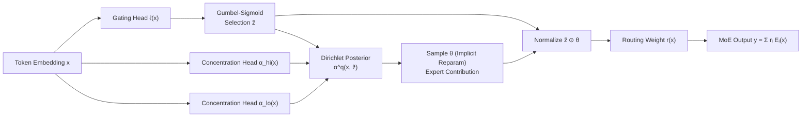

# DirMoE: Dirichlet-Routed Mixture of Experts

**Conference**: ICLR 2026  
**arXiv**: [2602.09001](https://arxiv.org/abs/2602.09001)  
**OpenReview**: [https://openreview.net/forum?id=a15cDnzr6r](https://openreview.net/forum?id=a15cDnzr6r)  
**Code**: To be confirmed  
**Area**: LLM Efficiency / MoE Routing  
**Keywords**: Mixture-of-Experts, Differentiable Routing, Dirichlet Variational, Gumbel-Sigmoid, Sparsity Control, Expert Specialization  

## TL;DR
DirMoE decouples MoE routing into two separate decisions: "which experts to select (Bernoulli/Gumbel-Sigmoid)" and "how to distribute weights among selected experts (Dirichlet)." Using a Dirichlet Variational Autoencoder framework, it achieves end-to-end differentiability and introduces a mathematically guaranteed "sparsity knob" $\lambda$ for direct calibration, enhancing expert specialization without the need for auxiliary load-balancing losses.

## Background & Motivation
- **Background**: Sparse MoE expands model capacity without proportional increases in computation by routing each token to a subset of experts. The router is the core component. Prevailing routers, such as Top-k+Softmax (GShard, Switch), rely on capacity constraints and auxiliary balancing losses for stability.
- **Limitations of Prior Work**: The discrete selection step in Top-k is **non-differentiable**, requiring secondary objectives like temperature adjustment, auxiliary losses, or Straight-Through Estimators (STE) to "force" sparsity, which are complex and difficult to calibrate. While continuous gating like ReMoE restores gradients, it still requires auxiliary sparsity losses that inject interference gradients and suppress expert specialization, often becoming unstable when combined with token dropping.
- **Key Challenge**: A single Softmax **entangles** "which experts are selected (selection)" and "how much each contributes (contribution)." Load balancing and mixing weight calibration are coupled by the same temperature, leading to uninterpretable expert usage and uneven load distribution.
- **Goal**: To design a routing mechanism that is (i) fully differentiable and (ii) provides **explicit, interpretable** control over both expert selection and probability distribution.
- **Core Idea**: **Utilize a spike-and-slab prior to decompose routing into a "binary selection mask z" and "Dirichlet mixing weights θ on the simplex." The final routing weight is the normalized Hadamard product of both. Selection is relaxed via Gumbel-Sigmoid, and Dirichlet sampling uses implicit reparameterization, ensuring full differentiability. A single-parameter sparsity knob is derived from the property that the mass of Dirichlet subsets follows a Beta distribution.**

## Method

### Overall Architecture
DirMoE replaces the standard MoE router with a Dirichlet Variational Router. Given a token embedding $x$, three heads generate gating logits $\ell(x)$, active concentrations $\alpha_{hi}(x)$, and inactive concentrations $\alpha_{lo}(x)$. Gating logits yield a relaxed **expert selection vector** $\tilde z\in(0,1)^E$ via Gumbel-Sigmoid. Conditioned on $\tilde z$, the Dirichlet posterior samples **expert contributions** $\theta\in\Delta^{E-1}$. The final routing weight is $r(x)=\text{normalize}(\tilde z\odot\theta)$, used to aggregate expert outputs. Training employs a variational ELBO (reconstruction + Dirichlet KL + sparsity penalty), with scheduling applied to temperature and Dirichlet concentrations to transition the model from "exploration" to "decision" states.

### Key Designs

**1. Spike-and-slab decomposition on the simplex: Disentangling "selection" and "contribution".** DirMoE formalizes the two routing decisions using a spike-and-slab prior: the selection mask $z\in\{0,1\}^E$ is the spike (deciding active experts), and the simplex vector $\theta\in\Delta^{E-1}$ is the slab (deciding mass distribution among active experts). The joint distribution is $p(z,\theta\mid x)=\prod_i \text{Bernoulli}(z_i\mid\pi_i(x))\times \text{Dir}(\theta\mid\alpha^{(p)}(z))$. The slab uses two-level concentrations $\alpha_i^{(p)}(z)=\lambda\big(z_i\alpha_{hi}+(1-z_i)\alpha_{lo}\big)$, where $\alpha_{hi}>\alpha_{lo}>0$. Active experts receive high concentration, while inactive ones receive low concentration to suppress leakage. $\lambda$ is a global scale—larger $\lambda$ makes samples more uniform around the mean, while smaller $\lambda$ increases variance, pushing mass toward simplex vertices (further sparsity).

**2. Fully differentiable routing: Gumbel-Sigmoid + Dirichlet implicit reparameterization.** To allow gradients through discrete choices, the selection vector uses binary Gumbel-Sigmoid sampling $\tilde z_i=\sigma\big((\ell_i(x)+g_i)/\tau_z\big)$ where $g_i\sim\text{Logistic}(0,1)$. As temperature $\tau_z\downarrow 0$, $\tilde z$ approaches binary values. Conditioned on $\tilde z$, the posterior is $q_\phi(\theta\mid x,\tilde z)=\text{Dir}(\alpha^{(q)}(x,\tilde z))$, where $\alpha_i^{(q)}=\lambda^{(q)}\big(\tilde z_i\alpha_{hi,i}(x)+(1-\tilde z_i)\alpha_{lo,i}(x)\big)$, sampled via implicit reparameterization of normalized Gamma distributions. The prior uses the same relaxed gate $\tilde z$ to maintain closed-form KL. The final $r(x)=\text{normalize}(\tilde z(x)\odot\theta(x))$ allows gradients to pass through both Binary-Concrete relaxations and the Dirichlet distribution without needing STE or Top-k.

**3. Variational training objective + explicit sparsity penalty.** Each token optimizes $\mathcal{L}_{\text{DirMoE}}=-\mathbb{E}_q[\log p_\psi(x\mid r(x))] + \beta_\theta\,\mathbb{E}_q[D_{KL}(\text{Dir}(\alpha^{(q)})\|\text{Dir}(\alpha^{(p)}))] + R_{\text{sparsity}}$. When $\beta_\theta=1$, this reduces to a standard ELBO. The total loss is $\mathcal{L}_{\text{total}}=\mathcal{L}_{LM}+\mathcal{L}_{\text{DirMoE}}$. The sparsity term directly constrains the expected number of active experts to $k$: $R_{\text{sparsity}}(x)=\lambda_{\text{sparsity}}\big(\sum_i\tilde z_i(x)-k\big)^2$. Experiments show that larger $\lambda_{\text{sparsity}}$ allows precise approximation of target sparsity $1-k/E$.

**4. Mathematically guaranteed "sparsity knob" λ.** A key contribution is utilizing Dirichlet properties—where the sum of masses of any subset follows a Beta distribution—to turn sparsity into an analytically calibratable scalar. For an active set $S$, the total mass $T=\sum_{i\in S}\theta_i\sim\text{Beta}(k\lambda^{(p)}\alpha_{hi},(E-k)\lambda^{(p)}\alpha_{lo})$. Given a target mass fraction $m = \mathbb{E}[T]$, the ratio $r=\alpha_{hi}/\alpha_{lo}=\frac{m}{1-m}\cdot\frac{E-k}{k}$ can be solved. Measuring sparsity with the Simpson index $H(p)=\sum_i p_i^2$, it is proven that $\mathbb{E}[H(p)]=\frac{\lambda S_2/B+1}{\lambda B+1}$ is **strictly monotonically decreasing** with respect to concentration $\lambda$. This allows two practical calibrators: mapping a target Simpson $h$ to $\lambda = \frac{1-h}{hE-1}$ under symmetric bases, or solving for $\lambda$ given a target variance $v_{\text{tar}}$. Thus, $k$ determines "how many experts," and $\lambda$ determines "how concentrated their mass is"—two orthogonal knobs.

## Key Experimental Results

The backbone is a 185M parameter LLaMA model (12 layers, RMSNorm, SwiGLU, RoPE, GQA), trained on approximately 30B tokens from The Pile using H100 GPUs.

### Main Results: Zero-shot Accuracy (%, higher is better)

| Method | ARC-c | ARC-e | BoolQ | HellaSwag | LAMBADA | PIQA | RACE | Avg. |
|------|-------|-------|-------|-----------|---------|------|------|------|
| Hash | 19.28 | 45.45 | 54.95 | 29.68 | 31.44 | 63.06 | 27.66 | 38.79 |
| Lory | 20.31 | 42.97 | 49.54 | 28.75 | 32.35 | 62.24 | 27.75 | 37.70 |
| SparseMixer-v2 | 19.80 | 46.72 | 45.96 | 30.24 | 34.12 | 62.89 | 29.00 | 38.39 |
| Expert Choice | 18.86 | 42.97 | 60.21 | 29.14 | 29.26 | 61.92 | 27.37 | 38.53 |
| Switch MoE† | 20.09 | 44.23 | 57.83 | 29.68 | 32.97 | 63.55 | 27.96 | 39.47 |
| ReMoE | 20.22 | 46.68 | 54.16 | 30.26 | **35.94** | 63.55 | 29.38 | 40.03 |
| **Ours (DirMoE)** | **20.57** | 46.20 | **61.52** | 29.93 | 36.44 | **63.75** | 29.52 | **41.13** |

The average score of 41.13 leads the strongest baseline, ReMoE (40.03), by approximately 1.1 points, with the most significant gain in BoolQ (+1.3 vs EC).

### Training Efficiency (LLaMA-185M, E=8, k=1)

| Method | Iteration Time (ms)↓ | Throughput (TFLOP/s/GPU)↑ |
|------|----------------|---------------------|
| Vanilla MoE (Switch) | 431.5 | 138.2 |
| Ours (DirMoE) | 437.3 | 137.2 |

Computational overhead is less than 1%, remaining largely consistent with vanilla MoE.

### Ablation Study
- **Necessity of Sparsity Regularization**: $\lambda_{\text{sparsity}}=0.01$ stabilizes the approximation of target sparsity, whereas $=0$ fails to achieve required sparsity.
- **Decoupling of $m$ and $\lambda$**: Fixing Beta variance at 0.01, as $m$ decreases, the calculated $\lambda$ increases to maintain similar sparsity, only changing the contribution distribution among active experts. This verifies that the "who" and "how much" knobs are orthogonal.
- **Scalability**: Training was stable across $k\in\{1,2,3\}$ and $E\in\{8,16,32,48\}$, consistently reaching target sparsity.

### Key Findings
- **Elimination of auxiliary balancing loss** does not hinder sparsity control and actually **improves expert specialization**. DirMoE's expert routing for different domains deviates further from uniform distribution compared to vanilla MoE, at the cost of slight load asymmetry. Vanilla MoE's forced balancing tends to homogenize experts and weaken semantic focus.

## Highlights & Insights
- **Clear Conceptual Decoupling**: Explicitly splitting "active experts" and "mass distribution" into Bernoulli and Dirichlet variables addresses the fundamental limitation of Top-k+Softmax, where one temperature parameter controls two distinct behaviors.
- **Calibratable Sparsity with Proof**: The monotonic relationship between Simpson index and Dirichlet concentration transforms "tuning sparsity" from empirical temperature searching into an analytical formula $\lambda=\frac{1-h}{hE-1}$.
- **Removal of Auxiliary Loss**: Relying on ELBO and expected constraints $\sum\tilde z_i\approx k$ avoids interference gradients from traditional balancing losses, resulting in superior specialization.
- **White-box Routing**: Selection and contribution vectors naturally expose which experts are active and their relative weights, facilitating interpretability research.

## Limitations & Future Work
- **Limited Scale**: Verified only on a 185M LLaMA with 30B tokens; performance at billion-parameter scales remains to be proven.
- **Hyperparameter Complexity**: Managing schedules for temperature $(\tau_0,\rho,\tau_{\min})$, concentration decay $(\gamma,\eta)$, $\beta_\theta$, and $\lambda_{\text{sparsity}}$ is more engineering-intensive than Top-k.
- **Load Asymmetry**: Removing balancing losses leads to slight load asymmetry, which may impact expert parallel efficiency at massive scales.
- **Future Directions**: Potential for "monosemantic" expert specialization through decoupled variables and increased robustness through probabilistic modeling.

## Related Work & Insights
- **Top-k+Softmax Routing**: GShard and Switch rely on auxiliary balancing and capacity controls; DirMoE resolves the non-differentiability at the root.
- **Differentiable Routing**: Soft-MoE and ReMoE also restore end-to-end gradients, but DirMoE provides unique spike-and-slab decoupling and a theoretical sparsity knob.
- **Variable k / Dynamic Depth**: Methods like DynMoE or MoD are complementary to DirMoE's "sparsity-on-demand" philosophy.
- **Insight**: Introducing variational inference (Dirichlet VAE) into the router suggests that routing is fundamentally a probability assignment problem with uncertainty. The analytical calibration approach could be transferred to other sparse gating or attention scenarios.

## Rating
- **Novelty**: ⭐⭐⭐⭐⭐ Reformulating MoE routing as a Dirichlet VAE with decoupled selection/contribution and provable sparsity knobs is a significant framework-level innovation.
- **Experimental Thoroughness**: ⭐⭐⭐ Covers 7 zero-shot benchmarks and efficiency/scalability ablations, but lacks large-scale or downstream fine-tuning validation.
- **Writing Quality**: ⭐⭐⭐⭐ Clear motivation, rigorous theoretical derivations, and effective visualizations.
- **Value**: ⭐⭐⭐⭐ Offers an interpretable, calibratable, and auxiliary-loss-free differentiable router with clear utility for expert specialization research.

<!-- RELATED:START -->

## Related Papers

- [\[ICLR 2026\] Understanding the Mixture-of-Experts with Nadaraya-Watson Kernel](understanding_the_mixture-of-experts_with_nadaraya-watson_kernel.md)
- [\[ICLR 2026\] Mixture-of-Experts Can Surpass Dense LLMs Under Strictly Equal Resource](mixture-of-experts_can_surpass_dense_llms_under_strictly_equal_resource.md)
- [\[ICLR 2026\] Expert Merging in Sparse Mixture of Experts with Nash Bargaining](expert_merging_in_sparse_mixture_of_experts_with_nash_bargaining.md)
- [\[ICLR 2026\] Routing Manifold Alignment Improves Generalization of Mixture-of-Experts LLMs](routing_manifold_alignment_improves_generalization_of_mixture-of-experts_llms.md)
- [\[ICML 2025\] Mixture of Lookup Experts](../../ICML2025/llm_efficiency/mixture_of_lookup_experts.md)

<!-- RELATED:END -->
