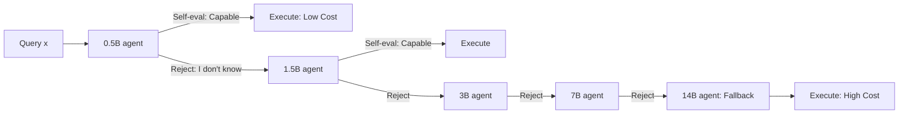

# DiSRouter: Distributed Self-Routing for LLM Selections

**Conference**: ICLR 2026  
**OpenReview**: [https://openreview.net/forum?id=KDcwXKr0NU](https://openreview.net/forum?id=KDcwXKr0NU)  
**Code**: TBD  
**Area**: Efficient LLM Inference / Query Routing  
**Keywords**: LLM Routing, Model Selection, Self-Awareness, Distributed System, Cost-Performance Trade-off  

## TL;DR
DiSRouter replaces the traditional "centralized external router" with a distributed self-routing paradigm where each LLM determines whether to answer. Queries are passed through a sequence of LLM agents arranged by increasing cost; each agent decides to either provide an answer or pass the query to a more powerful model based on its self-awareness, achieving superior utility between performance and cost.

## Background & Motivation
**Background**: The LLM ecosystem is highly heterogeneous, ranging from 0.5B small models runnable on edge devices to 14B/flagship models in the cloud, with significant gaps in performance and cost. "Query routing / model selection" has become a popular direction, with architectures like GPT-5 reportedly using multi-model unified frameworks with real-time routing. Most existing approaches train a **centralized router** (a scoring model) to assess query difficulty and predict if a specific LLM can answer correctly, subsequently dispatching the query to the "smallest capable model."

**Limitations of Prior Work**: Centralized routers suffer from two fundamental flaws. First, **poor flexibility**—the router is trained on a fixed set of candidate LLMs. Adding a new model or updating an agent requires retraining the entire routing system, leading to ossification and broken scalability. Second, **inaccurate assessment**—routers are typically small models that lack the capacity to understand the internal knowledge boundaries of larger models. Their judgment on whether a specific large model can solve a query is unreliable, becoming the bottleneck of the system.

**Key Challenge**: The essence of routing is judging "model competence for a specific query." However, **having an external small model assess a large model's knowledge boundaries from the outside** is naturally more difficult than having the model assess itself. An information gap exists between external assessment and the target model's actual capabilities.

**Goal**: To develop a distributed system that does not rely on external routers, allows plug-and-play addition/removal of agents, dynamically adjusts to user preferences (performance-heavy vs. cost-heavy), and achieves higher utility and stronger generalization than centralized routing across multiple scenarios.

**Core Idea**: **"Self-awareness is superior to external assessment."** Instead of training an external scoring router, this work **empowers each agent to evaluate its own competence and autonomously decide to answer or forward**. This abstract "self-awareness" is implemented through a concrete action: provide the answer if confident, otherwise "reject" (e.g., "I don't know") and pass to the next larger model. This is coupled with a **two-stage self-awareness training with local rewards**, allowing each agent to be trained independently and in parallel.

## Method

### Overall Architecture
DiSRouter replaces a single centralized router with an **agent network of self-evaluation and autonomous routing**. The paper instantiates this as a **cascade** arranged by increasing model size/cost. A query enters via the smallest agent $m_1$; the action space for each agent $m_i$ consists only of "execute query" or "reject and forward to $m_{i+1}$." The final agent $m_K$ is fixed to "always execute" as the fallback expert. The path terminates when an agent decides to execute. Since routing overhead is negligible, the total system cost equals the inference cost of the final executing model. The system optimization goal is **decomposed** into each agent independently maximizing its local utility $U_i$, allowing individual agents to be trained or updated without retraining the full system.

### Key Designs

**1. Distributed Self-Routing Paradigm: Turning self-awareness into routing via "rejection" actions.** Traditional routing defines policy $\pi$ as a global mapping $\pi: X \to M$ decided by a central router. DiSRouter splits this into a **set of local policies** $\Pi = \{\pi_1, \dots, \pi_K\}$ distributed across agents, where each $\pi_i(x)$ chooses a target from itself or higher-cost agents: $\pi_i(x) \in \{m_j \in M \mid j \geq i\}$. In a cascade, the action simplifies to a binary choice: answer or reject. The benefits of this shift stem from the distributed structure—adding/removing a model does not affect other agents' local policies, supporting "plug-and-play" modularity. Furthermore, letting large models use **their own knowledge** to judge knowledge boundaries is more accurate than external guessing. The system-level goal $\Pi^* = \arg\max_\Pi \mathbb{E}_{x\sim D}[A(\Pi(x), x) - \alpha \cdot C(\Pi(x))]$ is decomposed into each agent independently optimizing $\pi_i^* = \arg\max_{\pi_i} U_i(\pi_i)$, providing the mathematical basis for parallel training.

**2. Two-Stage Self-Awareness Training (SFT → RL): Learning to say "I don't know," then learning when to say it.** Since small open-source models have unreliable self-awareness, **SFT** is applied first: using the target LLM for N CoT sampling attempts per training query, measuring competence by the frequency of correct answers. Queries with a frequency below threshold $\delta$ are labeled "incapable," and their responses are replaced with "I don't know." High-competence queries use standard CoT and answer templates. This establishes basic "rejection behavior." This is followed by **RL** to refine "when to reject" more precisely. Both stages maintain a balanced 50/50 ratio of accept/reject samples to prevent bias, using 10,000 samples per stage.

**3. Scenario-Conditioned Local Rewards: Parallel training and scenario adaptation via a single reward function.** The RL reward design is a core innovation:
$$
\text{reward}(x) = \begin{cases} 1, & \text{Correct} \\ 0, & \text{Incorrect} \\ (1-\alpha)^\gamma, & \text{Rejection} \end{cases}
$$
Here $\alpha$ is the **preference factor** (higher values weight cost more) and $\gamma$ is the **reliability factor** (ensures accuracy isn't excessively sacrificed for cost). Crucially, this reward is **local**—each agent only considers its own success and rejection without inter-agent communication, enabling **completely independent, parallel training**. This is justified by expectation analysis: the expected reward for answering is $E[\text{answer}] = p(x)$ (where $p$ is competence), and for rejecting is $E[\text{reject}] = (1-\alpha)^\gamma$. Thus, an agent answers if and only if $p(x) > (1-\alpha)^\gamma$. This means **competence must exceed a threshold determined by $\alpha$ to trigger an answer**: as $\alpha$ increases (cost-heavy), the threshold lowers, and the agent becomes more "aggressive" in attempting tasks. $\gamma$ (set to 0.5 in the paper) controls the curve's shape, ensuring high reliability unless cost-saving is extremely prioritized.

**Scenario Adaptation Instructions**: During training, preferences for three scenarios (Performance First $\alpha=0.2$ / Balance $\alpha=0.5$ / Cost First $\alpha=0.8$) are explicitly provided via prompts. In SFT, the rejection threshold is set to $\delta=1-\alpha$. Consequently, the **same system** can switch between scenarios by changing the prompt, avoiding the need for per-scenario retraining required by methods like GraphRouter.

## Key Experimental Results

**Configuration**: Model pool consists of five sizes of Qwen2.5-Instruct (0.5B→14B), with costs normalized from 0.1→0.9. Seven in-domain datasets (GSM8K/ARC/MMLU/RACE/OpenbookQA/DROP/CosmosQA) and three out-of-domain datasets (SQuAD/HellaSwag/HeadQA) were used. SFT/RL used 10k samples each, trained on A800s.

### Main Results (In-domain, Utility ↑)

| Method | Performance First $\alpha=0.2$ | Balance $\alpha=0.5$ | Cost First $\alpha=0.8$ |
|---|---|---|---|
| Oracle (topline) | 0.87 | 0.79 | 0.70 |
| Smallest LLM | 0.36 | 0.33 | 0.30 |
| Largest LLM | 0.67 | 0.40 | 0.13 |
| Random | 0.58 | 0.44 | 0.30 |
| RouteLLM | 0.41 | 0.36 | 0.31 |
| FrugalGPT | 0.64 | 0.52 | 0.43 |
| Automix | 0.63 | 0.29 | 0.18 |
| FORC | 0.65 | 0.47 | 0.37 |
| GraphRouter | 0.68 | 0.53 | 0.45 |
| **DiSRouter (SFT)** | 0.72 | 0.57 | 0.43 |
| **DiSRouter (+RL)** | **0.73** | **0.61** | **0.52** |

DiSRouter achieves the highest utility across all three scenarios, reaching at least 74.29% of the Oracle topline.

### Ablation Study: Out-of-Domain Generalization (Balance $\alpha=0.5$)

| Method | Accuracy ↑ | Cost ↓ | Utility ↑ |
|---|---|---|---|
| Oracle | 0.89 | 0.33 | 0.72 |
| GraphRouter | 0.64 | 0.49 | 0.39 |
| FrugalGPT | 0.55 | 0.25 | 0.42 |
| **DiSRouter (+RL)** | 0.69 | 0.43 | **0.48** |

Out-of-domain utility still leads all baselines, verifying the discriminative power of self-awareness on unseen datasets.

### Key Findings
- **Role of RL is "Cost Reduction" rather than "Performance Enhancement"**: Training does not directly improve task accuracy; the utility gains come from more accurate routing (better self-awareness) rather than stronger models.
- **Scenario Adaptation is an Emergent Global Behavior**: Although each agent adjusts thresholds based on local rewards, the system-level strategy automatically shifts (e.g., more queries routed to small models when emphasizing cost) without inter-agent communication.
- **Flexibility (5→3 agents without retraining)**: In a 3-agent setup (1.5B/3B/14B), the Balance utility remains 0.60, outperforming all baselines, showing effective modularity.
- **Difficulty Discrimination**: For queries solvable by models $\leq$ 3B ("easy"), DiSRouter achieves significantly better cost discrimination between easy and hard queries compared to GraphRouter/FORC/FrugalGPT.

## Highlights & Insights
- **Paradigm Shift**: Reconstructing routing from "external referee scoring" to "candidate raising/lowering hand" empowers the entity that knows its own capabilities best, bypassing the information gap of "small models evaluating large ones."
- **Local Rewards as an Engineering Enabler**: The $(1-\alpha)^\gamma$ term decouples the training of $K$ agents, supporting both modular "plug-and-play" and the parameterization of "performance-cost preferences" into a single scalar $\alpha$.
- **Strong Interpretability**: The threshold $p(x) > (1-\alpha)^\gamma$ provides a clean theoretical characterization of why the system saves money or improves accuracy.

## Limitations & Future Work
- **Evaluation Limited to Cascade Structures**: While the framework supposedly supports tree/mesh topologies, experiments are confined to cascades. Behavior in complex topologies remains an open question.
- **Simplified Action Space**: The constraint "only forward to higher-cost agents" discards lateral or backward routing, which may not hold in systems without monotonic cost assumptions.
- **Self-Awareness Ceiling**: Small models may still systematically overestimate/underestimate competence even after training; the evolution of the reliability-cost trade-off curve is not deeply explored.
- **Closed-Source Incorporation**: Highly capable closed-source models (e.g., GPT-4) can be integrated directly (Appendix A.9), but coordination in mixed open-closed pools isn't fully expanded.

## Related Work & Insights
- **Centralized Routing**: Methods like RouteLLM and GraphRouter depend on external scoring. DiSRouter's fundamental difference is "self-assessment" vs "external-assessment," granting modularity without retraining.
- **LLM Self-Awareness/Abstention**: By repurposing "I don't know" abstention as a routing signal, this work provides a prime example of productizing "knowing what you don't know" into system-level gains.
- **Multi-Agent Systems**: The argument that internal self-awareness is more effective than external evaluation provides a template for modular, scalable multi-agent collaboration where agents autonomously decide to accept or transfer tasks.

## Rating
- Novelty: ⭐⭐⭐⭐ — "Distributed self-routing + rejection-as-routing" is a clear reconstruction of the query routing paradigm.
- Experimental Thoroughness: ⭐⭐⭐⭐ — solid across 3 scenarios, in/out-domain, 5/3-agent setups, and 8 baselines, though focused on cascades.
- Writing Quality: ⭐⭐⭐⭐ — Clear definitions, logical reward justification, and effective visualization.
- Value: ⭐⭐⭐⭐ — No retraining, plug-and-play, and multi-scenario support offer direct practical value for LLM serving and cost-performance scheduling.

<!-- RELATED:START -->

## Related Papers

- [\[ICLR 2026\] Universal Model Routing for Efficient LLM Inference](universal_model_routing_for_efficient_llm_inference.md)
- [\[ICLR 2026\] Smooth Reading: Bridging the Gap of Recurrent LLM to Self-Attention LLM on Long-Context Understanding](smooth_reading_bridging_the_gap_of_recurrent_llm_to_self-attention_llm_on_long-c.md)
- [\[ICLR 2026\] DualMap: Enabling Both Cache Affinity and Load Balancing for Distributed LLM Serving](dualmap_enabling_both_cache_affinity_and_load_balancing_for_distributed_llm_serv.md)
- [\[ICLR 2026\] Long-Context Attention Benchmark: From Kernel Efficiency to Distributed Context Parallelism](long-context_attention_benchmark_from_kernel_efficiency_to_distributed_context_p.md)
- [\[ICLR 2026\] Stacked From One: Multi-Scale Self-Injection for Context Window Extension](stacked_from_one_multi-scale_self-injection_for_context_window_extension.md)

<!-- RELATED:END -->
