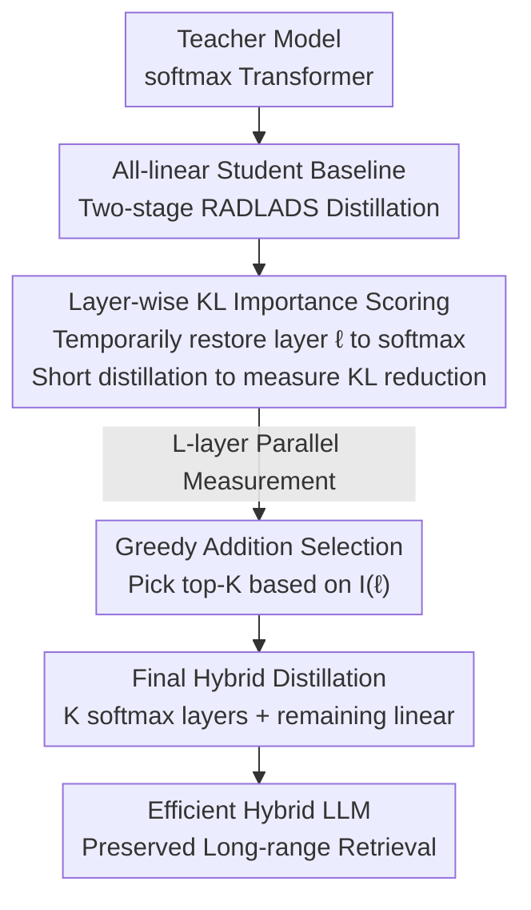

# Distilling to Hybrid Attention Models via KL-Guided Layer Selection

**Conference**: ICLR2026  
**OpenReview**: [https://openreview.net/forum?id=RzbsHcFqIf](https://openreview.net/forum?id=RzbsHcFqIf)  
**Code**: https://github.com/fla-org/hybrid-distillation  
**Area**: LLM Efficiency / Hybrid Attention / Knowledge Distillation  
**Keywords**: Linear Attention, Hybrid Architecture, Cross-Architecture Distillation, Layer Selection, KL Divergence

## TL;DR
When distilling a pre-trained softmax attention Transformer into a hybrid model with "few softmax layers + many linear attention layers," the importance of each layer is scored by temporarily restoring it to softmax and measuring the reduction in KL distillation loss. By greedily selecting the $K$ most critical layers to remain as softmax, the method significantly improves inference efficiency while maintaining long-context retrieval capabilities.

## Background & Motivation
**Background**: Linear attention and State Space Models (SSMs) offer fast inference and constant memory usage, but most high-performing models remain pure softmax attention Transformers. Training a large linear attention model from scratch is prohibitively expensive. Consequently, "cross-architecture distillation" has emerged as a viable path: converting pre-trained Transformer checkpoints into efficient linear versions to avoid the cost of pre-training from scratch. Recent works (e.g., RADLADS) have matured the distillation process using attention weight transfer, hidden state alignment, and KL distribution matching followed by fine-tuning.

**Limitations of Prior Work**: Pure linear attention students can approach teacher performance on **short-context** tasks like MMLU or common-sense reasoning. However, these benchmarks mask a critical weakness: **long-context "in-context recall" capability**. Figure 1 and Figure 2 of the paper provide robust evidence that pure linear (or small sliding window) models show monotonic performance gains on long-range retrieval benchmarks (like RULER) as the number of softmax layers increases, indicating that global attention is indispensable for retrieval. Conversely, common-sense reasoning is nearly insensitive to the number of softmax layers. This suggests that the "linear attention is sufficient" conclusion is an artifact of short-context evaluation.

**Key Challenge**: To balance efficiency (fewer expensive softmax layers) and long-range retrieval (essential softmax layers), a **hybrid architecture** is naturally preferred—retaining only a few global softmax layers while converting the rest to linear attention. The core challenge becomes: **Which specific layers should be retained as softmax?** While pre-trained hybrid models often use "fixed-ratio uniform interleaving" (e.g., one global layer every 3 or 7 layers), the authors' pilot experiments show that uniform strategies are suboptimal for **distillation**. Unlike pre-training, distillation aims to fit a fixed teacher distribution where critical layer positions are not uniformly distributed.

**Goal**: Given a budget $K$ (the number of softmax layers to retain), find a layer subset $S_{\text{softmax}}$ that minimizes performance loss when the remaining layers are converted to linear attention. Exhaustive search of all $K$-element subsets is computationally infeasible.

**Core Idea**: Use the **KL divergence loss** inherent in distillation as a metric for layer importance. The intuition is that "the more critical a global attention layer is, the more the distillation KL loss will decrease when that layer is restored to softmax from an all-linear student." By measuring the marginal utility of restoring each layer individually, layers are selected greedily based on their KL improvement.

## Method

### Overall Architecture
The method addresses the discrete choice problem of "selecting $K$ softmax layers" in three steps: First, the teacher is distilled into an **all-linear student** as a common baseline. Second, each layer is **individually** and temporarily restored to softmax, followed by short distillation to record the reduction in KL loss, yielding importance scores $I(\ell)$ for every layer. Finally, the top-$K$ layers by score are fixed as softmax, while others remain linear, and a **final distillation** is performed. The distillation uses the two-stage recipe from RADLADS (Stage 1 hidden state alignment + Stage 2 KL distribution matching). Layer-wise scoring is **parallelizable** as each layer's measurement is independent.

### Key Designs

**1. All-linear Student as a Unified Scoring Baseline**

A fixed reference frame is required to measure "how important a layer is." The authors first use the first two stages of RADLADS to distill the teacher into a **pure linear attention student** $M_{\text{all-linear}}$. Linear layers $W_Q, W_K, W_V, W_O$ are initialized from the teacher, while data-dependent gating $\alpha_t$ is randomly initialized. Stage 1 involves layer-wise hidden state alignment, using L2 loss to match student hidden states $U^{(\ell)}_{\text{all-linear}}$ to the teacher's $U^{(\ell)}_{\text{teacher}}$ (freezing FFNs, training only linear layers): $L_{\text{hidden}}=\sum_\ell \frac{1}{T}\lVert U^{(\ell)}_{\text{teacher}}-U^{(\ell)}_{\text{all-linear}}\rVert_2^2$ (using 100M tokens). Stage 2 uses temperature-scaled KL distribution matching to minimize the difference between teacher and student logits: $L_{\text{KL}}=\frac{\tau^2}{T}\sum_t \text{KL}\big(\text{Softmax}(\ell_{\text{teacher},t}/\tau)\,\Vert\,\text{Softmax}(\ell_{\text{all-linear},t}/\tau)\big)$, training all parameters with 600M tokens. This baseline ensures that subsequent importance scores are comparable.

**2. KL Marginal Utility Scoring (GA-S2)**

This is the core metric. For layer $\ell$, a model $M^{(-\ell)}_{\text{all-linear}}$ is constructed: **only the $\ell$-th block is restored to the teacher's softmax layer**, while others remain linear. Stage 1 and Stage 2 short distillations are re-run for this "single-softmax" student. Layer importance is defined as the KL loss relative to the teacher (multiplied by -1, higher is better): $I(\ell)=-\mathbb{E}_{x\sim D}\big[L_{\text{KD}}(M^{(-\ell)}_{\text{all-linear}}, x)\big]$. A higher $I(\ell)$ indicates that restoring this layer results in a larger reduction in KL loss. This metric is **hybrid-aware and variant-aware**: because other layers are fixed as linear, the score reflects how critical a layer is specifically within a linear skeleton. Ablations show that Stage-2 KL metrics far outperform Stage-1 MSE metrics (Table 2), as KL captures the impact on final generation quality.

**3. Greedy Addition Selection (GA vs. GR)**

With scores $I(\ell)$, the top-$K$ layers are selected as softmax: $S_{\text{softmax}}=\text{top-}K(I(\ell))$. This process of "starting from all-linear and greedily adding layers with max KL reduction" is called **Greedy Addition (GA)**. Alternative strategies include Greedy Removal (GR, starting from all-softmax and removing the least important layers) and Average Ranking (AVG). Table 2 shows GA-S2 consistently outperforms GR-S2. The authors explain that identifying "the best layer to add" to a linear baseline is a more robust signal for addressing retrieval bottlenecks than identifying "the least important layer to remove" from a softmax model.

**4. Linear Variants as "Probes" for Transferable Layers**

Layer selection is sensitive to the linear attention variant used (e.g., GDN vs. GLA). At a 25% budget, the Jaccard similarity of selected layers between GDN and GLA is only 0.54–0.65. Interestingly, layers selected using **GDN as a probe** performed significantly better on RULER even when used for a GLA student (Llama 0.6927 vs 0.6498). This suggests that some variants are superior "probes" for identifying essential layers, and these layer sets are robust enough to migrate across different student architectures.

### Loss & Training
Two-stage distillation follows RADLADS: Stage 1 hidden state L2 alignment (100M tokens, frozen FFNs); Stage 2 temperature-scaled KL matching (600M tokens, all parameters). The scoring phase performs these stages for each layer in parallel. For final model construction, Stage-1 aligned linear layers can be reused, requiring only the final Stage-2 distillation. The entire process uses approximately 5–6B tokens, significantly fewer than the 50B tokens required by PostNAS.

## Key Experimental Results

### Main Results
Using two 3B teachers (Qwen2.5-3B-Instruct, Llama-3.2-3B-Instruct) and gated DeltaNet (GDN) linear layers, GA-S2 was compared against several baselines on RULER and SWDE (Figure 3). The advantage is most pronounced at low budgets: for Qwen2.5 with a 12.5% softmax budget (5 layers), GA-S2 achieved 0.662, which is +0.12 higher than the strongest baseline AR (0.542) and +0.22 higher than uniform interleaving (0.441).

| Task/Setting | Ours (GA-S2) | Strongest Baseline | Uniform | Gain |
|--------|------|------|------|------|
| RULER, Qwen2.5-3B, 12.5% softmax | 0.662 | 0.542 (AR) | 0.441 | +0.12 / +0.22 |
| RULER, Qwen2.5-1.5B, 25% | 0.5408 | 0.5098 (SMART) | — | +0.031 |
| RULER, Qwen2.5-7B, 25% | 0.8584 | 0.8158 (SMART) | — | +0.043 |
| RULER, Llama-3.2-3B, 25% (GDN) | 0.7539 | 0.6274 (SMART) | 0.461 | +0.126 |

Across scales (1.5B/7B), GA-S2 consistently outperforms SMART. At a 50% budget, hybrid models recover most of the teacher's retrieval performance.

### Ablation Study

| Configuration | RULER (Llama-3.2-3B, 25%) | Description |
|------|---------|------|
| GA-S2 (Full Method) | 0.7539 | KL metric + Greedy Addition |
| GR-S2 | 0.4950 | KL metric but Greedy Removal; significant drop |
| GA-S1 | 0.4193 | Stage-1 MSE metric; poor performance |
| AVG-S2 | 0.5580 | Average of GA/GR rankings |

### Key Findings
- **KL (Stage-2) metric is critical**: Switching to Stage-1 MSE caused RULER performance to plummet from 0.75 to 0.42, showing that L2 alignment fails to capture layers essential for the generation distribution.
- **Greedy Addition > Greedy Removal**: Identifying the "best layer to add" provides a stronger signal (0.754 vs 0.495).
- **Probes are transferable**: GDN-selected layers work better for GLA students than GLA's own selection, suggesting certain variants identify more fundamental layer roles.
- **Token Efficiency**: Selected layer sets stabilize early (25–40% into training). Early stopping can save 58–74% of the selection token budget with <0.01 impact on RULER.

## Highlights & Insights
- **Leveraging Distillation Targets as Signals**: By using the KL reduction directly as an importance metric, the method aligns layer selection per-se with the final distillation goal, avoiding auxiliary diagnostic tasks.
- **Debunking the "Linear is Enough" Myth**: The stark contrast between RULER and common-sense benchmarks (Figure 1/2) clarifies that long-range retrieval is the true bottleneck for linear attention models.
- **Transferable Probes as a Design Pattern**: Decoupling selection from the final deployment architecture allows a "good" probe to find a robust structure transferable to multiple configurations.
- **High Efficiency**: Parallel scoring and early stopping reduce the selection cost to 5–6B tokens, an order of magnitude less than competitors like PostNAS.

## Limitations & Future Work
- **Linear Scaling of Scoring Cost**: Scoring $L$ layers requires $L$ short distillations; while parallelizable, the total compute is significant for models with over 100 layers.
- **Manual Budget $K$**: The method optimizes "where" to put $K$ layers, but "how many" layers ($K$) must still be provided as a hyperparameter.
- **Benchmarking Beyond Retrieval**: While performance on retrieval is robust, further validation is needed for math, code, and extremely long contexts (> RULER lengths).
- **Heuristic Probe Selection**: The effectiveness of GDN as a probe is an empirical finding; theoretical guidance on choosing probes remains an open question.

## Related Work & Insights
- **vs. Uniform Interleaving (e.g., Jamba, MiniMax)**: Uniform strategies work for pre-training, but this work shows that critical layer positions are non-uniform in distillation scenarios and should be picked based on KL marginal utility.
- **vs. SMART (Yang et al. 2025)**: SMART also uses KL improvement but adds "endpoint retention" heuristics. Ours (GA-S2) is stronger without such heuristics (e.g., 0.754 vs 0.627 for Llama 25%).
- **vs. PostNAS (Gu et al. 2025)**: PostNAS uses a complex search on a SuperNet requiring 50B tokens. Ours achieves better RULER performance with 1/10th of the token budget.
- **vs. AR / AR-MH (Synthetic Retrieval Probes)**: AR-MH uses specific KV retrieval tasks for scoring. Ours uses general text KL, which is more elegant and consistently yields better performance.

## Rating
- Novelty: ⭐⭐⭐⭐ Using distillation KL directly and the discovery of probe transferability are insightful.
- Experimental Thoroughness: ⭐⭐⭐⭐ Comprehensive testing across teachers, scales, budgets, and linear variants.
- Writing Quality: ⭐⭐⭐⭐⭐ Extremely clear motivation and methodology; ablations are thorough.
- Value: ⭐⭐⭐⭐ Offers a practical and efficient path to deploying hybrid LLMs that maintain long-context capabilities.

<!-- RELATED:START -->

## Related Papers

- [\[ACL 2026\] Native Hybrid Attention for Efficient Sequence Modeling](../../ACL2026/llm_efficiency/native_hybrid_attention_for_efficient_sequence_modeling.md)
- [\[ICLR 2026\] RACE Attention: A Strictly Linear-Time Attention Layer for Training on Outrageously Large Contexts](race_attention_a_strictly_linear-time_attention_layer_for_training_on_outrageous.md)
- [\[ICML 2026\] KnapSpec: Self-Speculative Decoding via Adaptive Layer Selection as a Knapsack Problem](../../ICML2026/llm_efficiency/knapspec_self-speculative_decoding_via_adaptive_layer_selection_as_a_knapsack_pr.md)
- [\[ICLR 2026\] Composer: A Search Framework for Hybrid Neural Architecture Design](composer_a_search_framework_for_hybrid_neural_architecture_design.md)
- [\[ICLR 2026\] KnowProxy: Adapting Large Language Models by Knowledge-guided Proxy](knowproxy_adapting_large_language_models_by_knowledge-guided_proxy.md)

<!-- RELATED:END -->
