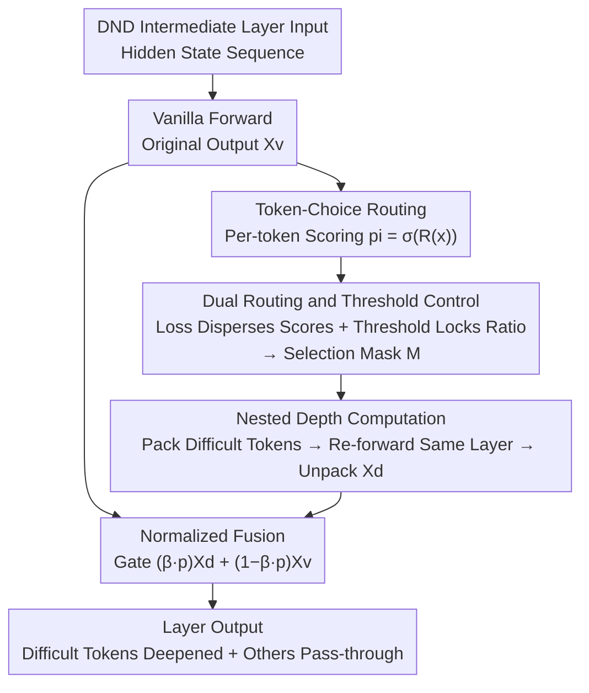

# DND: Boosting Large Language Models with Dynamic Nested Depth

**Conference**: ICLR 2026  
**arXiv**: [2510.11001](https://arxiv.org/abs/2510.11001)  
**Code**: None  
**Area**: LLM Efficiency / Adaptive Computation  
**Keywords**: Dynamic Depth, Adaptive Token Selection, Large Language Models, Post-training Enhancement, MoE

## TL;DR
DND selects key tokens via a router at the end of Transformer layers and sends them back to the same layer for additional processing (nested depth). Combined with routing control loss and threshold schemes for precise token selection, it achieves average performance gains of 1.88% on Qwen3-1.7B and 0.87% on Qwen3-30B-A3B with minimal parameter increase (<0.1M).

## Background & Motivation
The primary strategy for improving large language models has been scaling—more parameters, more data, and more computation. However, this incurs exponentially growing computational overhead. A key observation is that **prediction difficulty varies significantly between tokens**: most tokens are "simple" (e.g., language coherence tokens), while only a few "critical" tokens involve complex logical reasoning or planning tasks.

This leads to two related research directions:
- **Token Pruning**: Filtering out unimportant tokens to reduce computation—but this only addresses "not processing" simple tokens.
- **Test-time Computation Scaling (Implicit Strategies)**: Recurrent computation in hidden states to enhance reasoning—but this applies uniformly to all tokens.

**Key Challenge**: Simple tokens do not require extra computation, but critical tokens require deeper processing. Existing methods either perform subtraction (pruning) or apply addition indiscriminately (universal recurrence), lacking **targeted depth gains**.

**Key Insight**: DND combines these two directions by first selecting difficult tokens and then assigning them extra computational depth—a "reviewing" mechanism. This represents the first effective fusion of token-level selection and implicit spatial deepening.

## Method

### Overall Architecture
DND only modifies the intermediate layers of the model (keeping several initial and final layers unchanged to protect pre-trained inference patterns). In each DND layer, the input first undergoes a vanilla forward pass to obtain the original output $\mathbf{X}^v$. Subsequently, a lightweight router scores each token. Combined with a control mechanism to stabilize score dispersion and lock the threshold to a target ratio, a small subset of "difficult" tokens is precisely selected. These tokens are packed into a short sequence, re-processed through the **same layer** to obtain the deepened output $\mathbf{X}^d$, and finally scattered back to their original positions after gated fusion with the original output. The difficulty lies not in "re-computing" itself, but in stably selecting the tokens that truly need deepening without disrupting existing knowledge. The internal data flow of a DND layer is shown below:

### Key Designs

**1. Token-Choice Routing: Compatibility with Autoregressive Decoding**

The selection step determines where the additional computation is spent. DND employs a linear router $R: \mathbb{R}^{d_{model}} \to \mathbb{R}$ that maps hidden states to scalars, calculates independent preference scores $p_i = \sigma(R(\mathbf{x}_i^v))$ for each token, and selects tokens where $p_i > \tau$. Token-choice is intentionally used instead of the expert-choice common in MoE. Expert-choice requires viewing the entire sequence to select top-k, which leaks future token information to current positions and violates the causality of autoregressive decoding. Token-choice allows each position to decide independently based on its score, making it naturally compatible with token-by-token generation.

**2. Dual Control of Routing and Threshold: Stable and Precise Ratio Locking**

Token-choice lacks the natural ratio constraints of top-k, leading to two risks: routing scores may cluster, making selection near-random, or minor threshold perturbations may cause the selection ratio to fluctuate violently. DND solves this using a set of losses and a threshold adjustment mechanism. On the loss side, two "push-pull" objectives are used: the score dispersion loss $\mathcal{L}_{sd}$ (based on information entropy) encourages scores within a sequence to spread across a wider range to increase discriminability; the distribution preservation loss $\mathcal{L}_{dp}$ uses MSE to penalize scores deviating from 0.5, pulling them back into the linear sensitive region of the sigmoid to prevent gradient vanishing in saturation zones. On the threshold side, dual regulation is applied: buffer ratio control calculates the error $e$ between the actual selection ratio and the target ratio $k_{target}$ for each mini-batch and fine-tunes the threshold via $\tau \leftarrow \tau + \alpha \cdot e$; EMA synchronization calibrates the threshold every few steps (e.g., 50 steps) using the mean of top-k routing values $\bar{\tau}_{topk}$ in the buffer via $\tau = (1-\gamma)\tau + \gamma\bar{\tau}_{topk}$. Compared to prior work using z-loss for rough constraints, this mechanism precisely locks the selection ratio at the target value.

**3. Nested Depth Computation: Reviewing Difficult Tokens in the Same Layer**

Selected tokens are packed into a much shorter subsequence according to a binary mask $\mathbf{M}$, assigned new positional encodings $\mathbf{E}'_{pos}$, and fed into the **same** Transformer layer again. Crucially, reusing the same layer weights rather than adding a new layer minimizes additional parameters (<0.1M). Since this applies only to a few tokens, the extra computation is limited (e.g., at a 20% selection ratio, total FLOPs increase by only ~6.27%). This essentially performs an "internal review iteration" for difficult tokens, allowing them to undergo the same transformation more times than simple tokens.

**4. Normalized Fusion: Preserving Pre-trained Knowledge via Gating**

As a post-training method, DND could disrupt the pre-trained global token interaction distribution if the deepened output directly replaced the original output. Therefore, the deepened output $\mathbf{x}_i^d$ is fused with the original output via gating: $\mathbf{x}_i = (\beta \cdot p_i)\,\mathbf{x}_i^d + (1 - \beta \cdot p_i)\,\mathbf{x}_i^v$ (applied only to selected tokens). $\beta$ is a learnable scalar initialized to 0.1. At the start of training, the fusion weight is small, making the output nearly identical to the original model and avoiding distribution disruption. As training progresses, tokens with higher routing scores $p_i$ receive a larger proportion of the nested output $\mathbf{x}_i^d$, allowing "deepening" to be released smoothly onto the most appropriate tokens.

### Loss & Training
The total loss is the sum of cross-entropy and two routing regularization terms: $\mathcal{L} = \mathcal{L}_{ce} + \lambda_{sd}\mathcal{L}_{sd} + \lambda_{dp}\mathcal{L}_{dp}$. The approach follows a post-training (SFT) route using the AdamW optimizer with a cosine learning rate schedule (5e-6 decaying to 1e-6). Qwen3-1.7B was trained for 2 epochs on 128 H100 GPUs (approx. 1 day), and Qwen3-30B-A3B for 4 epochs on 256 H100 GPUs (approx. 3 days). DND is applied only to intermediate layers ($L_s=4$ to $L_e=43$), with a target selection ratio of 20%, zero-initialized routers, threshold initialized to 0.5, and $\beta$ initialized to 0.1.

## Key Experimental Results

### Main Results
On the Qwen3-30B-A3B MoE model across 17 benchmarks:

| Task Category | Representative Benchmark | SFT Baseline | +DND | Gain |
| :--- | :--- | :--- | :--- | :--- |
| General & Alignment | MMLU | 85.41 | 85.91 | +0.50 |
| General & Alignment | C-Eval | 83.09 | 84.92 | +1.83 |
| General & Alignment | IFEval | 83.09 | 84.31 | +1.22 |
| Math & STEM | AIME24 | 51.46 | 52.37 | +0.91 |
| Math & STEM | GPQA-Diamond | 56.76 | 57.67 | +0.91 |
| Code & Agent | BFCL v3 | 75.43 | 77.48 | +2.05 |
| Code & Agent | LCB-v6 | 31.14 | 32.56 | +1.42 |
| **Average** | 17 benchmarks | 75.70 | 76.57 | **+0.87** |

### Ablation Study (Qwen3-1.7B)

| Configuration | Average Score | Gain | Description |
| :--- | :--- | :--- | :--- |
| Qwen3-1.7B SFT | 59.53 | 0.00 | Baseline |
| +DND (Full) | 61.41 | +1.88 | All strategies |
| +z-loss Control Only | 60.54 | +1.01 | No precise routing control |
| +Routing Control Only | 60.58 | +1.05 | No dynamic threshold adjustment |
| +Threshold Control Only| 60.68 | +1.15 | No routing dispersion loss |
| Ratio = 10% | 60.33 | +0.80 | Too few tokens for effective attention |
| Ratio = 20% | 61.41 | +1.88 | Optimal balance |
| Ratio = 30% | 61.03 | +1.50 | Slightly lower than 20% |

### Key Findings
- **Extremely Low Overhead**: At a 20% selection ratio, total FLOPs increase by only ~6.27%, with <0.1M parameter increase.
- **No Performance Degradation**: All 17 benchmarks showed improvements, with no performance trade-offs observed.
- **Code and Agent Tasks Benefit Most**: The 2.05 gain on BFCL v3 validates the hypothesis that DND filters out noise and focuses on critical reasoning tokens.
- **Token Selection Visualization**: Shallower layers tend to select key nouns, while deeper layers select mathematical expressions and logical verbs—indicating the model learns hierarchical processing strategies.
- **Stable Inference Ratios**: Ratios remain stable between 0.178 and 0.242, with slightly higher selection in intermediate layers.

## Highlights & Insights
- **Simple yet Effective**: The core idea—selecting difficult tokens for extra processing—is intuitive and yields significant gains using only a linear router.
- **Pluggable Post-training**: DND can be directly inserted into existing dense and MoE models without requiring pre-training from scratch, offering high practical value.
- **Sophisticated Routing Control**: The "push-pull" mechanism of dispersion and preservation losses is better suited for precise ratio control than simple z-loss.
- **Dense and MoE Compatible**: Validated on both 1.7B dense and 30B MoE models, with lower relative costs for the latter due to existing sparsity.
- **Persuasive Visual Analysis**: Hierarchical token selection patterns (entities in shallow layers, logic in deep layers) provide empirical evidence for adaptive computation.

## Limitations & Future Work
- Validated only in the post-training (SFT) phase; the impact on pre-training and continued pre-training is unexplored.
- Tested only on autoregressive LLMs; applicability to other architectures like diffusion-based LLMs is unknown.
- Layer-wise selection ratios varied naturally, but the paper did not utilize this to design layer-adaptive ratios.
- Nested depth is fixed to 1 (one extra pass); whether multiple nesting iterations provide further benefits is unexplored.
- Hyperparameters for training strategies ($\lambda_{sd}$, $\lambda_{dp}$, $\alpha$, $\gamma$, etc.) require careful tuning.

## Related Work & Insights
- **Mixture-of-Depths (MOD, Raposo et al., 2024)**: Dynamically reduces computing layers to lower redundancy; DND does the opposite—adding depth for critical tokens.
- **MOR (Bae et al., 2025)**: Highly relevant work performing token selection + extra computation, but limited to 1B scale pre-training with imprecise z-loss ratio control and no fusion strategy.
- **Inner Thinking Transformer (ITT, Chen et al., 2025)**: Similar dynamic selection + extra computation; DND features more refined control strategies.
- **DeepSeek-V3 Balance Loss**: Inspiration for DND's buffer ratio control.
- **Inspiration**: Token-level adaptive computation is a promising direction; the key lies in precise selection ratio control and effective fusion strategies.

## Rating
- Novelty: ⭐⭐⭐⭐
- Experimental Thoroughness: ⭐⭐⭐⭐⭐
- Writing Quality: ⭐⭐⭐⭐
- Value: ⭐⭐⭐⭐

<!-- RELATED:START -->

## Related Papers

- [\[ICLR 2026\] Deep Hierarchical Learning with Nested Subspace Networks for Large Language Models](deep_hierarchical_learning_with_nested_subspace_networks_for_large_language_mode.md)
- [\[ICLR 2026\] Inference-Cost-Aware Dynamic Tree Construction for Efficient Inference in Large Language Models](inference-cost-aware_dynamic_tree_construction_for_efficient_inference_in_large_.md)
- [\[ICLR 2026\] SinkTrack: Attention Sink based Context Anchoring for Large Language Models](sinktrack_attention_sink_based_context_anchoring_for_large_language_models.md)
- [\[ICLR 2026\] KnowProxy: Adapting Large Language Models by Knowledge-guided Proxy](knowproxy_adapting_large_language_models_by_knowledge-guided_proxy.md)
- [\[ICLR 2026\] Neuron-Aware Data Selection in Instruction Tuning for Large Language Models](neuron-aware_data_selection_in_instruction_tuning_for_large_language_models.md)

<!-- RELATED:END -->
