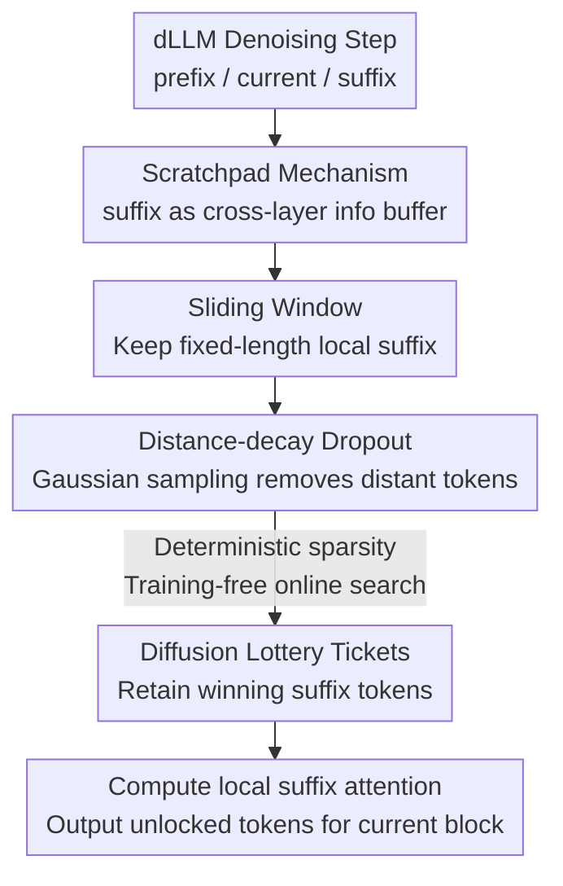

# DPad: Efficient Diffusion Language Models with Suffix Dropout

**Conference**: ICLR2026  
**OpenReview**: [https://openreview.net/forum?id=0yOsSMU1eY](https://openreview.net/forum?id=0yOsSMU1eY)  
**Code**: https://github.com/Crys-Chen/DPad.git  
**Area**: LLM Efficiency / Diffusion Language Models / Efficient Inference  
**Keywords**: Diffusion Language Models, Suffix Dropout, Training-free Acceleration, Sliding Window, Lottery Ticket Hypothesis

## TL;DR
DPad discovers that Diffusion Language Models (dLLMs) compute attention for all future suffix tokens at every step but retain very few, causing significant redundancy. It employs a "sliding window + distance-decay dropout" to discard distant suffix tokens **before** attention computation. This training-free, plug-and-play method achieves up to 61.39× acceleration on LLaDA-1.5/GSM8K (1024 tokens, 1-shot) when combined with parallel decoding and prefix caching, with accuracy even slightly improved.

## Background & Motivation

**Background**: Diffusion-based Large Language Models (dLLMs, e.g., LLaDA, Dream) model text generation as a denoising process, enabling the parallel prediction of multiple tokens. This is considered a promising route to break the "one token at a time" serial bottleneck of autoregressive models. The mainstream approach is block-wise (semi-autoregressive) decoding: the response is divided into blocks, denoising is performed iteratively within each block, and undetermined positions are filled with `[MASK]`.

**Limitations of Prior Work**: This parallelism comes at a cost. In each denoising step, the model must calculate attention and make predictions for **all** subsequent (suffix) positions, yet only a handful of tokens with the highest confidence are "unlocked" per step; the rest are discarded. Consequently, the throughput gains from parallelism are offset by the "super-linear" expansion of computation—the longer the suffix, the more waste occurs.

**Key Challenge**: Analysis by the authors reveals that these suffix tokens **carry no intrinsic semantics** under the mask structure; they act more as a "scratchpad" (scratchpad) to aggregate context signals from prefix/current positions across Transformer layers before feeding them back to the current block. However, this scratchpad is extremely inefficient: most suffix tokens are redundant and low-entropy, and attention scores decay rapidly with distance—distant suffix tokens are barely noticed yet consume computation and may even interfere with generation quality.

**Goal**: To eliminate redundant suffix computation **without retraining**, while preserving (or even improving) generation quality, and ensuring compatibility with existing optimizations like parallel decoding and prefix caching.

**Key Insight**: Since suffix attention follows a "near-dominant, distance-decay" pattern and distant tokens are highly redundant, they can be discarded **a priori** based on distance, eliminating the need to compute attention scores before pruning. The authors further verify that even forcibly pruning distant "spotlight" attention tokens causes negligible accuracy loss, as information is absorbed by neighboring tokens.

**Core Idea**: Limit suffix attention to a structured subset of "nearby tokens" by using a fixed-length sliding window for a bounded neighborhood and distance-decay dropout to deterministically remove distant tokens before execution. This serves as a "training-free lottery ticket search" to identify the small subset of truly useful suffix tokens online.

## Method

### Overall Architecture

DPad is a **training-free** attention sparsity strategy layered onto existing dLLM inference pipelines. It modifies "which suffix tokens the current block perceives" without changing parameters. Given a prompt, it generates the response block-by-block. The framework consists of three components: formalizing suffix utility via the **Scratchpad mechanism**, pruning redundancy using **Suffix Dropout (sliding window + distance decay)**, and explaining the effectiveness via the **Diffusion Lottery Tickets hypothesis**.

Specifically, the sequence is split into three segments: prefix `[0, c-1]`, current `[c, s-1]`, and suffix `[s, L-1]`. The attention matrix is divided into 3×3 blocks. Key interactions occur between current↔suffix: the $n$-th layer suffix aggregates prefix and current info ("writing to scratchpad"), and the $(n+1)$-th layer current reads this info back ("reading from scratchpad"). DPad removes low-value suffix columns from this path before attention computation.

### Key Designs

**1. Scratchpad Mechanism: Formalizing suffix tokens as cross-layer buffers**

To safely discard suffix tokens, one must understand their function. Due to the mask structure, suffix positions lack semantics but act as "information reservoirs." Formally, global attention $A^{(n)} = \mathrm{Softmax}\!\left(\frac{Q^{(n)}(K^{(n)})^\top}{\sqrt{d_k}}\right)$ is partitioned. The suffix hidden state $H^{(n)}_S = A^{(n)}_{S,P}V^{(n)}_P + A^{(n)}_{S,C}V^{(n)}_C + A^{(n)}_{S,S}V^{(n)}_S$ represents **writing** prefix and current info into the suffix. At layer $n+1$, the current block **reads** this via $A^{(n+1)}_{C,S}$. This "write-read" path, termed the **Attention Connection**, functions like a residual connection: the model compresses high-dimensional signals into the low-rank suffix buffer for reuse. This confirms that while the suffix is useful, only "local" scratchpad entries are vital; the rest are redundant.

**2. Sliding Window: Decoupling suffix cost from sequence length**

In vanilla dLLMs, suffix computation grows with sequence length. DPad adopts the streaming/sliding window concept from prefix KV-cache optimization to the suffix side: it maintains a **fixed-length** $W$ suffix window that slides with the current block. Only tokens within $W$ participate in attention. This fixes the number of suffix tokens to a constant, reducing suffix-related complexity from quadratic to nearly linear relative to length. Ablations show the critical context window is roughly 64–128 tokens; concentrating the budget here is more effective than sparse allocation over a larger window.

**3. Distance Decay Dropout: Discarding tokens before computation**

DPad further applies distance-decay pruning within the window. The probability of retention for a token at distance $d$ follows the right half of a Gaussian distribution: $P(d) = a\cdot\frac{1}{\sigma\sqrt{2\pi}}\exp\!\left[-\frac{1}{2}\left(\frac{k\sigma}{W}\cdot\frac{d-\mu}{\sigma}\right)^2\right]$ ($0 < d \le W$, $\mu{=}0,\sigma{=}1$), implemented via rejection sampling. Hyperparameter $k$ maps window $W$ to $k\sigma$, and $a$ controls amplitude. The key distinction is that traditional pruning requires **computing scores first**, whereas DPad **pre-determines** a sparsity mask before execution, skipping score computation entirely. This implies sparsity is an inherent property of suffix attention.

**4. Diffusion Lottery Tickets (DLT) Hypothesis: Explaining why it works**

The authors found that removing the top-10 "spotlight" attention tokens outside the first 128 positions (e.g., at distances 199 or 362) hardly affects accuracy (GSM8K 40.5→41.7), as their attention mass is absorbed by neighbors. Generalizing the Lottery Ticket Hypothesis to dLLM inference, the **DLT Hypothesis** posits that the suffix region contains massive redundancy, but a sparse subset is sufficient for quality. DPad acts as a **training-free lottery ticket search**, where Gaussian sampling identifies the "winning tickets" that carry denoising signals. Unlike prefix tokens (dense/position-bound), suffix tokens are flexible low-rank buffers that can be effectively reorganized.

### Loss & Training

Ours is a **purely inference-time, training-free** strategy. It requires no fine-tuning and uses the original dLLM denoising objective ($L(\theta) = -\mathbb{E}_{t,x_0,x_t}\left[\frac{1}{t}\sum_{i:x^i_t=[\text{MASK}]}\log p_\theta(x^i_0|x_t)\right]$). It introduces only three hyperparameters: decay factor $k$, amplitude $a$, and window size $W$, tuned on a small validation subset.

## Key Experimental Results

### Main Results

Evaluated using LLaDA-Instruct and Dream-Base across GSM8K, MATH, HumanEval, and MBPP on A100 80GB. Efficiency is measured by end-to-end latency; accuracy by strict/flexible match or pass@1.

| Model / Benchmark | Method | Latency↓ | Speedup | Strict-Match↑ |
|------|------|------|------|------|
| LLaDA-Inst / GSM8K(4-shot) | Vanilla | 27.48s | 1.00× | 37.38 |
| LLaDA-Inst / GSM8K | +DPad | 18.35s | 1.50× | 63.84 |
| LLaDA-Inst / GSM8K | +Par.+DPad | 6.64s | 4.14× | 64.97 |
| LLaDA-Inst / MBPP(3-shot) | Vanilla | 62.11s | 1.00× | 15.00 |
| LLaDA-Inst / MBPP | +Par.+DPad | 6.02s | 10.32× | 39.40 |
| Dream-Base / HumanEval(0-shot) | Vanilla | 28.49s | 1.00× | 51.22(flex) |
| Dream-Base / HumanEval | +Par.+DPad | 4.06s | 7.01× | 52.44(flex) |

DPad alone provides 1.18×–3.91× latency reduction. Combined with parallel decoding, it reaches 2.72×–10.32×. Notably, LLaDA's accuracy improves (e.g., GSM8K +26.46%), likely because DPad suppresses interference from distant suffix tokens and redirects attention to prefix few-shot examples.

### Ablation Study

The advantage scales with length. LLaDA-1.5/GSM8K (1024 tokens, 1-shot):

| Configuration | Acc.(Flex./Str.) | Lat.(s)/TPS | Relative Speedup |
|------|------|------|------|
| Vanilla | 78.17 / 48.98 | 127 / 1.55 | 1.00× |
| +DPad | 78.77 / 74.07 | 6.28 / 18.4 | 20.3× |
| +Par.+DPad | 79.38 / 74.22 | 2.26 / 51.4 | 5.17× (vs +Par.) |
| +Par.+PC.+DPad vs Vanilla | 77.10 / 70.66 | 2.07 / 55.5 | **61.39×** |

Ablations confirm that Gaussian decay is robustly superior under low budgets, but the specific decay shape (exponential vs. linear) is less critical than prioritizing the local window.

### Key Findings
- **Scaling with Length**: Speedup reaches 61.39× at 1024 tokens but only 1.51× at 256 tokens, as prompt computation dominates shorter sequences (Amdahl's Law).
- **Complementarity**: DPad (KV redundancy) and parallel decoding (dependency constraints) address different bottlenecks, yielding multiplicative gains.
- **Model Sensitivity**: LLaDA (native dLLM) benefits significantly more than Dream (hybrid AR-initialization), as the latter relies less heavily on suffix context.
- **TPS Paradox**: DPad can lead to shorter, more natural terminations. Fewer tokens can result in lower GPU utilization/TPS despite significant latency improvements, suggesting latency is a better metric than throughput here.

## Highlights & Insights
- **A Priori Sparsity Paradigm**: Unlike score-based pruning, DPad demonstrates that suffix sparsity can be determined based on distance prior to computation, drastically simplifying implementation.
- **Inference-phase Lottery Tickets**: Extending LTH to online token search during dLLM inference is a novel conceptual bridge.
- **Quality-Efficiency Win-Win**: By suppressing "distal noise," DPad breaks the typical trade-off, improving strict formatting accuracy while accelerating.
- **Scratchpad Intuition**: Treating the suffix as a "drafting area" (detailed nearby, rough far away) is a highly transferable heuristic for long-context resource allocation.

## Limitations & Future Work
- **Short Sequence Gains**: Limited acceleration when prompts dominate suffix computation.
- **Architectural Bias**: Native dLLMs show much higher gains than those initialized from autoregressive weights.
- **Hyperparameter Sensitivity**: Window size and decay rates currently require per-benchmark tuning; an adaptive mechanism is lacking.

## Related Work & Insights
- **vs Attention-score Pruning**: Prior methods compute scores then prune; DPad skips score computation entirely using distance priors.
- **vs Prefix KV-cache / Sliding Window**: While others apply sliding windows to prefix history, DPad applies it to the "future" suffix, noting that suffix tokens are more amenable to pruning than prefix tokens.
- **vs Parallel Decoding**: DPad is orthogonal and stackable, addressing compute redundancy rather than step-dependency.

## Rating
- Novelty: ⭐⭐⭐⭐⭐ (Scratchpad formalization and DLT hypothesis are highly original.)
- Experimental Thoroughness: ⭐⭐⭐⭐ (Solid across multiple benchmarks, though mostly LLaDA-centric.)
- Writing Quality: ⭐⭐⭐⭐⭐ (Clear intuition and logical flow.)
- Value: ⭐⭐⭐⭐⭐ (Training-free and stackable; significant practical value for dLLM inference.)

<!-- RELATED:START -->

## Related Papers

- [\[ICLR 2026\] SparseD: Sparse Attention for Diffusion Language Models](sparsed_sparse_attention_for_diffusion_language_models.md)
- [\[ICLR 2026\] Diffusion Language Models Know the Answer Before Decoding](diffusion_language_model_knows_the_answer_before_it_decodes.md)
- [\[ICLR 2026\] FlashDLM: Accelerating Diffusion Language Model Inference via Efficient KV Caching and Guided Diffusion](flashdlm_accelerating_diffusion_language_model_inference_via_efficient_kv_cachin.md)
- [\[ICLR 2026\] Beyond Masks: Efficient, Flexible Diffusion Language Models via Deletion-Insertion Processes](beyond_masks_efficient_flexible_diffusion_language_models_via_deletion-insertion.md)
- [\[ICLR 2026\] UltraLLaDA: Scaling the Context Length to 128K for Diffusion Large Language Models](ultrallada_scaling_the_context_length_to_128k_for_diffusion_large_language_model.md)

<!-- RELATED:END -->
