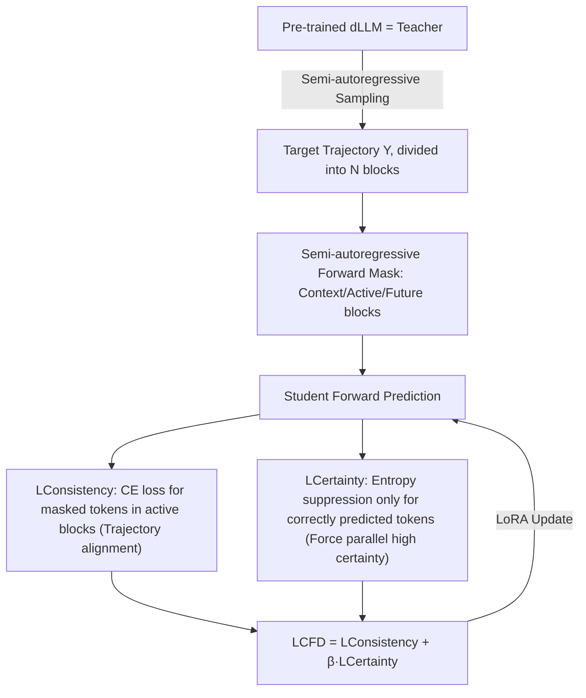

# dParallel: Learnable Parallel Decoding for dLLMs

**Conference**: ICLR 2026  
**OpenReview**: [https://openreview.net/forum?id=hVOcstAURb](https://openreview.net/forum?id=hVOcstAURb)  
**Code**: [https://github.com/czg1225/dParallel](https://github.com/czg1225/dParallel)  
**Area**: LLM Inference Acceleration / Diffusion Language Models / Parallel Decoding  
**Keywords**: diffusion LLM, parallel decoding, certainty-forcing distillation, self-distillation, LLaDA, Dream  

## TL;DR
By reshaping the "serial certainty convergence" (predicting token-by-token) of diffusion language models (dLLMs) into "parallel simultaneous convergence" through "Certainty-Forcing Distillation," LLaDA-8B achieves an 8.5× acceleration on GSM8K, reducing decoding steps from 256 to 30 without accuracy loss.

## Background & Motivation
**Background**: Diffusion language models (dLLMs, e.g., LLaDA, Dream) replace autoregressive (AR) left-to-right generation with bidirectional attention. Theoretically, they can predict all masked tokens in parallel at each step, promising significantly lower inference latency than AR-LLMs. However, current open-source dLLMs require a number of decoding steps almost proportional to the sequence length (e.g., 256 steps for length 256) to maintain quality, rendering their parallel potential ineffective.

**Limitations of Prior Work**: Existing acceleration efforts follow two paths: reducing per-step time (e.g., Dual-Cache for KV caching) or optimizing remasking strategies to reduce the total number of steps. However, performance collapses when parallelism is increased (i.e., committing multiple tokens per step). Previous studies focused on "trajectory alignment" (teacher forcing / diffusion forcing) without identifying the fundamental cause.

**Key Challenge**: While dLLMs predict all masked tokens in parallel, the **"certainty/confidence"** of these predictions converges **serially from left to right**. In each step, only a few tokens adjacent to the known context reach high confidence; others remain uncertain until newly determined tokens provide context for the next batch. Empirical evidence reveals that **high certainty is a necessary condition for correct generation** (strong positive correlation between confidence and accuracy). Forcing the commitment of low-confidence tokens leads to cascading errors. This is the true bottleneck of parallel decoding: **serial certainty convergence**.

**Goal**: Train dLLMs to reach high certainty at multiple positions **in parallel**, thereby breaking the serial bottleneck and significantly compressing decoding steps without degrading performance.

**Core Idea**: **[Certainty as a Training Signal]** Proposes certainty-forcing distillation. The model undergoes self-distillation along its original sampling trajectory (to maintain consistency) while directly suppressing the "output entropy for correctly predicted tokens," forcing the model to push certainty to its peak faster and more in parallel.

## Method

### Overall Architecture
The method is a **self-distillation** training pipeline: a pre-trained dLLM serves as the teacher to generate target trajectories, while an identical student replica learns to follow these trajectories. The training objective includes an additional term to "force high certainty." This process does not change the original generation trajectory but reshapes the rhythm of certainty convergence from serial to parallel. Training utilizes LoRA and can be completed in approximately 10 hours on 8× 24GB A5000 GPUs.

### Key Designs

**1. Semi-autoregressive forward mask: Aligning training states with actual sampling.** The teacher uses semi-autoregressive remasking (total length $L$, block size $L_b$) to generate a target response $Y=(y_1,\dots,y_L)$, which is partitioned into $N=L/L_b$ contiguous blocks. Unlike standard dLLM pre-training which masks tokens randomly across the sequence, this method samples a block index $n$ and constructs a noisy input $\tilde Y$ with three segments: **Context blocks** before block $n$ (fully preserved as conditions), the **Active block** $n{+}1$ (tokens replaced with [MASK] with probability $q$), and **Future blocks** (fully masked). This $\tilde Y$ simulates the semi-autoregressive intermediate state "given the first $n$ blocks, generating the $(n+1)$-th block," ensuring the input distribution during self-distillation aligns with the inference phase. Ablations show this step is crucial for high efficiency and accuracy.

**2. Consistency loss: Self-distillation along the original trajectory.** Learning signals are applied only to the set of masked positions $M_a$ in the active block $B_{n+1}$. Standard cross-entropy pulls the student toward the teacher's trajectory:
$$\mathcal{L}_{\text{Consistency}} = -\frac{1}{|M_a|}\sum_{i\in M_a}\log p_\theta(y_i\mid \tilde Y).$$
This ensures the student's generation trajectory remains consistent with the original model. However, **this alone cannot solve serial convergence**: once the prediction is correct, the CE gradient vanishes, providing no incentive to further increase confidence—this explains why standard consistency distillation offers limited speedup.

**3. Certainty-forcing loss: Suppressing entropy for "already correct" tokens.** This is the core contribution. Let $M_c=\{i\in M_a\mid \arg\max_v p_\theta(v\mid\tilde Y)=y_i\}$ be the set of tokens in the active block already correctly predicted by the student. The output distribution entropy with temperature $T$ is minimized only for these tokens:
$$\mathcal{L}_{\text{Certainty}} = \frac{1}{|M_c|}\sum_{i\in M_c}\Big(-\sum_{v\in V} p_\theta(v\mid\tilde Y;T)\log p_\theta(v\mid\tilde Y;T)\Big).$$
By applying entropy suppression **only to correctly predicted tokens**, the CE loss ensures "correct direction" while the entropy term ensures "higher confidence." This pushes confidence to its peak in parallel at multiple locations, allowing more tokens to cross the commitment threshold in a single step. The total objective is:
$$\mathcal{L}_{\text{CFD}} = \mathcal{L}_{\text{Consistency}} + \beta\,\mathcal{L}_{\text{Certainty}}.$$
The combination transforms the left-to-right serial confidence climb into a parallel surge, enabling the entropy-threshold based remasking to commit multiple tokens per step.

## Key Experimental Results

### Main Results (LLaDA-8B-Instruct, Sequence Length 256, Block Length 32)

| Benchmark | Method | #Steps ↓ | Latency ↓ | Speedup ↑ | Acc ↑ |
|---|---|---|---|---|---|
| GSM8K-CoT | LLaDA-8B (Orig) | 256 | 18.6s | 1.0× | 75.7% |
| | Conf-threshold | 72 | 5.2s | 3.6× | 75.5% |
| | Consistency Distill | 64 | 4.7s | 4.0× | 69.9% |
| | **dParallel (Ours)** | **30** | **2.2s** | **8.5×** | **76.1%** |
| MATH (4-shot) | LLaDA-8B | 256 | 50.9s | 1.0× | 33.5% |
| | **dParallel** | **46** | **8.9s** | **5.7×** | 31.5% |
| HumanEval | LLaDA-8B | 256 | 23.5s | 1.0× | 38.4% |
| | **dParallel** | **33** | **2.9s** | **8.2×** | **40.2%** |
| MBPP (3-shot) | LLaDA-8B | 256 | 50.1s | 1.0× | 42.4% |
| | **dParallel** | **24** | **4.8s** | **10.5×** | 40.8% |

Results are also valid for Dream-7B-Instruct: 39 steps for 6.9× speedup on GSM8K (82.1% vs 82.9% orig). Note that since Dream is initialized from an AR-LLM, semi-autoregressive masking causes it to degrade back to AR; thus, random masking was used, resulting in lower speedup than LLaDA.

### Ablation Study (LLaDA, GSM8K-CoT / HumanEval)

| Consistency | Certainty | Semi-AR Mask | GSM8K Steps/Speed/Acc | HumanEval Steps/Speed/Acc |
|---|---|---|---|---|
| ✓ | | ✓ | 53 / 4.5× / 73.5% | 71 / 3.6× / 36.0% |
| | ✓ | ✓ | 23 / 10.4× / 57.8% | 28 / 9.8× / 30.5% |
| ✓ | ✓ | | 44 / 5.5× / 73.3% | 61 / 4.3× / 32.9% |
| ✓ | ✓ | ✓ | **30 / 8.5× / 76.1%** | **33 / 8.2× / 40.2%** |

### Key Findings
- **Confidence as a Necessary Condition**: Confidence is strongly positively correlated with accuracy; forcing commitment of low-confidence tokens leads to errors.
- **Interdependence of Components**: Consistency loss prevents deviation, certainty loss enables parallel peaks, and semi-AR masking aligns training-inference states. Removing any component results in lower accuracy or speed.
- **Cross-task Generalization**: Training LLaDA only with math prompts also significantly improved parallel decoding performance on code tasks.
- **Superior Trade-off**: At a 9.4× speedup, dParallel outperforms the confidence-threshold baseline by 16.5% in accuracy on GSM8K and 21.3% on HumanEval.

## Highlights & Insights
- **Root Cause Identification**: Precise diagnosis of why dLLM parallel decoding fails—identifying "serial certainty convergence" and validating it with confidence propagation diagrams is highly insightful.
- **Ingenious Use of Entropy Regularization**: Instead of minimizing entropy across the whole sequence, the method targets **only correctly predicted tokens**. This surgical application enhances confidence without jeopardizing accuracy.
- **Low Cost**: Pure self-distillation requiring no external labeled data. Training with LoRA on 8× A5000s for 10 hours makes the method highly reproducible.

## Limitations & Future Work
- **Constraints on AR-initialized Models**: For models like Dream, semi-AR masking causes a fallback to AR mode. Using random masking instead leads to significantly lower speedup than native dLLMs like LLaDA.
- **Domain Focus**: Experiments concentrated on GSM8K/MATH/HumanEval/MBPP, where answers are definitive. Parallel gains in open-ended generation or long-context scenarios remain unverified.
- **Hyperparameter Sensitivity**: Parameters like temperature $T$, weight $\beta$, and mask ratio require tuning; an adaptive mechanism is currently lacking.
- **Theoretical Gap**: While empirical evidence is strong, a deeper theoretical framework explaining how entropy suppression for correct tokens triggers the jump from serial to parallel convergence is yet to be established.

## Related Work & Insights
- **Two Main Lines of dLLM Acceleration**: Reducing per-step cost (Dual-Cache/KV cache/token dropping) vs. reducing steps (modified remasking). This work opens a third path: training to modify the model's certainty dynamics.
- **Distillation Methods**: Unlike SDTT or Consistency Distillation which focus on trajectory alignment, this paper argues that alignment is insufficient to overcome serial convergence.
- **Insight**: Optimizing the evolution rhythm of internal statistics (such as certainty) rather than just output correctness could be a universal strategy for accelerating iterative generative models (diffusion/flow matching).

## Rating
- **Novelty**: ⭐⭐⭐⭐⭐ Precise attribution of bottlenecks to serial certainty convergence and using certainty as an explicit training signal is a fresh and effective perspective.
- **Experimental Thoroughness**: ⭐⭐⭐⭐ Solid testing across two dLLMs, four benchmarks, multiple baselines, and complete ablations. However, the task variety is somewhat narrow (math/code).
- **Writing Quality**: ⭐⭐⭐⭐ Clear problem definition and compelling empirical visualizations.
- **Value**: ⭐⭐⭐⭐⭐ 8.5–10.5× lossless speedup at low training cost sets a new baseline for efficient dLLM inference.

<!-- RELATED:START -->

## Related Papers

- [\[ICLR 2026\] Learning to Parallel: Accelerating Diffusion Large Language Models via Learnable Parallel Decoding](learning_to_parallel_accelerating_diffusion_large_language_models_via_learnable_.md)
- [\[ICLR 2026\] Hierarchy Decoding: A Training-free Parallel Decoding Strategy for Diffusion Large Language Models](hierarchy_decoding_a_training-free_parallel_decoding_strategy_for_diffusion_larg.md)
- [\[ICLR 2026\] Wide-In, Narrow-Out: Revokable Decoding for Efficient and Effective DLLMs](wide-in_narrow-out_revokable_decoding_for_efficient_and_effective_dllms.md)
- [\[ICLR 2026\] Fast-dLLM: Training-free Acceleration of Diffusion LLM by Enabling KV Cache and Parallel Decoding](fast-dllm_training-free_acceleration_of_diffusion_llm_by_enabling_kv_cache_and_p.md)
- [\[ICLR 2026\] ReFusion: A Diffusion Large Language Model with Parallel Autoregressive Decoding](refusion_a_diffusion_large_language_model_with_parallel_autoregressive_decoding.md)

<!-- RELATED:END -->
