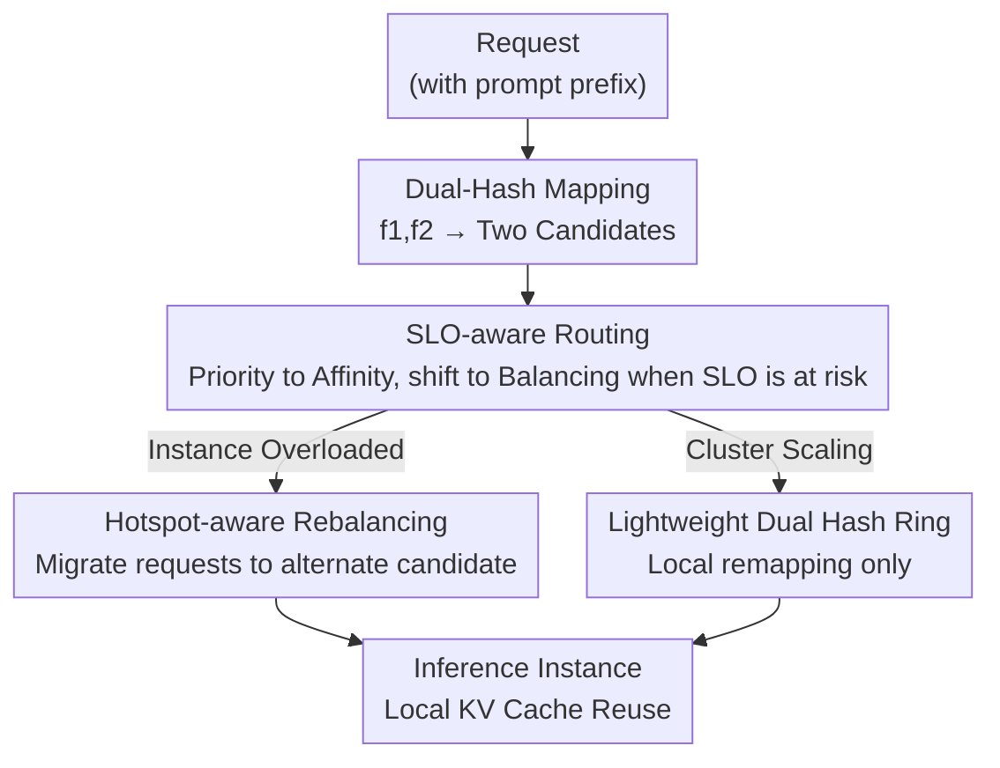

# DualMap: Enabling Both Cache Affinity and Load Balancing for Distributed LLM Serving

**Conference**: ICLR2026  
**OpenReview**: [https://openreview.net/forum?id=zCadrJ32Xn](https://openreview.net/forum?id=zCadrJ32Xn)  
**Code**: https://github.com/ASISys/DualMap  
**Area**: LLM Serving / Distributed Scheduling / KV Caching  
**Keywords**: Prefix Caching, Cache Affinity, Load Balancing, Dual-Hash Mapping, Power of Two Choices

## TL;DR
DualMap utilizes two independent hash functions to map each request to two candidate instances and selects the optimal one based on system status. By leveraging the "power of two choices" principle, it **simultaneously achieves cache affinity and load balancing** within a single scheduling framework, increasing effective request capacity by up to 2.25× under the same TTFT SLO.

## Background & Motivation
**Background**: In distributed LLM inference services, reusing KV caches corresponding to shared prompt prefixes (context/prefix caching) is a critical method for reducing Time To First Token (TTFT) and lowering service costs. Multi-turn conversations sharing history and agents repeatedly calling tools with the same instruction prefixes make prefix reuse highly beneficial.

**Limitations of Prior Work**: To realize reuse, a scheduler must route requests with the same prefix to the **same** instance that has already cached that prefix, a property known as **cache affinity**. However, real-world workloads exhibit highly skewed prefix popularity—requests for popular prefixes concentrate on a single instance, leading to long queues and spikes in tail TTFT, while other instances remain idle. This necessitates **load balancing** to distribute requests evenly. These two objectives conflict directly: affinity aggregates same-prefix requests, while balancing disperses them.

**Key Challenge**: The authors identify that the root cause of this conflict is that existing schedulers are confined to a **single mapping space**. Affinity strategies use a "prompt-aware" mapping function, while balancing strategies use a "load-aware" mapping function; these are mutually exclusive choices for a single slot. Compromises in systems like Mooncake, Preble, and Dynamo essentially route "some requests via prompt-aware and others via load-aware," failing to maximize both. Empirical Pareto curves (Figure 1) show these methods stuck between the extremes of Cache Affinity and Least Loaded.

**Key Insight**: The authors draw from a classic result in load balancing: **Power of Two Choices (PoTC)**. By randomly selecting **2** candidates for each task and choosing the one with the lower load, the maximum load can be kept close to the average. If, instead of choosing between "one mapping vs. another," the system provides "two mappings simultaneously, where either allows cache reuse," affinity and balancing are no longer mutually exclusive.

**Core Idea**: Use **two independent hash functions** on the request prefix to calculate two candidate instances and select the better one based on current system status. The randomness of the two hashes ensures different prefixes are spread uniformly (achieving balancing), while using the prefix as the hash input ensures same-prefix requests consistently land on the same pair of candidates (achieving affinity). Theoretically, if $m$ same-prefix requests map to a candidate pair $\{I_1, I_2\}$, the hit rate is $\max(0, 1-2/m)$, which approaches the $\max(0, 1-1/m)$ of pure affinity as $m$ increases. Meanwhile, the load deviation term drops from $\Theta(\sqrt{m\log n/n})$ in single-choice to $\log\log n$ in dual-choice, an exponential improvement.

## Method

### Overall Architecture
DualMap is a **global scheduling layer** built on top of a distributed LLM serving system (implemented in vLLM), consisting of a **global scheduler** and an **inference cluster**. Each inference instance runs an LLM and is equipped with a fixed size of host DRAM for context caching to enable local cross-request KV reuse. Upon receiving a request, the scheduler uses two independent hash functions $f_1, f_2$ on the prefix to determine **two candidate instances**. It then addresses three technical problems: ① SLO-aware routing for optimal candidate selection, ② Hotspot-aware rebalancing for skewed loads, and ③ Lightweight dual hash ring for elastic scaling. All three rely on the foundation that each request consistently has two candidate instances, enabling PoTC and localized migrations.

### Key Designs

**1. Dual-Hash Mapping: Combining Affinity and Balancing**

This serves as the foundation, addressing the root cause that a single mapping space cannot satisfy both affinity and balancing. For each request, two **independent** hash functions $f_1, f_2$ are applied to the prefix to identify two candidate instances. The randomness of the hashes spreads different prefixes across the cluster (balancing via PoTC), while using the prefix as the key ensures identical prefixes always map to the same pair $\{I_1, I_2\}$ (affinity via consistent mapping). The authors specifically choose $d=2$. Based on the PoTC upper bound $\max_i L(I_i) \le \frac{m}{n} + \frac{\log\log n}{\log d} + O(1)$, increasing $d$ from 2 to 3 or 4 yields marginal load improvements but disperses same-prefix requests further, weakening cache locality. If $f_1, f_2$ collide on the same instance, the second candidate is deterministically set to $\text{id}_2 = (\text{id}_1 + 1) \bmod \text{num\_instances}$.

**2. SLO-aware Routing: Affinity by Default, Balancing for Constraints**

The system must handle two sub-problems. First, **hash prefix length**: too long might split requests that share prefixes; too short might cause collisions between unrelated request sets. **Ours** uses an **adaptive hash prefix length** by maintaining a "prefix popularity tree." Each node records prefix information; the hash prefix corresponds to the full path from root to leaf. If a leaf prefix becomes hot, child nodes are added to extend the prefix and spread load; if a parent prefix cools, children are deleted to aggregate requests. Popularity is tracked via the flow ratio $\rho$ in a sliding window. A prefix is "hot" if $\rho > \frac{2}{n}$, and updated/shortened if it drops to $\rho < \frac{1}{n}$. Second, **candidate selection**: instead of naive least-loaded or Min TTFT (which oscillates between cache-aware and load-aware), the SLO-aware strategy **prioritizes the instance with higher cache reuse, using it until its load causes the expected TTFT to exceed the SLO threshold**, only then switching to the less-loaded candidate. If hit rates are equal, the less-loaded one is chosen. This maintains affinity as long as load permits to stabilize hit rates.

**3. Hotspot-aware Rebalancing: Offloading Queues under Skewed Load**

Despite initial routing, skewed workloads can still overload specific instances over time. Inspired by **Cuckoo hashing** (where a key can be moved to an alternate slot), DualMap treats instances as slots and requests as keys. When an instance is overloaded, a portion of its queued requests is redirected to their **alternate candidate** (the other instance in the dual mapping) to maintain mapping consistency. Unlike traditional Cuckoo hashing that might involve recursive evictions, this uses **non-recursive, single-round batch migration** to minimize overhead. Selection is based on **migration gain**: $B^{(i \to j)}_r = \text{TTFT}_{r,i} - \text{TTFT}_{r,j} = (T_q(r,i) + T_c(r,i)) - (T_q(r,j) + T_c(r,j))$. Requests are moved in descending order of gain until the overloaded instance's queue satisfies the SLO. This process is restricted to the pair $\{I_1, I_2\}$, avoiding global searches while preserving affinity.

**4. Lightweight Dual Hash Ring: Elastic Scaling with Local Mapping**

LLM workloads fluctuate, requiring elastic scaling. Static hashing triggers global remapping when instances are added or removed, destroying cache affinity. DualMap combines **dual mapping with consistent hashing** into a dual hash ring. Within the hash space $[0, M)$, each instance is placed as an anchor. Each request uses $f_1, f_2$ on its prefix to calculate two points on the ring; the nearest clockwise instances serve as candidates. Since the mapping depends on **relative positions**, membership changes only affect local regions. Most requests retain their original mapping during scaling, minimizing cache loss.

## Key Experimental Results

### Main Results
The testbed is a distributed LLM cluster with 8 Ascend NPUs (910B4 32GB / 910B3 64GB) per node + 1.5TB DRAM, with DualMap built on vLLM. Models include Qwen2.5 7B / 14B (float16) across 8 instances. Workloads involve two real traces from Mooncake: Conversation and Tool&Agent. Baselines include Cache Affinity, Least Loaded, Min TTFT, and Preble. Core metrics: **Effective Request Capacity** (request ratio with TTFT < 5s SLO) and Goodput.

| Workload | Metric | Gain over best baseline |
| :--- | :--- | :--- |
| Tool&Agent (High skew) | Effective Request Capacity | Up to **+125%** (2.25× capacity) |
| Tool&Agent | Goodput | +16.7% ~ +48% |
| Conversation (Lower skew) | Effective Request Capacity | +40.6% ~ +80% |
| Conversation | Goodput | +14.3% ~ +40% |
| High QPS (All settings) | P50 TTFT | -55.4% to -97.4% (via high hit rate) |
| High QPS (All settings) | P90 TTFT | -82.3% to -97% (via balancing) |

On the highly skewed Tool&Agent trace, pure Cache Affinity suffers massive SLO violations even at low QPS due to imbalance. Preble and Min TTFT mitigate imbalance at the cost of hit rates. DualMap achieves both, leading consistently.

### Ablation Study
Tested on Conversation + Qwen2.5-14B by incrementally adding features:

| Configuration | Observation | Explanation |
| :--- | :--- | :--- |
| DualMap-cache-affinity | Highest P50/P90 TTFT | Max reuse leads to severe imbalance/queues |
| DualMap-least-loaded | Lower imbalance but low hit rate | Load-aware only |
| DualMap-min-ttft | Slightly better but hit rate still low | Oscillates between cache/load-aware |
| DualMap-no-rebalance | P50/P90 TTFT dropped by 23.5%/18.5% over min-ttft | Benefit of SLO-aware routing |
| DualMap (Full) | Optimal performance | Addition of hotspot-aware rebalancing |

### Key Findings
- **SLO-aware Routing (§3.2)** individually reduces P50/P90 TTFT by 23.5%/18.5% compared to Min TTFT by stabilizing routing decisions and hit rates.
- **Hotspot-aware Rebalancing (§3.3)** further eliminates tail latency, which is crucial for skewed workloads (explaining the higher +125% gains in Tool&Agent).
- $d=2$ is a deliberate choice: theoretical and empirical evidence suggests further increases in $d$ offer marginal load benefits while significantly damaging cache locality.

## Highlights & Insights
- **Adapting PoTC theory to LLM cache scheduling**: Using "two choices" provides a higher dimension where cache affinity (keeping prefixes within 2 instances) and load balancing (exponentially tighter load bounds) are no longer mutually exclusive. This shift in perspective is the most significant contribution.
- **Engineering solutions for practical deployment**: Adaptive prefix trees address "prefix length," Cuckoo-style migration handles "hotspots without losing affinity," and the dual hash ring ensures "elasticity without cache destruction." Each aligns a classic algorithm with serving-specific constraints.
- **Portability**: The concept of prefix-based dual hashing and candidate-pair migration can be generalized to any stateful distributed system where data locality and load balancing conflict, such as vector search sharding or feature caching.

## Limitations & Future Work
- **Dependency on prefix sharing**: Gains are maximized for skewed/shared prefix workloads (Tool&Agent). Benefits decrease for workloads with negligible sharing.
- **$d=2$ trade-off**: In scenarios that are extremely balance-sensitive where caching is irrelevant, a larger $d$ or global scheduling might be superior.
- **Hyperparameter sensitivity**: The prefix popularity tree and sliding windows introduce parameters (thresholds $\frac{2}{n}/\frac{1}{n}$, window size, `ttft_slo_threshold`) whose sensitivity and maintenance overhead were not fully explored.
- **Evaluation Scope**: Experiments were limited to Qwen2.5 7B/14B on 8 instances with NPUs. Performance on larger scales, heterogeneous hardware, or multi-model co-serving requires verification.

## Related Work & Insights
- **vs Mooncake (Min TTFT)**: Mooncake switches between prompt-aware and load-aware based on balance within a single mapping space; DualMap allows both to exist in parallel via dual mappings and prioritizes affinity until SLOs are threatened.
- **vs Preble**: Preble uses prompt-aware routing only when hit rates >50%; DualMap allows every request to potentially benefit from both affinity and balancing.
- **vs PoTC / Cuckoo hashing / Consistent hashing**: DualMap represents a systematic implementation of classic distributed algorithms tailored for LLM inference (prefix-keying, non-recursive migration, dual rings).

## Rating
- Novelty: ⭐⭐⭐⭐⭐ Using PoTC to resolve the affinity-balancing conflict is a fresh and theoretically grounded approach.
- Experimental Thoroughness: ⭐⭐⭐⭐ Uses real traces and multiple models, though cluster scaling and hyperparameter sensitivity could be more extensive.
- Writing Quality: ⭐⭐⭐⭐⭐ Clear logical flow connecting challenges, theoretical foundations, and specific designs.
- Value: ⭐⭐⭐⭐⭐ Significantly improves distributed LLM serving capacity and is open-sourced with high practical utility.

<!-- RELATED:START -->

## Related Papers

- [\[ICLR 2026\] Scaling Large Vision-Language Model RL Training via Efficient Load Balancing](scaling_large_vision-language_model_rl_training_via_efficient_load_balancing.md)
- [\[ICLR 2026\] Libra: Effective yet Efficient Load Balancing for Large-scale MoE Inference](libra_effective_yet_efficient_load_balancing_for_large-scale_moe_inference.md)
- [\[ACL 2025\] SpindleKV: A Novel KV Cache Reduction Method Balancing Both Shallow and Deep Layers](../../ACL2025/llm_efficiency/spindlekv_layered_kv_cache.md)
- [\[ICLR 2026\] DiSRouter: Distributed Self-Routing for LLM Selections](disrouter_distributed_self-routing_for_llm_selections.md)
- [\[ICLR 2026\] DefensiveKV: Taming the Fragility of KV Cache Eviction in LLM Inference](defensivekv_taming_the_fragility_of_kv_cache_eviction_in_llm_inference.md)

<!-- RELATED:END -->
