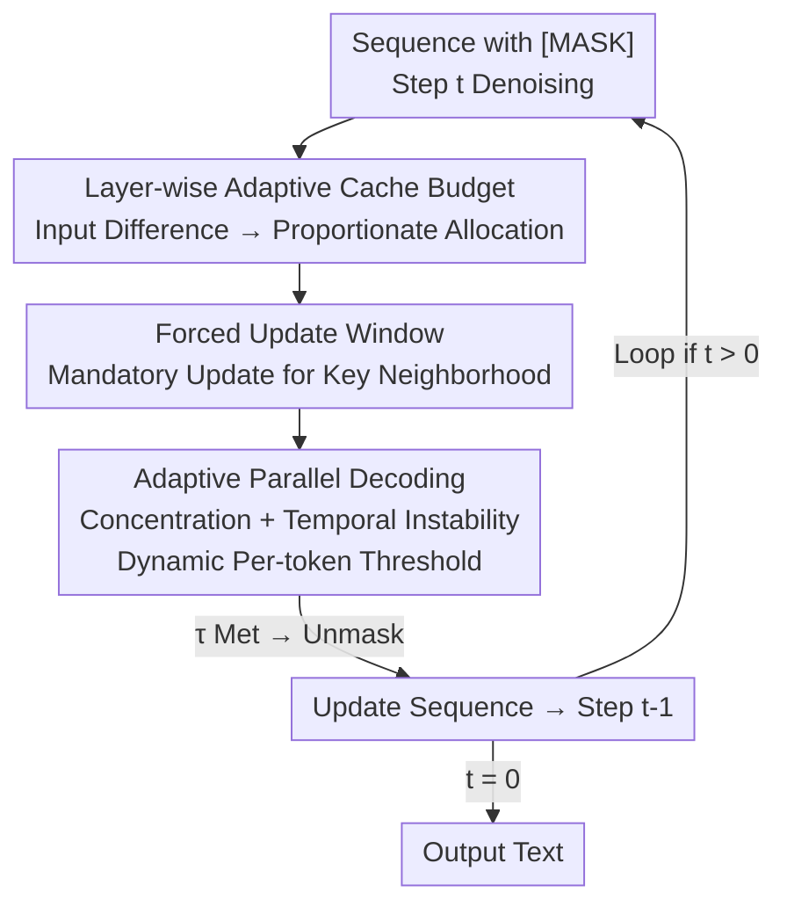

# Dynamic-dLLM: Dynamic Cache-Budget and Adaptive Parallel Decoding for Training-Free Acceleration of Diffusion LLM

**Conference**: ICLR2026  
**OpenReview**: [https://openreview.net/forum?id=SdnkB5pGbq](https://openreview.net/forum?id=SdnkB5pGbq)  
**Code**: https://github.com/TianyiWu233/DYNAMIC-DLLM  
**Area**: LLM Efficiency / Diffusion Language Models / Inference Acceleration  
**Keywords**: Diffusion LLM, Training-free Acceleration, Dynamic Cache, Parallel Decoding, Adaptive Threshold

## TL;DR
Dynamic-dLLM is a training-free inference acceleration framework for Diffusion LLMs. Addressing the "dynamic" variations of tokens across different layers and decoding steps, it employs Dynamic Cache Update (DCU) to adaptively allocate cache update budgets per layer and Adaptive Parallel Decoding (APD) to dynamically calibrate decoding thresholds per token. It achieves an average speedup of over 3× (up to 4.48×) on models like LLaDA and Dream with negligible accuracy loss.

## Background & Motivation

**Background**: Diffusion Large Language Models (dLLMs, e.g., LLaDA, Dream) utilize bidirectional attention for iterative denoising text generation. Compared to Autoregressive (AR) models, they offer advantages in complex scenarios like the "reversal curse" and are viewed as a promising alternative paradigm.

**Limitations of Prior Work**: The computational complexity of dLLMs grows as $O(L^3)$ with sequence length $L$, significantly higher than $O(L^2)$ for AR models. The root cause lies in their non-autoregressive nature—each denoising step requires a parallel recomputation of all tokens in the sequence. This leads to cubic overhead and prevents dLLMs from natively reusing AR KV-Cache mechanisms (since all tokens change at every step).

**Key Challenge**: Existing acceleration methods (dLLM-Cache, dKV-Cache, Fast-dLLM, etc.) either reuse intermediate token representations across steps or parallelize unmasking of multiple high-confidence tokens within a single step. However, they rely on **static** strategies, applying uniform cache or unmasking rules across all layers and decoding steps. The paper observes that token properties are inherently dynamic: ① the proportion of tokens requiring cache updates increases monotonically from shallow to deep layers; ② the confidence distribution of each token fluctuates across decoding steps, where the early "winner" is often replaced by "runners-up." Static rules mismatch this dynamics, leading to either wasted computation or early commitment errors (error propagation).

**Goal**: To design a training-free acceleration framework that dynamically aligns with the model's "inter-layer + inter-step token dynamics," decomposed into two sub-problems: how to dynamically distribute cache update budgets across layers and how to adaptively adjust parallel decoding thresholds per token.

**Key Insight**: Based on two critical observations—the cache update requirement varies significantly by layer (Figure 2a-d), and fixed thresholds fail to capture valid "runner-up" candidates (Figure 2e)—the authors conclude that "layer-wise and step-wise adaptivity" is the correct approach.

**Core Idea**: Replace static caching with Dynamic Cache Update (DCU) and fixed thresholds with Adaptive Parallel Decoding (APD). This allows the computational budget to flow toward layers and tokens that are "actually changing" in a training-free, plug-and-play manner.

## Method

### Overall Architecture

Dynamic-dLLM optimizes acceleration across two orthogonal dimensions: **Cache Update Management** (layer dimension) and **Parallel Decoding Scheduling** (step dimension). The input is a sequence with `[MASK]` placeholders, and the output is the complete text after $T$ iterative denoising steps. At each denoising step, DCU decides "which token caches to recompute for each layer," while APD decides "which token predictions can be committed (unmasked) early." These components are independent and additive: DCU reduces redundant forward computation, while APD reduces the total number of denoising steps.

The DCU logic (upper half) uses an **input-level difference** proxy to estimate the variation of each token per layer, allocates cache update budgets proportionally, and employs a **forced update window** to ensure critical tokens do not get "stuck in the mud" due to prolonged inactivity. The APD logic (lower half) maintains a per-token threshold that evolves per step, dynamically increasing or decreasing based on the **confidence concentration** and **temporal instability** of the prediction distribution.

### Key Designs

**1. Dynamic Cache Update (DCU): Input Difference as a Proxy for Layer-wise Budget Allocation**

Current methods update a fixed or uniform number of token caches for all layers. However, empirical tests show that the proportion of tokens needing updates increases with layer depth—shallow features are stable while deep features change drastically. A direct approach, like dLLM-Cache, involves explicit recomputation and cosine similarity comparison of Value vectors, but recomputing Values is expensive. Inspired by the "input-output strong correlation" in DiT, the authors verify that layer inputs in dLLMs have very high Spearman correlations (0.94~0.99) with various intermediate features (Key/Value/Attention/FFN outputs). Thus, **layer input variation** serves as a cheap proxy for intermediate activation dynamics.

Specifically, the difference of token $x_i$ between steps $t$ and $t+1$ at layer $l$ is measured by the cosine distance of normalized inputs:

$$d_i^{t,l} = 1 - \frac{(x_i^{t,l})^\top x_i^{t+1,l}}{\|x_i^{t,l}\|\,\|x_i^{t+1,l}\|}$$

Token-level differences are aggregated into layer-level dynamism $s^{t,l}=\frac{1}{N}\sum_i d_i^{t,l}$, and the total budget $B_{\text{layer}}\times \text{LayerNum}$ is **proportionally allocated** based on the previous step's $s^{t+1,l}$:

$$B_{\text{layer}}^{t,l} = (B_{\text{layer}}\times \text{LayerNum})\cdot \frac{s^{t+1,l}}{\sum_{k} s^{t+1,k}}$$

Each layer selects the top-$B_{\text{layer}}^{t,l}$ tokens with the largest $d_i^{t,l}$ to recompute, while others reuse old values. This directs compute to the "deep layers that actually change," saving shallow layer computation.

**2. Forced Update Window: Rescuing Critical Tokens "Stuck in the Mud"**

Proportional allocation has a risk: if token $x_i$ is not selected for update at layer $l$, its cache representation remains unchanged, leading to an unchanged input for layer $l+1$ ($d_i^{t,l+1}=0$). Since the strategy favors large differences, $x_i$ is likely to be skipped in subsequent layers, falling into a cycle of "no update → zero difference → no selection." The authors term this **token stuck in the mud**.

The solution stems from spatial locality (Figure 5): tokens surrounding the recently unmasked token (key token at position $p$) are most likely to be affected and decoded in the current step. Thus, a fixed-size window $B_{\text{window}}$ is set around the key token: $\left[p-\frac{B_{\text{window}}}{2},\, p+\frac{B_{\text{window}}}{2}\right]$. All tokens within this window are **forcibly updated**, bypassing the budgetary allocation:

$$U^{t,l} \leftarrow U^{t,l}\cup\left\{x_i \;\middle|\; p-\tfrac{B_{\text{window}}}{2}\le i\le p+\tfrac{B_{\text{window}}}{2}\right\}$$

Remaining global budget is distributed outside these windows.

**3. Adaptive Parallel Decoding (APD): Thresholding via Confidence Concentration and Temporal Instability**

Static parallel decoding (e.g., Fast-dLLM) unmasks tokens if confidence exceeds a fixed threshold. However, peak confidence fluctuates across steps: an early "top" prediction may be wrong, while a prediction that clearly dominates others (low entropy/large margin) can be safely unmasked even if its absolute confidence is below a static threshold.

Each token starts with $\tau_i^T$, evolving from $\tau_i^{t+1}$. The first signal is **confidence concentration**, measuring distribution sharpness ($u$ is the top token):

$$c_i^t = 1 - \max_{v\in V\setminus\{u\}} (z_i^t)_v$$

A larger $c_i^t$ implies a concentrated distribution; the threshold is **lowered** to allow early decoding. The second signal is **temporal instability**, using cosine distance of confidence distributions between steps:

$$H_i^t = 1 - \frac{(z_i^t)^\top z_i^{t+1}}{\|z_i^t\|\,\|z_i^{t+1}\|}$$

A larger $H_i^t$ implies significant revisions; the threshold is **raised** to wait. The threshold update rule:

$$\tau_i^t = \tau_i^{t+1} - \alpha\cdot c_i^t + \beta\cdot H_i^t$$

where $\alpha,\beta\ge 0$ balance the influence. This reduces total decoding steps without sacrificing quality.

### Loss & Training
This method is **fully training-free**, requiring no training objectives or fine-tuning. DCU and APD are inference-time scheduling strategies. Default hyperparameters: $B_{\text{layer}}=32$, $B_{\text{window}}=32$, APD threshold starts near 0.9.

## Key Experimental Results

### Main Results
Evaluated on LLaDA-8B-Instruct, LLaDA-1.5, and Dream-v0-7B-Instruct across MMLU, ARC-C, GSM8k, GPQA, and HumanEval. Comparisons against dLLM-Cache, dKV-Cache, and Fast-dLLM. Metrics: accuracy and throughput (TPS). (*) denotes combined parallel decoding.

| Model / Config | Avg. Acc | Avg. Gain | GSM8k Peak Gain |
|------------|---------|---------|---------------|
| LLaDA-8B-Instruct (Baseline) | 59.67 | 1.0× | — |
| + Fast-dLLM | 59.62 | 2.27× | 2.73× |
| + Dynamic-dLLM (Cache only) | 59.51 | 2.63× | 3.27× |
| + Fast-dLLM* (Parallel) | 59.22 | 2.85× | 3.77× |
| + Dynamic-dLLM* (Parallel) | 59.33 | **3.21×** | **4.48×** (37.29 vs 8.32 TPS) |

Results are consistent across models: LLaDA-1.5 achieves 4.46× speedup on GSM8k with minimal accuracy loss (60.67% vs 61.08%). Dream-v0-7B-Instruct achieves 3.91× speedup on GSM8k. Dynamic-dLLM achieves the highest throughput while maintaining the most stable accuracy.

### Ablation Study

| Config | Key Finding |
|------|---------|
| $B_{\text{layer}}$ Sweep | Acc increases with budget and saturates at ~32; throughput drops rapidly as budget increases. |
| $B_{\text{window}}$ Sweep | Similar trend to $B_{\text{layer}}$, but very small windows cause significant accuracy drops. |
| Dynamic vs. Static Threshold | At same initialization, dynamic thresholds reduce inference steps by ~30% compared to static. |

### Key Findings
- DCU gains stems from "layer-wise allocation + input proxy": directing budget to deep layers while avoiding recomputation costs.
- The Forced Update Window is essential; without it, critical tokens "stuck in the mud" drag down accuracy.
- APD reduces steps without dropping accuracy: at a high initialization (0.9), it requires ~30% fewer steps than fixed thresholds.

## Highlights & Insights
- **Input as a Proxy**: Verifying the high correlation (0.94~0.99) between layer inputs and intermediate features allows for a "free" signal to guide cache updates.
- **"Stuck in the Mud" Diagnosis**: Identifying the coupling between adaptive selection and cache reuse as a failure loop and solving it via spatial locality provides a clean mechanism.
- **Dual-signal Threshold**: Combining "concentration" (dominance over runners-up) and "stability" (historical fluctuation) into a single threshold update is intuitive and effective.
- **Orthogonality**: DCU (layer dimension) and APD (step dimension) are complementary and can be layered for additive speedups.

## Limitations & Future Work
- Evaluation is currently limited to unimodal text benchmarks; generalization to multimodal alignment or complex reasoning is unexplored.
- Fixed $B_{\text{layer}}/B_{\text{window}}$ (32) might need tuning for different sequence lengths or tasks.
- Parallel decoding shows slight accuracy jitters on hard tasks (GPQA, HumanEval), suggesting it can be aggressive.
- Future work includes adaptive window sizes and auto-calibration of APD parameters $\alpha, \beta$.

## Related Work & Insights
- **vs. dLLM-Cache / dKV-Cache (Static Cache)**: These use uniform updates; Dynamic-dLLM uses layer-wise dynamism and a cheap input proxy to save compute.
- **vs. Fast-dLLM (Fixed Threshold)**: Dynamic-dLLM's per-token thresholding reduces steps by 30% while maintaining accuracy by committing stable tokens earlier and delaying unstable ones.
- **Insight**: In iterative generation, redundancy is not static but drifts across layers and steps. Quantifying this drift with cheap proxies is a robust training-free acceleration path.

## Rating
- Novelty: ⭐⭐⭐⭐ Clear modeling of inter-layer and inter-step dynamics with novel proxy signals and diagnostics.
- Experimental Thoroughness: ⭐⭐⭐⭐ Strong coverage of multi-model/multi-benchmark and SOTA comparisons; lacks multimodal/long-context verification.
- Writing Quality: ⭐⭐⭐⭐ Logical flow from observation to method, well-supported by formulas and figures.
- Value: ⭐⭐⭐⭐ Training-free, 3×+ speedup, and near-zero loss provide immediate value for dLLM deployment.

<!-- RELATED:START -->

## Related Papers

- [\[ICLR 2026\] Hierarchy Decoding: A Training-free Parallel Decoding Strategy for Diffusion Large Language Models](hierarchy_decoding_a_training-free_parallel_decoding_strategy_for_diffusion_larg.md)
- [\[ICLR 2026\] Fast-dLLM v2: Efficient Block-Diffusion LLM](fast-dllm_v2_efficient_block-diffusion_llm.md)
- [\[ICML 2026\] dLLM-Cache: Accelerating Diffusion Large Language Models with Adaptive Caching](../../ICML2026/llm_efficiency/dllm-cache_accelerating_diffusion_large_language_models_with_adaptive_caching.md)
- [\[ICLR 2026\] Dynamic Speculative Agent Planning](dynamic_speculative_agent_planning.md)
- [\[ICLR 2026\] Learning to Parallel: Accelerating Diffusion Large Language Models via Learnable Parallel Decoding](learning_to_parallel_accelerating_diffusion_large_language_models_via_learnable_.md)

<!-- RELATED:END -->
