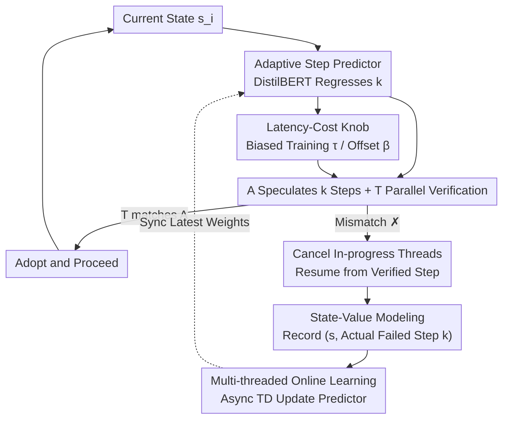

# Dynamic Speculative Agent Planning

**Conference**: ICLR2026  
**OpenReview**: [https://openreview.net/forum?id=YZ5k2dVj6O](https://openreview.net/forum?id=YZ5k2dVj6O)  
**Code**: https://github.com/guanyilin428/Dynamic-Speculative-Planning  
**Area**: LLM Efficiency / Agent / Speculative Execution  
**Keywords**: Speculative Planning, LLM Agent Acceleration, Online Reinforcement Learning, Latency-Cost Trade-off, TD Learning

## TL;DR
Addressing the issue where fixed speculative step length $k$ in "plan-while-speculating" LLM agents either fails to save time or wastes excessive redundant tokens, this paper proposes DSP. DSP utilizes a lightweight DistilBERT regressor to predict the optimal speculation distance for each step online (without pre-deployment preparation). The prediction is modeled as a state-value function in reinforcement learning and updated using TD learning. While maintaining "lossless acceleration," DSP reduces total costs by 30% and invalid costs by up to 60%, while providing a knob for users to navigate the latency-cost trade-off.

## Background & Motivation
**Background**: LLM agents have transitioned from demos to real-world deployment (autonomous software engineering, open-world tool calling, daily assistants). However, practitioners frequently report high end-to-end latency—multi-step planning is inherently autoregressive, requiring each step to wait for the preceding LLM call. To accelerate this, the community has explored context compression, step parallelization, and fast/slow dual-system thinking. Among these, Interactive Speculative Planning (ISP) migrates "speculative execution" from the CPU/decoding level to agent planning: a cheap approximate agent A generates subsequent actions ahead of time, while a powerful target agent T verifies these actions based on A's prefix in parallel. If T agrees with A's proposal, it is adopted, transforming serial pipelines into non-autoregressive parallel ones, ensuring "losslessness" as the final trajectory always follows T's policy.

**Limitations of Prior Work**: Existing acceleration methods have significant drawbacks: (1) Most, excluding ISP, do not guarantee losslessness (System 1.x requires training a router, EcoAct requires meticulous prompt tuning, and parallelization methods depend on the model's ability to generate parallelizable steps); (2) They generally require pre-deployment preparation (offline training of specialized modules), increasing implementation complexity; (3) Almost none provide a knob for users to control the latency-cost trade-off, despite the rapid shifts in pricing, inference speed, and model capabilities in the LLM ecosystem.

**Key Challenge**: Although ISP is lossless and zero-training, it uses a **fixed speculative step length** $k$. Empirical tests on 312 OpenAGI tasks show that the "optimal $k$" (steps from the current state to the first mismatch) fluctuates significantly even within a single task—averaging a maximum of 3.53, minimum of 1.60, variance of 1.46, and range of 1.93. This implies no global optimal $k$ exists: if $k$ is too small (Fig 2a), parallelism is insufficient to save much time; if $k$ is too large (Fig 2b), a mismatch before step $k$ invalidates all subsequent steps, wasting tokens. The paper further categorizes waste into four parts: A's prompt/generation tokens and T's prompt/generation tokens. It finds that A's waste primarily stems from prompts (long environment descriptions, task details, action history), while T incurs additional waste from "completed but invalid steps" and "forcibly cancelled in-progress steps," both of which scale linearly with $k$.

**Goal**: Enable the speculative step length $k$ to **dynamically adapt to the context** without sacrificing losslessness or requiring pre-deployment preparation, while providing a tunable knob for users to balance latency and cost.

**Key Insight**: Since the mismatch point is inherently determined by the "current partial trajectory," how many steps agent A can correctly generate is predictable from the state. Rather than training an expensive model offline, this prediction can be **learned online** during system runtime. Each mismatch naturally generates a training sample $(\text{partial trajectory}, k)$. Furthermore, the nature of speculative execution ensures that predicting $k$ does not alter the distribution of the generated trajectory, making this a stable value estimation problem rather than policy optimization.

**Core Idea**: Model "how many steps to speculate" as **state-value prediction** in reinforcement learning. Use Temporal Difference (TD) learning to train a lightweight predictor online and asynchronously, giving users control over the latency-cost trade-off through biased training or inference offsets.

## Method

### Overall Architecture
DSP inserts an **adaptive step-length predictor** into the ISP "A speculates, T verifies" dual-agent framework. At the start of each episode, the predictor observes the current state $s_i$ and outputs a speculative step length $k$. A and T then execute in parallel accordingly. Upon a mismatch (T's action differs from A's), all in-progress threads are cancelled, execution resumes from the last verified step, and the "actual correct steps" are recorded as a training sample. An **independent asynchronous training thread** continuously fine-tunes the predictor with new samples until convergence, synchronizing weights with the online inference predictor. The learning process never blocks agent planning. Finally, users can push the system toward "faster/more expensive" or "slower/cheaper" points using a parameter (expectile $\tau$ during training or offset $\beta$ during inference).

### Key Designs

**1. Adaptive Step-Length Predictor: Letting $k$ follow context instead of a fixed value**

This is DSP's direct correction to ISP. The fundamental issue with fixed $k$ is that the optimal speculative steps depend heavily on context and are unknown a priori. DSP trains a lightweight DistilBERT regressor to predict speculation distance directly from the token sequence of the current partial trajectory. DistilBERT is chosen for its expressive power in understanding trajectory semantics and its negligible forward pass cost compared to an LLM call. The predictor is triggered **asynchronously** at the start of an episode, running in parallel with A's current planning step, usually concluding before A finishes, thus hiding prediction latency. Intuitively, it learns to be bold in simple segments and conservative in complex ones, achieving speedup without waste.

**2. Formalizing step prediction as a state-value function with TD learning: Stable and dataset-free**

DSP formulates the speculative step selection as an MDP $\mathcal{M}=(S,A,P,p_0,R,\gamma)$: state $S$ is the token sequence, action $A$ is the speculative step, and state transitions involve appending the action token to the state $s_{t+1}=s_t\,|\,a_t$, with $\gamma=1$. The reward design is the core: $R(s_t,a_t)=1$ if A's step matches T, and 0 otherwise, ending the episode immediately upon mismatch. Under this reward, the return from state $s$, $G_t=\sum_{i=t}^{T-1}\gamma^{i-t}R(s_i,a_i)$, exactly equals the "number of steps that can still be correctly speculated." Thus, the state value $V_\pi(s)=\mathbb{E}_\pi[G_t\mid s_t=s]$ is the expected step length. An NN $V_\theta$ approximates $V_\pi$ with the loss:

$$L_\theta=\mathbb{E}_{\tau\sim\pi}\big[(G^\lambda_t-V_\theta(s_t))^2\big],$$

where $G^\lambda_t$ is the $\lambda$-return, interpolating between Monte Carlo returns ($\lambda=1$) and single-step TD targets ($\lambda=0$) to balance bias and variance (implemented with $\lambda=0.95$). Notably, when $\lambda=1$ and $\gamma=1$, $G^1_t=G_t=k$, and TD learning effectively becomes online supervised learning. DSP is thus a generalized framework that empirically outperforms pure supervised training. Value prediction is feasible because both A and T are fixed, and predicting $k$ does not change the trajectory distribution, avoiding the instability of policy optimization.

A critical detail is **decoupled data collection**: training samples are recorded only when A **actually fails**, not when the speculation budget is exhausted. If the predictor underestimates (predicting $k_2 < k_1$ when A could have correctly done $k_1$ steps), collecting samples at $k_2$ would make the predictor systematically conservative. Recording at the true failure point $k_1$ ensures prediction errors only affect efficiency, not the purity of training data.

**3. Multi-threaded Asynchronous Online Learning: Training never blocks inference**

To ensure "learning while running" does not slow down the agent, DSP maintains **two model copies**: a training predictor that is continuously updated and an inference predictor that serves all runtime requests. After each episode, an asynchronous thread is launched for training, synchronizing weights to the inference predictor upon completion. Combined with asynchronous inference (prediction parallel to A's planning), both inference and training are decoupled from the core execution pipeline. This provides two benefits over offline training: (1) real-time adaptation to the current user interaction distribution; (2) immediate prompt cost reduction as the predictor starts saving money as soon as new data arrives.

**4. Latency-Cost Knob: Biased training and inference offset**

The balance between cost and latency depends on the predicted $k$. DSP offers two adjustment methods. First is **Biased $k$ prediction**: replacing MSE with an asymmetric square loss from expectile regression $L^\tau_2(u)=|\tau-\mathbb{1}(u<0)|\,u^2$ during training, where $\tau\in(0,1)$ determines the expectile ( $\tau=0.5$ is MSE). When $\tau>0.5$, negative prediction errors are penalized less, making $V_\theta$ prone to overestimating $G^\lambda_t$, resulting in faster but more expensive execution. $\tau<0.5$ results in slower but cheaper execution. Second is **$k$ with offset**: adding a user-specified offset $\beta\in\mathbb{N}$ to the unbiased prediction $\hat{k}$, where $k=\max(1,\hat{k}+\beta)$. These knobs allow practitioners to stop at any point on the spectrum from "low-cost/slow" to "high-cost/fast."

### Loss & Training
The predictor uses DistilBERT optimized with AdamW, learning rate $1\times10^{-5}$, and batch size 16. It iterates for 3 epochs on a randomly sampled replay buffer (size 2500) per update. Multi-step returns are fused using $\lambda=0.95$. Backbone agents include GPT and DeepSeek families (e.g., GPT-4o-mini; DeepSeek-chat as A, DeepSeek-reasoner as T).

## Key Experimental Results

### Main Results
Evaluated on OpenAGI (312 vision-language multi-step tasks) and TravelPlanner (180 tasks). All metrics are normalized relative to a fixed $k=2$ baseline: $T(\times)$ relative latency, $P(\times)$/$G(\times)$ relative prompt/generation tokens, $\text{Cost}(\times)$ relative monetary cost, MC average peak concurrency, and K average predicted step. Selected results for OpenAGI + GPT backbone (Direct-ReAct):

| Mode | Latency $T(\times)$ | Cost $\text{Cost}(\times)$ | Avg Step K | Description |
|------|------|------|------|------|
| Fix ($k=2$) | 1.00 | 1.00 | 2.00 | Baseline |
| Fix ($k=4$) | 0.92 | 1.41 | 4.00 | Faster, but cost surges 41% |
| Fix ($k=6$) | 0.90 | 1.92 | 6.00 | Fastest fixed, cost nearly doubles |
| Dyn. ($\tau=0.5$) | 1.01 | **0.88** | 1.78 | Same speed as $k=2$, saves 12% |
| Dyn. ($\tau=0.99$) | 0.91 | 1.25 | 3.59 | Matches $k=6$ speed, cost only 1.25 |
| Dyn. (offset=2) | 0.90 | 1.25 | 3.47 | Same as above, cost $\approx$35% lower than $k=6$ |

The key conclusion is **strict Pareto dominance**: In setting 1, Dyn.($\tau=0.99$)/Dyn.(offset=2) achieves speedup comparable to Fix($k=6$) while reducing costs from $1.92\times$ to $1.25\times$ (a 34.9% reduction). The paper claims that compared to the fastest lossless acceleration methods, DSP maintains comparable speedups while reducing total costs by up to 30% and invalid costs by up to 60%.

### Ablation Study

| Configuration | Key Finding | Description |
|------|---------|------|
| Full DSP (RL/TD Formulation) | Optimal Pareto | $\lambda=1,\gamma=1$ degenerates to online supervision. |
| w/o RL (Pure Supervised Fine-tuning) | Weaker than RL (§A.8) | Validates TD formulation over pure supervision. |
| Non-contextual dynamic optimization (Bayesian) | Inferior to Neural Predictor (§A.7) | Proves the need for a trajectory-aware predictor. |
| Decoupled vs. Budget-exhausted collection | Latter is systematically conservative | Samples must be recorded at true failure points. |

### Key Findings
- **Optimal $k$ fluctuates within the same task** (max 3.53 / min 1.60 / var 1.46), fundamentally justifying the need for dynamic $k$.
- **Prompt tokens are the primary source of waste**, not generation tokens. Significant cost savings come from avoiding repeated long prompts during invalid speculations.
- **The knobs are truly continuously tunable**: Adjusting $\tau$ from 0.5 to 0.99 or offset from 1 to 2 smoothly slides latency and cost along the Pareto front.

## Highlights & Insights
- **Translating "how many steps to speculate" into "state-value" is the most clever part**: By setting the reward as +1 for a match and 0 (terminating) otherwise, the return naturally equals the expected speculative steps. This transforms a heuristic tuning problem into a theoretically grounded value estimation problem.
- **"Recording samples at actual failure points" is a subtle but crucial detail**: It breaks the negative feedback loop of "conservative prediction → seeing only short samples → even more conservative prediction," making unbiased online learning possible.
- **Dual predictors + Full asynchrony** cleanly engineer "learning while serving": Training never blocks inference, and weights are hot-synced. This decoupled paradigm is applicable to other online adaptation scenarios.

## Limitations & Future Work
- **The lossless guarantee is inherited entirely from the ISP mechanism** (relying on T's policy); if the underlying speculative paradigm changes, the cost arguments may not hold.
- **Predictor requires cold-start**: Although online learning requires no pre-deployment preparation, early-stage predictions might be inaccurate until the system warms up.
- **Benchmark scope is limited** to two agent benchmarks and specific model families; its performance on longer-range or more irregular mismatch patterns requires further validation.

## Related Work & Insights
- **vs ISP (Interactive Speculative Planning)**: ISP pioneered lossless zero-training speculative agent planning but used fixed $k$; DSP improves on this with dynamic predictors and user knobs.
- **vs Speculative Decoding**: DSP elevates the "draft and verify" concept from the token level to the "action/planning step" level and solves the dynamic step length problem.
- **vs System 1.x / EcoAct**: These methods lack lossless guarantees or require significant pre-training/prompt tuning; DSP's selling point is losslessness + zero-deployment prep + user control.

## Rating
- Novelty: ⭐⭐⭐⭐⭐ Formalizing step length as state-value prediction with online TD is novel and self-consistent.
- Experimental Thoroughness: ⭐⭐⭐⭐ Solid across multiple benchmarks and backbones, though could benefit from more diverse real-world agent tasks.
- Writing Quality: ⭐⭐⭐⭐ Clear motivation supported by empirical data.
- Value: ⭐⭐⭐⭐⭐ High practical value by targeting the latency and cost pain points of LLM agent deployment.

<!-- RELATED:START -->

## Related Papers

- [\[ICLR 2026\] Dynamic-dLLM: Dynamic Cache-Budget and Adaptive Parallel Decoding for Training-Free Acceleration of Diffusion LLM](dynamic-dllm_dynamic_cache-budget_and_adaptive_parallel_decoding_for_training-fr.md)
- [\[ACL 2026\] TokenTiming: A Dynamic Alignment Method for Universal Speculative Decoding Model Pairs](../../ACL2026/llm_efficiency/tokentiming_a_dynamic_alignment_method_for_universal_speculative_decoding_model_.md)
- [\[ICLR 2026\] MemAgent: Reshaping Long-Context LLM with Multi-Conv RL-based Memory Agent](memagent_reshaping_long-context_llm_with_multi-conv_rl-based_memory_agent.md)
- [\[ICML 2026\] GraphFlow: A Graph-Based Workflow Management for Efficient LLM-Agent Serving](../../ICML2026/llm_efficiency/graphflow_a_graph-based_workflow_management_for_efficient_llm-agent_serving.md)
- [\[ICML 2026\] Dynamic Linear Attention](../../ICML2026/llm_efficiency/dynamic_linear_attention.md)

<!-- RELATED:END -->
